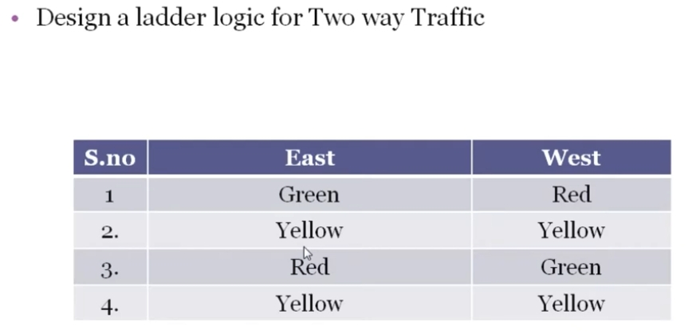
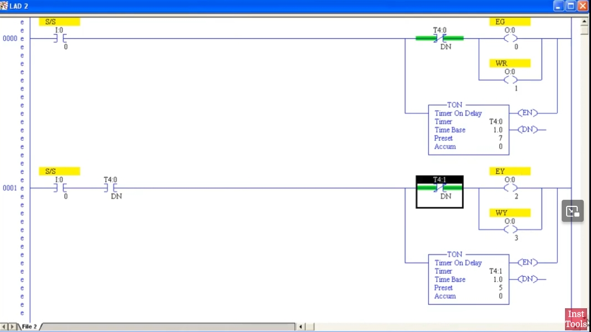
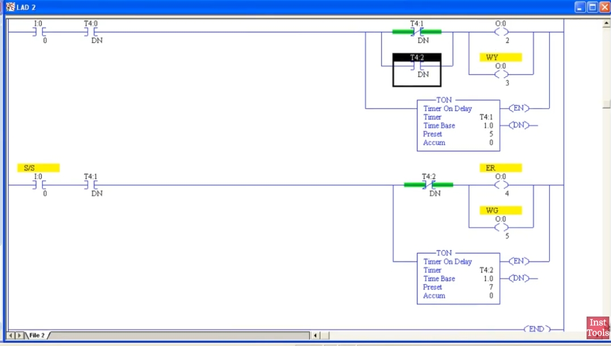
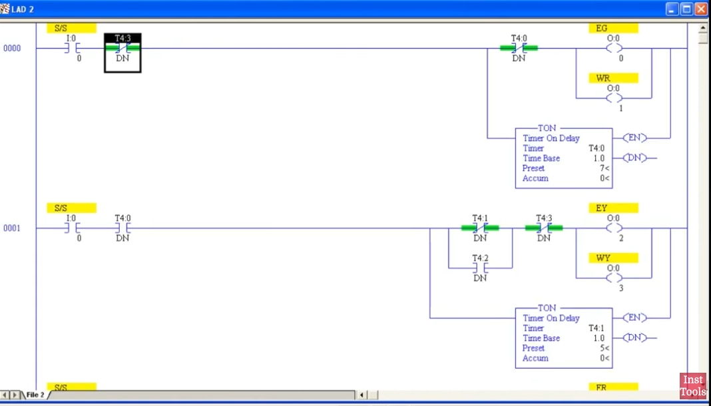

# PLC 双向交通灯（东西向）梯形图控制教程

> 本教程基于 Allen-Bradley RSLogix500（SLC500/PLC5）风格的梯形图，讲解如何用**定时器链**（Timer Chain）实现一个东西两个方向的交通灯顺序控制。适合 PLC 入门学习者。

---

## 1. 控制需求

设计一个"东-西"双向交通灯系统，要求灯的状态按下表循环切换：

| 序号 | 东（East） | 西（West） | 说明 |
|:---:|:---:|:---:|:---|
| 1 | 绿灯 (Green) | 红灯 (Red)  | 东方向通行 |
| 2 | 黄灯 (Yellow)| 黄灯 (Yellow)| 东方向准备停止 |
| 3 | 红灯 (Red)  | 绿灯 (Green) | 西方向通行 |
| 4 | 黄灯 (Yellow)| 黄灯 (Yellow)| 西方向准备停止 |

循环顺序为：**状态1 → 状态2 → 状态3 → 状态4 → 状态1 → ...**（无限循环）



---

## 2. I/O 地址分配表

### 输入（Input）

| 地址 | 名称 | 说明 |
|---|---|---|
| I:0/0 | S/S（启停开关） | 系统启动/停止总开关 |

### 输出（Output）

| 地址 | 标签 | 说明 |
|---|---|---|
| O:0/0 | EG | 东绿灯 East Green |
| O:0/1 | WR | 西红灯 West Red |
| O:0/2 | EY | 东黄灯 East Yellow |
| O:0/3 | WY | 西黄灯 West Yellow |
| O:0/4 | ER | 东红灯 East Red |
| O:0/5 | WG | 西绿灯 West Green |

### 定时器（Timer，TON 通电延时定时器）

| 定时器 | 对应状态 | 预设时间 Preset | 作用 |
|---|---|:---:|---|
| T4:0 | 状态1（东绿/西红） | 7.0 s | 计时东方向通行时间 |
| T4:1 | 状态2（黄/黄） | 5.0 s | 计时缓冲切换时间 |
| T4:2 | 状态3（东红/西绿） | 7.0 s | 计时西方向通行时间 |
| T4:3 | 状态4（黄/黄） | 5.0 s | 计时缓冲切换时间，并复位整个循环 |

> **设计核心思想**：每个状态对应一个 TON 定时器。上一个定时器的 **DN（Done，完成）位** 作为触发条件启动下一个状态，同时用**最后一个定时器 T4:3 的常闭（NC）触点**去"打断"第一个状态的起始条件，从而形成自复位的循环链（Ring Counter / 时序链逻辑），不断循环 4 个状态。

---

## 3. 梯形图逻辑说明（Rung by Rung）

下图为 RSLogix500 中 Rung 0000（状态1）与 Rung 0001（状态2）的原始梯形图截图：



### Rung 0000 — 状态1：东绿灯 / 西红灯

```
  I:0/0        T4:3/DN        T4:0/DN                          EG (O:0/0)
──] [──────────]/[──────────]/[───┬─────────────────────────( )
   S/S                             │                          WR (O:0/1)
                                   ├─────────────────────────( )
                                   │
                                   │        TON  T4:0
                                   └───(EN)  Timer: T4:0
                                            Time Base: 1.0
                                            Preset: 7      (DN)──
```

逻辑说明：
- 启停开关 `I:0/0` 闭合，且 `T4:3`（状态4定时器）**未完成**（NC 触点闭合），且 `T4:0` 本身**未完成**（自复位保护，NC）时，
- 输出 `EG`（东绿灯）、`WR`（西红灯）为 ON，
- 同时启动定时器 `T4:0`，预设 7 秒。

### Rung 0001 — 状态2：东黄灯 / 西黄灯

```
  I:0/0       T4:0/DN         T4:1/DN                          EY (O:0/2)
──] [──────────] [───────────]/[───┬───────────────────────( )
   S/S                              │                        WY (O:0/3)
                                    ├───────────────────────( )
                                    │
                                    │        TON  T4:1
                                    └───(EN)  Timer: T4:1
                                             Time Base: 1.0
                                             Preset: 5      (DN)──
```

逻辑说明：
- `I:0/0` 闭合，且 `T4:0` **已完成**（DN=1，7 秒计时到），且 `T4:1` 自身未完成（NC，自复位保护）时，
- 输出 `EY`、`WY`（东西黄灯）ON，
- 同时启动 `T4:1`，预设 5 秒。

下图为 Rung 0001（延续）与 Rung 0002（状态3）的原始梯形图截图：



### Rung 0002 — 状态3：东红灯 / 西绿灯

```
  I:0/0       T4:1/DN         T4:2/DN                          ER (O:0/4)
──] [──────────] [───────────]/[───┬───────────────────────( )
   S/S                              │                        WG (O:0/5)
                                    ├───────────────────────( )
                                    │
                                    │        TON  T4:2
                                    └───(EN)  Timer: T4:2
                                             Time Base: 1.0
                                             Preset: 7      (DN)──
```

逻辑说明：
- `T4:1` 完成（5 秒到）后，触发东红灯 `ER`、西绿灯 `WG`，
- 并启动 `T4:2`，预设 7 秒（西方向通行时间）。

下图为完整循环（含 T4:3 复位触点）的最终梯形图截图：



### Rung 0003 — 状态4：东黄灯 / 西黄灯（再次），并复位循环

```
  I:0/0       T4:2/DN         T4:3/DN                          EY (O:0/2)
──] [──────────] [───────────]/[───┬───────────────────────( )
   S/S                              │                        WY (O:0/3)
                                    ├───────────────────────( )
                                    │
                                    │        TON  T4:3
                                    └───(EN)  Timer: T4:3
                                             Time Base: 1.0
                                             Preset: 5      (DN)──
```

逻辑说明：
- `T4:2` 完成后，再次点亮东西黄灯（复用 `EY`/`WY` 输出），并启动 `T4:3`，预设 5 秒。
- 当 `T4:3` 计时到（DN=1）时：
  - Rung 0003 中 `T4:3/DN` 常闭触点断开 → 本 Rung 输出关闭 → `T4:3` 失电复位（DN 回到 0）；
  - 与此同时，Rung 0000 中的 `T4:3/DN` 常闭触点因 `T4:3.DN` 曾经为 1 而短暂断开，阻止状态1立即重新触发，`T4:3.DN` 复位为 0 后触点恢复闭合，Rung 0000 重新满足条件，**从状态1重新开始**，形成完整循环。

### END

程序以 `(END)` 指令结束一个扫描周期，PLC 循环执行以上 4 个 Rung。

---

## 4. 等效程式码（Structured Text, IEC 61131-3）

梯形图之外，下面给出等效的结构化文本（ST）代码，便于理解与移植到其他支持 IEC 61131-3 的平台（如 CODESYS、TIA Portal）：

```pascal
PROGRAM TwoWayTrafficLight
VAR
    SS       : BOOL;        // I:0/0  启停开关
    EG, WR   : BOOL;        // 状态1输出：东绿 / 西红
    EY, WY   : BOOL;        // 状态2/4输出：东黄 / 西黄
    ER, WG   : BOOL;        // 状态3输出：东红 / 西绿

    T0 : TON;  // 对应 T4:0  Preset = 7s
    T1 : TON;  // 对应 T4:1  Preset = 5s
    T2 : TON;  // 对应 T4:2  Preset = 7s
    T3 : TON;  // 对应 T4:3  Preset = 5s
END_VAR

(* ---------- 状态1：东绿 / 西红 ---------- *)
T0(IN := SS AND NOT T3.Q AND NOT T0.Q, PT := T#7S);
EG := SS AND NOT T3.Q AND NOT T0.Q;
WR := EG;

(* ---------- 状态2：东黄 / 西黄 ---------- *)
T1(IN := SS AND T0.Q AND NOT T1.Q, PT := T#5S);
EY := SS AND T0.Q AND NOT T1.Q;
WY := EY;

(* ---------- 状态3：东红 / 西绿 ---------- *)
T2(IN := SS AND T1.Q AND NOT T2.Q, PT := T#7S);
ER := SS AND T1.Q AND NOT T2.Q;
WG := ER;

(* ---------- 状态4：东黄 / 西黄，触发复位 ---------- *)
T3(IN := SS AND T2.Q AND NOT T3.Q, PT := T#5S);
EY := EY OR (SS AND T2.Q AND NOT T3.Q);
WY := EY;

END_PROGRAM
```

> 说明：`.Q` 对应梯形图中定时器的 `DN`（Done）位；`NOT Tx.Q` 对应梯形图中的常闭（NC）触点 `]/[`。

---

## 5. 时序图（时间轴示意）

```
时间(s):   0        7        12       19       24  (循环回到0)
状态:    │--状态1--│--状态2--│--状态3--│--状态4--│
东灯:      绿(EG)    黄(EY)    红(ER)    黄(EY)
西灯:      红(WR)    黄(WY)    绿(WG)    黄(WY)
定时器:    T4:0(7s)  T4:1(5s)  T4:2(7s)  T4:3(5s)
```

一个完整循环周期 = 7 + 5 + 7 + 5 = **24 秒**。

---

## 6. 调试与验证要点

1. **上电检查**：确认 `I:0/0`（S/S）为常开输入，闭合后系统才开始运行。
2. **互锁检查**：确保东西两个方向绝不会同时出现"绿灯 + 绿灯"的状态，本设计通过定时器链的顺序性天然避免了冲突。
3. **定时器复位**：重点检查 `T4:3` 的 `DN` 常闭触点是否正确接在 **Rung 0000** 中，这是整个循环能否"自动复位重启"的关键点。
4. **Preset 时间调整**：可根据实际路口车流量，分别调整 `T4:0`~`T4:3` 的 Preset 值（例如把主干道通行时间调长）。
5. **急停/维护模式**：可在 `I:0/0` 前串联一个手动/自动切换开关，方便夜间将信号灯切换为全黄闪烁模式（此教程未包含，可作为扩展练习）。

---

## 7. 扩展练习

- 增加一个"全红"过渡状态，提升路口安全性。
- 加入行人过街按钮（Pedestrian Push Button）与行人信号灯。
- 使用 `HMI` 显示当前倒计时秒数。
- 将本逻辑改写为 SFC（顺序功能图）或状态机实现，比较与定时器链方式的优劣。

---

*参考视频：PLC Training 52 - Traffic Light Control using PLC Ladder Logic*
