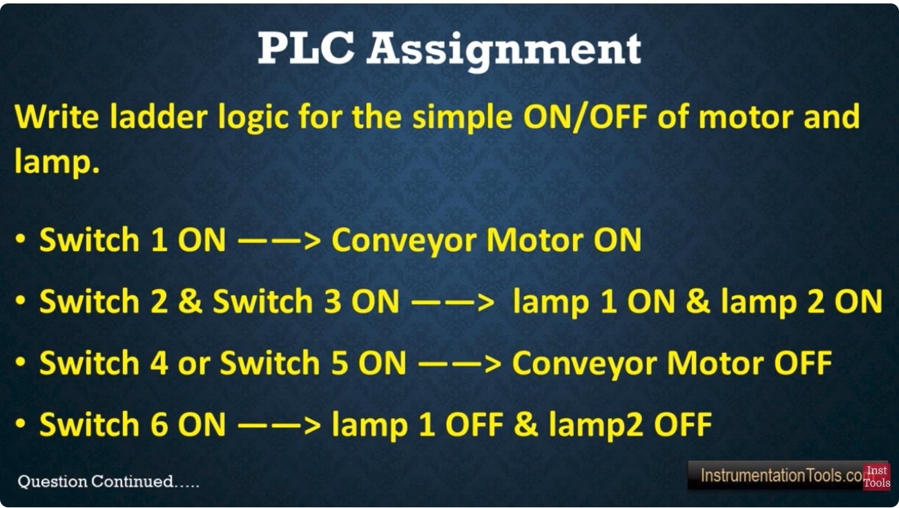
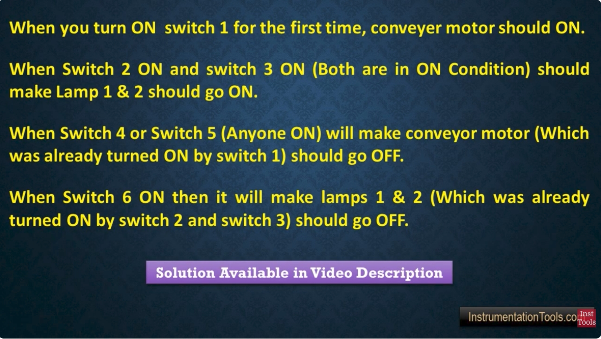

# PLC 教學 53 — 馬達與燈具 ON/OFF 梯形圖邏輯（Allen-Bradley）

## 0. 原始題目截圖





## 1. 題目說明

使用六個輸入開關，設計簡單的 **輸送帶馬達（Conveyor Motor）** 與 **兩個指示燈（Lamp）** 的 ON/OFF 控制梯形圖邏輯。

| # | 條件 | 動作 |
|---|------|------|
| 1 | 開關 1 ON | 輸送帶馬達 ON |
| 2 | 開關 2 ON **且** 開關 3 ON | 燈 1 ON 且 燈 2 ON |
| 3 | 開關 4 **或** 開關 5 ON | 輸送帶馬達 OFF |
| 4 | 開關 6 ON | 燈 1 OFF 且 燈 2 OFF |

**重點行為：** 所有開關皆視為 *瞬動式（momentary）* 按鈕。一旦馬達（或燈具）被啟動為 ON，即使觸發的開關已放開，狀態仍必須 **維持 ON**，直到對應的 OFF 條件發生為止。因此需要使用 **鎖存邏輯（Latching Logic）**（Set/Reset 或自鎖 Seal-in）來實現。

---

## 2. I/O 位址對應（Allen-Bradley / Studio 5000 風格）

| 標籤名稱 (Tag Name) | 說明 | 類型 | 位址範例（Micro800/CompactLogix） |
|----------------------|------|------|-------------------------------------|
| `Switch_1` | 馬達啟動按鈕 | BOOL 輸入 | Local:1:I.Data.0 |
| `Switch_2` | 燈具啟動條件 A | BOOL 輸入 | Local:1:I.Data.1 |
| `Switch_3` | 燈具啟動條件 B | BOOL 輸入 | Local:1:I.Data.2 |
| `Switch_4` | 馬達停止按鈕 A | BOOL 輸入 | Local:1:I.Data.3 |
| `Switch_5` | 馬達停止按鈕 B | BOOL 輸入 | Local:1:I.Data.4 |
| `Switch_6` | 燈具停止按鈕 | BOOL 輸入 | Local:1:I.Data.5 |
| `Conveyor_Motor` | 輸送帶馬達輸出 | BOOL 輸出 | Local:2:O.Data.0 |
| `Lamp_1` | 燈 1 輸出 | BOOL 輸出 | Local:2:O.Data.1 |
| `Lamp_2` | 燈 2 輸出 | BOOL 輸出 | Local:2:O.Data.2 |

> 在 RSLogix5000 / Studio 5000 中，可使用 **OTL（輸出鎖存, Output Latch）** 與 **OTU（輸出解鎖, Output Unlatch）** 指令，取代自鎖接點，是實現此類需求最乾淨的方式。

---

## 3. 梯形圖（LD, Ladder Diagram）

```
Rung 0：馬達 ON（鎖存）
 |  Switch_1                                  Conveyor_Motor  |
 |  ─┤ ├─────────────────────────────────────────( L )──────  |

Rung 1：馬達 OFF（解鎖）— 開關 4 或 開關 5
 |  Switch_4                                  Conveyor_Motor  |
 |  ─┤ ├───┬─────────────────────────────────────( U )──────  |
 |          │                                                 |
 |  Switch_5│                                                 |
 |  ─┤ ├───┘                                                  |

Rung 2：燈具 ON（鎖存）— 開關 2 且 開關 3
 |  Switch_2      Switch_3                    Lamp_1          |
 |  ─┤ ├──────────┤ ├────────────────────────────( L )──────  |
 |                                              Lamp_2          |
 |                                              ───( L )──────  |

Rung 3：燈具 OFF（解鎖）— 開關 6
 |  Switch_6                                   Lamp_1          |
 |  ─┤ ├─────────────────────────────────────────( U )──────  |
 |                                              Lamp_2          |
 |                                              ───( U )──────  |
```

### 各 Rung 說明
- **Rung 0：** 只要按一下 `Switch_1`（瞬動），即可鎖存（`OTL`）`Conveyor_Motor` 為 ON。即使開關放開，馬達仍會維持 ON 狀態（由 `OTL` 指令保持記憶）。
- **Rung 1：** `Switch_4` **或** `Switch_5`（並聯分支，任一動作即可）會解鎖（`OTU`）`Conveyor_Motor`，使馬達關閉。
- **Rung 2：** `Switch_2` **且** `Switch_3`（串聯）必須同時為 ON，才能鎖存 `Lamp_1` 與 `Lamp_2` 為 ON。
- **Rung 3：** `Switch_6` 會同時解鎖 `Lamp_1` 與 `Lamp_2`，使兩者關閉。

> **關於 OTL/OTU 的行為說明：** 鎖存/解鎖位元屬於保持型（retentive），即使 PLC 斷電重開，狀態仍會維持（除非該記憶體被設定為非保持型）。若希望採用 *非鎖存* 行為（斷電後自動重置），可改用一般的 **自鎖電路（Seal-in Circuit）**，搭配標準 `OTE`（輸出激磁, Output Energize）線圈來達成相同效果，詳見下方替代方案。

---

## 4. 替代方案：自鎖電路（使用 OTE 取代 OTL/OTU）

```
Rung 0：輸送帶馬達自鎖電路
 |  Switch_1     Switch_4     Switch_5         Conveyor_Motor |
 |  ─┤ ├──┬──────┤/├──────────┤/├─────────────────( )───────  |
 |         │                                                   |
 |  Conveyor_Motor                                              |
 |  ─┤ ├──┘                                                     |

Rung 1：燈具自鎖電路
 |  Switch_2   Switch_3     Switch_6            Lamp_1          |
 |  ─┤ ├───────┤ ├──────────┤/├────────────────────( )───────  |
 |     │                                            Lamp_2       |
 |  Lamp_1                                          ────( )───  |
 |  ─┤ ├──────────┘  （自鎖接點並聯於 Switch_2 與 Switch_3）    |
```

此處 `Switch_4`／`Switch_5`／`Switch_6` 在梯形圖中須接成 **常閉接點（NC, Normally Closed）**（圖中以 `┤/├` 表示），如此當按下時會切斷電路，使自鎖線圈斷電。

---

## 5. 結構化文字（ST, Structured Text）對應程式碼

Allen-Bradley Studio 5000 / CompactLogix / Micro800 亦支援結構化文字（ST）程式語言。以下為使用 **鎖存/解鎖（Set/Reset）方式** 撰寫的 ST 版本，邏輯與第 3 節的梯形圖完全對應。

```pascal
// ==========================================================
// PLC 教學 53 - 馬達與燈具 ON/OFF - 結構化文字 (Structured Text)
// ==========================================================

// Rung 0：馬達 ON（鎖存）
IF Switch_1 THEN
    Conveyor_Motor := TRUE;
END_IF;

// Rung 1：馬達 OFF（解鎖）— 開關 4 或 開關 5
IF Switch_4 OR Switch_5 THEN
    Conveyor_Motor := FALSE;
END_IF;

// Rung 2：燈具 ON（鎖存）— 開關 2 且 開關 3
IF Switch_2 AND Switch_3 THEN
    Lamp_1 := TRUE;
    Lamp_2 := TRUE;
END_IF;

// Rung 3：燈具 OFF（解鎖）— 開關 6
IF Switch_6 THEN
    Lamp_1 := FALSE;
    Lamp_2 := FALSE;
END_IF;
```

### 掃描順序注意事項
在 ST（以及梯形圖）中，當同一掃描週期內兩個條件可能同時為真時，**敘述（rung）的順序會影響結果**。以上寫法將 **OFF 條件放在 ON 條件之後執行**，因此若 `Switch_1` 與 `Switch_4` 在同一掃描週期同時為 ON，馬達最終會變成 OFF（即 OFF 具有優先權）。若希望讓 ON 具有優先權，只需將兩段 IF 區塊順序對調（把 ON 邏輯放在 OFF 邏輯之後）即可。

---

## 6. 時序圖（概念示意）

```
Switch_1   __|‾|______________________________________
Switch_4   ________________________|‾|________________
Conveyor   ____|‾‾‾‾‾‾‾‾‾‾‾‾‾‾‾‾‾‾‾|________________  （馬達持續 ON，直到 Sw4/Sw5 動作）

Switch_2   __|‾‾‾‾‾|__________________________________
Switch_3   __|‾‾‾‾‾|__________________________________
Switch_6   ________________________|‾|________________
Lamp_1/2   __|‾‾‾‾‾‾‾‾‾‾‾‾‾‾‾‾‾‾‾‾‾|________________  （燈具持續 ON，直到 Sw6 動作）
```

---

## 7. 總結

| 邏輯區塊 | 梯形圖指令 | ST 對應程式碼 |
|----------|------------|----------------|
| 馬達 ON | `Switch_1` → `OTL Conveyor_Motor` | `IF Switch_1 THEN Conveyor_Motor := TRUE;` |
| 馬達 OFF | `Switch_4 OR Switch_5` → `OTU Conveyor_Motor` | `IF Switch_4 OR Switch_5 THEN Conveyor_Motor := FALSE;` |
| 燈具 ON | `Switch_2 AND Switch_3` → `OTL Lamp_1, Lamp_2` | `IF Switch_2 AND Switch_3 THEN Lamp_1:=TRUE; Lamp_2:=TRUE;` |
| 燈具 OFF | `Switch_6` → `OTU Lamp_1, Lamp_2` | `IF Switch_6 THEN Lamp_1:=FALSE; Lamp_2:=FALSE;` |

此設計滿足題目要求的全部四項條件，採用標準的 Allen-Bradley 鎖存/解鎖指令（或等效的自鎖電路），並附上對應的結構化文字（ST）程式，適用於偏好使用 ST 而非 LD 的平台或使用者。
