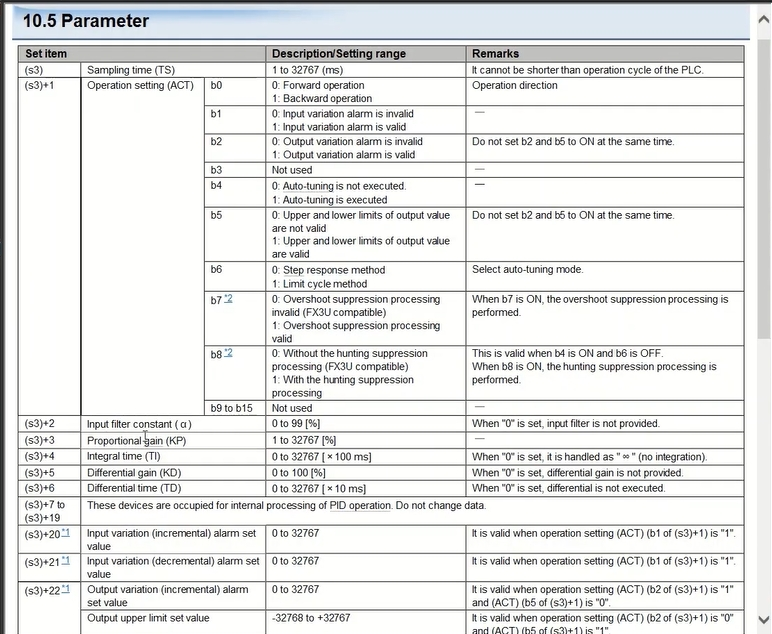

# 三菱 PLC「S(P).PID」命令教學：參數詳解與程式範例解析

> 參考影片：[Mitsubishi PID Function in PLC (PID Instruction)](https://www.youtube.com/watch?v=um2zIoyZWLM)
> 參考資料：使用者提供之《10.5 Parameter》參數表截圖（iQ-R 系列 PID 命令手冊）

---

## 1. 前言

三菱 PLC 的 **PID 命令**（在 iQ-R／Q 系列中寫作 `S(P).PID`，FX 系列則是 `PID`）是一個「功能指令」，把傳統上要自己寫比例、積分、微分運算的工作，包成一個現成的黑盒子指令。使用者只要準備好四樣東西：

- **目標值 SV**（Set Value，希望控制到的值）
- **量測值 PV**（Present Value，感測器目前讀到的值）
- **一整組參數區**（採樣時間、增益、動作方向…）
- **一個輸出暫存器**存放算出來的 **操作量 MV**（Manipulated Value）

PLC 就會在每個採樣週期自動算好 MV，我們只要把 MV 送到閥門、變頻器或加熱器的輸出即可。

---

## 2. 命令基本語法

```
PID   S1   S2   S3   D
```

| 運算元 | 意義 | 對應到範例程式 |
|---|---|---|
| S1 | 目標值 SV 存放位址 | D0 |
| S2 | 量測值 PV 存放位址 | D2 |
| S3 | 參數區的**起始位址**（後面連續佔用約 25 個字） | D100 |
| D  | 輸出（運算後的操作量 MV） | D10 |

也就是說，圖片中「10.5 Parameter」表格裡寫的 `(s3)`、`(s3)+1`、`(s3)+2`…，指的就是「以 S3 為起點往後數第幾個字」。範例程式把 S3 設成 D100，所以 `(s3)+3`（比例增益 KP）實際上就是 **D103**，`(s3)+22` 就是 **D122**，以此類推。



---

## 3. 參數逐項解說

### (s3)：採樣時間 TS
- 範圍：1~32767 (ms)
- PID 運算並不是每一個掃描週期都重新算一次，而是每隔 TS 毫秒才更新一次輸出，這個間隔理論上要儘量接近實際製程的反應速度。
- **注意**：TS 不能設得比 PLC 的運算週期（scan time）還短，否則命令會來不及執行完就被要求重算。

### (s3)+1：動作設定 ACT（一個字，用位元分別代表不同開關）
這是最容易搞混、但也最重要的一個參數，因為它是用「位元組合」的方式一次設定好幾件事：

| 位元 | 0 | 1 |
|---|---|---|
| b0 | 正動作（Forward，輸出隨 PV 上升而增加，常用於冷卻類製程） | 逆動作（Backward，輸出隨 PV 上升而減少，常用於加熱類製程） |
| b1 | 不做輸入變化量警報 | 啟用輸入變化量警報 |
| b2 | 不做輸出變化量警報 | 啟用輸出變化量警報 |
| b3 | 未使用 | — |
| b4 | 不執行自動調諧 | 執行自動調諧（Auto-tuning） |
| b5 | 不限制輸出上下限 | 限制輸出上下限（設定 (s3)+22、+23 為上下限值） |
| b6 | 自動調諧採「階梯響應法」 | 自動調諧採「極限循環法」 |
| b7 | 不做超調（overshoot）抑制 | 啟用超調抑制（相容 FX3U） |
| b8 | 不做整定振盪抑制 | 啟用整定振盪抑制（相容 FX3U） |
| b9~b15 | 未使用 | — |

**關鍵限制**：手冊特別註明 **b2 與 b5 不可以同時設為 1**，因為 (s3)+22 / (s3)+23 這兩個位址是「共用」的——依 b2、b5 的組合，同一個位址會被拿來當「輸出變化量警報值」或「輸出上下限值」兩種不同用途（詳見後面第 6 點）。

### (s3)+2：輸入濾波常數 α
- 範圍：0~99 [%]
- 對量測值做一階濾波，用來濾掉雜訊。設 0 表示不做濾波。

### (s3)+3：比例增益 KP
- 範圍：1~32767 [%]

### (s3)+4：積分時間 TI
- 範圍：0~32767 [×100ms]
- 設 0 時，等同積分時間視為「無限大」，也就是**不做積分動作**。

### (s3)+5：微分增益 KD
- 範圍：0~100 [%]

### (s3)+6：微分時間 TD
- 範圍：0~32767 [×10ms]
- 設 0 時，**不執行微分動作**。

### (s3)+7 ~ (s3)+19
這 13 個字是命令內部運算暫存區（存放上一次的偏差值、積分累加值等中間結果），**使用者絕對不要去改寫**，否則 PID 運算會亂掉。

### (s3)+20 / (s3)+21：輸入變化量警報設定值（增側／減側）
- 範圍：0~32767
- 只有在 ACT 的 b1 = 1 時才有作用：當 PV 每次採樣的變化量超過這裡設定的門檻，就會在 (s3)+24 的警報字裡標示出來。

### (s3)+22 / (s3)+23：依 ACT 的 b2、b5 決定用途（兩用位址）

| ACT 設定 | (s3)+22 的用途 | (s3)+23 的用途 |
|---|---|---|
| b2=1，b5=0 | 輸出變化量（增側）警報值，0~32767 | 輸出變化量（減側）警報值，0~32767 |
| b2=0，b5=1 | **輸出上限值**，-32768~32767 | **輸出下限值**，-32768~32767 |

這就是為什麼同一個位址表格上會出現兩行不同的描述——並不是打字錯誤，而是命令設計上「借位址重複使用」。

### (s3)+24：警報輸出
- 用一個字裡的各個位元，分別標示輸入變化量、輸出變化量是否超出上面設定的門檻，供程式判斷後觸發警報燈或警報訊息。

---

## 4. 範例程式逐步解析

以下依 CSV 匯出的程式內容（RCPU R16EN，iQ-R 系列）逐行說明：

```
0   LD    M0
1   PID   D0  D2  D100  D10
7   LD    M1
8   ANDP  SM411
10  MPS
11  ANI   M0
12  INC   D2
14  MPP
15  AND   M2
16  DEC   D2
18  LD    SM400
19  MOV   K100    D100
21  MOV   K33     D101
23  MOV   K0      D102
25  MOV   K200    D103
27  MOV   K10     D104
29  MOV   K5      D105
31  MOV   K100    D106
33  MOV   K10000  D122
35  MOV   K0      D123
37  END
```

**第 0~1 行**：當 M0 為 ON 時執行 PID 運算，SV 取 D0、PV 取 D2、參數區起點 D100、輸出寫到 D10。

**第 7~16 行（模擬 PV 變化用）**：這段不是 PID 命令本身，而是**測試用的模擬程式**，目的是在沒有接實際感測器的情況下，讓 D2（也就是 PID 的 PV）能自己動起來，方便驗證參數效果：
- `LD M1` + `ANDP SM411`：SM411 是每 0.2 秒切換一次的內建時鐘脈波，`ANDP` 表示「取 SM411 的上升緣」，所以這一段等於「M1 為 ON 期間，每 0.2 秒觸發一次瞬間脈衝」。
- 用 `MPS`/`MPP` 把這個脈衝暫存並分兩路使用：
  - 若 `M0` 為 OFF，就把 D2 加 1（`INC D2`）；
  - 若 `M2` 為 ON，就把 D2 減 1（`DEC D2`）。
- 因為觸發點本身已經是脈衝（邊緣觸發），所以直接用 `INC`／`DEC` 而不是 `INCP`／`DECP` 也不會有「一次觸發跑好幾次」的問題——這點是正確的寫法，不是漏加 P。

**第 18~37 行（開機初始化參數）**：`LD SM400`（SM400 恆為 ON），在每次掃描把下列常數寫入參數區，等同「開機時把 PID 參數重新設定一次」：

| 位址 | 數值 | 對應參數 | 意義 |
|---|---|---|---|
| D100 | 100 | TS | 採樣時間 100ms |
| D101 | 33 | ACT | 二進位 100001，即 b0=1（逆動作）、b5=1（啟用輸出上下限） |
| D102 | 0 | α | 不做輸入濾波 |
| D103 | 200 | KP | 比例增益 200% |
| D104 | 10 | TI | 積分時間 10×100ms = 1 秒 |
| D105 | 5 | KD | 微分增益 5% |
| D106 | 100 | TD | 微分時間 100×10ms = 1 秒 |
| D122 | 10000 | (s3)+22 | 因 b5=1、b2=0，此處代表**輸出上限 = 10000** |
| D123 | 0 | (s3)+23 | 輸出下限 = 0 |

---

## 5. 檢查結果：有沒有打字錯誤？

把整份程式對照參數表逐一核對位址偏移量之後，**沒有發現位址算錯或數值明顯矛盾**的地方，重點如下：

1. **偏移量正確**：S3 設為 D100，因此 D101~D106 剛好對應 (s3)+1~+6，D122、D123 也剛好對應 (s3)+22、+23，換算沒有錯位。
2. **ACT=33 沒有違反「b2、b5 不可同時為 1」的限制**：33 換算成二進位只有 b0、b5 是 1，b2 是 0，所以 D122/D123 被拿來當輸出上下限，用法一致，沒有衝突。
3. **模擬迴路的脈衝處理正確**：用 `ANDP` 取代單獨的 `PLS`/`INCP`，效果相同，不是漏打 P。

比較值得留意、但**不算錯誤**、而是「要依實際製程確認」的地方：

- **b0（動作方向）**：目前設定為「逆動作」，如果你的製程其實是屬於「PV 上升時，輸出也要跟著增加」的類型（例如冷卻水流量隨溫度升高而增加），這裡就要改回 0（正動作），否則控制方向會反過來，PID 會愈調愈糟。
- **D10（PID 輸出 MV）在這段程式裡沒有被接到任何實際輸出**（例如類比輸出模組、PWM 輸出）。若這只是參數示範片段，這是正常的；但若要用在實機上，記得後面要補上把 D10 寫到硬體輸出的邏輯。
- **TI = TD = 1 秒**：積分時間與微分時間目前設成一樣長，這在調參上比較少見（一般微分時間會抓積分時間的 1/3~1/4 左右），實際上線前建議依現場反應速度重新試調，而不是照抄範例數值。

---

## 6. 延伸閱讀

- 影片：[Mitsubishi PID Function in PLC (PID Instruction)](https://www.youtube.com/watch?v=um2zIoyZWLM)
- 建議搭配三菱官方《PID 制御命令編》程式手冊，針對你使用的 CPU 型號（本例為 R16ENCPU）確認參數區的完整定義與步數計算方式。
