# 三菱 PLC Q 系列類比輸入（Analog Input）教程

> 本教程整理自 GX Works2 操作錄影截圖，示範如何使用三菱 **Q64AD** 類比輸入模組讀取 4–20mA 訊號，並換算成實際物理量（以壓力/液位訊號為例），最後搭配 **Factory IO** 透過 OPC 進行模擬驗證。

---

## 一、基礎知識

在開始設定 PLC 之前，先了解兩個核心概念。

### 1. 什麼是 A/D 轉換（Analog to Digital Converter）

現場的感測器（如壓力、溫度、液位計）輸出的是連續變化的類比訊號（電壓或電流），PLC 內部運算只能處理數位訊號，因此需要透過 **ADC 模組** 將類比訊號轉換成數位數值，才能在程式中運算與判斷。

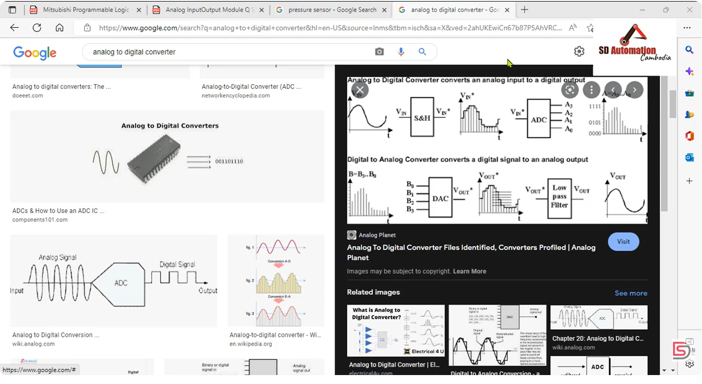

### 2. 常見的類比訊號來源：壓力感測器

以壓力感測器為例，市面上常見輸出規格多為 **4–20mA** 電流訊號，接線簡單、抗雜訊能力強，適合長距離傳輸，是工業現場最常見的類比訊號型式之一。

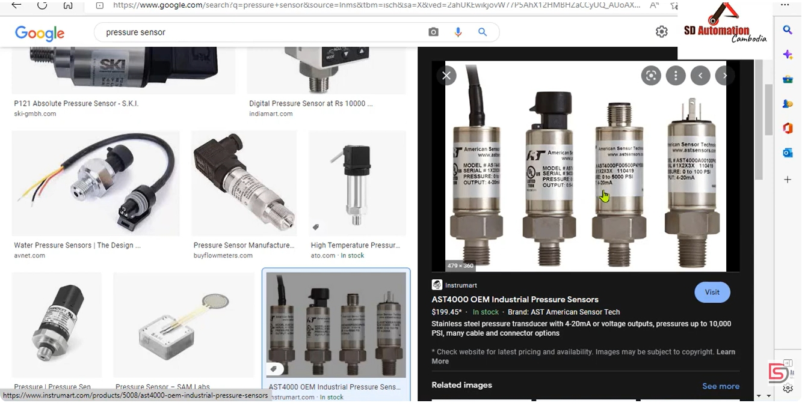

### 3. Q64AD 模組規格

三菱 **Q64AD** 為 4 通道類比輸入模組，支援電壓（如 0–10V、-10–10V、1–5V 等）與電流（0–20mA、4–20mA）輸入，並提供一般解析度與高解析度兩種模式，數位輸出範圍隨輸入型式與解析度模式而不同，詳細規格請參考模組使用手冊。

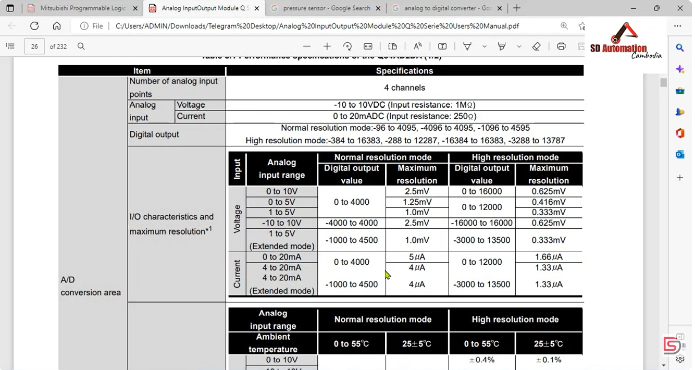

---

## 二、建立專案與新增智慧功能模組

### 步驟 1：建立新專案

開啟 GX Works2，建立一個新的 PLC 專案，此時 MAIN 程式僅有一行 `END` 指令。

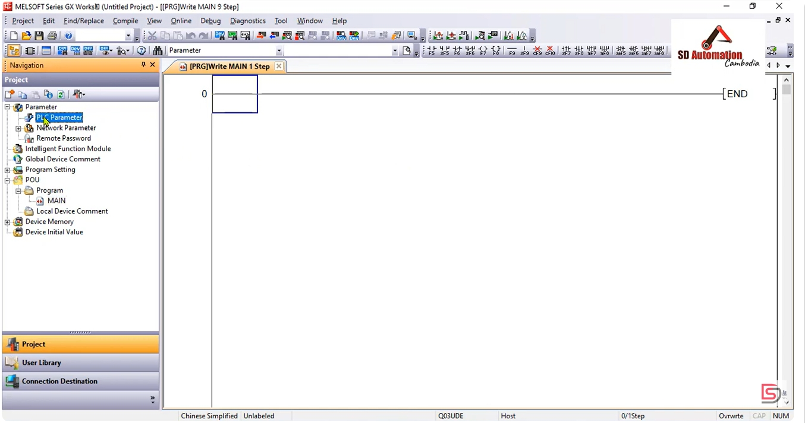

### 步驟 2：開啟 PLC 參數設定

在導航列點選 **Parameter → PLC Parameter**，進入 **I/O Assignment** 頁籤，準備新增智慧功能模組。

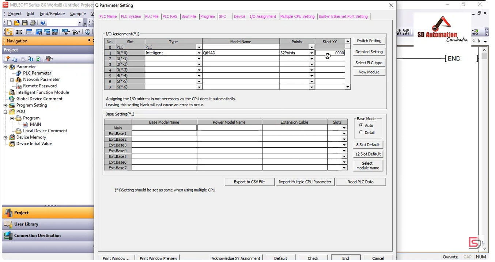

### 步驟 3：新增 Analog Module（Q64AD）

在導航列的 **Intelligent Function Module** 上按右鍵，選擇新增模組，於彈出的 **New Module** 視窗中：

- Module Type：選擇 `Analog Module`
- Module Name：選擇 `Q64AD`
- Mounted Slot No.：設定安裝的插槽（本例為 Slot 1）

設定完成後點選 **Acknowledge I/O Assignment** 確認位址配置。

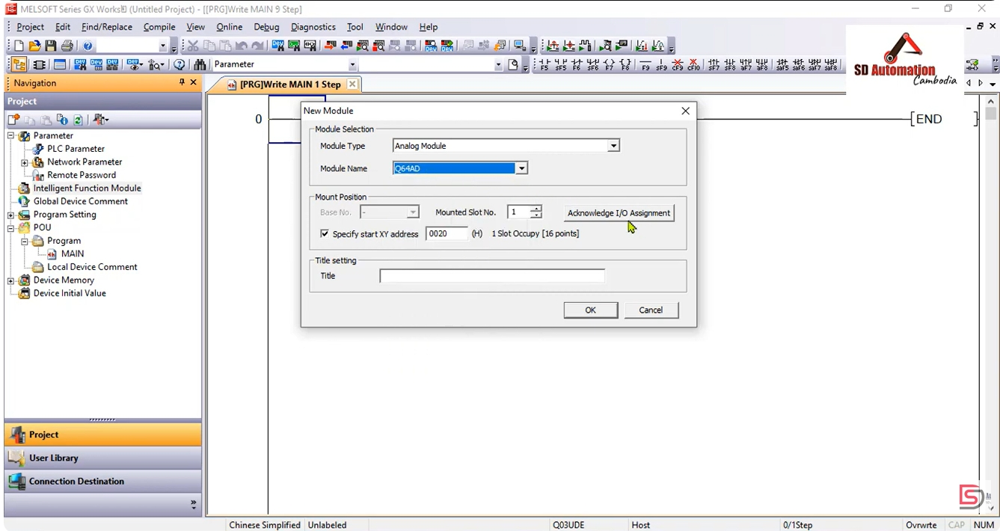

### 步驟 4：確認 I/O 位址分配

系統會自動配置模組的起始位址（藍綠色代表自動分配），確認 Q64AD 已正確配置於對應插槽、佔用 32 點，起始位址為 `0000`，點選 **Setting** 完成配置。

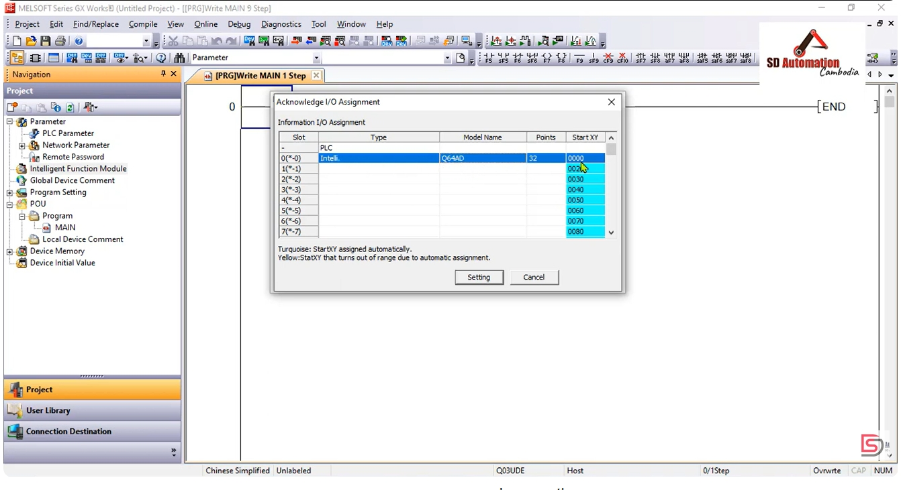

### 步驟 5：檢查程式設定是否有誤

切換至 **Program** 頁籤確認 MAIN 程式已加入執行清單，點選 **End/Check** 進行檢查，確認彈出「There is no error.」訊息後按 OK 完成 PLC 參數設定。

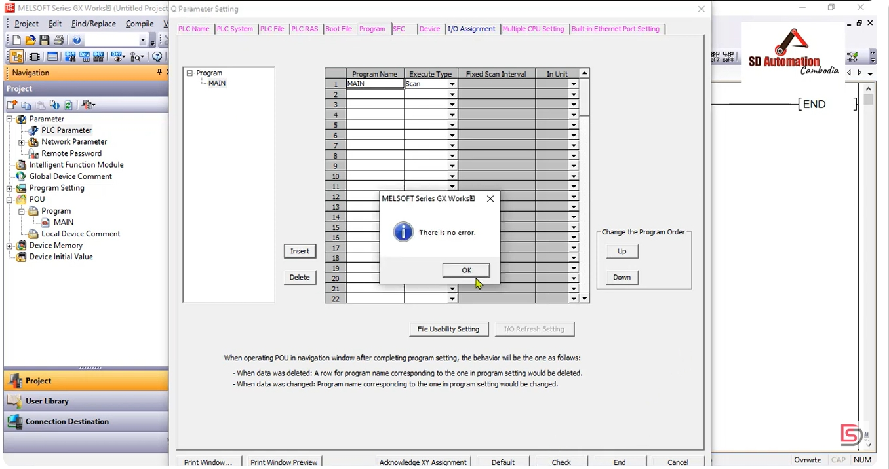

---

## 三、設定 Q64AD 模組參數

新增完成後，導航列會出現 **0000:Q64AD** 節點，展開後依序設定以下三個項目。

### 1. Switch Setting（輸入範圍設定）

雙擊 **Switch Setting**，將 CH1 的 Input Range 設定為 `4 to 20mA`（依實際感測器輸出型式選擇對應通道與範圍）。

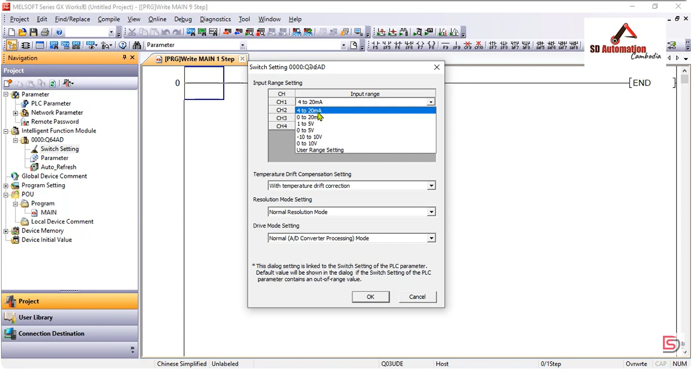

### 2. Parameter（A/D 轉換致能設定）

雙擊 **Parameter**，在 Basic Setting 中將要使用的通道（CH1）設為 `0:Enable`，未使用的通道維持 `1:Disable`，以降低不必要的轉換負擔。

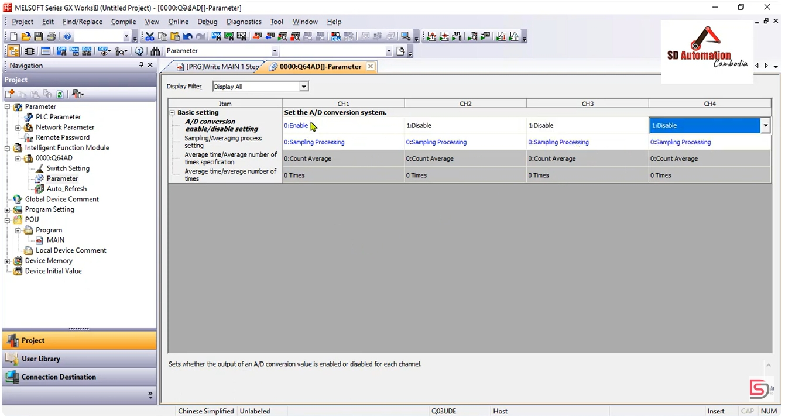

### 3. Auto_Refresh（自動更新緩衝區資料至 CPU）

雙擊 **Auto_Refresh**，將 CH1 的數位輸出值（Digital output value）自動更新到指定軟元件，本例設定為 `D0`，之後程式即可直接讀取 D0 取得類比輸入的數位值。

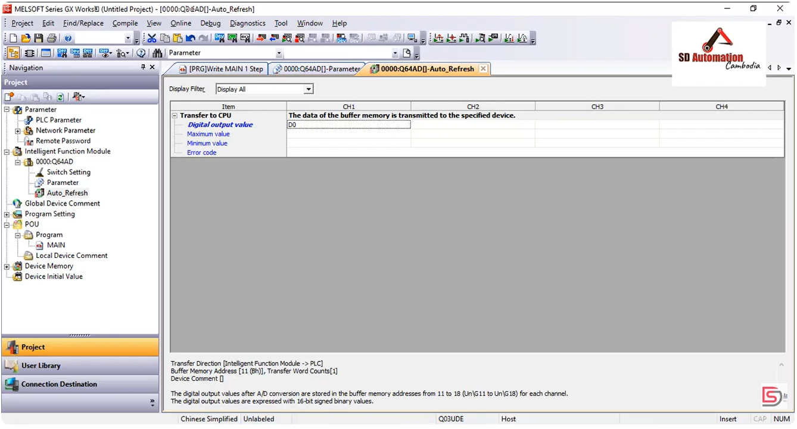

---

## 四、撰寫梯形圖程式

完成硬體參數設定後，撰寫以下邏輯，將原始數位值換算為實際物理量：

| 步序 | 指令 | 說明 |
|---|---|---|
| 0 | `LD SM400` | 常閉/常開特殊繼電器，作為常時執行條件 |
| 1 | `INT2FLT D0 → D20` | 將類比輸入原始整數值 D0 轉換成浮點數，存入 D20 |
| 3 | `E/ D20 E100 → D22` | D20 除以係數 E100，得到換算係數，存入 D22 |
| 7 | `E* D20 D22 → D24` | D20 乘以係數 D22，得到實際量測值，存入 D24 |
| 10 | `END` | 程式結束 |

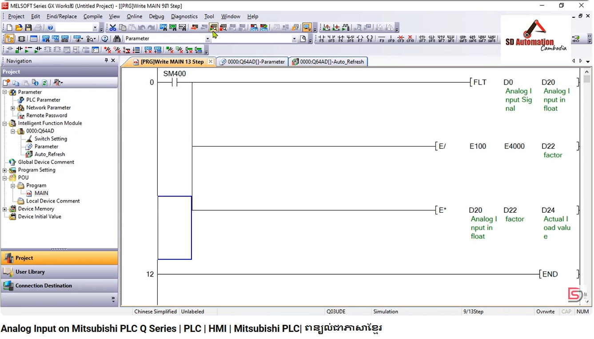

> 此程式對應的 CSV 匯出內容與畫面一致：`INT2FLT D0→D20`、`E/ D20 E100→D22`、`E* D20 D22→D24`。

---

## 五、線上監看與 OPC 資料確認

將程式寫入並切換至 **Monitor Executing（監看執行）** 模式，同時開啟 **MX OPC Configurator**，可即時查看：

- `Analog_Sensor`（對應 D0，原始類比輸入值）
- `Actal_Value`（對應 D24，換算後的實際量測值）

透過 OPC Server 即時比對兩者數值，確認換算邏輯正確無誤。

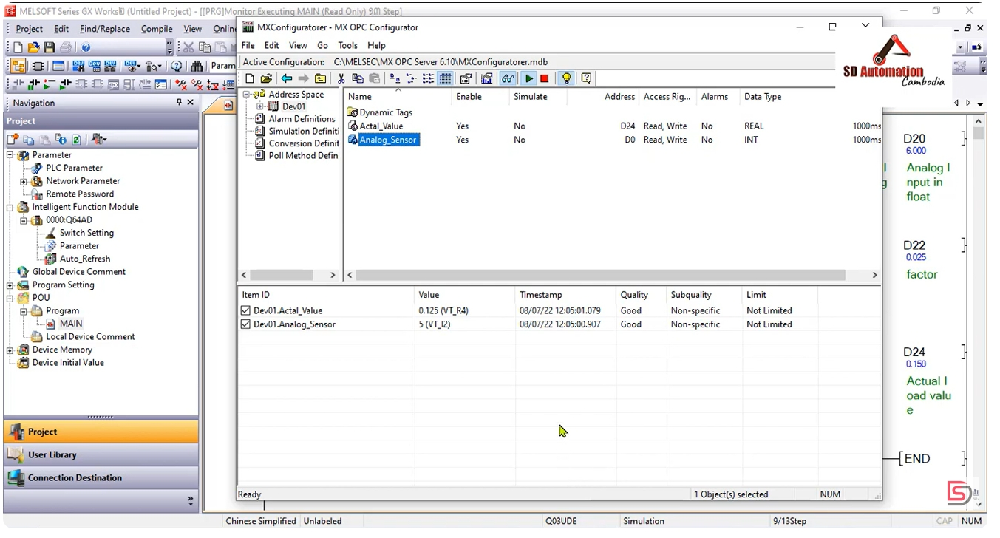

---

## 六、串接 Factory IO 進行模擬驗證

### 1. 設定 Factory IO 的 OPC 驅動

在 Factory IO 的 **Driver** 設定中選擇 **OPC Client DA/UA**，並將標籤對應如下：

- `Tank 1 (Level Meter)` → `Analog_Sensor`（模擬液位訊號輸入至 PLC）
- `Tank 1 (Fill Valve)` → `Actal_Value`（PLC 換算後數值回寫控制注水閥）

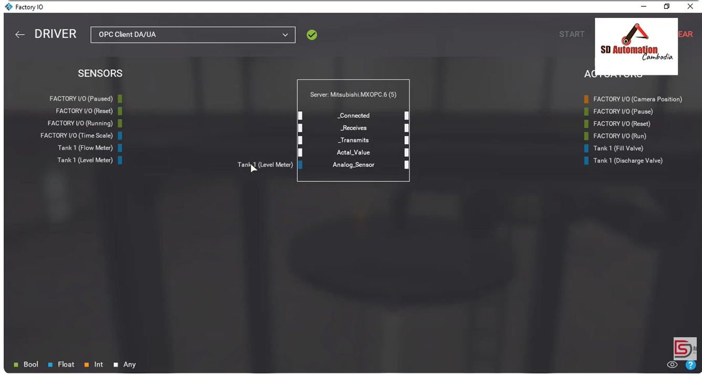

### 2. 執行模擬

啟動模擬後，手動調整 **Fill Valve** 開度，觀察水箱液位變化，並在 GX Works2 監看畫面確認 D0、D20、D22、D24 數值同步連動，驗證整套類比輸入與換算邏輯運作正常。

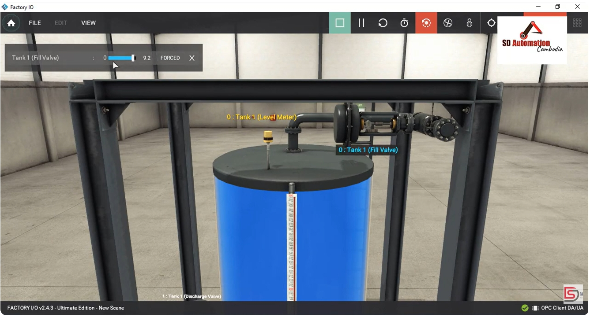

---

## 七、小結

1. 類比訊號（如壓力、液位）需經 ADC 模組（Q64AD）轉換為數位值。
2. PLC 端需完成三項模組設定：**輸入範圍（Switch Setting）→ 通道致能（Parameter）→ 緩衝區自動更新（Auto_Refresh）**。
3. 程式端使用 `INT2FLT`、`E/`、`E*` 等浮點運算指令，將原始數位值換算成有意義的實際物理量。
4. 可透過 **MX OPC + Factory IO** 在無實體硬體的情況下完成模擬與驗證，加快開發除錯效率。

---

*參考來源：SD Automation Cambodia — Analog Input on Mitsubishi PLC Q Series | PLC | HMI | Mitsubishi PLC*
