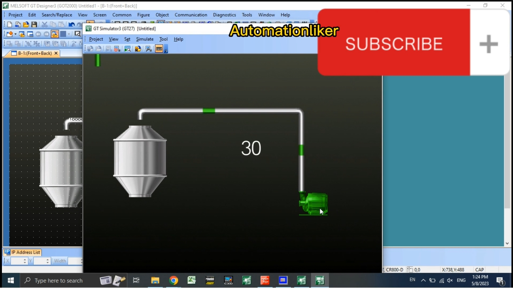
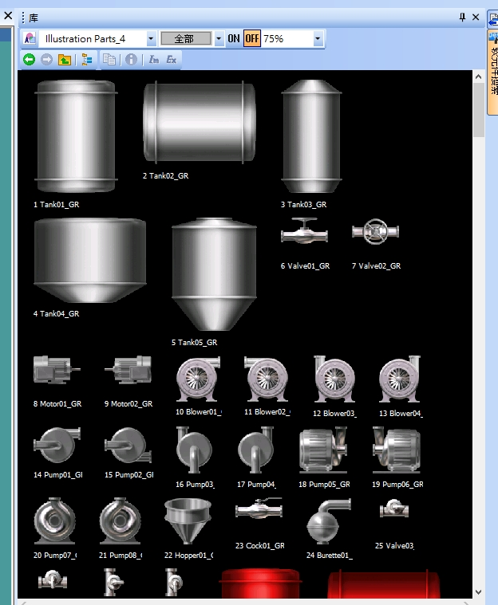
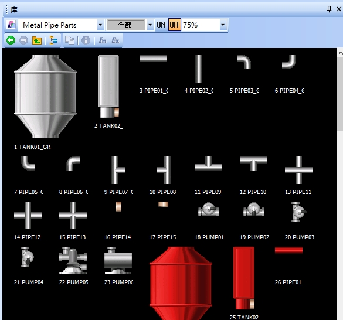
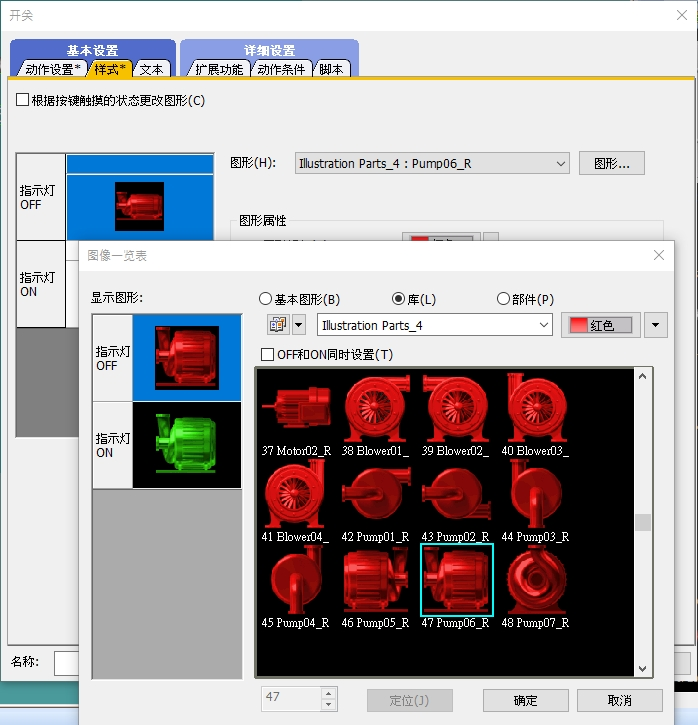
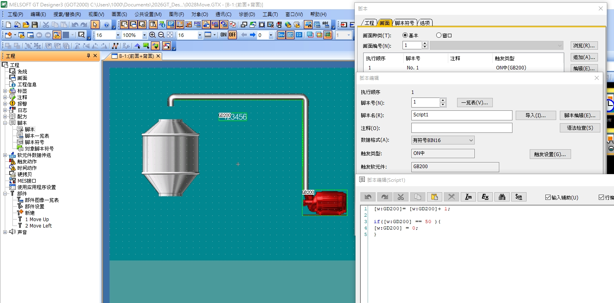
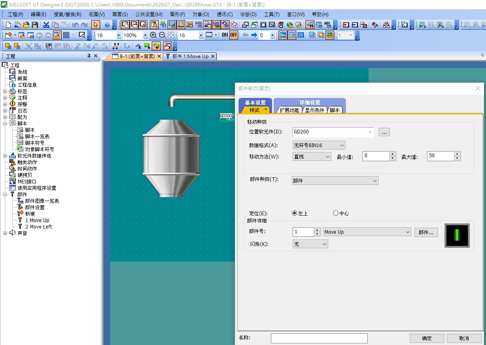
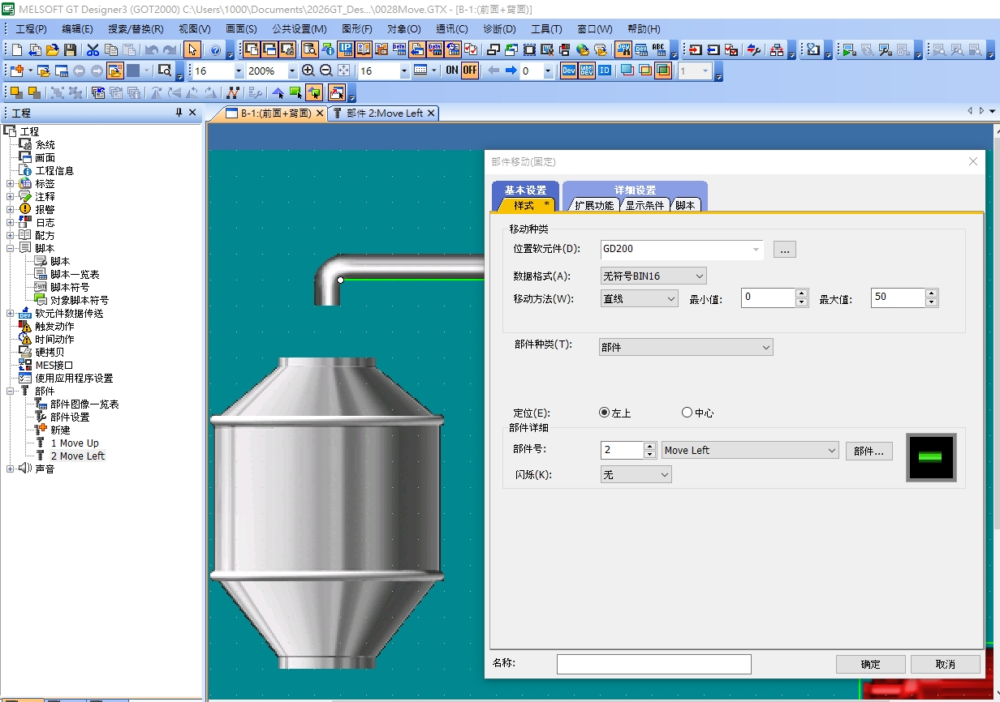

# GOT2000 部件移動：三菱 HMI 水流動畫實作（免 PLC 程式）

> 專案檔：`0028Move.GTX` ｜ 軟體：MELSOFT GT Designer3 (GOT2000) + GT Simulator3 (GT27)
> 目標：按下泵的圖形開關 → 觸發畫面腳本 → 管路內出現一段一段往上、往左流動的綠色水流。
> 全程只用 GOT 內部軟元件（GB / GD），**不需要連接 PLC、不需要寫 PLC 程式**。

---

## 一、成果預覽



畫面說明：

| 畫面元素 | 對應設定 |
|---|---|
| 右下角的泵（綠色＝運轉中） | 位開關，軟元件 `GB200`，動作為「交替」 |
| 管路上兩段綠色亮塊 | 兩個「部件移動」物件：`1 Move Up`、`2 Move Left` |
| 中間的數字 `30` | 數值顯示，監看 `GD200`（動畫種子，0～49 循環） |

泵按下去變綠 → `GB200 = ON` → 腳本開始跑 → `GD200` 不斷加 1 → 兩個部件沿著各自的路徑前進，就形成水流動畫。

---

## 二、整體架構

```
[泵 位開關 GB200] ──ON──► [畫面腳本 Script1]
                                 │
                                 ▼
                     GD200 = GD200 + 1 （0～49 循環）
                                 │
                 ┌───────────────┴───────────────┐
                 ▼                               ▼
       [部件移動 1：Move Up]            [部件移動 2：Move Left]
        沿右側立管往上移動                沿上方橫管往左移動
```

水流方向：**泵（右下）→ 立管往上 → 橫管往左 → 進入左側儲槽**，所以兩個部件才會命名為 `Move Up` 與 `Move Left`。

---

## 三、步驟一：畫背景（儲槽 + 管路）

背景圖形全部從 GT Designer3 內建的**圖庫（庫）**拖出來，不必自己畫。

### 3-1 儲槽與泵浦本體

開啟「檢視 → 庫」，選擇 **Illustration Parts_4**：



常用元件：

- `4 Tank04_GR` / `5 Tank05_GR`：錐底儲槽（本例用錐底槽）
- `14 Pump01_GR` ～ `21 Pump08_GR`：各式泵浦
- `8 Motor01_GR`、`9 Motor02_GR`：馬達
- `10 Blower01_` ～ `13 Blower04_`：鼓風機

同一個圖庫下方還有同款的**紅色版（_R）**，後面做開關的 ON/OFF 兩態時會用到。

### 3-2 管路

切換圖庫到 **Metal Pipe Parts**：



- `3 PIPE01` ～ `15 PIPE13`：直管、彎管、T 型管、十字管
- `18 PUMP01` ～ `23 PUMP06`：管線用泵
- `26 PIPE01_`（紅色）：可當作「流動亮塊」的素材

**配管技巧**

1. 先拉一段直管，設定好長度與位置後，用 `Ctrl + C / Ctrl + V` 複製接續，管徑才會完全一致。
2. 轉角一律用彎管零件（`5 PIPE03`、`6 PIPE04`、`7 PIPE05`、`8 PIPE06`），不要用直管硬湊。
3. 把管路排好後，全選 → 右鍵「**組合（群組）**」，避免之後拉動時跑位。
4. 記下管路的**起點與終點座標**（狀態列右下角有 `X:, Y:` 即時顯示），做移動路徑時要用。

---

## 四、步驟二：做一個會變色的泵（位開關）

泵不是圖形，而是一個**位開關**，用圖形的 ON/OFF 兩態來表現「停止（紅）／運轉（綠）」。



設定流程：

1. 「物件 → 開關 → 位開關」，在泵的位置拉出一個開關。
2. **動作設置**頁籤
   - 軟元件：`GB200`
   - 動作設置：**交替（Alternate）** ← 按一下 ON、再按一下 OFF
3. **樣式**頁籤
   - 圖形（H）：按「圖形…」開啟**圖像一覽表**
   - 顯示圖形選 **庫（L）**，圖庫選 `Illustration Parts_4`
   - 右上角顏色下拉選 **紅色**
   - **不要**勾選「OFF 和 ON 同時設置(T)」，才能分別指定兩態
   - 左側先點「指示燈 OFF」→ 選 `47 Pump06_R`（紅色）
   - 左側再點「指示燈 ON」→ 顏色改成綠色 → 選同編號的 `Pump06_GR`（綠色）
   - 按「確定」

> **重點**：ON 態與 OFF 態務必選**同一款泵的紅／綠版本**，切換時外型才不會跳動，只有顏色變。

4. 把開關的邊框、底色設為透明，只留圖形。

---

## 五、步驟三：註冊「流動塊」部件

「部件」就是 GT Designer3 的圖形素材庫，登錄後才能被「部件移動」物件引用。



在左側工程樹：**工程 → 部件 → 新建**

登錄兩個部件：

| 部件編號 | 名稱 | 內容 |
|---|---|---|
| 1 | `Move Up` | 一小段**直立**的綠色亮塊，寬度＝立管管徑 |
| 2 | `Move Left` | 一小段**水平**的綠色亮塊，高度＝橫管管徑 |

製作方式二選一：

- **方式 A（最快）**：在畫面上畫一個綠色實心矩形，尺寸剛好蓋住管子內徑 → 全選 → 右鍵「登錄到部件」。
- **方式 B**：從 Metal Pipe Parts 拉一段紅管 `26 PIPE01_`，改成綠色後登錄成部件。

> **關鍵尺寸**：亮塊要**比管子內徑略小 1～2 點**，蓋上去才不會壓到管壁的金屬高光，動起來才像水在管內流。

---

## 六、步驟四：建立畫面腳本（動畫的心臟）

這一步是整個動畫的引擎。

工程樹：**腳本 → 腳本**，或用「共通設置 → 腳本 → 畫面腳本」。

### 6-1 腳本本體

| 項目 | 設定值 |
|---|---|
| 腳本號（N） | `1` |
| 腳本名（R） | `Script1` |
| 資料格式（A） | **有符號 BIN16** |
| 觸發類型 | **ON 中** |
| 觸發軟元件 | `GB200` |

程式碼：

```c
[w:GD200] = [w:GD200] + 1;

if( [w:GD200] == 50 ){
    [w:GD200] = 0;
}
```

寫完按「**語法檢查(S)**」確認無誤。

### 6-2 註冊到畫面

在「腳本」對話框的**畫面**頁籤：

| 項目 | 設定值 |
|---|---|
| 畫面種類（T） | 基本 |
| 畫面編號（N） | `1` |
| 執行順序 | `1` |
| 腳本號 | `No. 1` |
| 觸發類型 | `ON 中(GB200)` |

### 6-3 腳本邏輯解讀

- **觸發類型「ON 中」**：只要 `GB200` 保持 ON，這支腳本就會在**每個畫面更新週期**被執行一次。泵一停（GB200 OFF），腳本立刻停止，`GD200` 停在最後的值。
- `GD200` 從 0 數到 49，到 50 立刻歸零 → 值域就是 **0～50**。
- **這個 `50` 必須等於部件移動對話框裡的「最大值」**，兩邊一致，亮塊才會剛好跑到軌跡終點就瞬間跳回起點，形成無縫循環。

> 腳本對話框的資料格式是「有符號 BIN16」、部件移動是「無符號 BIN16」，因為值域只有 0～50，兩者結果相同，不影響動作。若要統一，把腳本也改成無符號即可（但遞減型的反向流動寫法需要負數判斷，那就維持有符號）。

### 6-4 調整流速

| 想要的效果 | 做法 |
|---|---|
| 流動變快 | `[w:GD200] = [w:GD200] + 2;`（步進值加大） |
| 流動變慢 | 值域拉大：腳本改成 `== 100`，部件移動的「最大值」同步改 `100` |
| 動畫更平滑 | 同上，值域越大，每一步移動的像素越小 |
| 反向流動 | 改成遞減：`[w:GD200] = [w:GD200] - 1; if([w:GD200] < 0){ [w:GD200] = 49; }` |

---

## 七、步驟五：建立「部件移動」物件

「物件 → 部件移動 → 固定部件」，在管路上**沿著要流動的方向拖曳出一條移動軌跡**，放開滑鼠後開啟「部件移動(固定)」對話框。

> **重要觀念**：GOT2000 的部件移動**不需要一個一個點路徑點**。你只要拖出一條「起點 → 終點」的直線軌跡，再設定軟元件的**最小值／最大值**，GOT 就會把這段值域**線性換算**成軌跡上的位置。所以腳本裡的 `50` 對應的是對話框的「**最大值**」，不是點數。

### 7-1 部件移動 ①：Move Up（右側立管，由下往上）



**基本設置 → 樣式**

| 項目 | 設定值 |
|---|---|
| 位置軟元件（D） | `GD200` |
| 資料格式（A） | **無符號 BIN16** |
| 移動方法（W） | **直線** |
| 最小值 | `0` |
| 最大值 | **`50`** ← 必須與腳本的歸零值一致 |
| 部件種類（T） | 部件 |
| 定位（E） | 左上 |
| 部件號 | `1` → `Move Up` |
| 閃爍（K） | 無 |

右下角的預覽窗會顯示目前選到的部件外觀（一段**直立**的綠色亮塊）。

**軌跡畫法**

- 起點：**泵的出口**（立管下端）
- 終點：**右上彎管轉角**
- 建議把畫面縮放到 200% 再拖，起訖點才對得準管子中心。
- 因為「定位」選的是**左上**，軌跡線對應的是亮塊的**左上角**，所以拖曳時要往左上偏半個亮塊的尺寸；若覺得難抓，改選「**中心**」定位會比較直覺。

**詳細設置 → 顯示條件**

- 條件：軟元件 `GB200` **ON**
- 泵停止時綠色亮塊會整個消失，不會卡在管子中間。

### 7-2 部件移動 ②：Move Left（上方橫管，由右往左）



設定與 ① 幾乎相同，只差兩處：

| 項目 | 設定值 |
|---|---|
| 部件號 | `2` → `Move Left`（預覽是**水平**的綠色亮塊） |
| 軌跡 | 起點＝**右上彎管轉角**，終點＝**儲槽入口** |

位置軟元件同樣是 `GD200`、最小值 `0`、最大值 `50`，兩個部件才會同步前進，看起來像同一股水流轉了個彎。

> 圖中把畫面放大到 **200%** 之後拖軌跡，可以清楚看到綠色亮塊已經貼齊在橫管的管心上——這是讓動畫「像水在管內流」而不是「一塊綠色在管上滑」的關鍵。

### 7-3 兩個對話框的比對重點

| 項目 | Move Up | Move Left |
|---|---|---|
| 位置軟元件 | `GD200` | `GD200`（共用） |
| 資料格式 | 無符號 BIN16 | 無符號 BIN16 |
| 移動方法 | 直線 | 直線 |
| 最小值／最大值 | 0 / 50 | 0 / 50 |
| 部件號 | 1 Move Up（直立塊） | 2 Move Left（水平塊） |
| 軌跡方向 | 下 → 上 | 右 → 左 |

> **想做成多段水流連續前進**？再複製幾組部件移動，路徑相同，但把軟元件換成 `GD201`、`GD202`，並在腳本中讓它們彼此相差固定偏移量：
>
> ```c
> [w:GD201] = [w:GD200] + 10;
> if( [w:GD201] >= 50 ){ [w:GD201] = [w:GD201] - 50; }
> ```

---

## 八、步驟六：加上數值顯示（除錯用）

「物件 → 數值顯示／輸入 → 數值顯示」：

| 項目 | 設定值 |
|---|---|
| 軟元件 | `GD200` |
| 資料格式 | 有符號 BIN16 |
| 顯示位數 | 4 |

畫面上的 `30`（圖一）就是這個物件。做動畫時它非常有用：

- 數字**完全不動** → 腳本沒被觸發（檢查觸發類型與 `GB200`）
- 數字**跑太快看不清** → 流速太快，減小步進值
- 數字**跑到 50 以上不歸零** → `if` 條件寫錯或語法檢查沒通過

動畫調好之後，把它移到畫面外或設為不顯示即可。

---

## 九、步驟七：用 GT Simulator3 模擬（免 PLC）

因為全部用 `GB` / `GD` 這類 **GOT 內部軟元件**，模擬時根本不需要 PLC 或 GX Works。

1. GT Designer3 → 「工具 → 模擬器 → 啟動」（或直接開 GT Simulator3）。
2. 機種選 **GT27**，連接方式選「**無（不連線 / GOT 單獨）**」。
3. 模擬器開啟後，畫面就是圖一的樣子。
4. **用滑鼠點一下泵** → 泵由紅轉綠、`GD200` 開始跳動、綠色亮塊沿管路往上、往左流動。
5. 再點一下泵 → 停止，亮塊消失。

---

## 十、常見問題排除

| 症狀 | 原因 | 解法 |
|---|---|---|
| 點泵沒反應 | 開關動作設成「點動」 | 改成**交替** |
| 泵變色但沒有水流 | 腳本沒註冊到畫面 1 | 到腳本的「畫面」頁籤確認執行順序與腳本號 |
| `GD200` 有跳但部件不動 | 位置軟元件填錯 | 部件移動的「位置軟元件」對到 `GD200` |
| 亮塊只走一小段就跳回 | 「最大值」設得比腳本的歸零值大（例如 100 vs 50） | 兩邊都設 `50` |
| 亮塊衝過終點才回頭 | 「最大值」比腳本的歸零值小 | 兩邊對齊 |
| 亮塊移動一格一格很卡 | 值域太小，每步跨太多像素 | 值域放大（腳本與最大值同步改 100） |
| 亮塊沒貼齊管心 | 「定位」選左上，軌跡對到的是亮塊左上角 | 改選「中心」，或把軌跡往左上偏半個亮塊 |
| 泵停了亮塊卡在管中 | 沒設顯示條件 | 部件移動的顯示條件設為 `GB200` ON |
| 亮塊蓋住管壁、很像貼紙 | 部件尺寸大於管內徑 | 亮塊縮小 1～2 點，或改半透明綠 |
| 語法檢查報錯 | 軟元件沒寫成 `[w:GD200]` 格式 | 字元軟元件用 `w:`、位元用 `b:` |

---

## 十一、軟元件對照總表

| 軟元件 | 型態 | 用途 |
|---|---|---|
| `GB200` | GOT 內部位元 | 泵 ON/OFF，同時作為腳本觸發與部件顯示條件 |
| `GD200` | GOT 內部字元 | 動畫種子（0～49 循環），驅動兩個部件移動 |
| `GD201`、`GD202` | GOT 內部字元 | （選用）多段水流的相位偏移 |

---

## 十二、延伸應用

同一套「腳本計數 + 部件移動」的做法，可以直接套用在：

- **輸送帶物料流動**：部件換成箱子圖形，路徑沿輸送帶水平鋪設
- **攪拌槽液位 + 加藥流向**：搭配「部件顯示」依 `GD` 值切換不同液位圖形
- **風管氣流／冷媒循環**：亮塊改成箭頭部件
- **AGV 路徑模擬**：「移動方法」改用折線沿廠區動線佈置，`GD` 值由 PLC 實際位置換算

實際接 PLC 時，只要把 `GB200` 改成馬達運轉接點（例如 `Y10` 或 `M100`），`GD200` 的遞增改由 PLC 側的計數器或 GOT 的時間動作驅動即可，畫面部分完全不用重做。

---

> 對話框上的名稱（如「位置軟元件」、「移動方法」、「定位」）在不同版本的 GT Designer3 可能略有差異；「移動方法」除了本例用的**直線**之外，還有折線／圓弧等選項，可用來做轉彎一次到位的路徑。設定邏輯相同，請以實際軟體畫面為準。
