# 三菱 HMI 教学：风扇与管道动画 (Fan & Pipe Animation)

> 软件版本：MELSOFT GT Designer3 (GOT2000)
> 效果预览：储罐 → 管道 → 水泵 → 旋转风扇，配合数值动态显示

---

## 一、效果说明

本教学将实现一个完整的工业动画画面：

- 一个金属储罐（Tank）
- 一段 L 形金属管道，管道上有指示灯随时间移动（模拟流体流动）
- 一台水泵（Pump），可通过开关控制启动/停止，并切换红色（停止）/绿色（运行）图片
- 一个风扇（Fan），运行时叶片旋转动画
- 顶部艺术字标题 "PIPE & FAN ANIMATION"

最终效果通过 **GT Simulator3** 模拟器实时预览。

---

## 二、新建画面并放置储罐

1. 打开 GT Designer3，新建工程后进入画面编辑（如 `B-1:前面+背面`）。
2. 打开右侧 **库 (Library)** 面板，选择分类：
   `Illustration → Illustration Parts_4`
3. 库中可看到多种储罐图形：`Tank01_GR ~ Tank05_GR`，以及阀门 `Valve01_GR / Valve02_GR`。
4. 选择一个圆柱形储罐（如 `Tank02_GR`），拖拽放置到画面中，调整大小与位置。

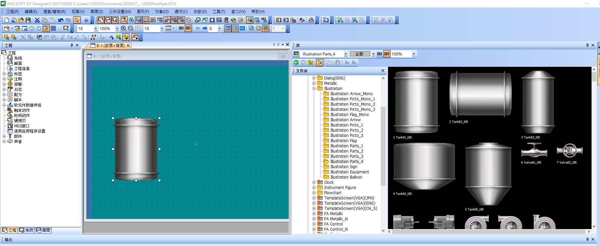

---

## 三、制作艺术字标题

1. 菜单栏 **图形(F) → 艺术字**（或工具栏对应图标），弹出「艺术字」设置窗口。
2. 在「文字(X)」输入框中输入标题文字，例如：

   ```
   PIPE & FAN ANIMATION
   ```

3. 在「基本设置」页签中设置：
   - **文本颜色**：选择所需颜色
   - **文本尺寸**：宽 × 高，例如 16 × 16
   - **装饰(E)**：选择「加边」等效果
4. 在效果预览列表中挑选颜色样式（如绿色 4 号 Logo 样式）。
5. 点击「确定」完成艺术字放置，并调整位置至画面顶部。

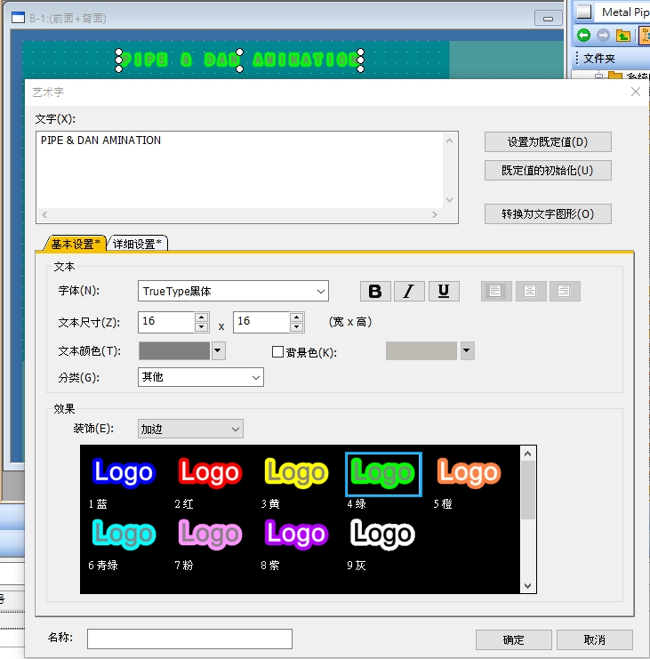

---

## 四、制作水泵启停开关

### 4.1 放置开关对象并设置动作

1. 菜单 **对象(O) → 开关(Switch)**，在画面上放置一个开关，弹出「开关」设置窗口。
2. 切换到「基本设置 → 动作设置」页签：
   - 点击「位(B)…」添加动作
   - **软元件(D)**：填入 `GB100`（内部继电器，作为泵运行状态位）
   - **动作设置**：选择 **位反转**（每按一次开关，状态取反：ON/OFF 切换）
3. 「指示灯功能」区域选择 **位的 ON/OFF**，软元件同样填 `GB100`，
   这样开关的外观会随 `GB100` 状态自动切换。

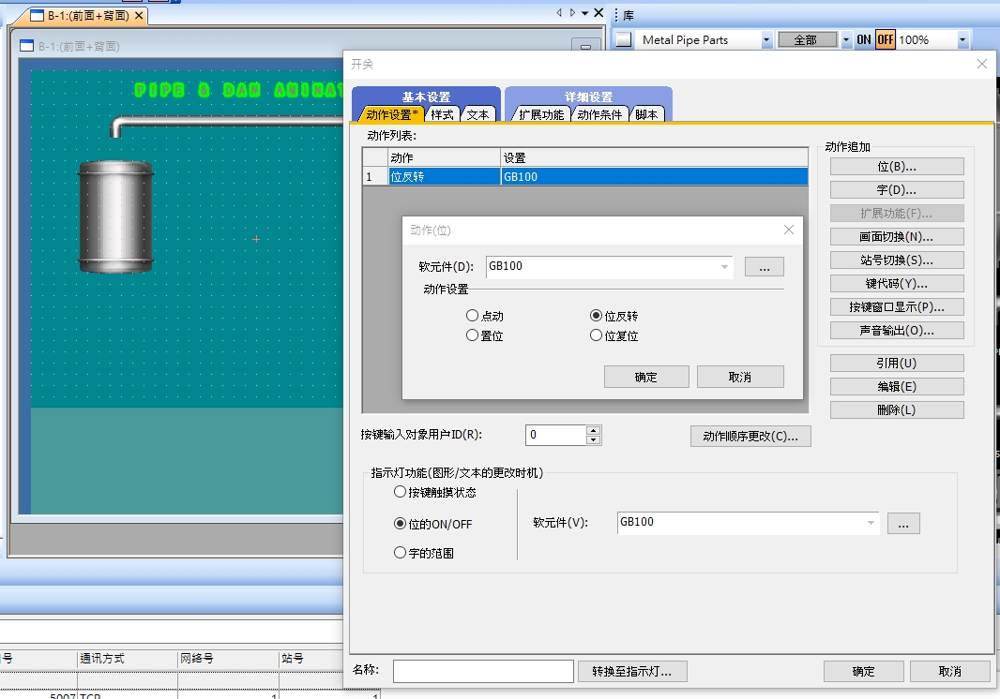

### 4.2 设置开关的 ON/OFF 图片样式

1. 切换到「样式」页签，取消/保留「根据文字...」选项。
2. 显示图形选择 **库(L)**，分类选择：
   `Illustration Parts_4`，颜色选择「绿色」。
3. 在图库中找到水泵/电机图形，例如 `131 Pump06_`：
   - **指示灯 OFF**：选择红色版本图形（表示停止状态）
   - **指示灯 ON**：选择绿色版本图形（表示运行状态）
4. 点击「确定」完成。此时开关会在 `GB100=0` 时显示红色泵图，
   `GB100=1` 时显示绿色泵图，模拟启动效果。

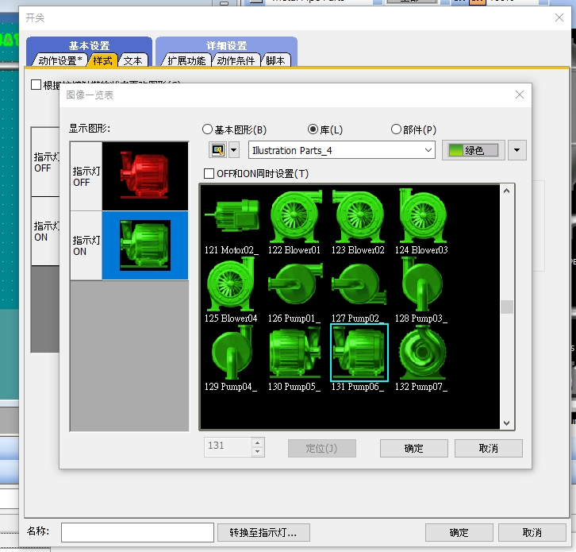

---

## 五、制作管道流动动画（部件移动）

管道内的“流动指示”是通过 **部件（Parts）移动** 实现的：一个小方块部件沿着水平/垂直路径移动，模拟液体在管道中流动。

### 5.1 新建移动部件

1. 左侧工程树 **部件 → 新建**，创建两个部件：
   - `1 horizontal`：水平方向的短线/方块图形（用于水平管段）
   - `2 Vertical`：垂直方向的短线/方块图形（用于垂直管段）
2. 每个部件在部件编辑窗口中绘制一个简单的绿色矩形图块作为“流动指示块”。

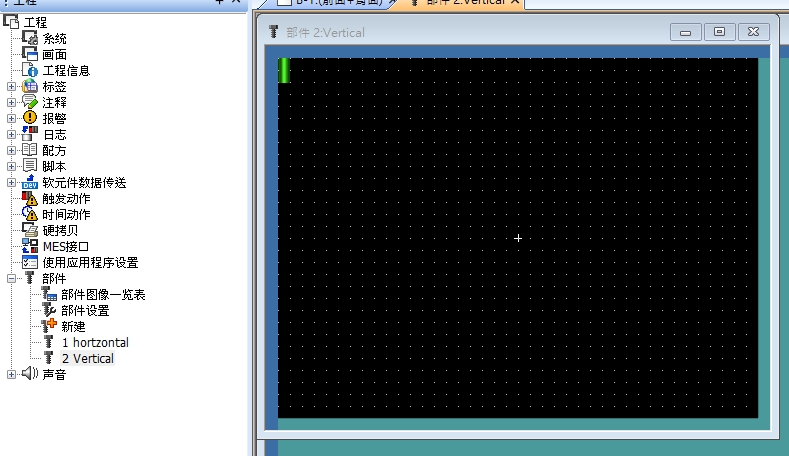

### 5.2 放置「部件移动（固定）」对象

1. 菜单 **对象(O) → 部件显示/移动 → Parts Movement → Fixed Parts (固定)**。

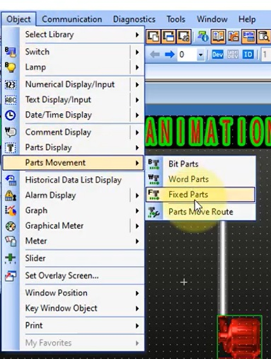
2. 在画面上点击放置，弹出「部件移动（固定）」设置窗口：
   - **位置软元件(D)**：`GD200`
   - **数据格式(A)**：无符号 BIN16
   - **移动方法(W)**：直线
   - **最小值/最大值**：0 ~ 50（即部件沿路径在 0~50 的数值范围内移动位置）
   - **定位(E)**：左上
   - **部件详细 → 部件号**：选择步骤 5.1 中创建的部件
     - 水平管段处放置引用「1 horizontal」的部件移动对象
     - 垂直管段处放置引用「2 Vertical」的部件移动对象

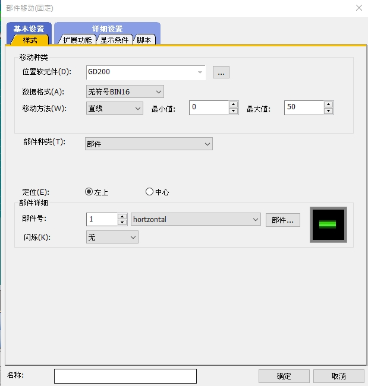

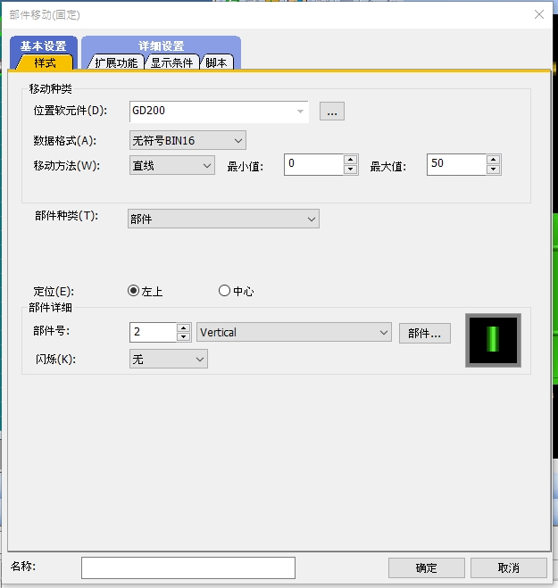

3. 两个方向的部件移动对象都使用同一个软元件 `GD200` 作为位置数据，
   这样水平段和垂直段的“流动块”会同步移动，形成沿管道连续流动的视觉效果。

---

## 六、用脚本让位置数据自动递增

### 6.1 新建画面脚本

1. 左侧工程树 **脚本 → 新建**，选择画面种类「基本」，画面编号「1」。
2. 点击「脚本编辑」，弹出「触发设置」：
   - **触发类型(G)**：`ON中`（表示只要触发条件为 ON，就持续循环执行）
   - **触发软元件(D)**：`GB100`（也就是水泵启动位，只有水泵运行时管道动画才执行）

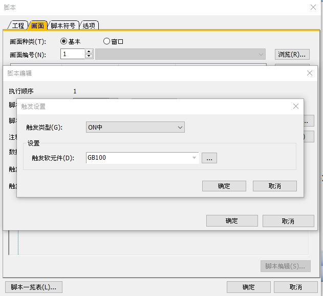

### 6.2 编写脚本内容

在脚本编辑窗口输入：

```c
[w:GD200] = [w:GD200] + 1;

if([w:GD200] == 50){ [w:GD200] = 0; }
```

**说明：**
- 每次脚本执行时，`GD200` 数值加 1
- 当数值达到 50（部件移动设置的最大值）时，重置为 0
- 从而使管道上的流动指示块沿路径循环往复移动
- 由于触发条件是 `GB100`（泵运行状态位），只有当泵处于运行（ON）状态时，管道内才会出现流动动画

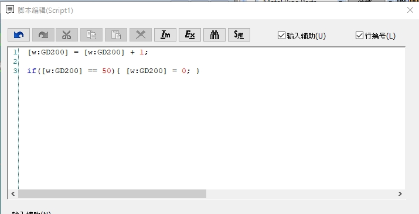

---

## 七、模拟器测试（第一阶段）

1. 保存工程后，点击工具栏 **模拟器 (GT Simulator3)** 图标启动仿真。
2. 效果验证：
   - 点击红色水泵开关 → 泵变为绿色（运行状态，`GB100=1`）
   - 管道上的蓝色指示块开始沿管道路径移动
   - 画面中央数字（`GD200` 数值）从 0 递增到 49 后归零，循环显示
3. 再次点击开关 → 泵变回红色（停止），管道动画随之停止。

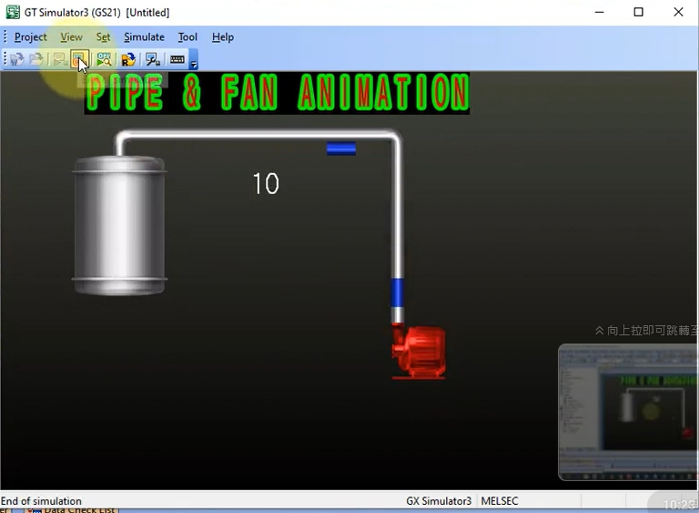

---

## 八、制作风扇旋转动画

### 8.1 准备风扇图片素材

1. 打开库面板，切换到分类：`Illustration Parts_2`
2. 找到风扇图形组：`Fan01_1、Fan01_2、Fan01_3、Fan01_4`
   —— 这是同一把风扇在旋转过程中 4 个不同角度的静态图片，
   依次快速切换即可产生“旋转”的视觉效果（类似逐帧动画）。

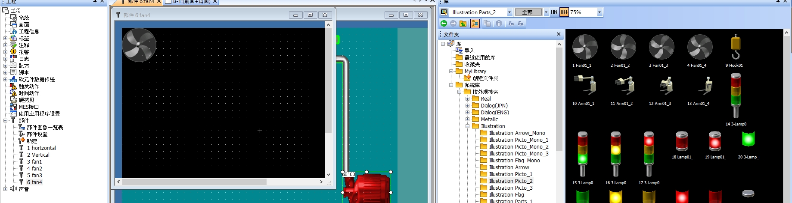

### 8.2 新建 4 个风扇部件

1. 工程树 **部件 → 新建**，依次创建：
   - `3 fan1` → 贴入 `Fan01_1` 图片
   - `4 fan2` → 贴入 `Fan01_2` 图片
   - `5 fan3` → 贴入 `Fan01_3` 图片
   - `6 fan4` → 贴入 `Fan01_4` 图片
2. 每个部件窗口中导入对应角度的风扇图片。

### 8.3 放置「部件显示（字）」对象实现切换

1. 菜单 **对象(O) → 部件显示/移动 → Parts Display**，在画面风扇位置放置对象，
   弹出「部件显示（字）」设置窗口：
   - **部件切换方式(P)**：选择「字」
   - **部件切换软元件(D)**：`GD201`
   - **数据格式(A)**：有符号 BIN16
   - **部件种类(T)**：部件
   - **部件详细 → 间接软元件(V)**：勾选，表示根据 `GD201` 的数值间接引用对应编号的部件
   - **预览号**：填入初始显示的部件编号（如 3，对应 `fan1`）
2. 点击「确定」，风扇图形放置到画面中（初始显示 `fan1` 静止画面）。

> 原理：`GD201` 数值 = 部件编号，`GD201=3` 显示 fan1，`GD201=4` 显示 fan2……
> 只要让 `GD201` 在 3~6 之间循环变化，风扇就会呈现连续旋转的动画效果。

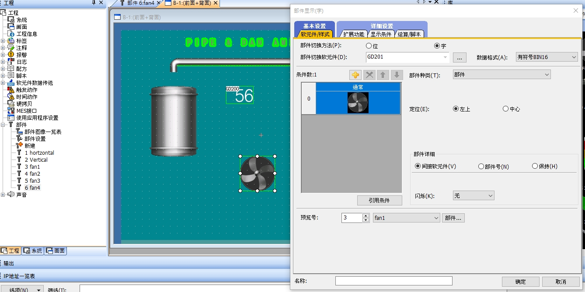

---

## 九、完善脚本：同时驱动管道流动 + 风扇旋转

回到步骤六建立的脚本，追加风扇旋转逻辑：

```c
[w:GD200] = [w:GD200] + 1;

if([w:GD200] == 50){ [w:GD200] = 0; }

[w:GD201] = [w:GD201] + 1;

if([w:GD201] == 6){ [w:GD201] = 3; }
```

**说明：**
- 新增 `GD201` 每次循环加 1
- 当 `GD201` 达到 6 时重置为 3（因为风扇部件编号范围是 3、4、5、6）
- 这样风扇部件会在 fan1 → fan2 → fan3 → fan4 → fan1 …… 之间循环切换，
  配合脚本的高频执行（ON 中持续触发），产生风扇旋转的视觉效果
- 由于触发条件仍是 `GB100`，风扇旋转动画同样只在泵运行时才会启动

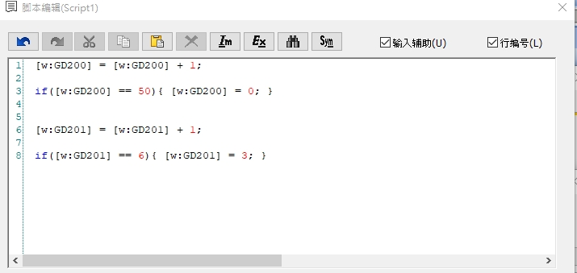

---

## 十、最终模拟测试

1. 保存工程，再次启动 **GT Simulator3**。
2. 点击水泵开关，`GB100` 变为 ON：
   - 泵图标变为绿色（运行状态）
   - 管道内指示块持续流动，数字（GD200）0~49 循环计数
   - 风扇图标持续旋转（叶片角度快速切换），数字（GD201）3~5 循环计数
3. 再次点击开关关闭水泵，所有动画随之停止，恢复静止画面。

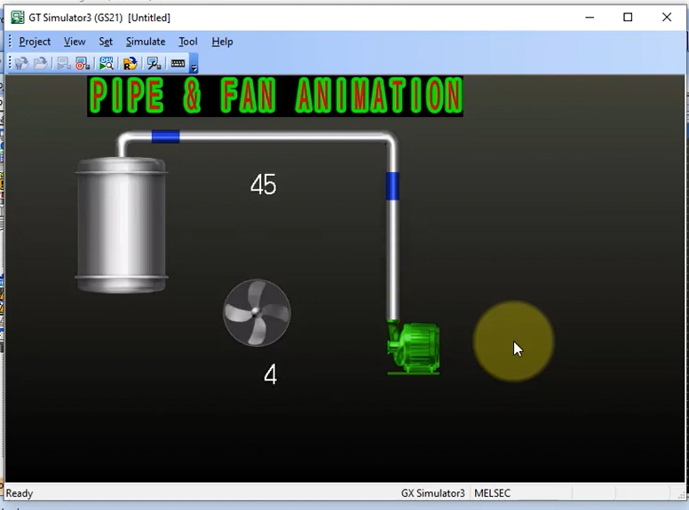

---

## 十一、要点总结

| 功能 | 使用的对象 | 关键软元件 |
|---|---|---|
| 泵启停控制 + 图片切换 | 开关（位反转 + 指示灯 ON/OFF 图片） | `GB100` |
| 管道流动动画 | 部件移动（固定），水平/垂直各一个 | `GD200`（0~50 循环） |
| 风扇旋转动画 | 部件显示（字），间接引用部件编号 | `GD201`（3~6 循环） |
| 动画驱动逻辑 | 画面脚本，触发类型 = ON中，触发软元件 = `GB100` | 脚本对 `GD200` / `GD201` 做递增与归零 |

**设计思路核心：**
用两个不断循环递增（再归零）的数据寄存器，分别去驱动
「部件移动的位置」和「部件图片切换的编号」，
并用一个位软元件（`GB100`）同时作为：
1. 开关状态位（决定按钮显示红/绿）
2. 脚本触发条件（决定动画是否运行）

从而实现「按下开关 → 设备运行状态改变 → 动画随之启动/停止」的联动效果。
这个方法可以推广到几乎所有工业动画场景，例如传送带滚动、搅拌机旋转、阀门开合等。

---

*参考视频：Mitsubishi HMI Animation Tutorial | Fan and Pipe Animation on HMI*
