# PLC Training / Tutorial for Allen-Bradley (Video 1 of 11)
# Allen-Bradley PLC 培訓教程（11 集之第 1 集）

> 中英對照教程｜Bilingual (EN / 中文) Tutorial
> Video / 影片：<https://www.youtube.com/watch?v=zlsJxSK8tPE>
> Instructor / 講師：Ron Beaufort（PLC Boot Camp）　Host / 主持：Archie Jacobs（Manufacturing Automation）
> Website / 網站：<http://www.ronbeaufort.com>　Channel / 頻道：<https://www.youtube.com/@ronbeaufort>

**Lesson topic / 本集主題：Problem: Mistakes and Misconceptions / 問題：錯誤與誤解**

---

## Table of Contents / 目錄

1. [Course approach / 課程方法](#1-course-approach--課程方法)
2. [Platforms used / 使用的平台](#2-platforms-used--使用的平台)
3. [The light box / 燈箱實驗裝置](#3-the-light-box--燈箱實驗裝置)
4. [Warm-up program (two rungs) / 熱身程式（兩個梯級）](#4-warm-up-program-two-rungs--熱身程式兩個梯級)
5. [The curveball rung / 變化球梯級](#5-the-curveball-rung--變化球梯級)
6. [The common (wrong) prediction / 常見的（錯誤）預測](#6-the-common-wrong-prediction--常見的錯誤預測)
7. [What really happens / 真實結果](#7-what-really-happens--真實結果)
8. [Misconceptions exposed / 被揭穿的誤解](#8-misconceptions-exposed--被揭穿的誤解)
9. [A first look at the real mechanism / 初探真正的運作機制](#9-a-first-look-at-the-real-mechanism--初探真正的運作機制)
10. [Key takeaways / 重點整理](#10-key-takeaways--重點整理)
11. [Series outline / 系列課程大綱](#11-series-outline--系列課程大綱)
12. [Glossary / 術語對照表](#12-glossary--術語對照表)

---

## 1. Course approach / 課程方法

The PLC Boot Camp does not rely on long lectures or PowerPoint slideshows. The whole hands-on approach is built around a **problem–solution format**: set up one realistic problem after another, then coach students through a systematic, step-by-step process to find the solution.

> PLC Boot Camp 不依賴冗長的講課，也從不使用 PowerPoint 簡報。整套實作式教學圍繞**「問題—解法」**的形式：一個接一個地設定貼近實務的問題，再一步一步、有系統地引導學員找出答案。

These videos are a quick preview of the 40-hour Boot Camp. They aim to make you an effective troubleshooter by teaching you to **think the same way a PLC does**. They are suitable for beginners and for people with many years of experience, because many long-held misconceptions get corrected.

> 這些影片是 40 小時 Boot Camp 課程的快速預覽，目標是教你**像 PLC 一樣思考**，成為有效率的故障排除人員。無論是初學者或資深人員都適用，因為許多根深蒂固的誤解會在此被糾正。

---

## 2. Platforms used / 使用的平台

This series focuses on the **PLC-5, SLC-500 and MicroLogix** families. To try the first exercise at home, a MicroLogix system works perfectly well.

> 本系列聚焦於 **PLC-5、SLC-500 與 MicroLogix** 系列。若想在家嘗試第一個練習，一套 MicroLogix 系統就足夠。

### MicroLogix 1000

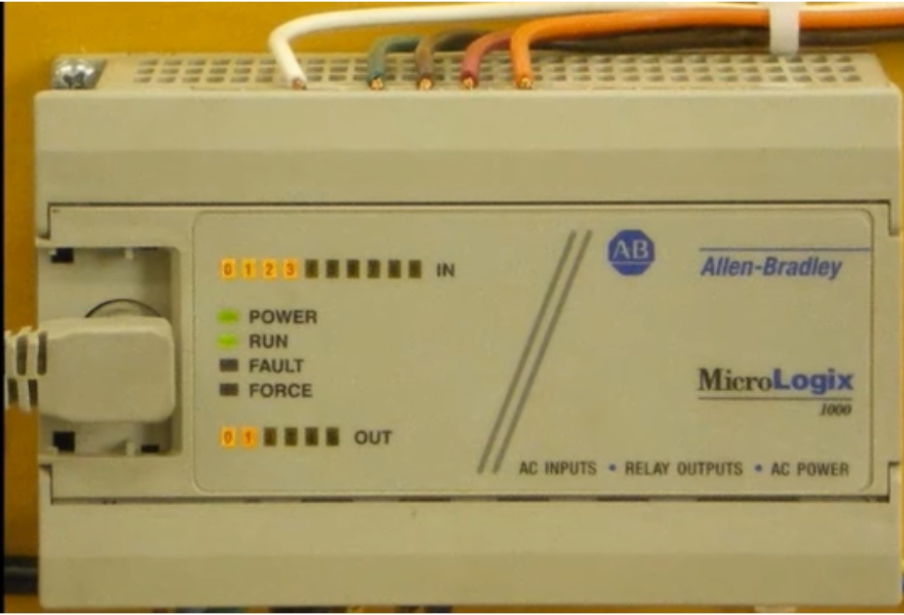

A compact all-in-one unit (AC inputs, relay outputs, AC power). It can run the same experiment at home.

> 小型一體式控制器（交流輸入、繼電器輸出、交流電源），可在家重現同一個實驗。

### SLC 5/04

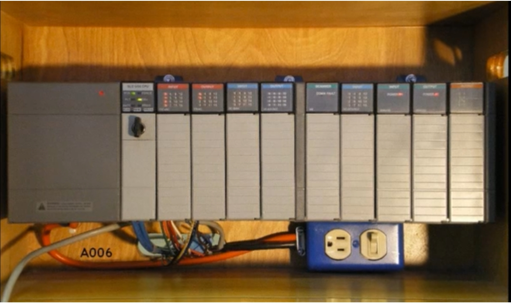

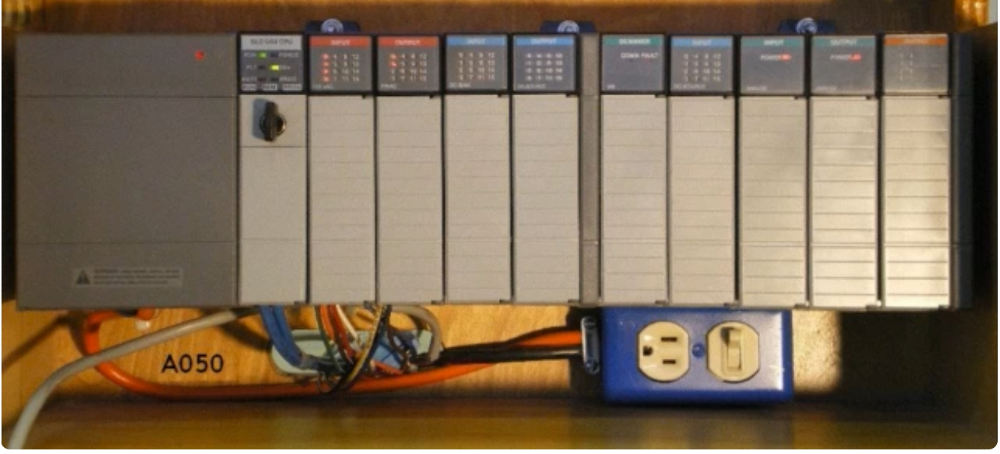

In class, the light box is controlled by either an Allen-Bradley SLC 5/04 …

> 課堂上，燈箱由 Allen-Bradley SLC 5/04 控制……

### PLC-5

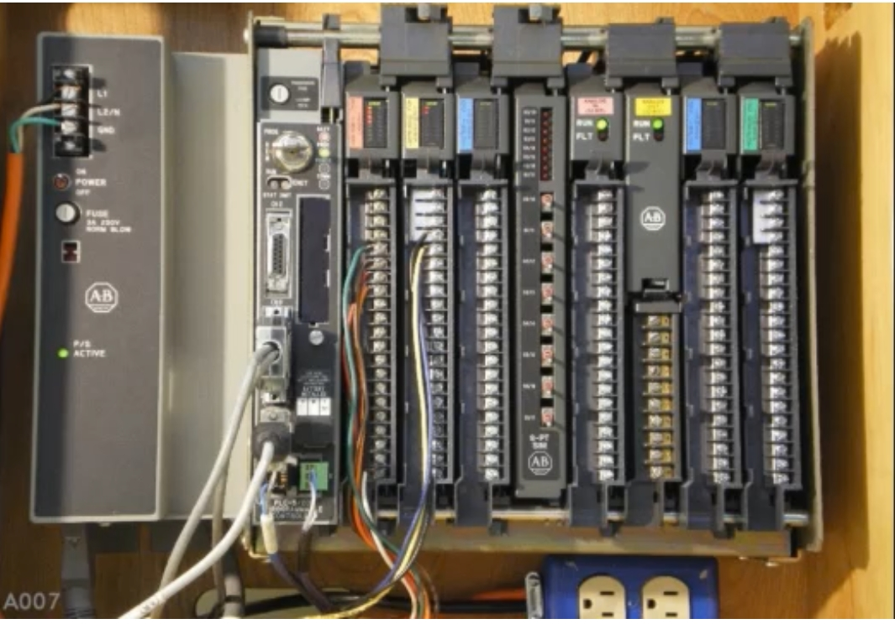

… or by an Allen-Bradley PLC-5 system.

> ……或由 Allen-Bradley PLC-5 系統控制。

### ControlLogix (marked with a red X / 以紅色 X 標示)

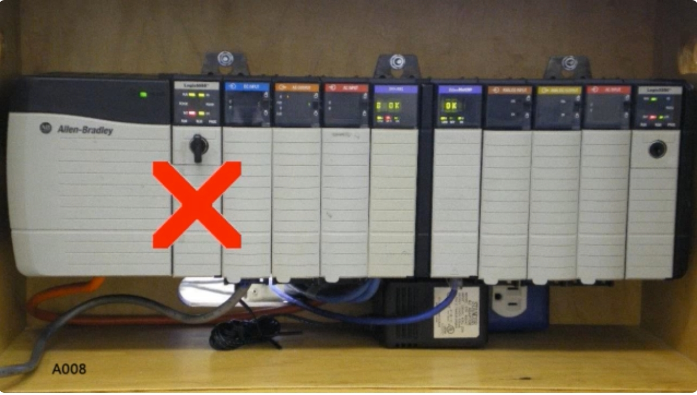

There are Boot Camp classes for ControlLogix too, but the red X is a reminder that these processors use a **different scan sequence**, so some material in this series does not quite fit them. ControlLogix may be covered in a future series.

> ControlLogix 平台也有對應的 Boot Camp 課程，但紅色 X 提醒你：這類處理器採用**不同的掃描順序**，因此本系列部分內容並不完全適用，之後或許會另開系列介紹。

---

## 3. The light box / 燈箱實驗裝置

The first lesson uses a simple "light box" for a warm-up exercise. It has four toggle switches (**A, B, C, D**) and two lamps (**E, F**). Switch A and Switch B are used as PLC inputs; Lamp E and Lamp F are PLC outputs. This uncomplicated little box has bewildered quite a few experienced technicians over the years.

> 第一堂課用一個簡單的「燈箱」做熱身練習。它有四個撥動開關（**A、B、C、D**）與兩顆燈（**E、F**）。開關 A、B 作為 PLC 輸入，燈 E、F 為 PLC 輸出。這個看似簡單的小箱子，多年來難倒過不少資深技術人員。

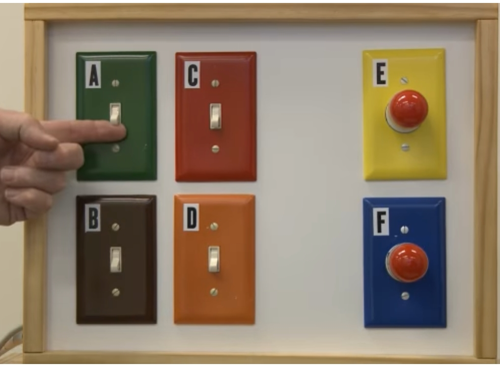

---

## 4. Warm-up program (two rungs) / 熱身程式（兩個梯級）

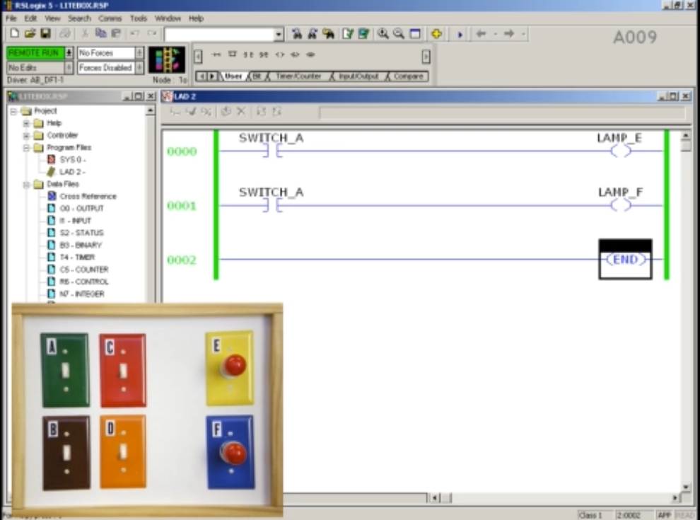

| Rung / 梯級 | Input contact / 輸入接點 | Output / 輸出 |
|---|---|---|
| 0000 | SWITCH_A (XIC) | LAMP_E (OTE) |
| 0001 | SWITCH_A (XIC) | LAMP_F (OTE) |
| 0002 | — | END |

### The "popular" explanation (NOT the Boot Camp approach, and NOT correct)
### 「流行」的解釋（不是 Boot Camp 的方法，也不正確）

Start with Switch A **on**. Both lamps come on. Many people explain it like this:

> 先把開關 A 打到 **ON**，兩顆燈都亮。許多人這樣解釋：

1. The contacts for Switch A are *Examine If Closed* (XIC / "examine on") instructions; each one looks at Switch A in the field to see whether it is closed.
2. Switch A is closed, so the contacts change state and become **true**; the processor marks them **green** to show rung continuity.
3. "Power" flows left to right and reaches the output instructions (*Output Energize*, OTE), which are said to work like **relay coils**, so they become "active" (green).
4. Active coils "energize" the real outputs: Lamp E and Lamp F turn on.

> 1. 開關 A 的接點是 *Examine If Closed*（XIC，「檢查是否閉合／ON」）指令，每個接點都會去現場檢查開關 A 是否閉合。
> 2. 開關 A 閉合，接點狀態改變而變為**真（true）**，處理器以**綠色**標示，表示梯級連續。
> 3. 「電源」由左向右流動，到達輸出指令（*Output Energize*，OTE）；人們說它像**繼電器線圈**，因此變成「作用中」（綠色）。
> 4. 作用中的線圈「激磁」現場輸出：燈 E、燈 F 亮起。

Now turn Switch A **off**: the contacts go false (no longer green), power can't flow, the "coils" become inactive (not green), so they can't energize the outputs, and both lamps turn off.

> 現在把開關 A 切到 **OFF**：接點變為假（不再是綠色），電源無法流通，「線圈」變為非作用中（不是綠色），因此無法激磁輸出，兩顆燈熄滅。

**The video's point:** these mistaken explanations *work*, but only while you stay at the beginner level. In real-world work you will meet many situations where this theory disagrees with reality.

> **影片重點：**這些錯誤的解釋「看起來行得通」，但只限於初學階段。進入實務後，你會遇到許多理論與現實不符的情況。

---

## 5. The curveball rung / 變化球梯級

Now a new rung is **inserted between** the two existing rungs. The two original rungs are not changed at all.

> 現在在原有兩個梯級**中間插入**一個新梯級，原本兩個梯級完全不改動。

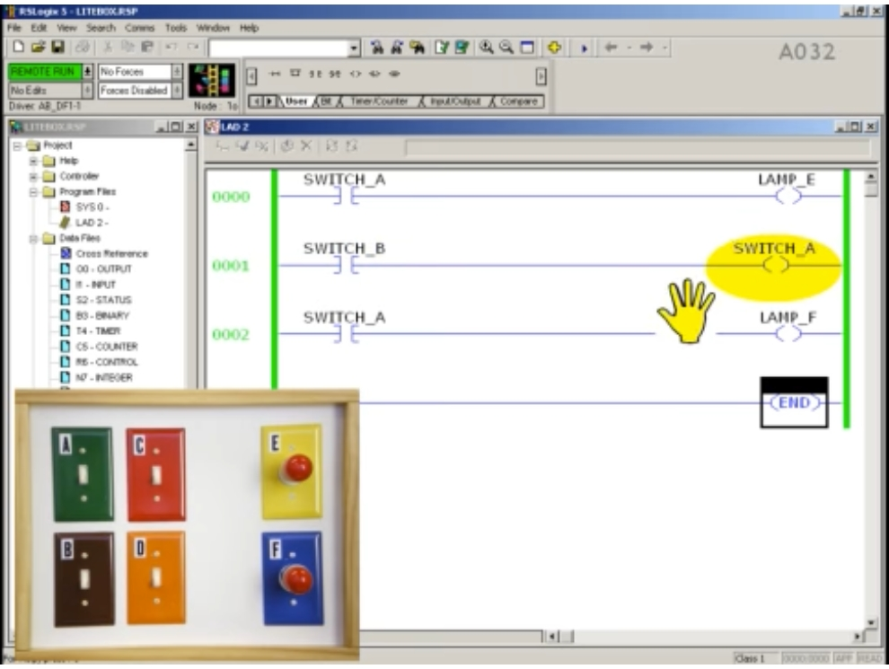

| Rung / 梯級 | Input contact / 輸入接點 | Output / 輸出 |
|---|---|---|
| 0000 | SWITCH_A (XIC) | LAMP_E (OTE) |
| **0001 (new / 新)** | **SWITCH_B (XIC)** | **SWITCH_A (OTE)** |
| 0002 | SWITCH_A (XIC) | LAMP_F (OTE) |
| 0003 | — | END |

The new rung uses **Switch B** as its input and **Switch A** as its output. This is not a good way to write a program and you may never see it again, but this curveball teaches a lot about how PLCs really operate "under the hood".

> 新梯級以**開關 B** 為輸入，**開關 A** 為輸出。這不是良好的程式寫法，你也許再也不會遇到，但這顆「變化球」能讓你學到 PLC 內部真正如何運作。

**Starting state / 起始狀態：** all switches off, both lamps off. **Question / 問題：** what happens to Lamp E and Lamp F the next time Switch A is turned on (with Switch B still off)?

> 所有開關皆為 OFF，兩顆燈熄滅。**問題：**在開關 B 仍為 OFF 的情況下，下一次把開關 A 打開，燈 E 與燈 F 會如何？

---

## 6. The common (wrong) prediction / 常見的（錯誤）預測

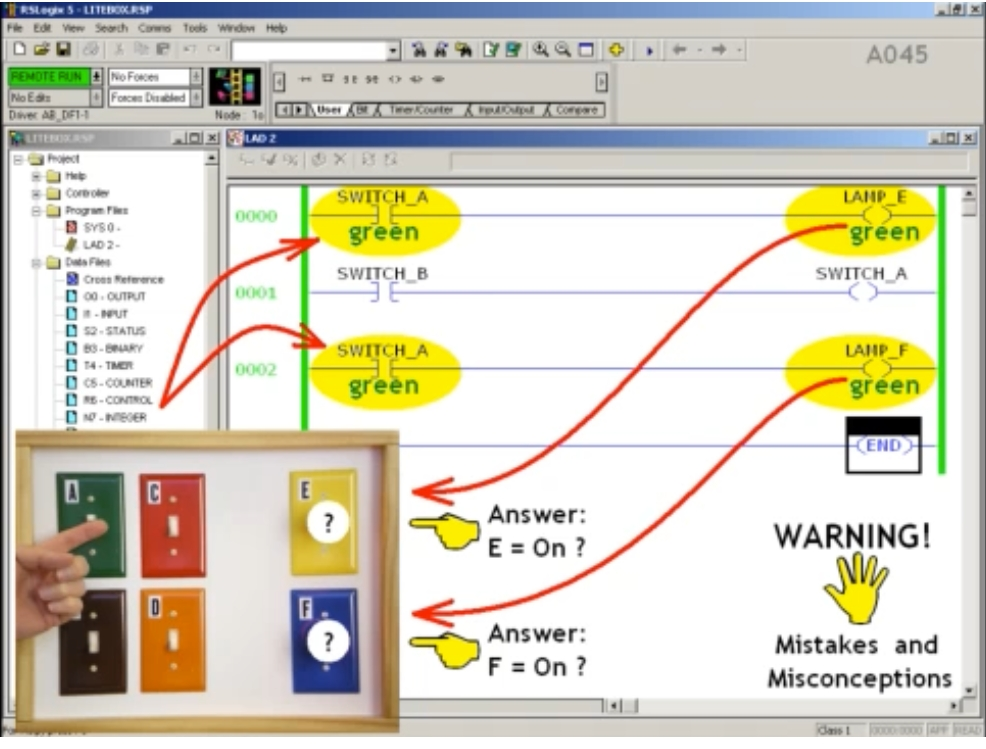

Many people reason as follows:

> 許多人這樣推理：

1. **Middle rung first:** Switch B is off, so the XIC finds it open → no continuity → "no power" → the output is disabled and can't affect Switch A.
2. Besides, an output coil in the program **can't affect an input device** in the field. Switch A is not a remote-control switch: no motor, no coil, nothing for the PLC to energize. So this "bogus" rung should have **no effect**.
3. Back to familiar territory: both Switch A contacts examine Switch A, find it closed → both true (green) → both rungs have continuity → both coils active → both outputs energized.
4. The two original rungs worked before and haven't been changed, so they should still work.

> 1. **先看中間梯級：**開關 B 是 OFF，XIC 找到它是斷開的 → 無連續性 →「沒有電」→ 輸出被禁能，無法影響開關 A。
> 2. 再說，程式中的輸出線圈**不可能影響**現場的輸入裝置。開關 A 不是遙控開關：沒有馬達、沒有線圈，PLC 無物可激磁。所以這個「假」梯級**不會有任何影響**。
> 3. 回到熟悉的部分：兩個開關 A 接點都檢查開關 A，發現它閉合 → 都為真（綠色）→ 兩個梯級都有連續性 → 兩個線圈都作用中 → 兩個輸出都被激磁。
> 4. 原本兩個梯級先前運作正常、也沒被修改，現在應該一樣正常。

**Predicted answer / 預測答案：Lamp E = ON, Lamp F = ON ❌ (wrong! / 錯！)**

*(The video suggests pausing here if you don't want the answer yet. / 影片在此建議：若還不想看答案，請先暫停。)*

---

## 7. What really happens / 真實結果

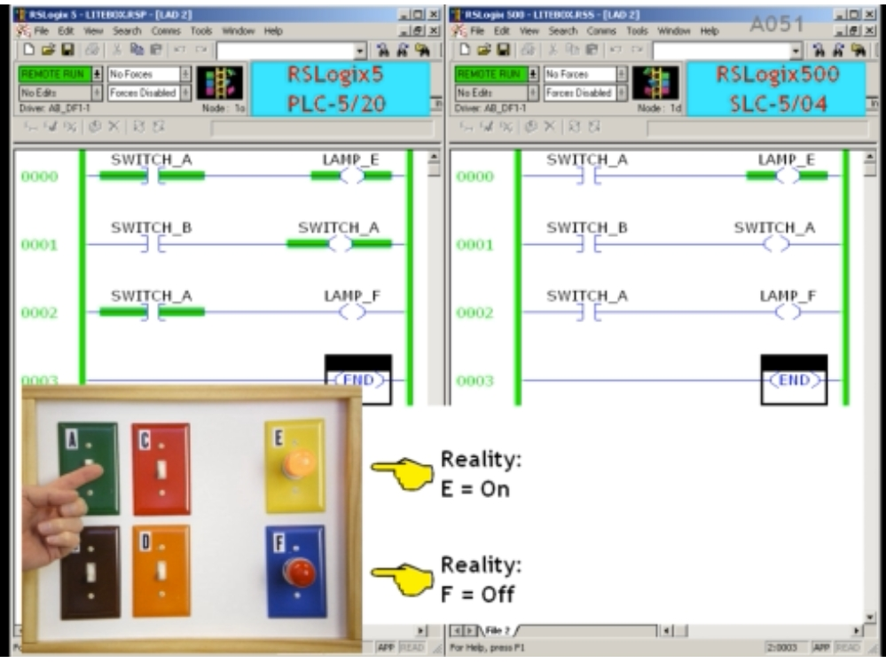

When Switch A is turned on (Switch B off):

> 當開關 A 打開（開關 B 為 OFF）時：

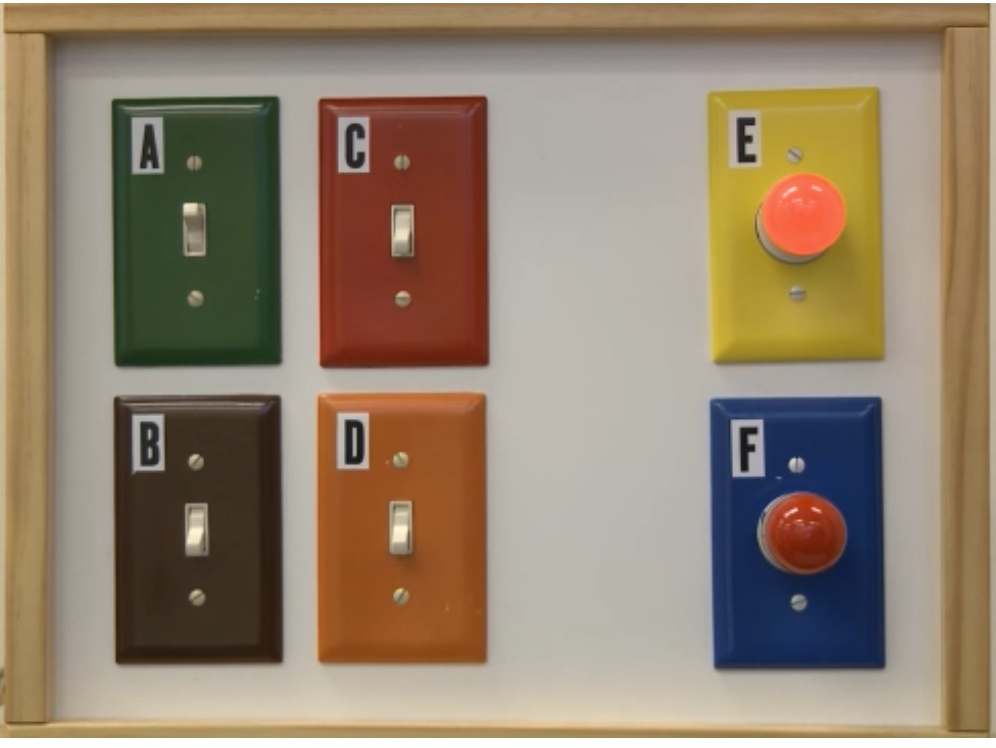

| Lamp / 燈 | Reality / 真實結果 |
|---|---|
| **E** | **ON / 亮** |
| **F** | **OFF / 不亮** |

This is **totally predictable** once you understand how a PLC really works, and it will be shown step by step later in the series.

> 一旦你了解 PLC 真正的運作方式，這個結果是**完全可預測**的，系列後面會逐步說明。

The example uses a PLC-5 with serial-port communications. With a MicroLogix or SLC 500 the **real lamps behave exactly the same**, but the pattern of green on the screen is **different**. The video shows both side by side:

> 範例使用 PLC-5 與序列埠通訊。若改用 MicroLogix 或 SLC 500，**真實的燈泡行為完全相同**，但螢幕上綠色的顯示樣式**不同**。影片將兩者並排比較：

| | Left / 左 | Right / 右 |
|---|---|---|
| Software / 軟體 | RSLogix 5 | RSLogix 500 |
| Processor / 處理器 | PLC-5/20 | SLC-5/04 |
| Rung 0000 | Contact green, output green / 接點綠、輸出綠 | Contact **not** green, output green / 接點**不**綠、輸出綠 |
| Rung 0001 | Contact **not** green, output green / 接點不綠、輸出綠 | Contact not green, output not green / 接點不綠、輸出不綠 |
| Rung 0002 | Contact green, output **not** green / 接點綠、輸出不綠 | Contact not green, output not green / 接點不綠、輸出不綠 |

> 注意 / Note: the table summarizes the screen capture shown above; compare it with the image. / 表格依上方截圖整理，請對照圖片確認。

---

## 8. Misconceptions exposed / 被揭穿的誤解

| # | Common belief / 常見說法 | Reality in this exercise / 本練習中的真相 |
|---|---|---|
| 1 | An XIC "examines the switch in the field to see if it's on". | If so, Lamp F would be ON, because Switch A is definitely on in the field. It isn't.  若真如此，燈 F 應該亮，因為開關 A 在現場確實是 ON，但燈 F 沒亮。 |
| 2 | When an output instruction is enabled, it energizes an output; when "disabled", it does nothing. | The middle rung's output is disabled by Switch B, **yet it still affects the program** through its address, Switch A.  中間梯級的輸出被開關 B 禁能，**卻仍然透過其位址（開關 A）影響程式**。 |
| 3 | Green on screen = true / active = power flow. | The top Switch A contact is true, but its "twin" at the bottom is false. **Green on screen can't always be trusted.**  上面的開關 A 接點為真，但下面「孿生」接點為假。**螢幕上的綠色並非永遠可信。** |
| 4 | Looking directly at the bit tables is more reliable than the ladder display. | The video shows the bit tables too ("here they are") and moves on to a systematic method for making sense of everything.  影片也展示了位元表（「就是這些」），接著引入一套系統化的方法來理解全部狀況。 |

**Big question / 大問題：** Is there a way to make sense of all this? **Yes** — a systematic, step-by-step approach, going far deeper than "green on the screen" and "switches and relay coils" explanations.

> 有沒有辦法理解這一切？**有。**透過系統化、逐步的方法，遠比「螢幕上的綠色」以及「開關與繼電器線圈」的說法更深入。

---

## 9. A first look at the real mechanism / 初探真正的運作機制

> ⚠️ **Supplementary note / 補充說明：**This section is a reading aid based on the diagram shown in the video; the full explanation comes in later lessons (scan sequence, bits and instructions, step-by-step analysis).
> 本節依影片中的示意圖整理，作為閱讀輔助；完整說明會在後續課程（掃描順序、位元與指令、逐步分析）中呈現。

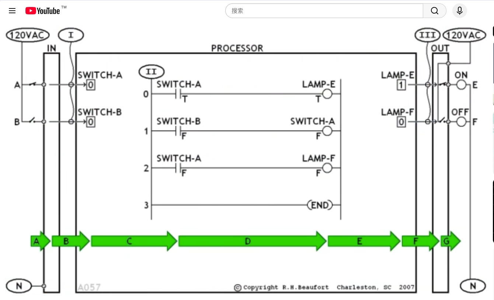

The diagram splits the system into three parts: **IN** (input module), **PROCESSOR** (memory + ladder program), **OUT** (output module). The green arrows **A → G** trace a signal from the field switch to the field lamp:

> 示意圖把系統分為三部分：**IN（輸入模組）**、**PROCESSOR（處理器：記憶體＋梯形圖程式）**、**OUT（輸出模組）**。綠色箭頭 **A → G** 描繪訊號從現場開關走到現場燈泡的路徑：

* **I** — the input module reports the state of each field switch into **memory bits** (e.g., SWITCH-A, SWITCH-B).
  輸入模組把每個現場開關的狀態寫入**記憶體位元**（如 SWITCH-A、SWITCH-B）。
* **II** — the processor solves the ladder program **by examining and writing memory bits**, not by examining the field devices. XIC instructions read bits; OTE instructions **write** bits (note: the middle rung writes to the *SWITCH-A* bit).
  處理器靠**檢查與寫入記憶體位元**來執行梯形圖，而不是檢查現場裝置。XIC 讀取位元；OTE **寫入**位元（注意：中間梯級寫入的是 *SWITCH-A* 這個位元）。
* **III** — the output module sets each field lamp according to its **output bit** in memory (LAMP-E = 1 → ON, LAMP-F = 0 → OFF).
  輸出模組依記憶體中的**輸出位元**驅動現場燈泡（LAMP-E = 1 → 亮，LAMP-F = 0 → 不亮）。

In the diagram's snapshot, rung 0 shows true (T) → LAMP-E = 1, while rung 1 (SWITCH-B is false) writes **0 into the SWITCH-A bit**, so rung 2's contact sees false (F) → LAMP-F = 0. That is why the *same* contact name can be true on one rung and false on another, even though the physical switch is ON.

> 在圖中的瞬間：梯級 0 為真（T）→ LAMP-E = 1；而梯級 1（開關 B 為假）把 **0 寫入 SWITCH-A 位元**，所以梯級 2 的接點看到的是假（F）→ LAMP-F = 0。這就是為什麼同名接點在一個梯級為真、在另一個梯級為假，即使實體開關其實是 ON。

---

## 10. Key takeaways / 重點整理

1. A ladder contact does **not** look at the field device; it looks at a **bit in memory**.
   梯形圖接點**不是**去看現場裝置，而是看**記憶體中的位元**。
2. An output instruction is **not** a relay coil; it **writes** a bit, even when its rung is false.
   輸出指令**不是**繼電器線圈；它會**寫入**位元，即使梯級為假也一樣。
3. Green on the screen does not simply mean "power flow" and can't always be trusted.
   螢幕上的綠色並非單純代表「電流通過」，不能永遠信任。
4. The same program can show **different green patterns** on RSLogix 5 and RSLogix 500, but the real-world result is the same.
   同一程式在 RSLogix 5 與 RSLogix 500 上的**綠色顯示樣式不同**，但實際結果相同。
5. Understanding the PLC's real operation is what makes a good troubleshooter.
   真正理解 PLC 的運作，才能成為優秀的故障排除人員。

---

## 11. Series outline / 系列課程大綱

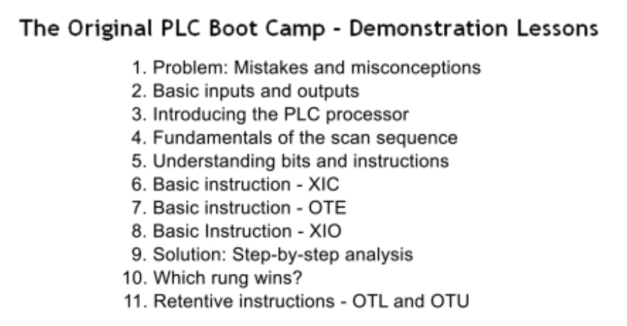

| # | English | 中文 |
|---|---|---|
| 1 | Problem: Mistakes and misconceptions | 問題：錯誤與誤解（本集） |
| 2 | Basic inputs and outputs | 基本輸入與輸出 |
| 3 | Introducing the PLC processor | 認識 PLC 處理器 |
| 4 | Fundamentals of the scan sequence | 掃描順序基礎 |
| 5 | Understanding bits and instructions | 理解位元與指令 |
| 6 | Basic instruction – XIC | 基本指令：XIC |
| 7 | Basic instruction – OTE | 基本指令：OTE |
| 8 | Basic instruction – XIO | 基本指令：XIO |
| 9 | Solution: Step-by-step analysis | 解法：逐步分析 |
| 10 | Which rung wins? | 哪個梯級獲勝？ |
| 11 | Retentive instructions – OTL and OTU | 保持型指令：OTL 與 OTU |

---

## 12. Glossary / 術語對照表

| English | 中文 |
|---|---|
| PLC (Programmable Logic Controller) | 可程式邏輯控制器 |
| Rung | 梯級 |
| Rung continuity | 梯級連續性 |
| XIC (Examine If Closed) | 檢查是否閉合（常開接點） |
| XIO (Examine If Open) | 檢查是否斷開（常閉接點） |
| OTE (Output Energize) | 輸出激磁 |
| OTL / OTU (Output Latch / Unlatch) | 輸出閂鎖／解閂 |
| Scan sequence | 掃描順序 |
| Bit table | 位元表 |
| Processor | 處理器 |
| Input / Output module | 輸入／輸出模組 |
| Troubleshooter | 故障排除人員 |
| Light box | 燈箱 |
| Misconception | 誤解 |
