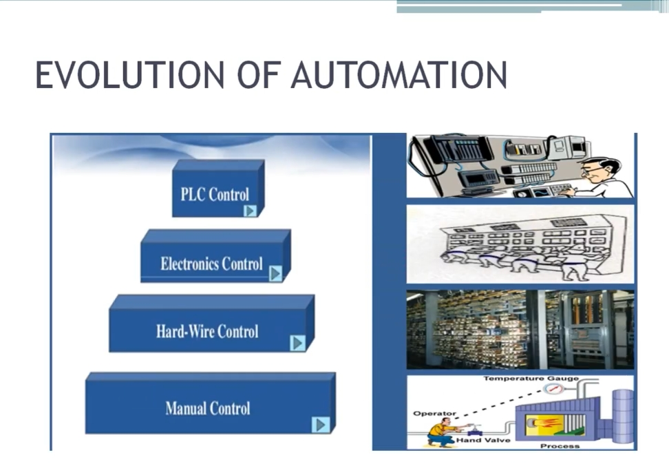

# 自動化的演進 / Evolution of Automation

> 影片參考 / Video reference：[YouTube 教學影片](https://www.youtube.com/watch?v=jrPF1lzRHm8&list=PLI78ZBihrkE3nnGIj2WmHb_GoWjFlfFIu&index=2)

在深入學習「如何實現自動化」之前，我們必須先了解自動化的發展歷史。工業自動化並非一蹴可幾，而是經歷了數個階段，逐步從純人工操作演變為今日的智慧化控制系統。
Before learning *how* to implement automation, we first need to understand its history. Industrial automation did not happen overnight — it evolved through several stages, gradually moving from purely manual operation to today's intelligent control systems.

如下圖所示，自動化的演進大致可分為四個階段：**人工控制 → 硬體（繼電器）控制 → 電子控制 → PLC 控制**。
As shown in the diagram below, the evolution of automation can be divided into four main stages: **Manual Control → Hard-Wire Control → Electronics Control → PLC Control**.

---

## 一、人工控制（Manual Control）

工業自動化最早期的形式，是完全依賴人力進行量測與控制作業，例如操作人員手動讀取溫度計數值、手動開關閥門等。
This is the earliest form of industrial automation, relying entirely on human labor for measurement and control tasks — for example, an operator manually reading a temperature gauge or manually opening/closing a valve.

**缺點 / Disadvantages：**
- 精確度不足 / Low accuracy
- 難以提升生產力 / Hard to improve productivity
- 安全性較差 / Poor safety

正是因為這些問題，產業開始朝向「硬體控制」邁進。
Because of these problems, industry moved toward "hard-wire control."

---

## 二、硬體控制（Hard-Wire Control）

硬體控制主要是利用電氣元件（如繼電器 Relay）來實現控制邏輯。
Hard-wire control implements control logic mainly using electrical/electromechanical components such as relays.

**優點（相較人工控制）/ Advantages (vs. Manual Control)：**
- 減少了直接的人工介入 / Less direct human involvement required

**缺點 / Disadvantages：**
- 佔用空間大 / Occupies a large space：大量的繼電器與配線使得控制盤體積龐大 — The large number of relays and wiring makes control panels bulky.
- 系統複雜、故障排除困難 / Complex and hard to troubleshoot：業界有句話說「找出故障要花五小時，修好故障只要五分鐘」— There's a saying: "Five hours to find the fault, five minutes to fix it," reflecting how tangled and hard-to-trace the wiring is.
- 功耗高、損耗大 / High power consumption and loss：整體效率因此降低 — Overall efficiency is reduced as a result.
- 停機風險 / Downtime risk：故障排除期間必須停產，嚴重影響產能 — Production must stop during troubleshooting, seriously affecting productivity.
- 安全性雖優於人工控制，但仍不夠理想 / Safety is better than manual control, but still not ideal.

---

## 三、電子控制（Electronics Control）

隨著電子技術發展，控制系統改採電子元件，例如印刷電路板（PCB）、積體電路（IC）等邏輯閘元件。
As electronics technology advanced, control systems shifted to electronic components such as printed circuit boards (PCBs) and integrated circuits (ICs)/logic gates.

**優點（相較硬體控制）/ Advantages (vs. Hard-Wire Control)：**
- 體積小、結構緊湊 / Small and compact
- 操作簡便 / Easy to operate
- 功耗低 / Low power consumption
- 配線需求大幅減少 / Much less wiring required

**缺點 / Disadvantages：**
- 故障排除困難 / Difficult to troubleshoot：正因體積小巧，故障診斷反而更不容易 — Precisely because it's compact, diagnosing faults becomes harder. 如同家中電視遙控器故障時，多數人不會嘗試維修，而是直接更換新品 — Like a broken TV remote at home: most people don't try to repair it, they just buy a new one, 因為即使能修，維修成本也可能高於更換 — because even if it could be repaired, the repair cost may exceed that of a replacement.
- 耐熱性差 / Poor heat tolerance：電子元件無法承受工業現場的高溫環境，也無法連續 24 小時、全年無休地運作 — Electronic components can't withstand the high temperatures of industrial environments, nor run continuously 24/7. （就像筆電無法連續使用超過 5～7 小時，手機充電器也會發熱一樣）— (Just as a laptop can't run continuously for more than 5–7 hours, and a phone charger also heats up.) 而工業控制器必須具備「24 小時 × 7 天」全天候運轉的能力 — But an industrial controller must be able to run around the clock, 24 hours a day, 7 days a week.

---

## 四、PLC 控制（Programmable Logic Controller）

為了克服前述各階段控制系統的缺點，可程式邏輯控制器（PLC）因應而生。PLC 專為工業環境設計，是目前工業自動化的核心控制器。
To overcome the drawbacks of the previous stages, the Programmable Logic Controller (PLC) was introduced. The PLC is designed specifically for industrial environments and is the core controller of modern industrial automation.

**優點 / Advantages：**
- 耐高溫、耐惡劣環境 / Heat- and environment-resistant：可在工業現場全年無休（24×7）穩定運作 — Can run stably in industrial settings around the clock (24×7).
- 故障排除容易 / Easy to troubleshoot：具備 LED 指示燈，可快速判斷各輸入/輸出（I/O）點的狀態，迅速定位問題 — Equipped with LED indicators that show the status of each input/output (I/O) point, allowing quick problem identification.
- 程式設計簡單 / Simple to program：程式撰寫門檻低，容易上手 — Low learning curve, easy to get started.
- 擴充性佳 / Good expandability：具備多組擴充埠，可依需求增加 I/O 點數 — Multiple expansion ports allow the number of I/O points to be increased as needed.

> 一句話總結 PLC / PLC in one sentence：**它是專為工業環境設計的控制器。/ It is a controller specially designed to operate in an industrial environment.**

隨後，工業自動化持續演進，進一步發展出分散式控制系統（DCS）、智慧型變送器（Smart Transmitters），乃至於今日的工業物聯網（IIOT）。
Industrial automation then continued to evolve further, leading to Distributed Control Systems (DCS), smart transmitters, and today's Industrial Internet of Things (IIoT).

---

## 總結 / Summary

| 階段 / Stage | 控制方式 / Control Method | 主要優點 / Key Advantages | 主要缺點 / Key Disadvantages |
|------|----------|----------|----------|
| 1 | 人工控制 / Manual Control | 成本低、實作簡單 / Low cost, simple | 精度低、效率差、安全性不足 / Low accuracy, low efficiency, poor safety |
| 2 | 硬體（繼電器）控制 / Hard-Wire Control | 減少人工介入 / Less human involvement | 體積大、故障排除困難、功耗高 / Bulky, hard to troubleshoot, high power use |
| 3 | 電子控制 / Electronics Control | 體積小、功耗低、配線少 / Compact, low power, less wiring | 故障排除困難、無法耐高溫長時運轉 / Hard to troubleshoot, poor heat tolerance |
| 4 | PLC 控制 / PLC Control | 耐熱耐用、易除錯、易編程、可擴充 / Rugged, easy to debug/program, expandable | （已大幅改善前述各項問題）/ (Largely overcomes the issues above) |

這四個階段的演進，正是工業控制系統從「人力驅動」走向「智慧自動化」的縮影，也是理解後續 PLC、DCS 與 IIOT 等技術發展的重要基礎。
These four stages capture, in miniature, how industrial control systems evolved from "human-driven" to "intelligent automation" — and form the essential foundation for understanding later technologies such as PLC, DCS, and IIoT.
