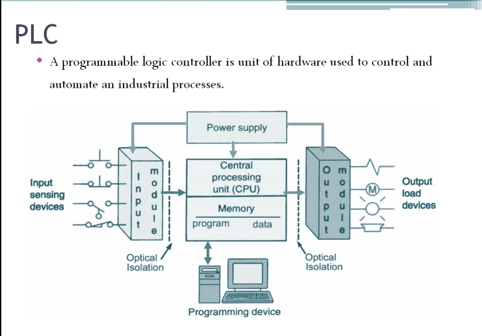

# PLC 基礎與架構 雙語教程
# PLC Basics and Architecture — Bilingual Tutorial

> 來源 Source: PLC Training 3 – Programmable Logic Controller
> https://www.youtube.com/watch?v=pIMEOA_injE&list=PLI78ZBihrkE3nnGIj2WmHb_GoWjFlfFIu&index=3

---

## 1. 什麼是 PLC？ What Is a PLC?

**EN:** A Programmable Logic Controller (PLC) is a unit of hardware used to control and automate an industrial process. It is one of the core tools of industrial automation, used alongside systems such as SCADA. A PLC includes both hardware and software.

**中文：** 可程式邏輯控制器（PLC）是用來控制並自動化工業製程的硬體單元，是工業自動化的核心工具之一，常與 SCADA 等系統搭配使用。PLC 同時包含硬體與軟體。

**EN:** A PLC continuously monitors inputs from sensors or other input devices, and, based on its stored program, makes decisions to operate actuators (output devices) such as lamps or motors.

**中文：** PLC 會持續監測來自感測器或其他輸入裝置的訊號，並依據儲存的程式做出決策，驅動致動器（輸出裝置），例如指示燈或馬達。

**EN:** A PLC is often called an "industrial computer": like a normal computer, it has a processor, memory, and I/O support.

**中文：** PLC 常被稱為「工業電腦」：與一般電腦相同，內部具備處理器、記憶體與 I/O 支援。

---

## 2. PLC 的組成 Main Components

| # | English | 中文 |
|---|---------|------|
| 1 | Power Supply | 電源供應器 |
| 2 | Central Processing Unit (CPU) / Processor | 中央處理單元（處理器） |
| 3 | Memory | 記憶體 |
| 4 | Input Modules | 輸入模組 |
| 5 | Output Modules | 輸出模組 |
| 6 | Programming Device (computer) | 程式編輯裝置（電腦） |

Optional / additional components 選配元件：

| English | 中文 |
|---------|------|
| Operator interface device | 操作員介面裝置 |
| Communication adapter (for remote I/O) | 通訊轉接器（遠端 I/O） |
| Network interface | 網路介面 |

---

## 3. 電源供應器 Power Supply

**EN:** The power supply powers the CPU and the input/output modules. It converts the available AC (or DC) source into the DC voltage the system needs.

**中文：** 電源供應器為 CPU 及輸入/輸出模組供電，將現有的交流（或直流）電源轉換為系統所需的直流電壓。

---

## 4. 中央處理單元 CPU

**EN:** The CPU is the "brain" of the PLC. It performs logic operations and controls communication among modules. The user designs a program, downloads it to the CPU, and the CPU then accepts data from input devices, executes the stored program, and sends signals to the output module.

**中文：** CPU 是 PLC 的「大腦」，負責執行邏輯運算並控制各模組間的通訊。使用者設計程式並下載至 CPU，CPU 隨後接收輸入裝置的資料、執行儲存的程式，再將訊號送往輸出模組。

### 記憶體 Memory

| Type | English | 中文 |
|------|---------|------|
| ROM | Read-only memory; stores the operating system and system programs | 唯讀記憶體；儲存作業系統與系統程式 |
| RAM | Random-access memory; stores the user program and working data | 隨機存取記憶體；儲存使用者程式與工作資料 |
| Non-volatile memory (e.g., EEPROM) | Retains the user program and data; restores them if power fails | 非揮發性記憶體（如 EEPROM）；斷電時保存並還原程式與資料 |

---

## 5. 輸入/輸出模組 I/O Modules

**EN:** I/O modules are the bridge between field devices and the CPU. Devices cannot be connected directly to the CPU. Input modules accept signals from input devices; output modules send signals to output devices.

**中文：** I/O 模組是現場裝置與 CPU 之間的橋樑，裝置不能直接連接 CPU。輸入模組接收輸入裝置的訊號，輸出模組則將訊號送至輸出裝置。

| Module | English | 中文 | Examples 範例 |
|--------|---------|------|--------------|
| Digital I/O | On/off signals | 數位（開/關）訊號 | Switches, sensors, lamps, 開關、感測器、指示燈 |
| Analog I/O | Continuously varying signals | 類比（連續）訊號 | Transmitters, current transducers, control valves, VFD 變送器、電流轉換器、控制閥、變頻器 |

> 數位與類比使用不同模組，不可混用。 Digital and analog use different modules and are not interchangeable.

### 光隔離 Optical Isolation

**EN:** Optical isolation (the "isolation barrier", shown in the diagram) electrically isolates the CPU's internal components from the I/O modules. Because input and output devices connect directly to the modules, this protects the CPU from electrical faults.

**中文：** 光隔離（又稱隔離屏障，見上圖）使 CPU 內部元件與 I/O 模組電氣隔離。由於輸入/輸出裝置直接接到模組，此設計可避免電氣異常影響 CPU。

---

## 6. 程式編輯裝置 Programming Device

**EN:** A computer, laptop, or small handheld device with the programming software installed. Through a communication cable, the program is downloaded to (and uploaded from) the PLC.

**中文：** 安裝了程式軟體的電腦、筆電或小型手持裝置，透過通訊纜線將程式下載至 PLC（或由 PLC 上傳）。

---

## 7. 通訊模組 Communication Modules

**EN:** Communication interface modules are intelligent I/O modules that exchange information between the CPU and a communication network. They allow the PLC to talk to other PLCs or computers, including remote or distant ones, and to be part of a distributed control system.

**中文：** 通訊介面模組是智慧型 I/O 模組，負責在 CPU 與通訊網路間交換資訊，使 PLC 能與其他 PLC 或電腦（包含遠端設備）通訊，並納入分散式控制系統。

---

## 8. 圖解說明 Diagram Walkthrough

1. 輸入感測裝置（按鈕、開關）→ 輸入模組 / Input sensing devices → Input module
2. 光隔離 → CPU（含程式與資料記憶體）/ Optical isolation → CPU (program + data memory)
3. CPU → 光隔離 → 輸出模組 → 負載裝置（馬達 M、燈、蜂鳴器）/ CPU → optical isolation → Output module → Load devices (motor, lamp, buzzer)
4. 電源供應器供電給 CPU 與兩個 I/O 模組 / Power supply feeds the CPU and both I/O modules
5. 程式編輯裝置與 CPU 雙向連接 / The programming device connects bidirectionally to the CPU

---

## 9. 重點回顧 Summary

- PLC = 控制工業製程的硬體＋軟體 / hardware + software controlling industrial processes
- 六大組成：電源、CPU、記憶體、輸入模組、輸出模組、程式裝置 / Six parts: power supply, CPU, memory, input module, output module, programming device
- 數位與類比 I/O 需用不同模組 / Digital and analog I/O need different modules
- 光隔離保護 CPU / Optical isolation protects the CPU
