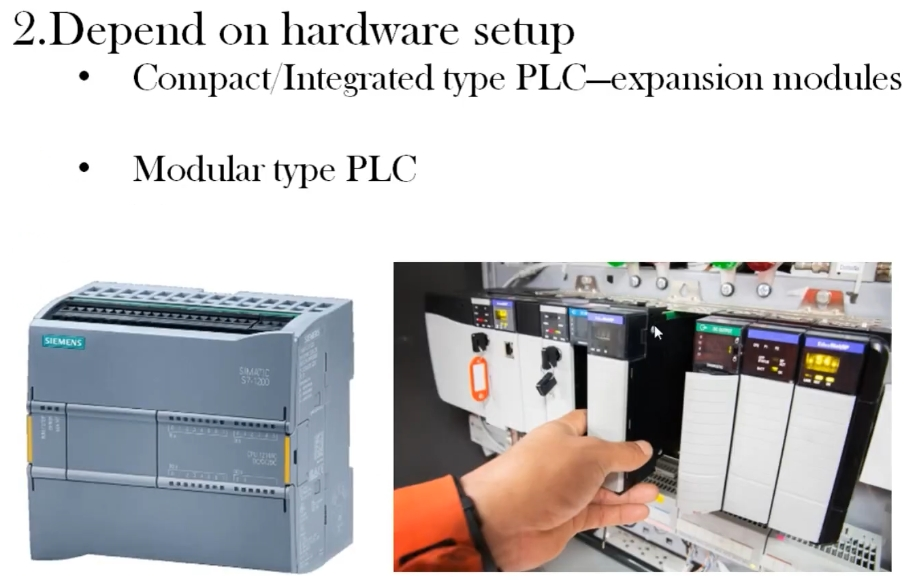
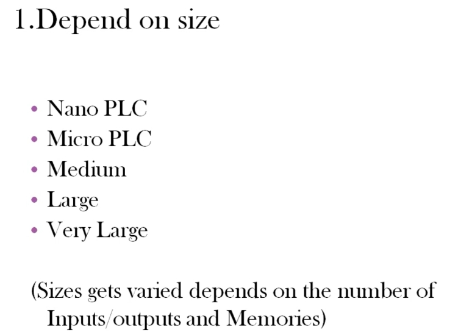
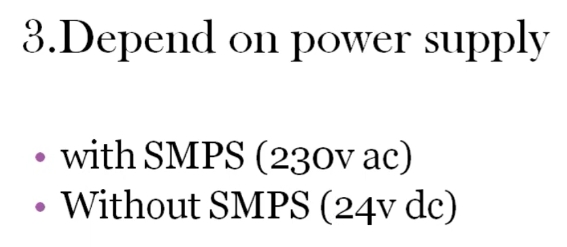

# PLC 的類型 雙語教程
# Types of PLC — Bilingual Tutorial

> 來源 Source: PLC Training 4 – Types of PLC
> https://www.youtube.com/watch?v=awEhouWf7cs&list=PLI78ZBihrkE3nnGIj2WmHb_GoWjFlfFIu&index=4

---

## 0. 概述 Overview

**EN:** PLCs come in many types. They can be classified in three ways: by **size**, by **hardware setup**, and by **power supply**. When purchasing a PLC, you should consider all three.

**中文：** PLC 有多種類型，可依三種方式分類：**尺寸**、**硬體配置**、**電源供應**。選購 PLC 時，這三方面都應納入考量。

| # | English | 中文 |
|---|---------|------|
| 1 | Depend on size | 依尺寸分類 |
| 2 | Depend on hardware setup | 依硬體配置分類 |
| 3 | Depend on power supply | 依電源供應分類 |

---

## 1. 依尺寸分類 Classification by Size

**EN:** By size, PLCs are classified as Nano, Micro, Medium, Large, and Very Large. Size varies with two parameters: the **number of inputs/outputs (I/O)** and the **memory** capacity.

**中文：** 依尺寸，PLC 分為奈米（Nano）、微型（Micro）、中型（Medium）、大型（Large）與超大型（Very Large）。尺寸差異取決於兩個參數：**輸入/輸出（I/O）點數**與**記憶體容量**。

| Size 尺寸 | English | 中文 |
|-----------|---------|------|
| Nano | Very few I/O; small enough to fit in a pocket-sized package | I/O 點數極少，體積小，可放入口袋大小的外殼 |
| Micro | More I/O than Nano, but still small | I/O 點數多於 Nano，但仍屬小型 |
| Medium | More I/O and memory than Micro | I/O 與記憶體多於 Micro |
| Large | Many I/O points | I/O 點數多 |
| Very Large | Can exceed 10,000–20,000 I/O (digital + analog combined), with the most memory | I/O 可超過 1 萬至 2 萬點（數位＋類比合計），記憶體最大 |

**EN:** There is no strict rule on which industry must use which size. It depends on the application and the number of I/O required. For example, oil & gas plants often use very large PLCs, while a college project can use a micro PLC; process industries may use a medium PLC, and even an amusement park may use a nano or micro PLC depending on the project.

**中文：** 並無嚴格規定哪個產業必須使用哪種尺寸，須視應用與所需 I/O 點數而定。例如石油天然氣產業常用超大型 PLC；學校專題可用微型 PLC；製程工業可用中型 PLC；遊樂園則可能依專案需求使用 Nano 或 Micro PLC。

---

## 2. 依硬體配置分類 Classification by Hardware Setup

### 2.1 一體式 Compact / Integrated Type PLC

**EN:** All components — power supply, I/O modules, and CPU — are combined in a **single box**. The number of I/O is fixed by the manufacturer. For example, a PLC may have 12 inputs and 16 outputs; if you need 6–7 more inputs, you cannot change it directly.

**中文：** 電源、I/O 模組與 CPU 等所有元件整合在**同一個機殼**內，I/O 點數由製造商固定。例如某 PLC 有 12 個輸入、16 個輸出；若需要多 6～7 個輸入，無法直接修改。

**EN:** Some manufacturers offer **expansion modules** — extra I/O modules connected to the CPU via communication — to add I/O when you run out.

**中文：** 部分製造商提供**擴充模組**（額外的 I/O 模組），以通訊方式連接 CPU，在 I/O 不足時增加點數。

### 2.2 模組式 Modular Type PLC

**EN:** The power supply, CPU, and I/O are **separate modules** that plug into place. If the CPU fails, you can remove it and plug in a new one. (In a compact PLC, a faulty CPU means the whole unit must be repaired or replaced.)

**中文：** 電源、CPU 與 I/O 為**各自獨立的模組**，以插接方式安裝。若 CPU 故障，可直接拔除並換上新的；（一體式 PLC 的 CPU 故障時，整台必須維修或更換。）

**EN:** A modular PLC has either a **rack** (like a DIN rail) or a **chassis** (a box with plug-in slots) in which the modules are mounted.

**中文：** 模組式 PLC 以**機架（Rack，類似 DIN 軌）**或**機箱（Chassis，具插槽的盒體）**來安裝各模組。

| | Compact 一體式 | Modular 模組式 |
|---|---|---|
| Structure 結構 | Single box 單一機殼 | Separate plug-in modules 獨立插接模組 |
| I/O count I/O 點數 | Fixed (expandable with expansion modules) 固定（可用擴充模組） | Flexible 彈性配置 |
| Fault handling 故障處理 | Repair/replace whole unit 整台維修或更換 | Replace faulty module 更換故障模組 |
| Example 範例 | Siemens S7-1200 | Rack/chassis-based PLC 機架/機箱式 PLC |

---

## 3. 依電源供應分類 Classification by Power Supply

**EN:** The supply a PLC needs is an important factor. It is specified in the PLC's user manual.

**中文：** PLC 所需的供電是重要的考量，詳細規格請參閱 PLC 使用手冊。

| Type 類型 | English | 中文 |
|-----------|---------|------|
| With SMPS (230 V AC) | Has a built-in SMPS (switch-mode power supply) that converts 230 V AC to 24 V DC, so mains voltage can be connected directly. | 內建 SMPS（交換式電源供應器），將 230 V 交流轉為 24 V 直流，可直接接市電。 |
| Without SMPS (24 V DC) | No built-in SMPS; you must supply 24 V DC (converted from mains externally). | 無內建 SMPS，須外部提供 24 V 直流電（自行由市電轉換）。 |

**EN:** The PLC's internal circuits actually operate on 24 V DC. A PLC with an SMPS does the conversion internally (the SMPS is not visible from outside).

**中文：** PLC 內部實際以 24 V 直流運作；內建 SMPS 的 PLC 在內部完成轉換（從外部看不到）。

> ⚠️ 接線前務必確認使用手冊的電源規格，若將 230 V 接到 24 V 輸入的 PLC 會造成損壞。
> Always check the manual before wiring: connecting 230 V to a 24 V-input PLC will damage it.

---

## 4. 重點回顧 Summary

- 三種分類方式：尺寸、硬體配置、電源 / Three classifications: size, hardware setup, power supply
- 尺寸由 I/O 數與記憶體決定：Nano → Micro → Medium → Large → Very Large / Size depends on I/O count and memory
- 一體式 = 單一機殼（可選擴充模組）；模組式 = 可更換的獨立模組 / Compact = single box (optional expansion); Modular = replaceable separate modules
- 電源：有 SMPS（230 V AC）或無 SMPS（24 V DC） / Power: with SMPS (230 V AC) or without (24 V DC)
- 選型依專案需求，而非產業別 / Choose by project requirements, not by industry
