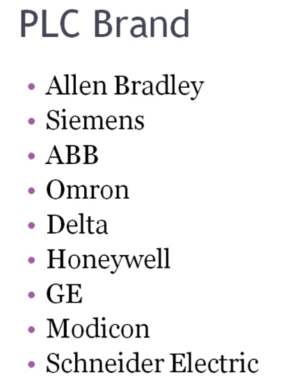
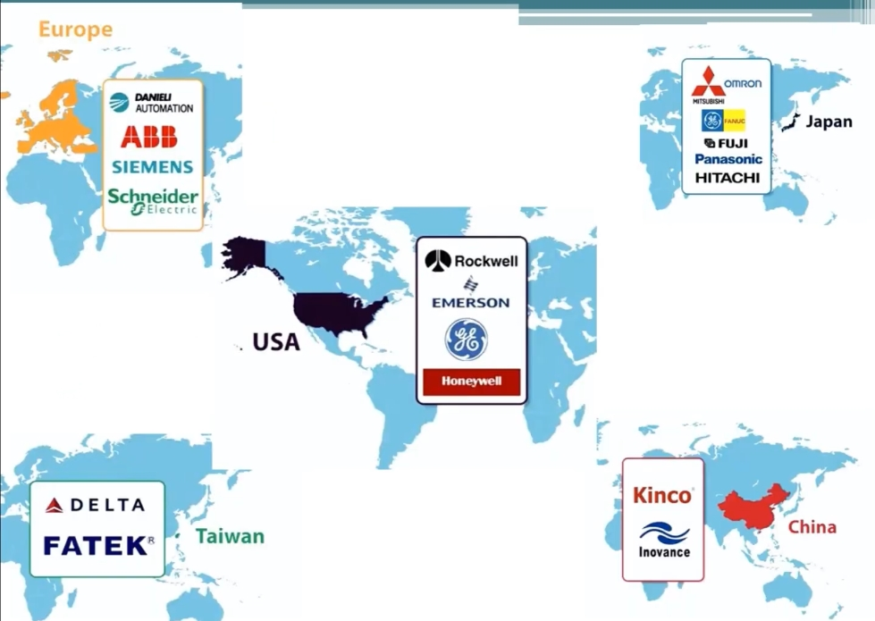

# PLC 品牌與製造商 雙語教程
# PLC Brands and Manufacturers — Bilingual Tutorial

> 來源 Source: PLC Training 5 – Top PLC Manufacturers
> https://www.youtube.com/watch?v=fkSDmY_r-e8&list=PLI78ZBihrkE3nnGIj2WmHb_GoWjFlfFIu&index=5

---

## 1. 常見 PLC 品牌 Popular PLC Brands

**EN:** Just like mobile phones, PLCs come in various brands, depending on the manufacturer. These brands are widely used in industry worldwide.

**中文：** 如同手機，PLC 也有各種品牌，取決於製造商。這些品牌在全球工業界被廣泛使用。

| English | 中文 / 備註 |
|---------|------------|
| Allen Bradley | 艾倫-布拉德利（Rockwell 旗下品牌） |
| Siemens | 西門子 |
| ABB | ABB |
| Omron | 歐姆龍 |
| Delta | 台達電子 |
| Honeywell | 霍尼韋爾 |
| GE | 通用電氣 |
| Modicon | Modicon（Schneider Electric 旗下） |
| Schneider Electric | 施耐德電氣 |

> 影片說明列出的頂級製造商 / Top manufacturers listed in the video description: Siemens, Allen Bradley, ABB, Omron, Delta, Schneider Electric, Mitsubishi.

---

## 2. 依國家／地區分類 Brands by Country / Region

| Region 地區 | Brands 品牌 |
|-------------|-------------|
| 🇺🇸 USA 美國 | Rockwell (Allen Bradley), Emerson, GE, Honeywell |
| 🇪🇺 Europe 歐洲 | ABB, Siemens, Schneider Electric, Danieli Automation |
| 🇯🇵 Japan 日本 | Omron, Mitsubishi, Fanuc, Fuji, Panasonic, Hitachi |
| 🇨🇳 China 中國 | Kinco（步科）, Inovance（匯川） |
| 🇹🇼 Taiwan 台灣 | Delta（台達）, Fatek（永宏） |

**EN:** In the USA, most industries use Rockwell (Allen Bradley), Emerson, GE, and Honeywell. In Europe, ABB, Siemens, and Schneider are the three most popular. In Japan there is Omron; in China, Inovance and Kinco; and in Taiwan, Delta.

**中文：** 美國多數產業使用 Rockwell（Allen Bradley）、Emerson、GE 與 Honeywell；歐洲最受歡迎的是 ABB、Siemens 與 Schneider；日本有 Omron；中國有 Inovance（匯川）與 Kinco（步科）；台灣有 Delta（台達）。

---

## 3. 如何選擇品牌 How to Choose a Brand

**EN:** There is no rule that you must use a particular brand. The choice depends on your **industry requirements** and **budget**. For example, in India, Siemens, Delta, and Omron are popular. Allen Bradley is considerably more expensive than Delta or Omron.

**中文：** 沒有規定必須使用某個品牌，選擇取決於**產業需求**與**預算**。例如在印度，Siemens、Delta 與 Omron 很常見；Allen Bradley 的價格明顯高於 Delta 或 Omron。

---

## 4. 安全型 PLC Safety PLC

**EN:** Most of these brands also offer a **safety PLC**. It works like a regular PLC but is dedicated to safety functions. Safety PLCs can be identified by their **color coding**, typically **red** (e.g., Allen Bradley's GuardLogix).

**中文：** 這些品牌多半也提供**安全型 PLC**。其功能與一般 PLC 相同，但專用於安全領域。可透過**顏色標示**辨認，通常為**紅色**（例如 Allen Bradley 的 GuardLogix）。

---

## 5. 重點回顧 Summary

- 品牌眾多，依製造商與國家而異 / Many brands, grouped by manufacturer and country
- 美：Rockwell/AB、Emerson、GE、Honeywell；歐：ABB、Siemens、Schneider；日：Omron、Mitsubishi；中：Inovance、Kinco；台：Delta、Fatek
- 選品牌看需求與預算，而非固定規則 / Choose by requirements and budget
- 安全型 PLC 多為紅色 / Safety PLCs are usually red
- 本系列課程接下來將以美國品牌為例 / The course continues with a US brand
