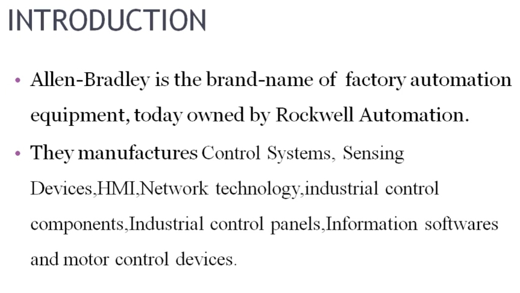
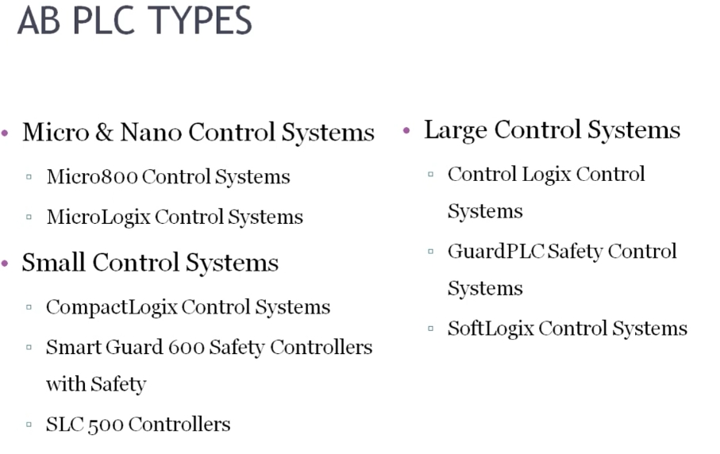
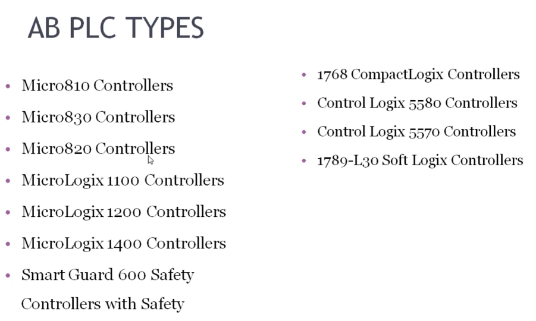

# Allen-Bradley PLC 簡介 雙語教程
# Introduction to Allen-Bradley PLC — Bilingual Tutorial

> 來源 Source: PLC Training 6 – Introduction to Allen Bradley PLC
> https://www.youtube.com/watch?v=sHmJ6OTcMoI&list=PLI78ZBihrkE3nnGIj2WmHb_GoWjFlfFIu&index=6

---

## 1. 公司與品牌 Company and Brand

**EN:** Allen-Bradley is the brand name of factory automation equipment, today owned by Rockwell Automation, a company based in the United States.

**中文：** Allen-Bradley 是工廠自動化設備的品牌名稱，現為 Rockwell Automation（羅克韋爾自動化）所有，公司總部位於美國。

**EN:** Rockwell Automation manufactures the following product lines. The PLC (controller) belongs to the **Control Systems** line.

**中文：** Rockwell Automation 生產下列產品線，PLC（控制器）屬於其中的**控制系統**。

| English | 中文 |
|---------|------|
| Control Systems (controllers / PLC) | 控制系統（控制器／PLC） |
| Sensing Devices | 感測裝置 |
| HMI (Human-Machine Interface) | 人機介面 |
| Network Technology | 網路技術 |
| Industrial Control Components | 工業控制元件 |
| Industrial Control Panels | 工業控制盤 |
| Information Software | 資訊軟體 |
| Motor Control Devices | 馬達控制裝置 |

---

## 2. Allen-Bradley PLC 的三大類 Three Major Categories

**EN:** Allen-Bradley PLCs are classified into three categories according to **size**.

**中文：** Allen-Bradley PLC 依**尺寸**分為三大類。

| Category 類別 | Product families 產品系列 | 中文說明 |
|---------------|---------------------------|----------|
| **Micro & Nano Control Systems** | Micro800, MicroLogix | 微型與奈米控制系統：體積很小的 PLC |
| **Small Control Systems** | CompactLogix, Smart Guard 600 Safety Controllers, SLC 500 | 小型控制系統（Smart Guard 600 為安全控制器） |
| **Large Control Systems** | ControlLogix, GuardPLC Safety Control Systems, SoftLogix | 大型控制系統（GuardPLC 為安全控制系統） |

**EN:** Large control systems are suited to applications such as oil & gas companies and power plants. Choose the category that fits your requirements.

**中文：** 大型控制系統適用於石油天然氣公司、發電廠等應用，請依需求選擇適合的類別。

---

## 3. 各系列型號 Series and Models

**EN:** Each category contains multiple series. Series differ from each other in **CPU (processor), memory size, number of I/O, and expansion module count**. For example, the difference between Micro810 and Micro830 lies in the number of I/Os and expansion modules.

**中文：** 每個類別下有多個系列，系列之間的差異在於 **CPU（處理器）、記憶體大小、I/O 點數與擴充模組數量**。例如 Micro810 與 Micro830 的差別在於 I/O 點數與擴充模組數。

| Category 類別 | Models 型號 |
|---------------|-------------|
| Micro & Nano | Micro810, Micro830, Micro820 Controllers |
| Micro & Nano | MicroLogix 1100, 1200, 1400 Controllers |
| Small | Smart Guard 600 Safety Controllers |
| Small | 1768 CompactLogix Controllers |
| Large | ControlLogix 5580, ControlLogix 5570 Controllers |
| Large | 1789-L30 SoftLogix Controllers |

> 安全型 PLC（Safety PLC）：Smart Guard 600 為其中一種安全控制系統。
> Safety PLC: Smart Guard 600 is one of the safety control systems.

---

## 4. 重點回顧 Summary

- Allen-Bradley = Rockwell Automation 旗下的工廠自動化品牌 / the factory automation brand of Rockwell Automation (USA)
- PLC 屬於「控制系統」產品線 / PLCs belong to the Control Systems line
- 三大類：Micro & Nano、Small、Large / Three categories by size
- 系列差異：CPU、記憶體、I/O 數量 / Series differ in CPU, memory, I/O count
- 下一課：Allen-Bradley PLC 的程式設計軟體 / Next: the programming software for Allen-Bradley PLCs
