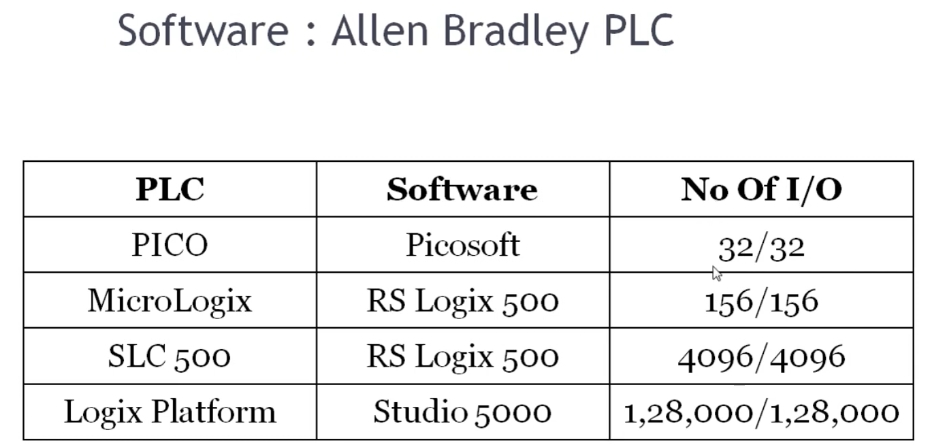

# PLC Training 7 – Allen-Bradley PLC Software List
# PLC 訓練 7 – Allen-Bradley PLC 軟體清單

> 原影片 / Source video: <https://www.youtube.com/watch?v=6oYphWqdImY&list=PLI78ZBihrkE3nnGIj2WmHb_GoWjFlfFIu&index=7>

---

## 1. 本課目標 / Objectives

| 中文 | English |
|---|---|
| 認識 Allen-Bradley（艾倫·布拉德利）PLC 的三種程式軟體。 | Learn the three types of programming software used with Allen-Bradley PLCs. |
| 了解各系列 PLC 對應哪一套軟體。 | Understand which software goes with which PLC family. |
| 了解各系列的 I/O 點數規模。 | Understand the I/O capacity of each family. |

---

## 2. 軟體總覽 / Software Overview

| PLC 系列 / PLC Family | 軟體 / Software | I/O 點數 (輸入/輸出) / No. of I/O (In/Out) |
|---|---|---|
| PICO | Picosoft | 32 / 32 |
| MicroLogix | RSLogix 500 | 156 / 156 |
| SLC 500 | RSLogix 500 | 4096 / 4096 |
| Logix Platform | Studio 5000 | 128,000 / 128,000 |

---

## 3. 講解內容 / Lecture Content

### 3.1 PLC 的規模分類 / PLC Size Classes

**中文**
上一課介紹了 Allen-Bradley PLC 的類型，大致分為四個等級：

- **Pico**、**MicroLogix**：屬於 **Nano / Micro（迷你～微型）** 級別
- **SLC 500**：屬於 **Small（小型）** PLC
- **Logix Platform（如 ControlLogix）**：屬於 **Large（大型）** 控制平台

**English**
The previous lesson introduced the Allen-Bradley PLC types, which fall into four classes:

- **Pico** and **MicroLogix**: **Nano / Micro** class
- **SLC 500**: **Small** PLC
- **Logix Platform (e.g. ControlLogix)**: **Large** control platform

### 3.2 各系列使用的軟體 / Software for Each Family

| # | 軟體 / Software | 中文說明 | English Description |
|---|---|---|---|
| 1 | **Picosoft** | 用於 **Pico** 系列。 | Used for the **Pico** family. |
| 2 | **RSLogix 500** | 用於整個 **MicroLogix** 系列，以及 **SLC 500**。 | Used for the whole **MicroLogix** family and for **SLC 500**. |
| 3 | **Studio 5000 (Logix Designer)** | 用於大型 **Logix** 平台，例如 ControlLogix。 | Used for the large **Logix** platform, e.g. ControlLogix. |

### 3.3 I/O 點數 / Number of I/O

**中文**
可用的 I/O 點數取決於所選的 PLC 與軟體：

- Pico：**32 輸入 / 32 輸出**
- MicroLogix：**156 輸入 / 156 輸出**
- SLC 500：**4096 輸入 / 4096 輸出**
- Logix Platform：**128,000 輸入 / 128,000 輸出**

若加裝**擴充模組 (Expansion Modules)**，即可增加 I/O 點數。

**English**
The available I/O count depends on the PLC and its software:

- Pico: **32 inputs / 32 outputs**
- MicroLogix: **156 inputs / 156 outputs**
- SLC 500: **4096 inputs / 4096 outputs**
- Logix Platform: **128,000 inputs / 128,000 outputs**

Adding **expansion modules** increases the number of I/O points.

---

## 4. 本課程使用的軟體 / Software Used in This Course

**中文**
本課程將學習 **MicroLogix PLC**，因此使用 **RSLogix 500** 作為程式軟體。下一課將示範如何下載並安裝 RSLogix 500。

**English**
This course focuses on the **MicroLogix PLC**, so we will use **RSLogix 500** as our programming software. The next lesson shows how to download and install RSLogix 500.

---

## 5. 重點整理 / Key Takeaways

1. Pico → **Picosoft**
2. MicroLogix / SLC 500 → **RSLogix 500**
3. Logix Platform → **Studio 5000**
4. 系列越大，I/O 點數越多；可用擴充模組增加點數。
   The larger the family, the more I/O; expansion modules add more.
5. 本課程 / This course: **MicroLogix + RSLogix 500**

---

## 6. 小測驗 / Quick Quiz

1. SLC 500 應使用哪套軟體？ / Which software is used for SLC 500?
   → **RSLogix 500**
2. Pico 的 I/O 點數是多少？ / How many I/O does the Pico have?
   → **32 / 32**
3. 大型 Logix 平台使用哪套軟體？ / Which software is used for the large Logix platform?
   → **Studio 5000**

---

## 7. 下一課預告 / Next Lesson

**中文**：如何下載與安裝 RSLogix 500。
**English**: How to download and install RSLogix 500.

---

## 附註 / Notes

- 原逐字稿為自動語音辨識，已依上下文修正術語（例如 "micrologic" → MicroLogix、"Studio 5000 logic" → Studio 5000 Logix）。
  The original transcript was auto-generated; terms were corrected from context (e.g. "micrologic" → MicroLogix).
- 表中 I/O 數字依影片投影片原樣記錄，實際最大點數依具體型號而異，請以 Rockwell 官方規格為準。
  I/O figures are recorded as shown in the video slide; actual limits vary by model, so check official Rockwell specifications.
