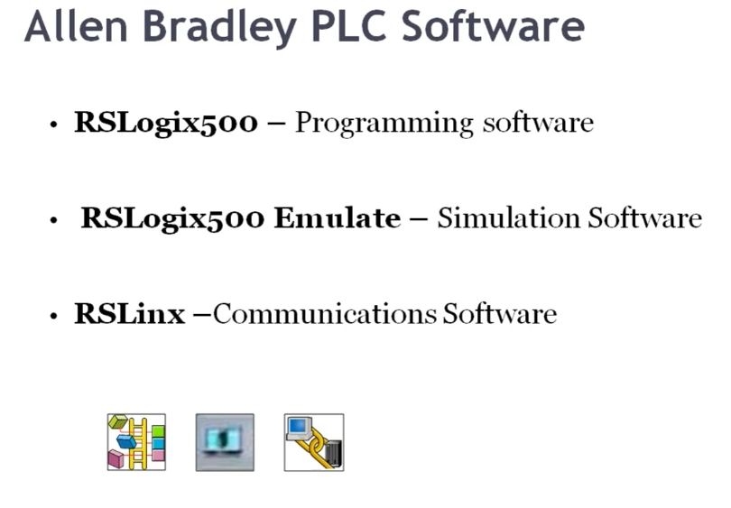

# PLC Training 8 – AB PLC Software Packages – Rockwell Automation
# PLC 訓練 8 – AB PLC 軟體套件 – Rockwell Automation

> 原影片 / Source video: <https://www.youtube.com/watch?v=KR9t0YqXqeQ&list=PLI78ZBihrkE3nnGIj2WmHb_GoWjFlfFIu&index=8>

---

## 1. 本課目標 / Objectives

| 中文 | English |
|---|---|
| 認識本線上課程所需的三套 Allen-Bradley PLC 軟體。 | Learn the three Allen-Bradley PLC software packages required in this online course. |
| 了解每套軟體的用途。 | Understand the purpose of each package. |
| 了解為什麼要三套軟體一起使用才能編程並模擬。 | Understand why all three are needed together to program and simulate. |

---

## 2. 軟體總覽 / Software Overview



| 軟體 / Software | 類型 / Type | 中文說明 | English Description |
|---|---|---|---|
| **RSLogix 500** | 程式編輯軟體 / Programming software | 用來撰寫所有應用與練習的梯形圖 (Ladder Logic)。 | Used to write the ladder logic for all applications and exercises. |
| **RSLogix 500 Emulate** | 模擬軟體 / Simulation software | 模擬 PLC 執行，檢查程式邏輯是否正確。 | Simulates a running PLC to check whether the logic is correct. |
| **RSLinx** | 通訊軟體 / Communications software | 建立程式編輯軟體與模擬軟體之間的連線。 | Creates the link between the programming software and the simulation software. |

---

## 3. 講解內容 / Lecture Content

### 3.1 RSLogix 500 – 程式編輯 / Programming

**中文**
本課程使用 **RSLogix 500** 作為程式編輯軟體。之後所有的梯形圖範例與練習，都會在這套軟體中完成。

**English**
This course uses **RSLogix 500** as the programming software. All ladder logic examples and exercises will be written in it.

### 3.2 RSLogix 500 Emulate – 模擬 / Simulation

**中文**
程式寫好之後，要如何確認它是否按照預期邏輯運作？這時就需要模擬器。**RSLogix 500 Emulate** 讓我們在沒有實體 PLC 的情況下，檢查程式是對是錯。

**English**
Once a program is written, how do we check that it behaves as intended? We need a simulator. **RSLogix 500 Emulate** lets us verify whether our logic is right or wrong without a physical PLC.

### 3.3 RSLinx – 通訊 / Communication

**中文**
RSLogix 500 與 RSLogix 500 Emulate 是兩個獨立的軟體，要讓它們互相通訊，就需要第三套軟體 **RSLinx**。它是通訊軟體，負責連結程式編輯軟體與模擬軟體。

**English**
RSLogix 500 and RSLogix 500 Emulate are separate programs. To let them communicate, we need a third package, **RSLinx**, a communications program that links the programming software to the simulation software.

### 3.4 為什麼三套都需要 / Why All Three Are Needed

**中文**
三套軟體都安裝後，才能完成「編寫程式 → 模擬測試」的完整流程。沒有 RSLinx，就無法進行模擬，因此 RSLinx 是建立通訊的關鍵。

**English**
Only with all three installed can you complete the full workflow of "write a program → simulate and test it". Without RSLinx the simulation cannot be done, so RSLinx is the key to communication.

---

## 4. 工作流程圖 / Workflow

```
┌──────────────┐     ┌──────────┐     ┌─────────────────────┐
│ RSLogix 500  │ ──► │  RSLinx  │ ──► │ RSLogix 500 Emulate │
│ 編寫梯形圖    │     │ 通訊連線  │     │ 模擬執行 / 驗證      │
│ Write ladder │     │ Comms    │     │ Simulate / Verify   │
└──────────────┘     └──────────┘     └─────────────────────┘
```

---

## 5. 重點整理 / Key Takeaways

1. **RSLogix 500** = 程式編輯 / Programming
2. **RSLogix 500 Emulate** = 模擬 / Simulation
3. **RSLinx** = 通訊 / Communication
4. 三套軟體缺一不可，才能編程並模擬。
   All three are required to program and simulate.

---

## 6. 小測驗 / Quick Quiz

1. 哪套軟體用來寫梯形圖？ / Which software is used to write ladder logic?
   → **RSLogix 500**
2. 哪套軟體負責模擬？ / Which software does the simulation?
   → **RSLogix 500 Emulate**
3. 哪套軟體連結編輯與模擬軟體？ / Which software links programming and simulation?
   → **RSLinx**

---

## 7. 下一課預告 / Next Lesson

**中文**：如何下載與安裝這些軟體。
**English**: How to download and install the software.

---

## 附註 / Notes

- 原逐字稿為自動語音辨識，已依上下文修正術語（例如 "RS logic 500" → RSLogix 500、"RS link" → RSLinx）；逐字稿結尾與主題無關的雜訊內容已略去。
  The original transcript was auto-generated; terms were corrected from context (e.g. "RS logic 500" → RSLogix 500, "RS link" → RSLinx). Unrelated noise at the end of the transcript was omitted.
