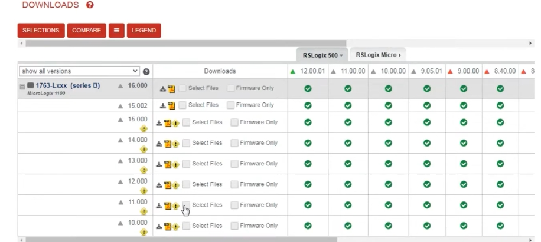
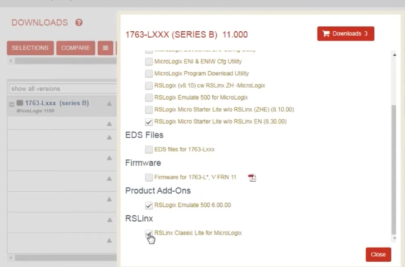
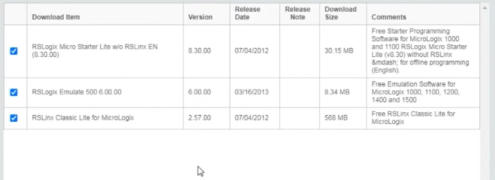
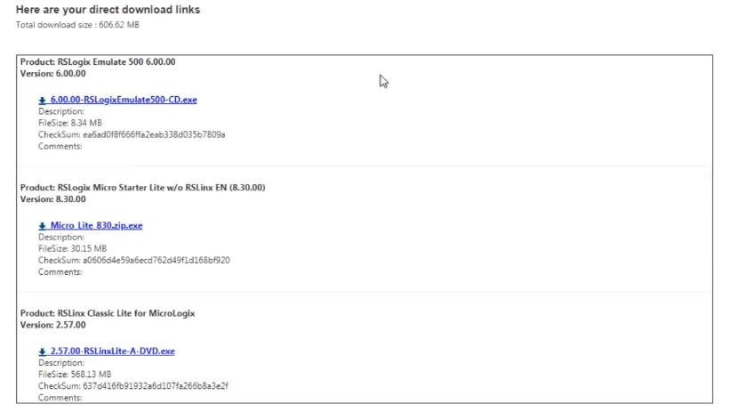

# PLC Training 9 – Download Allen-Bradley PLC Software
# PLC 訓練 9 – 下載 Allen-Bradley PLC 軟體

> 原影片 / Source video: <https://www.youtube.com/watch?v=AUgTRa1_618&list=PLI78ZBihrkE3nnGIj2WmHb_GoWjFlfFIu&index=9>
> 軟體下載網址 / Download site: <https://compatibility.rockwellautomation.com/>

---

## 1. 本課目標 / Objectives

| 中文 | English |
|---|---|
| 學會從 Allen-Bradley（Rockwell Automation）官網下載免費 PLC 軟體。 | Learn how to download the free PLC software from the Allen-Bradley (Rockwell Automation) website. |
| 一次下載三套軟體：RSLogix 500、RSLogix 500 Emulate、RSLinx。 | Download all three packages in one go: RSLogix 500, RSLogix 500 Emulate, RSLinx. |

---

## 2. 需要下載的軟體 / Software to Download

| # | 軟體 / Software | 用途 / Purpose |
|---|---|---|
| 1 | RSLogix 500 (RSLogix Micro Starter Lite) | 程式編輯 / Programming |
| 2 | RSLogix 500 Emulate | 模擬 / Simulation |
| 3 | RSLinx (RSLinx Classic Lite) | 通訊 / Communication |

> 三套軟體沒有固定的安裝順序，可自行調整。
> There is no fixed installation order; you may rearrange them.

---

## 3. 下載步驟 / Download Steps

### 步驟 1：註冊帳號並進入下載頁 / Step 1: Create an account and open the download page

**中文**
1. 打開瀏覽器，進入 Rockwell Automation 官網（ab.com），點選 **Downloads（下載）**，會進入 **Product Compatibility and Downloads（產品相容性與下載）** 頁面。
2. **下載前必須先註冊帳號**，沒有帳號無法下載。（影片中講者已有帳號。）

**English**
1. Open a browser, go to the Rockwell Automation site (ab.com) and click **Downloads**. This opens the **Product Compatibility and Downloads** page.
2. **You must create an account before downloading**; without one you cannot download the software. (The presenter already had an account.)

### 步驟 2：搜尋 RSLogix Micro Starter Lite / Step 2: Search for RSLogix Micro Starter Lite

**中文**
1. 在搜尋欄輸入 **RSLogix Micro Starter Lite**，選取搜尋結果。
2. **不要分別搜尋三個軟體**；從這個連結一次就能取得三套，不必分開下載。
3. 進入新頁面後，點選 **Download（下載）** 選項。

**English**
1. Type **RSLogix Micro Starter Lite** in the search box and select the result.
2. **Do not search for each package separately**; this one entry gives you all three, so there is no need to download them individually.
3. On the new page, click the **Download** option.

### 步驟 3：選擇 PLC 型號與版本 / Step 3: Choose the PLC model and version

**中文**
在下載頁展開 **1763-Lxxx (series B)**（MicroLogix 1100 系列），選擇 **版本 11.000**，然後勾選 **Select Files（選擇檔案）**。

**English**
On the download page, expand **1763-Lxxx (series B)** (MicroLogix 1100), choose **version 11.000**, then tick **Select Files**.

### 步驟 4：勾選三個檔案 / Step 4: Tick the three files

**中文**
在檔案選擇視窗中，向下捲動並勾選：

- **Programming（程式軟體）**：RSLogix Micro Starter Lite w/o RSLinx EN **(8.30.00)**
- **Product Add-Ons（附加產品）**：RSLogix Emulate 500 **6.00.00**（模擬器）
- **RSLinx**：RSLinx Classic Lite for MicroLogix（通訊軟體）

右上角的 **Downloads** 按鈕顯示 **3**，代表已選三項。

**English**
In the file selection window, scroll down and tick:

- **Programming software**: RSLogix Micro Starter Lite w/o RSLinx EN **(8.30.00)**
- **Product Add-Ons**: RSLogix Emulate 500 **6.00.00** (the emulator)
- **RSLinx**: RSLinx Classic Lite for MicroLogix (communication software)

The **Downloads** button at the top right shows **3**, meaning three items are selected.

### 步驟 5：確認下載清單 / Step 5: Confirm the download list

**中文**
確認清單內容後，繼續下一步：

| 項目 / Item | 版本 / Version | 發布日期 / Release Date | 大小 / Size | 說明 / Comments |
|---|---|---|---|---|
| RSLogix Micro Starter Lite w/o RSLinx EN | 8.30.00 | 07/04/2012 | 30.15 MB | 免費入門程式軟體，適用 MicroLogix 1000 / 1100，離線編程（英文） |
| RSLogix Emulate 500 | 6.00.00 | 03/16/2013 | 8.34 MB | 免費模擬軟體，適用 MicroLogix 1000、1100、1200、1400、1500 |
| RSLinx Classic Lite for MicroLogix | 2.57.00 | 07/04/2012 | 568 MB | 免費 RSLinx Classic Lite |

**English**
Check the list, then continue:

| Item | Version | Release Date | Size | Comments |
|---|---|---|---|---|
| RSLogix Micro Starter Lite w/o RSLinx EN | 8.30.00 | 07/04/2012 | 30.15 MB | Free starter programming software for MicroLogix 1000 / 1100, offline programming (English) |
| RSLogix Emulate 500 | 6.00.00 | 03/16/2013 | 8.34 MB | Free emulation software for MicroLogix 1000, 1100, 1200, 1400 and 1500 |
| RSLinx Classic Lite for MicroLogix | 2.57.00 | 07/04/2012 | 568 MB | Free RSLinx Classic Lite |

### 步驟 6：填寫基本資料 / Step 6: Fill in basic details

**中文**
系統會要求填寫姓名、所在地、電話等基本資料，僅用於一般詢問。**下載免費，不需付費。** 依畫面指示完成兩個步驟即可。

**English**
You will be asked for your name, location and phone number, used only for general enquiries. **The download is free of charge.** Just follow the two on-screen steps.

### 步驟 7：開始下載 / Step 7: Start downloading

**中文**
最後會出現「直接下載連結」頁面（總大小約 **606.62 MB**），逐一點選檔案下載：

| 產品 / Product | 檔名 / File | 大小 / Size |
|---|---|---|
| RSLogix Emulate 500 6.00.00 | `6.00.00-RSLogixEmulate500-CD.exe` | 8.34 MB |
| RSLogix Micro Starter Lite w/o RSLinx EN (8.30.00) | `Micro_Lite_830.zip.exe` | 30.15 MB |
| RSLinx Classic Lite for MicroLogix 2.57.00 | `2.57.00-RSLinxLite-A-DVD.exe` | 568.13 MB |

講者把檔案存到桌面，方便下一課安裝。

**English**
Finally a "direct download links" page appears (total size about **606.62 MB**). Click each file to download it:

| Product | File | Size |
|---|---|---|
| RSLogix Emulate 500 6.00.00 | `6.00.00-RSLogixEmulate500-CD.exe` | 8.34 MB |
| RSLogix Micro Starter Lite w/o RSLinx EN (8.30.00) | `Micro_Lite_830.zip.exe` | 30.15 MB |
| RSLinx Classic Lite for MicroLogix 2.57.00 | `2.57.00-RSLinxLite-A-DVD.exe` | 568.13 MB |

The presenter saves the files to the desktop to make the next lesson (installation) easy.

---

## 4. 重點整理 / Key Takeaways

1. 先註冊 Rockwell 帳號，下載免費。
   Register a Rockwell account first; the download is free.
2. 搜尋 **RSLogix Micro Starter Lite**，不要分開搜尋三個軟體。
   Search **RSLogix Micro Starter Lite**; don't search for the three separately.
3. 選 **1763-Lxxx (series B)**、版本 **11.000**，勾選三個檔案。
   Pick **1763-Lxxx (series B)**, version **11.000**, and tick the three files.
4. 三個檔案：**Micro Starter Lite 8.30.00**、**Emulate 500 6.00.00**、**RSLinx Classic Lite 2.57.00**。
   The three files: **Micro Starter Lite 8.30.00**, **Emulate 500 6.00.00**, **RSLinx Classic Lite 2.57.00**.
5. 總下載量約 **606.62 MB**。
   Total download size is about **606.62 MB**.

---

## 5. 小測驗 / Quick Quiz

1. 下載前需要先做什麼？ / What must you do before downloading?
   → 註冊帳號 / Create an account
2. 搜尋哪個關鍵字可一次取得三套軟體？ / Which search term gets all three packages?
   → **RSLogix Micro Starter Lite**
3. 三套軟體中檔案最大的是哪個？ / Which of the three files is the largest?
   → **RSLinx Classic Lite (568.13 MB)**

---

## 6. 下一課預告 / Next Lesson

**中文**：如何安裝這三套軟體。
**English**: How to install the three packages.

---

## 附註 / Notes

- 原逐字稿為自動語音辨識，已依上下文與截圖修正術語（例如 "RS logic micro starter light" → RSLogix Micro Starter Lite、"emulator" → RSLogix Emulate 500）。
  The transcript was auto-generated; terms were corrected using context and screenshots.
- 版本號與網站介面可能已更新，請以 Rockwell 官網實際頁面為準。
  Version numbers and the website layout may have changed; follow the actual Rockwell page.
