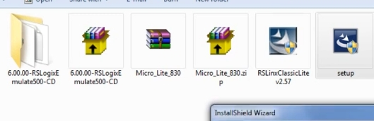

# PLC Training 10 – Installation of PLC Software
# PLC 訓練 10 – PLC 軟體安裝

> 原影片 / Source video: <https://www.youtube.com/watch?v=ZNK-sbXV460&list=PLI78ZBihrkE3nnGIj2WmHb_GoWjFlfFIu&index=10>

---

## 1. 本課目標 / Objectives

| 中文 | English |
|---|---|
| 學會安裝 Allen-Bradley PLC 的三套軟體。 | Learn how to install the three Allen-Bradley PLC software packages. |
| 了解解壓縮與安裝精靈的基本流程。 | Understand extraction and the basic installation-wizard flow. |

需安裝的軟體 / Software to install:

1. RSLogix 500（Micro Starter Lite，程式編輯 / programming）
2. RSLogix 500 Emulate（模擬器 / emulator）
3. RSLinx Classic（通訊 / communication）

> 沒有固定安裝順序；影片中的順序為：程式軟體 → 模擬器 → 通訊軟體。
> There is no fixed order; the video installs the programming software, then the emulator, then the communication software.

---

## 2. 安裝前準備：解壓縮 / Preparation: Extract the Files

**中文**
下載完成後，資料夾中會有三個安裝包：

- `Micro_Lite_830.zip`（程式軟體 RSLogix Micro Starter Lite）
- `6.00.00-RSLogixEmulate500-CD`（模擬器）
- `RSLinxClassicLite v2.57`（通訊軟體，通常已是可執行的安裝檔）

操作方式：對壓縮檔按 **右鍵 → Extract（解壓縮）**。`Micro_Lite_830` 解壓後會再出現一層壓縮檔，需要**再解壓一次**，最後才會看到 `setup`。模擬器同樣要解壓成資料夾。

**English**
After downloading, the folder contains three packages:

- `Micro_Lite_830.zip` (programming software, RSLogix Micro Starter Lite)
- `6.00.00-RSLogixEmulate500-CD` (emulator)
- `RSLinxClassicLite v2.57` (communication software, usually already an executable installer)

Right-click an archive and choose **Extract**. `Micro_Lite_830` contains another archive after the first extraction, so **extract it a second time** until you see `setup`. The emulator must also be extracted into a folder.

---

## 3. 安裝步驟 / Installation Steps

### 3.1 安裝 RSLogix Micro Starter Lite（程式軟體）/ Install RSLogix Micro Starter Lite (Programming)

**中文**
1. 開啟解壓後資料夾中的 **setup**，若出現使用者帳戶控制提示，選 **Yes（是）**。
2. 出現 InstallShield 精靈後，按 **Next（下一步）**。
3. 同意使用者授權合約（**Accept / Yes**），再按 **Next**。
4. 使用者名稱等欄位可任意填寫，繼續按 **Next**。
5. 等待安裝完成（需要一些時間）。
6. 出現 **Finish（完成）** 按鈕，點選後會顯示 **Release Notes（發行說明）**，關閉即可，安裝完成。

**English**
1. Open **setup** in the extracted folder; if User Account Control prompts, choose **Yes**.
2. When the InstallShield wizard appears, click **Next**.
3. Accept the license agreement (**Accept / Yes**) and click **Next**.
4. Fields such as user name can be anything; keep clicking **Next**.
5. Wait for the installation to finish (it takes a little while).
6. Click **Finish**; the **Release Notes** appear. Close them and the installation is done.

### 3.2 安裝 RSLogix Emulate 500（模擬器）/ Install RSLogix Emulate 500 (Emulator)

**中文**
1. 開啟模擬器資料夾中的 **setup**。
2. 就是一般安裝流程，沒有特別設定：連續按 **Next**，並在授權合約畫面按 **Yes** 同意。
3. 按 **Finish**，同樣會顯示 Release Notes，模擬器安裝完成。

**English**
1. Open **setup** in the emulator folder.
2. It is a normal installation with nothing special: keep clicking **Next** and accept the license agreement with **Yes**.
3. Click **Finish**; the Release Notes appear again and the emulator is installed.

### 3.3 安裝 RSLinx Classic（通訊軟體）/ Install RSLinx Classic (Communication)

**中文**
1. 開啟 **RSLinx Classic Lite v2.57** 安裝檔。
2. 依畫面指示進行：接受授權條款；若要求完整下載／安裝元件，請點選允許；可檢查安裝位置（保留預設即可）。
3. RSLinx 的安裝時間**比程式軟體與模擬器長**，因為它是通訊軟體，需要耐心等待。過程中會顯示多個安裝步驟（影片中約 13 個步驟，包含解壓縮檔案）。
4. 安裝完成後按 **Finish**，會出現 Release Notes，安裝完成。

**English**
1. Open the **RSLinx Classic Lite v2.57** installer.
2. Follow the prompts: accept the license; if asked to download or install the complete components, allow it; you may check the install location (the default is fine).
3. RSLinx takes **longer than the programming software and emulator** because it is communication software, so be patient. Several installation steps are shown (about 13 in the video, including file extraction).
4. When finished, click **Finish**; the Release Notes appear and the installation is complete.

---

## 4. 安裝流程總覽 / Installation Overview

| 順序 / Order | 軟體 / Software | 安裝檔 / Installer | 耗時 / Time | 結束畫面 / End screen |
|---|---|---|---|---|
| 1 | RSLogix Micro Starter Lite | `setup`（解壓兩次後 / after two extractions） | 中等 / Medium | Finish → Release Notes |
| 2 | RSLogix Emulate 500 | `setup`（解壓後 / after extraction） | 短 / Short | Finish → Release Notes |
| 3 | RSLinx Classic Lite | `RSLinxLite` installer | 最長 / Longest | Finish → Release Notes |

---

## 5. 重點整理 / Key Takeaways

1. 先解壓縮：Micro Lite 需要解壓**兩次**。
   Extract first: Micro Lite needs to be extracted **twice**.
2. 三套軟體的安裝都是標準流程：**Next → 同意授權 → Finish**。
   All three use the standard flow: **Next → accept license → Finish**.
3. 安裝完成後都會顯示 Release Notes，關閉即可。
   Release Notes appear at the end of each installation; just close them.
4. RSLinx 安裝最久，請耐心等待。
   RSLinx takes the longest; be patient.

---

## 6. 小測驗 / Quick Quiz

1. 哪個安裝包需要解壓兩次？ / Which package must be extracted twice?
   → **Micro_Lite_830（RSLogix Micro Starter Lite）**
2. 哪套軟體安裝時間最長？ / Which package takes the longest to install?
   → **RSLinx Classic**
3. 安裝完成後會出現什麼畫面？ / What appears when installation finishes?
   → **Finish 按鈕與 Release Notes / The Finish button and Release Notes**

---

## 7. 下一課預告 / Next Lesson

**中文**：介紹軟體環境、如何編寫程式與設定組態；待基本操作與編程部分熟悉後，再進行後續課程。
**English**: An introduction to the software environment, how to program and how to configure; later lessons follow once the basics and programming are covered.

---

## 附註 / Notes

- 原逐字稿為自動語音辨識，已依上下文與截圖修正術語（例如 "RS classic" → RSLinx Classic、"micro light" → Micro Lite）。
  The transcript was auto-generated; terms were corrected using context and the screenshot (e.g. "RS classic" → RSLinx Classic, "micro light" → Micro Lite).
- 逐字稿較簡略，部分細節（如授權畫面的確切按鈕名稱）為依一般 InstallShield 流程補充，實際畫面可能略有不同。
  The transcript is brief; some details (such as exact license-screen button names) follow the generic InstallShield flow and may differ slightly on your screen.
