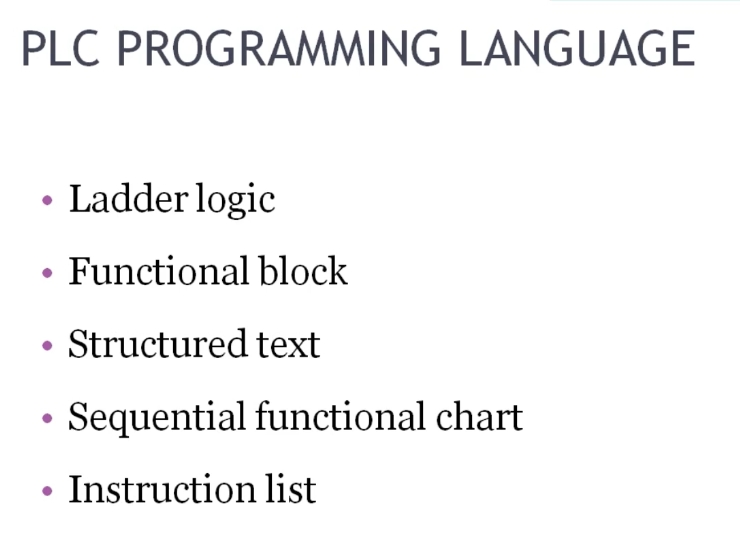
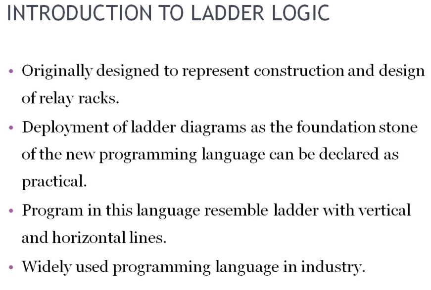
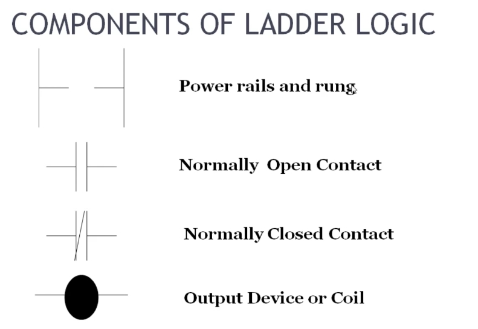
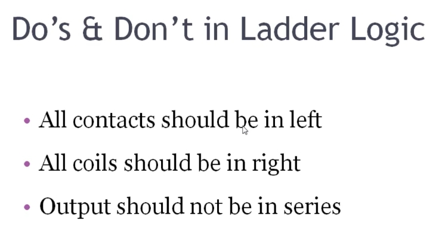

# PLC Training 11 – Introduction to Ladder Logic | Allen-Bradley PLC Course
# PLC 訓練 11 – 梯形圖邏輯簡介｜Allen-Bradley PLC 課程

> 原影片 / Source video: <https://www.youtube.com/watch?v=yZOR3lLqxfk&list=PLI78ZBihrkE3nnGIj2WmHb_GoWjFlfFIu&index=11>

---

## 1. 本課目標 / Objectives

| 中文 | English |
|---|---|
| 認識 PLC 的五種程式語言。 | Learn the five PLC programming languages. |
| 了解梯形圖（Ladder Logic）的由來與特色。 | Understand the origin and characteristics of ladder logic. |
| 認識梯形圖的基本元件。 | Learn the basic components of ladder logic. |
| 掌握梯形圖的編寫規則（Do's & Don'ts）。 | Learn the rules (Do's and Don'ts) of writing ladder logic. |

---

## 2. PLC 程式語言 / PLC Programming Languages



| # | 英文 / English | 中文 / Chinese |
|---|---|---|
| 1 | Ladder Logic (LD) | 梯形圖 |
| 2 | Functional Block Diagram (FBD) | 功能方塊圖 |
| 3 | Structured Text (ST) | 結構化文字 |
| 4 | Sequential Function Chart (SFC) | 順序功能圖 |
| 5 | Instruction List (IL) | 指令表 |

**中文**：PLC 共有五種程式語言。本課程將學習其中的**梯形圖**。

**English**: There are five languages for programming a PLC. This course focuses on **ladder logic**.

---

## 3. 梯形圖簡介 / Introduction to Ladder Logic



### 3.1 重點 / Key Points

| 中文 | English |
|---|---|
| 最初設計用來表示**繼電器盤（relay racks）**的構造與設計。 | Originally designed to represent the construction and design of **relay racks**. |
| 梯形圖作為新型程式語言的基礎，被認為是實用可行的。 | Using ladder diagrams as the foundation of the new programming language proved practical. |
| 程式外觀像一座**梯子**，由垂直線和水平線組成。 | Programs resemble a **ladder** with vertical and horizontal lines. |
| 是工業界**廣泛使用**的程式語言。 | A **widely used** programming language in industry. |

### 3.2 補充說明 / Additional Explanation

**中文**
- 梯子是用來爬高的；梯形圖的程式結構同樣由**兩條垂直線**與多條**水平線**組成，程式就寫在其中。
- 梯形圖是**經典的 PLC 程式語言**。PLC 發明之初就引入了梯形圖，1970 年代開始被廣泛使用，至今仍是多數工廠的主流。

**English**
- A ladder is used to climb up; likewise, a ladder-logic program has **two vertical lines** and several **horizontal lines**, and the program is written between them.
- Ladder logic is the **classic PLC programming language**. It was introduced when the PLC was invented, came into wide use in the 1970s, and is still the mainstream in most industries.

---

## 4. 梯形圖的元件 / Components of Ladder Logic



| 元件 / Component | 中文說明 | English Description |
|---|---|---|
| **Power Rails and Rung** | **電源軌與梯級**：兩條垂直線稱為電源軌（左側為正 +，右側為負 −）；水平線稱為梯級（rung），可有多條。 | **Power rails and rungs**: the two vertical lines are the power rails (left is +, right is −); the horizontal lines are rungs, and there can be many. |
| **Normally Open Contact (NO)** | **常開接點**：輸入的一種表示方式。 | **Normally open contact**: one way to represent an input. |
| **Normally Closed Contact (NC)** | **常閉接點**：輸入的另一種表示方式。 | **Normally closed contact**: the other way to represent an input. |
| **Output Device or Coil** | **輸出（線圈）**：表示輸出，例如燈或馬達。 | **Output device or coil**: represents an output, such as a lamp or motor. |

> 輸入有兩種：常開與常閉，其工作方式會在軟體操作時再詳細說明。
> There are two types of input, normally open and normally closed; their operation will be explained when we reach the software.

### 簡易示意 / Simple Sketch

```
 L+ │                                  │ L−
    │──┤ ├──────────────────────( )────│      ← 一個梯級 / one rung
    │  輸入 / Input            輸出 / Output │
```

---

## 5. 梯形圖的規則 / Do's & Don'ts in Ladder Logic



| # | 規則 / Rule | 中文說明 | English Explanation |
|---|---|---|---|
| 1 | All contacts should be on the left | 所有輸入接點都接在**左側**。 | All input contacts are connected on the **left**. |
| 2 | All coils should be on the right | 所有線圈（輸出）放在**右側**，梯級必須以線圈作結，**不能以輸入結尾**，否則會出現錯誤。 | All coils go on the **right**; a rung must end with a coil, **not an input**, otherwise an error appears. |
| 3 | Output should not be in series | 輸出**不可串聯**：一個梯級中不能把多個輸出串在一起。 | Outputs **must not be in series**: you cannot chain multiple outputs in series in one rung. |

其餘規則將在軟體中示範說明。
The remaining rules will be explained in the software.

---

## 6. 重點整理 / Key Takeaways

1. PLC 有五種程式語言：梯形圖、功能方塊圖、結構化文字、順序功能圖、指令表。
   PLC has five languages: ladder logic, functional block diagram, structured text, sequential function chart, instruction list.
2. 梯形圖源自繼電器控制盤，自 1970 年代起廣泛使用於工業。
   Ladder logic comes from relay control panels and has been widely used in industry since the 1970s.
3. 基本元件：電源軌與梯級、常開接點、常閉接點、輸出線圈。
   Basic components: power rails and rungs, NO contact, NC contact, output coil.
4. 規則：接點在左、線圈在右、輸出不串聯。
   Rules: contacts on the left, coils on the right, outputs not in series.

---

## 7. 小測驗 / Quick Quiz

1. PLC 有哪五種程式語言？ / What are the five PLC programming languages?
   → Ladder logic、Functional block、Structured text、Sequential function chart、Instruction list
2. 梯形圖的水平線與垂直線分別叫什麼？ / What are the horizontal and vertical lines called?
   → 水平線 = 梯級 (rung)；垂直線 = 電源軌 (power rail)
3. 輸入接點與輸出線圈應分別放在哪一側？ / Which side do contacts and coils go on?
   → 接點在左 / contacts on the left；線圈在右 / coils on the right

---

## 8. 下一課預告 / Next Lesson

**中文**：建立專案（Project Creation）。
**English**: Project creation.

---

## 附註 / Notes

- 原逐字稿為自動語音辨識，已依上下文與投影片修正術語（例如 "relay racks" 的語句、"logic" → ladder logic、"coin" → coil、"wrong" → rung）。
  The transcript was auto-generated; terms were corrected using context and slides (e.g. "coin" → coil, "wrong" → rung).
- 中文名稱（功能方塊圖、順序功能圖等）為 IEC 61131-3 慣用譯名，並非影片原文。
  The Chinese names (functional block diagram, sequential function chart, etc.) are the conventional IEC 61131-3 translations and were added by the editor, not taken from the video.
- 簡易示意圖為補充說明用，非影片投影片內容。
  The simple sketch is an addition for illustration and is not from the video slides.
