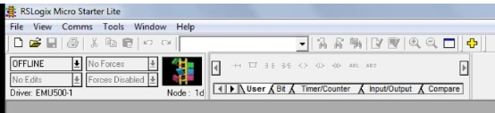
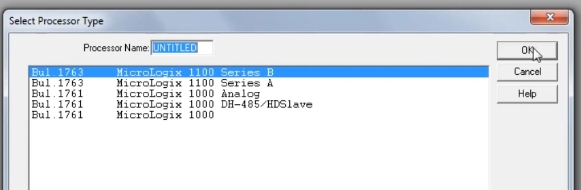
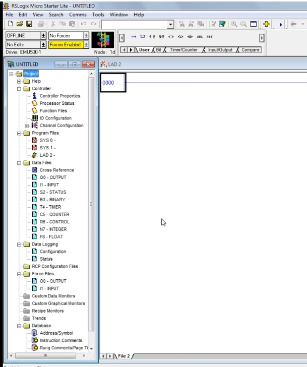
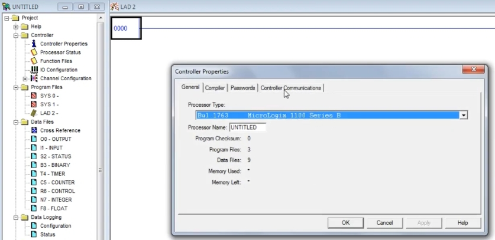
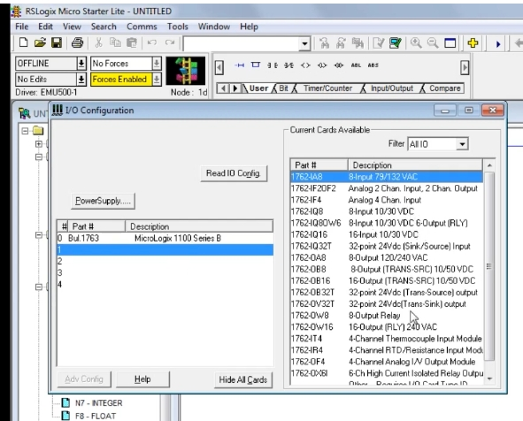
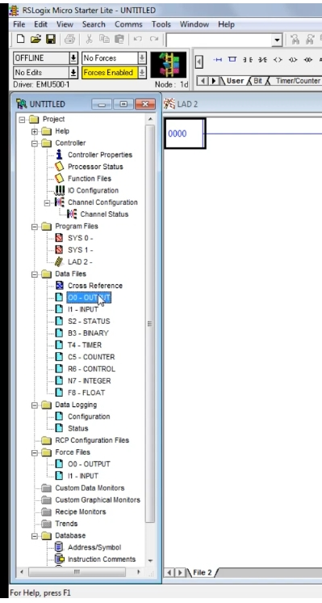

# PLC Training 12 – Project Creation in Allen-Bradley RSLogix 500
# PLC 訓練 12 – 在 Allen-Bradley RSLogix 500 中建立專案

> 原影片 / Source video: <https://www.youtube.com/watch?v=KwdKFFI-_wI&list=PLI78ZBihrkE3nnGIj2WmHb_GoWjFlfFIu&index=12>

---

## 1. 本課目標 / Objectives

| 中文 | English |
|---|---|
| 學會在 RSLogix 500 中建立新專案。 | Learn how to create a new project in RSLogix 500. |
| 認識程式編輯軟體的操作環境。 | Get to know the programming software environment. |
| 認識專案樹中的控制器、I/O 組態、程式檔與資料檔。 | Get to know the controller, I/O configuration, program files and data files in the project tree. |
| 學會儲存專案。 | Learn how to save a project. |

> 要用梯形圖寫程式，必須先建立專案。
> To write a ladder-logic program, you first need to create a project.

---

## 2. 開啟軟體 / Open the Software

**中文**
1. 在 Windows 開始功能表中尋找 **RSLogix Micro English**；找不到時，直接在搜尋欄輸入 **RSLogix 500**。
2. 點選開啟，並將視窗最大化。這就是程式編輯軟體，目前是空白的起始畫面。

**English**
1. In the Windows Start menu, look for **RSLogix Micro English**; if you can't find it, type **RSLogix 500** in the search box.
2. Click to open it and maximize the window. This is the programming software, currently showing an empty landing page.

---

## 3. 建立新專案 / Create a New Project

### 3.1 選擇處理器 / Select the Processor

**中文**
1. 點選 **File（檔案）→ New（新增）**，系統會要求選擇 **Processor Type（處理器型號）**。
2. **RSLogix Micro Starter Lite** 是免費版，只支援少數處理器；完整版 RSLogix 500 才有更多處理器型號。
3. 影片中選用 **Bul.1763 MicroLogix 1100 Series B**。不同型號的差別主要是 I/O 數量，沒有太大的差異，任選一個即可。
4. 可在 **Processor Name** 輸入專案名稱（預設為 UNTITLED），按 **OK**，專案就建立完成。

**English**
1. Click **File → New**; you are asked to choose the **Processor Type**.
2. **RSLogix Micro Starter Lite** is the free version and supports only a few processors; the full RSLogix 500 offers more processor types.
3. The video chooses **Bul.1763 MicroLogix 1100 Series B**. The processors mainly differ in the number of I/O; there is no big difference, so pick any one.
4. You may type a project name in **Processor Name** (default UNTITLED), then click **OK**; the project is created.

---

## 4. 軟體環境介紹 / The Software Environment

| 區域 / Area | 中文說明 | English Description |
|---|---|---|
| 梯級 / Rung | 右側的 LAD 視窗中有第一個梯級 **0000**：左邊是電源軌，水平線即為**梯級（rung）**。 | The LAD window on the right shows the first rung **0000**: the left side is the power rail and the horizontal line is the **rung**. |
| 工具列 / Toolbar | 有開啟、儲存、列印、驗證檔案（Verify File）、縮放（Zoom In / Out）等常用工具。 | Common tools: open, save, print, verify file, zoom in / out. |
| 指令列 / Instruction toolbar | 編寫程式所需的**指令**都在這裡（分頁：User、Bit、Timer/Counter、Input/Output、Compare…）。 | The **instructions** needed for programming are here (tabs: User, Bit, Timer/Counter, Input/Output, Compare …). |
| 專案樹 / Project tree | 左側的 **Project** 樹，包含控制器、程式檔、資料檔等。 | The **Project** tree on the left holds the controller, program files, data files, etc. |

### 4.1 工具列細節 / Toolbar Detail

指令列中可看到梯形圖元件：常開接點、常閉接點、輸出線圈等（上一課介紹過的符號）。
The instruction bar shows the ladder symbols introduced in the previous lesson: NO contact, NC contact, output coil, etc.

---

## 5. 專案樹 / The Project Tree

### 5.1 Controller（控制器）

**中文**
- **Controller Properties（控制器屬性）**：顯示處理器型號、處理器名稱、程式檔與資料檔數量等。
- 也可在此進行其他設定，例如密碼、控制器通訊。

**English**
- **Controller Properties**: shows the processor type, processor name, number of program and data files, etc.
- Other settings such as passwords and controller communications are also here.

### 5.2 I/O Configuration（I/O 組態）

**中文**
- 雙擊 **IO Configuration** 開啟組態視窗。**Slot 0** 已經是我們加入的處理器（Bul.1763 MicroLogix 1100 Series B）。
- 若需要更多 I/O，可加入**擴充模組**：在右側 **Current Cards Available（可用卡片）** 清單中選取模組（例如 1762-IA8 輸入卡、1762-OW8 繼電器輸出卡），加入到插槽中。
- 影片中示範加入後又刪除，因為目前不需要。實際使用時依需求配置。

**English**
- Double-click **IO Configuration** to open the window. **Slot 0** already holds the processor we chose (Bul.1763 MicroLogix 1100 Series B).
- If you need more I/O, add **expansion modules**: pick a module from **Current Cards Available** on the right (e.g. 1762-IA8 input card, 1762-OW8 relay output card) and add it to a slot.
- The video adds one and then deletes it because it isn't needed now. Configure according to your actual requirements.

### 5.3 Channel Configuration（通道組態）

通道組態用於設定通訊埠；本課僅提及，細節留待後續課程。
Channel Configuration is used to configure communication ports; it is only mentioned here and is covered later.

### 5.4 Program Files（程式檔）

**中文**
- **LAD 2** 是我們寫**梯形圖**的**主程式頁面（main page）**。
- **SYS 0、SYS 1** 是系統使用的頁面，一般不需要更動。

**English**
- **LAD 2** is the **main page** where we write the **ladder logic**.
- **SYS 0 and SYS 1** are used by the system and normally need not be touched.

### 5.5 Data Files（資料檔）

**中文**
資料檔對應定址（address）格式，**輸入與輸出的位址格式不同**，下一課會詳細說明。專案樹中可見：

| 檔案 / File | 說明 / Description |
|---|---|
| O0 – OUTPUT | 輸出 / Output |
| I1 – INPUT | 輸入 / Input |
| S2 – STATUS | 狀態 / Status |
| B3 – BINARY | 位元 / Binary |
| T4 – TIMER | 計時器 / Timer |
| C5 – COUNTER | 計數器 / Counter |
| R6 – CONTROL | 控制 / Control |
| N7 – INTEGER | 整數 / Integer |
| F8 – FLOAT | 浮點數 / Float |

**English**
Data files correspond to the addressing format; **inputs and outputs use different address formats**, explained in the next lesson. The tree shows the files listed in the table above.

---

## 6. 儲存專案 / Save the Project

**中文**
點選 **File → Save（儲存）**，輸入檔名並選擇存放位置即可。影片中以 **example one** 為名儲存。

**English**
Click **File → Save**, enter a file name and choose a location. In the video it is saved as **example one**.

---

## 7. 重點整理 / Key Takeaways

1. 開啟 RSLogix Micro English → **File → New** → 選處理器 → **OK**。
   Open RSLogix Micro English → **File → New** → choose a processor → **OK**.
2. 免費版只支援少數處理器；影片選用 **MicroLogix 1100 Series B**。
   The free version supports few processors; the video uses **MicroLogix 1100 Series B**.
3. 專案樹：Controller、Program Files（LAD 2 為主程式）、Data Files。
   Project tree: Controller, Program Files (LAD 2 is the main program), Data Files.
4. 需要更多 I/O 時，在 **IO Configuration** 加入擴充模組。
   Add expansion modules in **IO Configuration** when more I/O is needed.
5. 記得用 **File → Save** 儲存專案。
   Remember to save the project with **File → Save**.

---

## 8. 小測驗 / Quick Quiz

1. 哪個頁面用來撰寫梯形圖？ / Which page is used to write ladder logic?
   → **LAD 2**
2. 要新增擴充 I/O 模組，在哪裡設定？ / Where do you add expansion I/O modules?
   → **IO Configuration**
3. 免費版 RSLogix Micro Starter Lite 的處理器選擇有什麼限制？ / What limitation does the free version have on processors?
   → 只支援少數處理器型號 / Only a few processor types are available

---

## 9. 下一課預告 / Next Lesson

**中文**：CPU 組態與定址格式（Addressing Format）。
**English**: CPU configuration and the addressing format.

---

## 附註 / Notes

- 原逐字稿為自動語音辨識，已依上下文與截圖修正術語（例如 "RS logic micro English" → RSLogix Micro English、"rang" → rung、"Io" → I/O）。
  The transcript was auto-generated; terms were corrected using context and screenshots (e.g. "rang" → rung).
- 範例模組型號（1762-IA8、1762-OW8）取自截圖中的卡片清單；LAD 2、SYS 0/1 的用途說明依影片內容與一般 RSLogix 500 慣例整理。
  Example module part numbers (1762-IA8, 1762-OW8) are taken from the card list in the screenshot; the notes on LAD 2 and SYS 0/1 follow the video and general RSLogix 500 convention.
