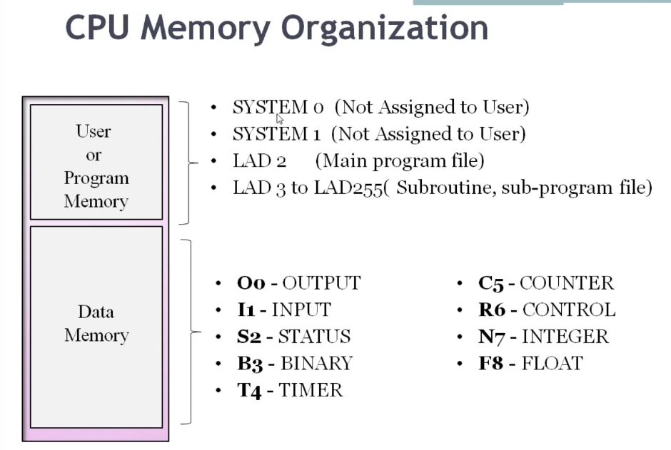
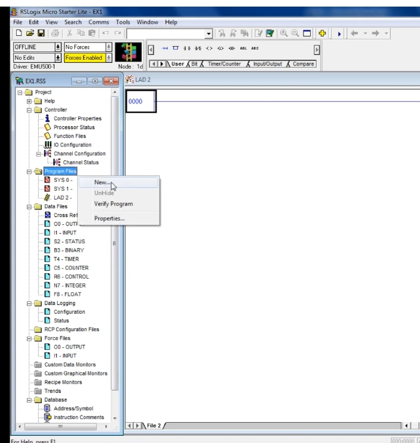
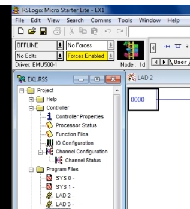
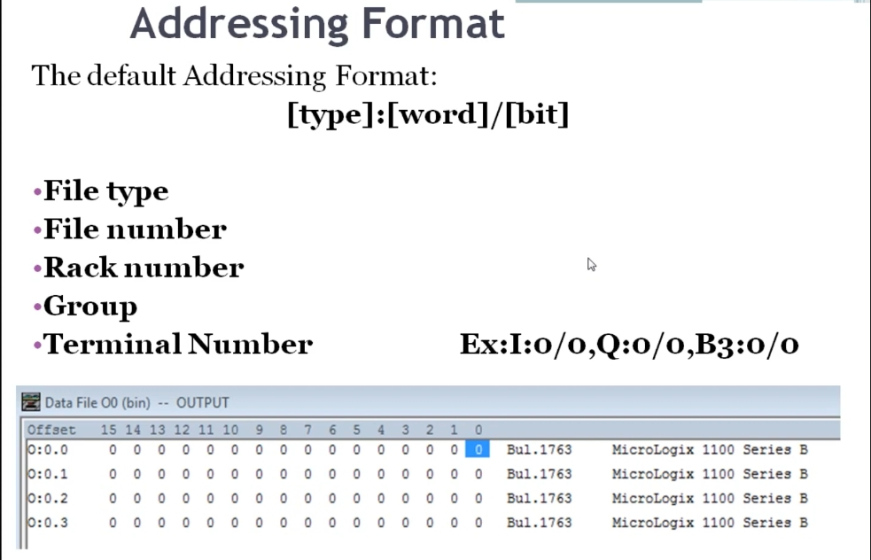
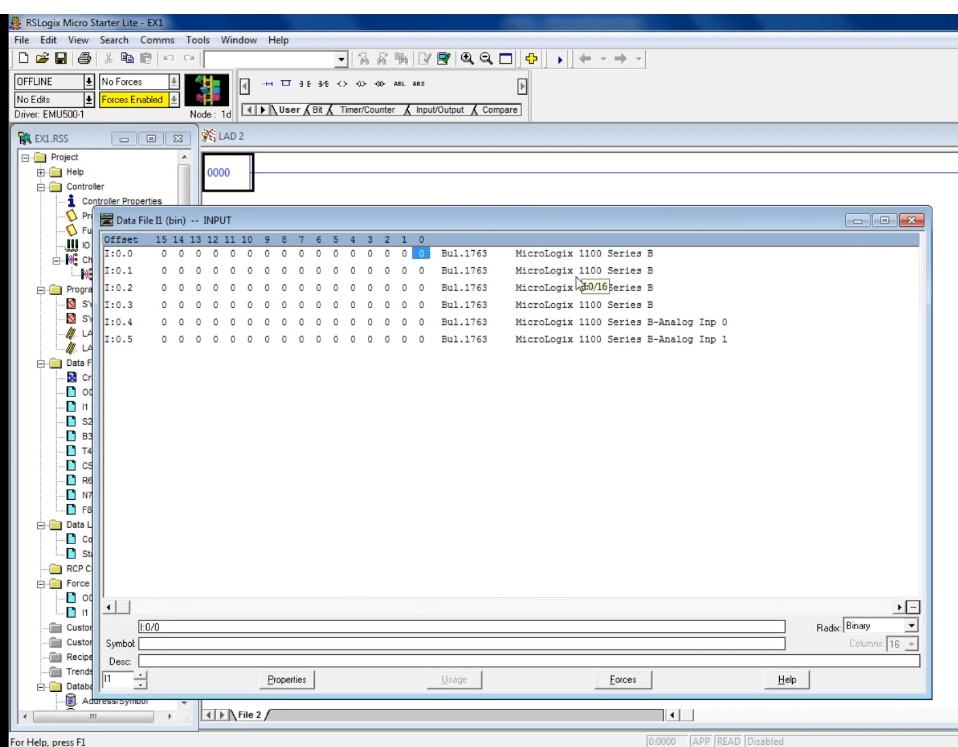

# PLC Training 13 – CPU Memory and Addressing in Allen-Bradley RSLogix 500
# PLC 訓練 13 – Allen-Bradley RSLogix 500 的 CPU 記憶體與定址

> 原影片 / Source video: <https://www.youtube.com/watch?v=Ob-BE1vnCvk&list=PLI78ZBihrkE3nnGIj2WmHb_GoWjFlfFIu&index=13>

---

## 1. 本課目標 / Objectives

| 中文 | English |
|---|---|
| 了解 RSLogix 500 的 CPU 記憶體組織。 | Understand the CPU memory organization in RSLogix 500. |
| 區分使用者（程式）記憶體與資料記憶體。 | Distinguish user (program) memory from data memory. |
| 學會 Allen-Bradley 的定址格式。 | Learn the Allen-Bradley addressing format. |
| 在軟體中查看輸入／輸出位址。 | Look up input / output addresses in the software. |

---

## 2. CPU 記憶體組織 / CPU Memory Organization



**中文**：CPU 記憶體分為兩大類：**使用者（程式）記憶體**與**資料記憶體**。

**English**: CPU memory has two parts: **user (program) memory** and **data memory**.

### 2.1 使用者／程式記憶體 / User or Program Memory

| 程式檔 / File | 中文說明 | English Description |
|---|---|---|
| **SYSTEM 0** | 系統使用，**不開放給使用者**；無法開啟，也不能寫入。 | Used by the system, **not assigned to the user**; it cannot be opened or written to. |
| **SYSTEM 1** | 同上，系統專用。 | Same as above, system use only. |
| **LAD 2** | **主程式檔（Main program file）**：專案從這裡開始寫。 | **Main program file**: this is where every project starts. |
| **LAD 3 ～ LAD 255** | **副程式／子程式檔（Subroutine / sub-program file）**：最多可建立到 LAD 255。 | **Subroutine / sub-program files**: up to LAD 255 can be created. |

### 2.2 資料記憶體 / Data Memory

| 檔案 / File | 英文 / English | 中文 / Chinese |
|---|---|---|
| **O0** | OUTPUT | 輸出 |
| **I1** | INPUT | 輸入 |
| **S2** | STATUS | 狀態 |
| **B3** | BINARY | 位元（二進位） |
| **T4** | TIMER | 計時器 |
| **C5** | COUNTER | 計數器 |
| **R6** | CONTROL | 控制 |
| **N7** | INTEGER | 整數 |
| **F8** | FLOAT | 浮點數 |

---

## 3. 在軟體中查看 / See It in the Software

### 3.1 新增程式檔 / Create a New Program File

**中文**
在專案樹的 **Program Files** 上按右鍵，選擇 **New…（新增）**，就會建立新的梯形圖檔 **LAD 3**。這些都屬於使用者／程式記憶體。

**English**
Right-click **Program Files** in the project tree and choose **New…**; a new ladder file, **LAD 3**, is created. These all belong to user / program memory.



新增後，專案樹中就會出現 **LAD 3**：
After that, **LAD 3** appears in the project tree:



### 3.2 資料檔 / Data Files

**中文**
專案樹的 **Data Files** 下可看到：輸出檔、輸入檔、狀態檔、位元檔、計時器、計數器、控制、整數、浮點數，也就是上表所列的檔案。

**English**
Under **Data Files** in the project tree you will find the output, input, status, binary, timer, counter, control, integer and float files listed in the table above.

---

## 4. 定址格式 / Addressing Format



### 4.1 預設格式 / Default Format

```
[type] : [word] / [bit]
```

範例 / Examples: `I:0/0`、`O:0/0`、`B3:0/0`

### 4.2 位址的組成 / Components of an Address

| 組成 / Component | 中文說明 | English Description |
|---|---|---|
| **File type（檔案類型）** | 指出是輸入、輸出、計時器、計數器等。 | Tells whether it is an input, output, timer, counter, etc. |
| **File number（檔案編號）** | 用來定義是哪一個 I/O 模組。 | Defines which I/O module it is. |
| **Rack number（機架編號）** | 表示模組放在哪個機架上。 | Indicates which rack the module is placed in. |
| **Group（群組）** | 機架內的一組端子。 | A set of terminals within the rack. |
| **Terminal number（端子編號）** | 就是**位元編號（bit number）**。 | The **bit number**. |

### 4.3 檔案類型字母 / File-Type Letters

| 類型 / Type | 字母 / Letter | 範例 / Example |
|---|---|---|
| Input 輸入 | **I** | `I:0/0` |
| Output 輸出 | **O** | `O:0/0` |
| Binary 位元 | **B** | `B3:0/0` |
| Timer 計時器 | **T** | `T4:0` |
| Counter 計數器 | **C** | `C5:0` |
| Integer 整數 | **N** | `N7:0` |
| Float 浮點數 | **F** | `F8:0` |

> 冒號（`:`）是分隔符號。
> The colon (`:`) is the separator.

### 4.4 位元與通道 / Bits and Channels

**中文**
- 一個**通道（channel / word）**有 **16 個位元（bit）**。
- 端子編號（位元）從 **0** 開始，到 **15** 結束，共 16 個。
- 例如 `O:0/0` 的 `0/0`，前者是通道（word），後者是位元（bit）。MicroLogix 1100 系列的輸出檔從 `O:0.0` 開始。

**English**
- One **channel (word)** has **16 bits**.
- Terminal (bit) numbers start at **0** and end at **15**, 16 in total.
- In `O:0/0`, the first number is the channel (word) and the second is the bit. For the MicroLogix 1100 series, the output file starts at `O:0.0`.

---

## 5. 查看輸入檔 / Viewing the Input File



**中文**
開啟 **I1 – INPUT** 資料檔，可看到輸入通道：

- `I:0.0` ～ `I:0.3`：數位輸入（Bul.1763 MicroLogix 1100 Series B）。
- `I:0.4`、`I:0.5`：**類比輸入**（Analog Inp 0、Analog Inp 1）。MicroLogix 1100 系列有 2 個類比輸入。
- 要看某一點的位址，把游標停在該位元上即可，例如 `I:0/0`。

**English**
Open the **I1 – INPUT** data file to see the input channels:

- `I:0.0` to `I:0.3`: digital inputs (Bul.1763 MicroLogix 1100 Series B).
- `I:0.4`, `I:0.5`: **analog inputs** (Analog Inp 0, Analog Inp 1). The MicroLogix 1100 series has 2 analog inputs.
- To see the address of a point, hover the cursor over that bit, e.g. `I:0/0`.

---

## 6. 重點整理 / Key Takeaways

1. CPU 記憶體 = **使用者／程式記憶體** + **資料記憶體**。
   CPU memory = **user / program memory** + **data memory**.
2. **SYSTEM 0／1** 不能使用；**LAD 2** 是主程式；**LAD 3～255** 是副程式。
   **SYSTEM 0 / 1** are off limits; **LAD 2** is the main program; **LAD 3–255** are subroutines.
3. 資料檔：O0、I1、S2、B3、T4、C5、R6、N7、F8。
   Data files: O0, I1, S2, B3, T4, C5, R6, N7, F8.
4. 位址格式：`[type]:[word]/[bit]`，一個 word 有 16 個 bit（0～15）。
   Address format: `[type]:[word]/[bit]`; one word has 16 bits (0–15).
5. **不同品牌的 PLC 定址格式完全不同**（例如西門子的位址就不一樣）。
   **Addressing differs completely between PLC brands** (e.g. Siemens addresses are different).

---

## 7. 小測驗 / Quick Quiz

1. 哪個程式檔是主程式？ / Which program file is the main program?
   → **LAD 2**
2. 一個 word（通道）有幾個 bit？ / How many bits are in one word (channel)?
   → **16（0～15）**
3. 輸入檔和輸出檔的檔案編號與字母是？ / What are the file number and letter of the input and output files?
   → 輸入 / Input：**I1**（`I:`）；輸出 / Output：**O0**（`O:`）

---

## 8. 下一課預告 / Next Lesson

**中文**：另一個有趣的主題（影片未明說，預期從梯形圖指令開始）。
**English**: Another interesting topic (not specified in the video; expected to start with ladder instructions).

---

## 附註 / Notes

- 原逐字稿為自動語音辨識，辨識錯誤較多，已依上下文與投影片修正（例如 "ran number and grew" → rack number and group、"Io" → I/O、"flow" → float、"time" → timer）。
  The transcript was auto-generated with many recognition errors; it was corrected using context and the slides (e.g. "ran number and grew" → rack number and group, "flow" → float).
- 第 4.2 節的元件說明依影片與投影片整理。就一般 SLC / MicroLogix 文件而言，位址常寫作 `O:e.s/b`（e = 插槽，s = 字，b = 位元），與影片的「機架／群組／端子」說法略有不同，請以實際軟體畫面與 Rockwell 手冊為準。
  Section 4.2 follows the video and slides. In general SLC / MicroLogix documentation an address is often written `O:e.s/b` (e = slot, s = word, b = bit), which differs slightly from the video's "rack / group / terminal" wording; check the actual software and Rockwell manuals.
- 下一課預告的細節為推測，影片只說「另一個有趣的主題」。
  The next-lesson details are an inference; the video only says "another interesting topic".
- 繁中中文名稱（位元檔、浮點數等）為編者翻譯。
  Chinese names (binary file, float, etc.) are the editor's translations.
