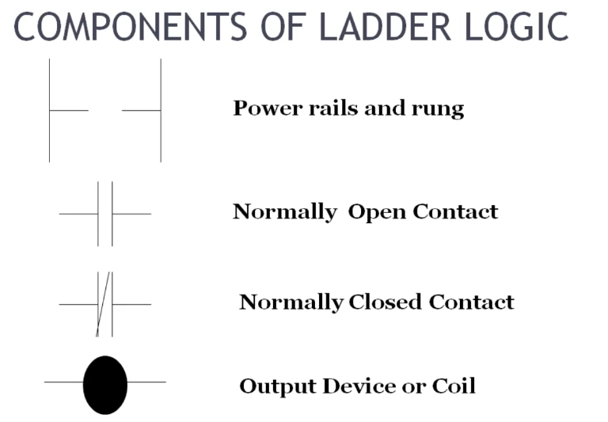
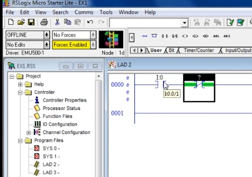
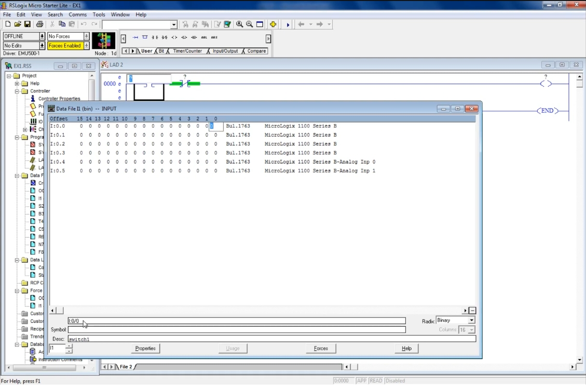
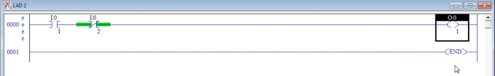
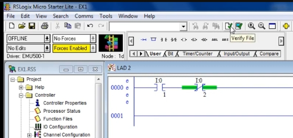
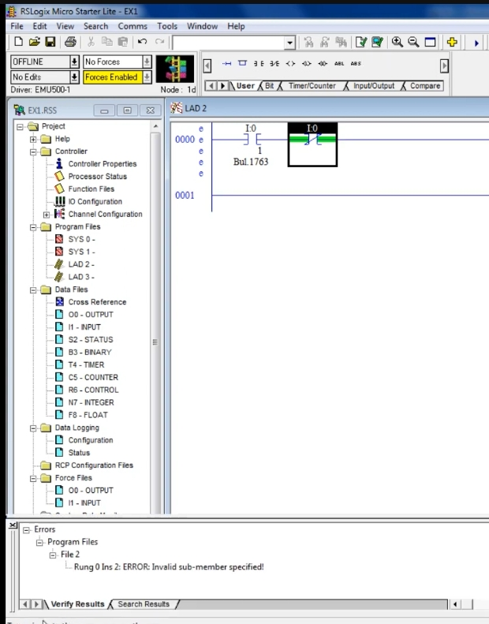
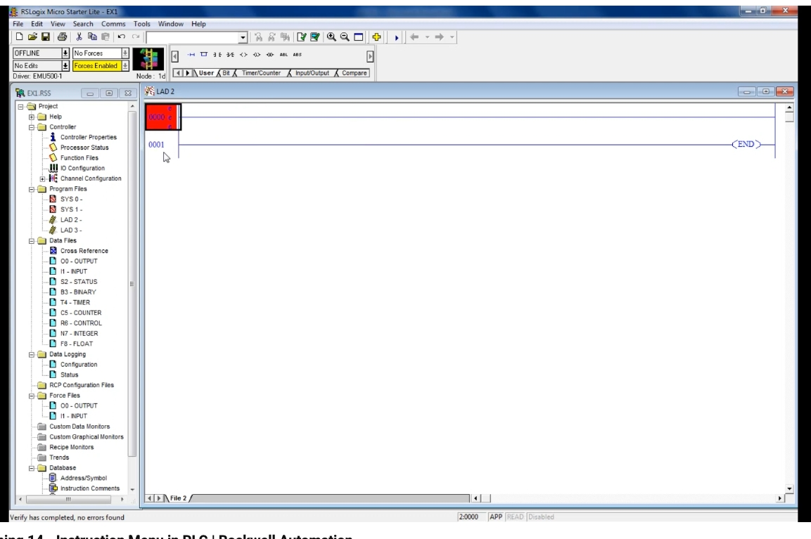

# PLC Training 14 – Instruction Menu in PLC | Rockwell Automation
# PLC 訓練 14 – PLC 的指令選單｜Rockwell Automation

> 原影片 / Source video: <https://www.youtube.com/watch?v=w3fliqcc8t4&list=PLI78ZBihrkE3nnGIj2WmHb_GoWjFlfFIu&index=14>

---

## 1. 本課目標 / Objectives

| 中文 | English |
|---|---|
| 認識三個基本指令：常開接點、常閉接點、輸出線圈。 | Learn the three basic instructions: normally open contact, normally closed contact, output coil. |
| 學會在 RSLogix 500 中插入指令。 | Learn how to insert instructions in RSLogix 500. |
| 學會為指令指定位址。 | Learn how to assign addresses to instructions. |
| 學會用 **Verify File（驗證檔案）** 檢查程式錯誤。 | Learn how to check for errors with **Verify File**. |

---

## 2. 三個基本指令 / The Three Basic Instructions

| 梯形圖元件 / Ladder Component | RSLogix 500 指令 / Instruction | 縮寫 / Short Form | 中文說明 | English Description |
|---|---|---|---|---|
| Normally Open Contact（常開接點） | **Examine If Closed** | **XIC** | 在 Allen-Bradley 中，常開接點稱為 XIC。 | In Allen-Bradley, the normally open contact is called XIC. |
| Normally Closed Contact（常閉接點） | **Examine If Open** | **XIO** | 常閉接點稱為 XIO。 | The normally closed contact is called XIO. |
| Output Device or Coil（輸出線圈） | **Output Energize** | **OTE** | 輸出，驅動燈或馬達等負載。 | The output, which drives loads such as lamps or motors. |

> 將游標停在指令圖示上，會顯示指令名稱（Examine If Closed 等）。
> Hover the cursor over an instruction icon to see its name (Examine If Closed, etc.).

---

## 3. 梯級（Rung）操作 / Working with Rungs

**中文**
- 軟體中的**水平線**稱為**梯級（rung）**，**垂直線**稱為**電源軌（rail）**。
- 要加入程式的指令，必須連接在梯級上。第一個梯級編號為 **0000**。
- 想新增梯級：使用 **User** 分頁中的 **New Rung** 圖示。
- 不需要的梯級：選取後按 **Delete** 鍵即可刪除。
- 本課只使用**一個梯級**。

**English**
- In the software the **horizontal lines** are **rungs** and the **vertical lines** are **rails**.
- Any instruction you add to the program must be connected on a rung. The first rung is numbered **0000**.
- To add a rung, use the **New Rung** icon in the **User** tab.
- To remove an unwanted rung, select it and press the **Delete** key.
- This lesson uses **only one rung**.

---

## 4. 插入指令 / Inserting Instructions

### 4.1 兩種插入方式 / Two Ways to Insert

**中文**
1. **點選圖示**：先點選梯級，再點選指令列中的指令圖示，指令就會出現在梯級上。
2. **鍵入縮寫**：點選梯級後，直接輸入指令縮寫，例如 **XIC**，按 **Enter**，即可插入常開接點。

**English**
1. **Click the icon**: click the rung, then click the instruction icon in the toolbar; the instruction appears on the rung.
2. **Type the short form**: click the rung, type the instruction short form, e.g. **XIC**, and press **Enter** to insert a normally open contact.

### 4.2 插入位置 / Where the Instruction Goes

**中文**
指令會插在**你目前選取位置之後**。例如：

- 想讓常閉接點排在**第一個**，要先點選梯級最前面，再點選常閉指令。
- 點選常閉接點之後，再點選輸出線圈，輸出會放在**最右側**（因為它是最後一個指令）。
- 若再多點一個輸入，就能繼續串接在梯級上。

**English**
An instruction is inserted **after the current selection**. For example:

- To put a normally closed contact **first**, select the start of the rung, then click the NC instruction.
- After the NC contact, click the output coil; the output goes to the **far right** because it is the last instruction.
- Clicking one more input adds another contact in series on the rung.

---

## 5. 指定位址 / Assigning Addresses

**中文**
插入指令後，上方會出現問號 `?`，需要輸入位址：

1. 點選指令上方的位址欄。
2. 輸入位址，輸入類別依上一課的定址格式：**輸入用 I，輸出用 O**。
3. 按 **Enter** 確認。

本課範例：

| 指令 / Instruction | 位址 / Address | 說明 / Description |
|---|---|---|
| 第一個接點 XIC / First contact XIC | `I:0/0` | 輸入 0 / Input 0 |
| 第二個接點 XIO / Second contact XIO | `I:0/1`（影片後來改為 `I:0/2`） | 另一個輸入 / Another input |
| 輸出線圈 OTE / Output coil | `O:0/1`（也可從 `O:0/0` 開始） | 輸出 / Output |

> **注意**：兩個接點代表不同的輸入，所以位址不能相同。端子編號（`/` 後面的數字）就是位元編號。
> **Note**: the two contacts are different inputs, so their addresses must differ. The number after `/` is the bit (terminal) number.

### 5.1 對照資料檔查看位址 / Checking Addresses in the Data File

開啟 **I1 – INPUT** 資料檔，點選要使用的位元，下方會顯示它的位址（例如 `I:0/0`），也可在 **Symbol / Desc** 欄位加上名稱與說明（影片中 Desc 為 `switch1`）。
Open the **I1 – INPUT** data file and select the bit you want; its address (e.g. `I:0/0`) is shown at the bottom. You can also add a name and description in the **Symbol / Desc** fields (the video uses `switch1`).

### 5.2 完成的梯級 / The Completed Rung

接點加上位址後，梯級上會顯示 `I:0` 與位元編號；輸出線圈顯示 `O:0`。
Once addresses are entered, the rung shows `I:0` with its bit number, and the output coil shows `O:0`.

---

## 6. 驗證程式 / Verifying the Program

**中文**
梯級左側的紅色 **e** 表示有錯誤。寫完程式後，要檢查是否正確：

1. 點選工具列的 **Verify File（驗證檔案）** 圖示。
2. 若沒有錯誤，狀態列會顯示 **Verify has completed, no errors found**，紅色的 e 消失。
3. 若有錯誤，下方的 **Verify Results** 視窗會列出錯誤。

### 6.1 錯誤示範 / Error Demonstration

**中文**
影片故意不輸入端子編號（位元號），驗證後出現：

`Rung 0 Ins 2: ERROR: Invalid sub-member specified!`

意思是「指令 2 指定了無效的子成員」。修正方法：補上完整位址（例如 `I:0/2`），**並確實按 Enter 確認**，再重新驗證，錯誤就會消失。

**English**
The video deliberately leaves out the terminal (bit) number. Verify then reports:

`Rung 0 Ins 2: ERROR: Invalid sub-member specified!`

It means instruction 2 has an invalid sub-member. Fix it by entering the complete address (e.g. `I:0/2`) **and pressing Enter to confirm**, then verify again; the error disappears.

### 6.2 驗證成功 / Verify Succeeded

驗證通過後，狀態列顯示 **Verify has completed, no errors found**，程式即可準備執行。
After a successful verification the status bar reads **Verify has completed, no errors found**, and the program is ready to run.

---

## 7. 重點整理 / Key Takeaways

1. 三個基本指令：**XIC**（常開）、**XIO**（常閉）、**OTE**（輸出）。
   Three basic instructions: **XIC** (NO), **XIO** (NC), **OTE** (output).
2. 先點選梯級，再插入指令；指令會出現在選取位置之後。
   Click the rung first, then insert; the instruction appears after the selection.
3. 每個指令都要有位址：輸入 `I:0/x`、輸出 `O:0/x`，不同的輸入不能用同一位址。
   Every instruction needs an address: inputs `I:0/x`, outputs `O:0/x`; different inputs must not share an address.
4. 位址輸入後要按 **Enter**。
   Press **Enter** after typing an address.
5. 用 **Verify File** 檢查；紅色 **e** 與 Verify Results 會指出錯誤。
   Use **Verify File**; the red **e** and Verify Results point out errors.

---

## 8. 小測驗 / Quick Quiz

1. 常開接點在 RSLogix 500 中叫什麼？ / What is the normally open contact called in RSLogix 500?
   → **XIC (Examine If Closed)**
2. 常閉接點叫什麼？ / What is the normally closed contact called?
   → **XIO (Examine If Open)**
3. 輸出指令叫什麼？ / What is the output instruction called?
   → **OTE (Output Energize)**
4. 如何檢查程式是否有錯？ / How do you check a program for errors?
   → 點選 **Verify File** / Click **Verify File**

---

## 9. 下一課預告 / Next Lesson

**中文**：程式已準備好執行（影片結尾提到「程式準備好運行」，下一步預期是模擬／執行）。
**English**: The program is ready to run (the video ends with "our program is ready to run"; running / simulating it is the expected next step).

---

## 附註 / Notes

- 原逐字稿為自動語音辨識，已依上下文與截圖修正（例如 "runs / rains" → rungs / rails、"coin" → coil、"examine if closed" 的縮寫 XIC、"Io" → I/O）。
  The transcript was auto-generated; terms were corrected using context and screenshots (e.g. "runs / rains" → rungs / rails, "coin" → coil).
- 影片中講者說「Examine If Open 是常閉接點」，其縮寫 **XIO** 與輸出指令縮寫 **OTE** 為 RSLogix 500 標準縮寫，影片未明說，由編者補充。
  The short forms **XIO** and **OTE** are standard RSLogix 500 abbreviations added by the editor; the video only names the instructions.
- 影片中輸出位址先說 `O:0/1`，又說「從 0 開始也可以」；其餘位址以逐字稿為準。
  The video first gives `O:0/1` and then says starting from 0 is also fine; other addresses follow the transcript.
- 下一課預告為推測。
  The next-lesson note is an inference.
