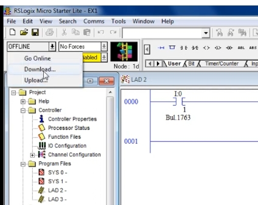
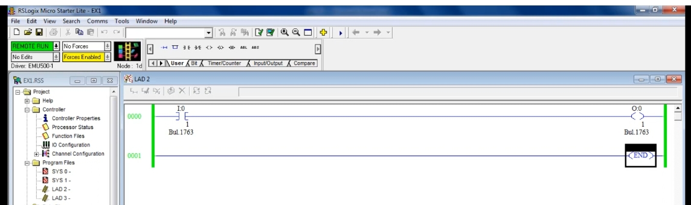
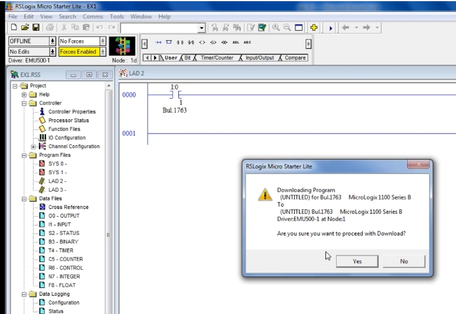
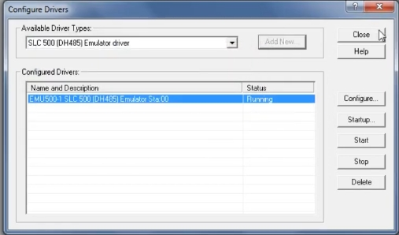
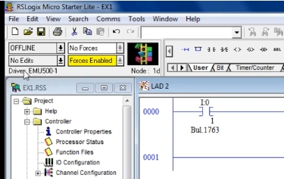
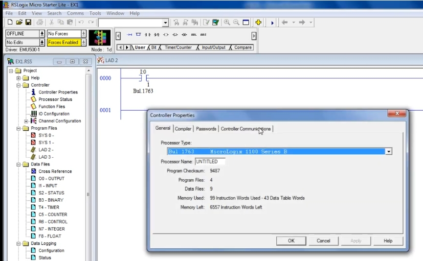
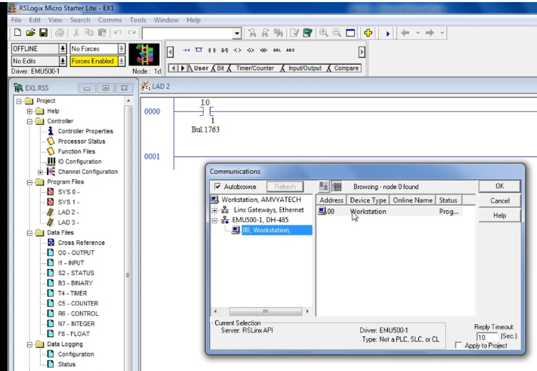

# PLC Training 15 – RSLinx 設定與 PLC 模擬器操作教程
# PLC Training 15 – RSLinx Setup and Working with the PLC Emulator

> 來源 Source: https://www.youtube.com/watch?v=hby13lgs778&list=PLI78ZBihrkE3nnGIj2WmHb_GoWjFlfFIu&index=15

**中文**：本教程說明如何設定 RSLinx 通訊軟體，並使用 Allen-Bradley PLC 模擬器（Emulator）下載並執行 RSLogix Micro Starter Lite 程式。

**English**: This tutorial shows how to set up the RSLinx communication software and use the Allen-Bradley PLC emulator to download and run a program from RSLogix Micro Starter Lite.

---

## 目錄 Contents

1. [檢查並儲存程式 Verify and Save](#步驟-1)
2. [嘗試下載（出現錯誤）Try to Download](#步驟-2)
3. [設定 RSLinx 模擬器驅動 Configure the Emulator Driver in RSLinx](#步驟-3)
4. [確認驅動已連結 Confirm the Driver Is Linked](#步驟-4)
5. [設定控制器通訊路徑 Set the Controller Communication Path](#步驟-5)
6. [下載並上線 Download and Go Online](#步驟-6)
7. [切換為 RUN 模式 Switch to Run Mode](#步驟-7)
8. [離線編輯與再次下載 Edit Offline and Re-download](#步驟-8)

---

## 步驟 1：檢查並儲存程式 / Step 1: Verify and Save the Program

**中文**
1. 示範程式包含 1 個輸入與 1 個輸出。
2. 先執行 **Verify File（驗證檔案）**，確認沒有錯誤；有錯誤就無法下載與執行。
3. 儲存檔案（影片中檔名為 `EX1`）。若要更換名稱，使用 **File → Save As**。

**English**
1. The demo program has one input and one output.
2. Run **Verify File** first and make sure there are no errors; a program with errors cannot be downloaded or run.
3. Save the file (named `EX1` in the video). Use **File → Save As** if you want a different name.

---

## 步驟 2：嘗試下載（出現錯誤）/ Step 2: Try to Download (Error Expected)

**中文**：點擊左上角狀態欄 **OFFLINE** 旁的下拉箭頭，選擇 **Download…**。第一次會出現 **"No response from processor"（處理器無回應）**，因為尚未設定 RSLinx。

**English**: Click the drop-down arrow next to **OFFLINE** at the top left and choose **Download…**. The first time you will get **"No response from processor"** because RSLinx has not been set up yet.

---

## 步驟 3：設定 RSLinx 模擬器驅動 / Step 3: Configure the Emulator Driver in RSLinx

**中文**
1. 在 Windows 搜尋 **RSLinx**，對 **RSLinx Classic** 按右鍵開啟（這是通訊軟體）。
2. 選擇 **Communications → Configure Drivers**。
3. 在 **Available Driver Types** 下拉選單選擇 **SLC 500 (DH485) Emulator driver**。
4. 點 **Add New…**，然後按 **OK**、再按 **OK**。
5. 驅動 `EMU500-1` 顯示狀態 **Running** 即成功。關閉視窗並將 RSLinx 縮小到工作列。

**English**
1. Search for **RSLinx** in Windows and right-click **RSLinx Classic** to open it (this is the communication software).
2. Go to **Communications → Configure Drivers**.
3. In **Available Driver Types**, select **SLC 500 (DH485) Emulator driver**.
4. Click **Add New…**, then **OK**, then **OK** again.
5. The driver `EMU500-1` should show the status **Running**. Close the window and minimize RSLinx.

---

## 步驟 4：確認驅動已連結 / Step 4: Confirm the Driver Is Linked

**中文**：回到 RSLogix，狀態欄下方會顯示 **Driver: EMU500-1**（之前沒有）。表示程式軟體已與模擬器連結。再按一次 **Download**，此時可能出現「處理器不受支援（processor is not supported）」的訊息，請繼續下一步。

**English**: Back in RSLogix, the status area now shows **Driver: EMU500-1** (it was not there before), meaning the programming software is linked to the emulator. Click **Download** again; you may now see a "processor is not supported" message — continue with the next step.

---

## 步驟 5：設定控制器通訊路徑 / Step 5: Set the Controller Communication Path

**中文**
1. 在左側專案樹狀圖雙擊 **Controller Properties**（或選單開啟）。
2. 切換到 **Controller Communications** 分頁（**General** 分頁顯示處理器類型為 `Bul.1763 MicroLogix 1100 Series B`）。

**English**
1. In the project tree on the left, open **Controller Properties**.
2. Switch to the **Controller Communications** tab (the **General** tab shows the processor type `Bul.1763 MicroLogix 1100 Series B`).

**中文**
3. 點擊 **Who Active**，會開啟 **Communications** 視窗。
4. 展開 **EMU500-1, DH-485**，選擇 **00, Workstation**，按 **OK**。
5. 回到上一個視窗，按 **Apply**，再按 **OK**。

**English**
3. Click **Who Active** to open the **Communications** window.
4. Expand **EMU500-1, DH-485**, select **00, Workstation**, and click **OK**.
5. Back in the previous window, click **Apply**, then **OK**.

> **注意 Note**
> **中文**：第一次執行軟體才需要做這個設定；之後再下載不需要重設路徑。
> **English**: This setup is only needed the first time you run the software; later downloads do not need the path to be set again.

---

## 步驟 6：下載並上線 / Step 6: Download and Go Online

**中文**
1. 再次選擇 **Download…**，會出現確認視窗，內容顯示下載至 `Bul.1763 MicroLogix 1100 Series B`、驅動 `EMU500-1`、節點 1。
2. 按 **Yes** 下載。
3. 出現「是否要上線（go online）」時，按 **Yes**。

**English**
1. Choose **Download…** again. A confirmation dialog appears showing the target `Bul.1763 MicroLogix 1100 Series B`, driver `EMU500-1`, node 1.
2. Click **Yes** to download.
3. When asked whether you want to go online, click **Yes**.

---

## 步驟 7：切換為 RUN 模式 / Step 7: Switch to Run Mode

**中文**
1. 點擊同一個狀態下拉選單，選擇 **Run**。
2. 出現「確定要將處理器模式改為 RUN 嗎？」時，按 **Yes**。
3. 狀態顯示綠色 **REMOTE RUN**，梯形圖左側出現綠色線條，代表處於執行狀態。
4. 此時可操作輸入開關，並依程式邏輯觀察輸出結果。

**English**
1. Click the same status drop-down and choose **Run**.
2. When asked "Are you sure you want to change the processor mode to RUN?", click **Yes**.
3. The status turns green and shows **REMOTE RUN**, and green bars appear beside the ladder rungs — the program is running.
4. You can now toggle the input switch and watch the output according to your program logic.

---

## 步驟 8：離線編輯與再次下載 / Step 8: Edit Offline and Re-download

**中文**
1. 在狀態下拉選單選擇 **Go Offline**，進入編輯模式。
2. 範例：新增一個常閉接點（Normally Closed）並指定位址。
3. 再次 **Verify File** 檢查錯誤。
4. 因通訊路徑已設定好，可直接 **Download → Yes → Go Online → Run → Yes**。

**English**
1. Choose **Go Offline** from the status drop-down to enter editing mode.
2. Example: add a Normally Closed contact and assign an address.
3. Run **Verify File** again to check for errors.
4. Since the communication path is already set, simply **Download → Yes → Go Online → Run → Yes**.

---

## 快速流程 / Quick Workflow

| # | 中文 | English |
|---|------|---------|
| 1 | 驗證並儲存程式 | Verify and save the program |
| 2 | RSLinx Classic → Configure Drivers | RSLinx Classic → Configure Drivers |
| 3 | 選 SLC 500 (DH485) Emulator driver → Add New → OK | Select SLC 500 (DH485) Emulator driver → Add New → OK |
| 4 | Controller Properties → Controller Communications → Who Active | Controller Properties → Controller Communications → Who Active |
| 5 | 選 EMU500-1 下的 00 Workstation → OK → Apply → OK | Select 00 Workstation under EMU500-1 → OK → Apply → OK |
| 6 | Download → Yes → Go Online → Yes | Download → Yes → Go Online → Yes |
| 7 | Run → Yes（顯示 REMOTE RUN） | Run → Yes (shows REMOTE RUN) |
| 8 | 要修改程式時：Go Offline → 編輯 → 重新下載 | To change the program: Go Offline → edit → download again |

---

## 下一單元預告 / Next Session

**中文**：下一課將說明 NO（常開）與 NC（常閉）接點的功能，以及它們如何影響輸出，並示範如何操作開關。

**English**: The next session explains the function of NO (normally open) and NC (normally closed) contacts, how they affect the output, and how to turn the switches on.
