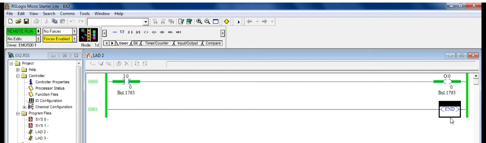
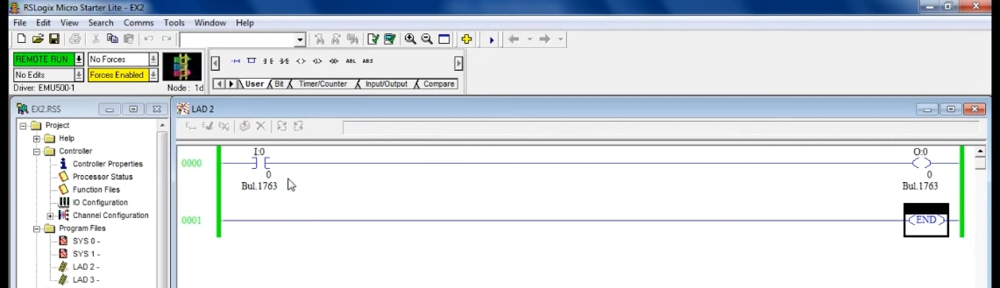
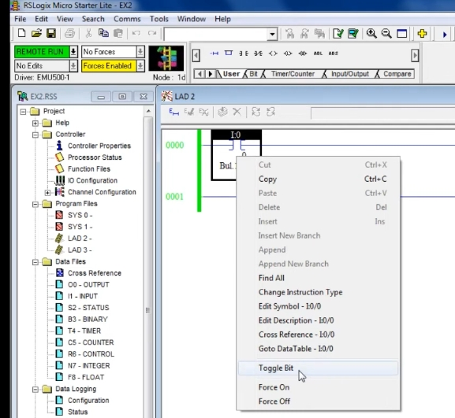

# PLC Training 16 – 常開接點（NO Contact）教程
# PLC Training 16 – Normally Open (NO) Contact | Allen-Bradley PLC Tutorial

> 來源 Source: https://www.youtube.com/watch?v=1zJRSrgsL5s&list=PLI78ZBihrkE3nnGIj2WmHb_GoWjFlfFIu&index=16

**中文**：本教程說明常開接點（Normally Open Contact）的功能，以及它如何影響輸出，並在模擬器中以 Toggle Bit 操作示範。

**English**: This tutorial explains the function of the normally open (NO) contact, how it influences the output, and demonstrates it in the emulator using Toggle Bit.

---

## 目錄 Contents

1. [建立梯形圖 Build the Ladder Logic](#步驟-1)
2. [觀念：家中的開關 Concept: The Home Switch](#步驟-2)
3. [下載並執行 Download and Run](#步驟-3)
4. [開啟接點（Toggle Bit）Turn the Contact On](#步驟-4)
5. [關閉接點 Turn the Contact Off](#步驟-5)

---

## 步驟 1：建立梯形圖 / Step 1: Build the Ladder Logic

**中文**
1. 選擇 **Run**（Rung）建立新的梯級。
2. 從指令列選擇常開接點，在 Allen-Bradley 中稱為 **XIC（Examine If Closed）**，位址輸入 `I:0/0`，按 **OK**。
3. 選擇輸出線圈（**OTE**），位址輸入 `O:0/0`，按 **OK**。
4. 執行 **Verify File** 確認沒有錯誤。

**English**
1. Add a new rung.
2. From the instruction toolbar choose the normally open contact, called **XIC (Examine If Closed)** in Allen-Bradley, and enter the address `I:0/0`, then click **OK**.
3. Choose the output coil (**OTE**) and enter the address `O:0/0`, then click **OK**.
4. Run **Verify File** to make sure there are no errors.

> **說明 Note**
> **中文**：影片逐字稿此處的語音辨識文字不精確；在 Allen-Bradley 中，常開接點是 XIC，常閉接點是 XIO（Examine If Open）。
> **English**: The auto-generated transcript is imprecise here; in Allen-Bradley, the normally open contact is XIC and the normally closed contact is XIO (Examine If Open).

---

## 步驟 2：觀念：家中的開關 / Step 2: Concept: The Home Switch

**中文**
- 常開接點就像家裡的一般開關：**沒有打開開關，對應的設備就不會啟動**。
- 以電風扇為例：打開開關風扇才會轉，關掉開關風扇就停。
- 控制權掌握在我們手中：把接點當作「開關」，輸出當作「風扇」。

**English**
- A normally open contact works like an ordinary switch at home: **the device will not turn on until you turn the switch on**.
- Take a fan as an example: turn the switch on and the fan runs; turn it off and the fan stops.
- Control is in our hands: think of the contact as the "switch" and the output as the "fan".

---

## 步驟 3：下載並執行 / Step 3: Download and Run

**中文**
1. 點擊 **Download…**，按 **Yes**。若出現錯誤，進入 **Controller Properties** 設定通訊路徑（參見 Training 15）。
2. 影片中先用 **Save As** 另存為新名稱（`EX2`），再重新下載。
3. 出現是否上線時按 **Yes**，接著選擇 **Run** 並按 **Yes**。
4. 此時尚未碰開關，接點為 OFF，所以輸出（風扇）也是 OFF。

**English**
1. Click **Download…** and click **Yes**. If an error appears, open **Controller Properties** and set the communication path (see Training 15).
2. In the video the file is first saved under a new name (`EX2`) with **Save As**, then downloaded again.
3. Click **Yes** when asked to go online, then choose **Run** and click **Yes**.
4. Since the switch has not been touched, the contact is OFF, so the output (the fan) is also OFF.

---

## 步驟 4：開啟接點（Toggle Bit）/ Step 4: Turn the Contact On (Toggle Bit)

**中文**
1. 在接點 `I:0/0` 上按 **右鍵**。
2. 選擇 **Toggle Bit**，位元由 0 變為 1。

**English**
1. **Right-click** the contact `I:0/0`.
2. Choose **Toggle Bit**; the bit changes from 0 to 1.

**中文**：接點出現**綠色**，表示開關為 ON；因為開關為 ON，輸出 `O:0/0` 也跟著變成 ON（綠色）。

**English**: The contact turns **green**, meaning the switch is ON; because the switch is ON, the output `O:0/0` also turns ON (green).

---

## 步驟 5：關閉接點 / Step 5: Turn the Contact Off

**中文**
- 關閉的方式相同：在接點上按右鍵 → **Toggle Bit**。
- 綠色消失，輸出也跟著 OFF（回到上方第一張圖的狀態）。
- 想再次開啟，再執行一次 Toggle Bit 即可。

**English**
- Turning it off uses the same procedure: right-click the contact → **Toggle Bit**.
- The green disappears and the output also turns OFF (back to the state shown in the first image above).
- To turn it on again, simply use Toggle Bit once more.

---

## 重點整理 / Summary

| 狀態 State | 接點 I:0/0 Contact | 輸出 O:0/0 Output | 梯形圖顏色 Ladder color |
|---|---|---|---|
| 預設 Default | OFF (0) | OFF | 無綠色 No green |
| Toggle Bit 後 After toggle | ON (1) | ON | 綠色 Green |
| 再次 Toggle Toggle again | OFF (0) | OFF | 無綠色 No green |

**中文**：常開接點就像家中的開關，不去操作它就不會啟動輸出；它的功能與家用開關一致。

**English**: A normally open contact behaves like a home switch: unless you operate it, it will not turn on the output.

---

## 下一單元預告 / Next Session

**中文**：下一課將介紹常閉接點（Normally Closed Contact）的功能。

**English**: The next session covers the function of the normally closed (NC) contact.
