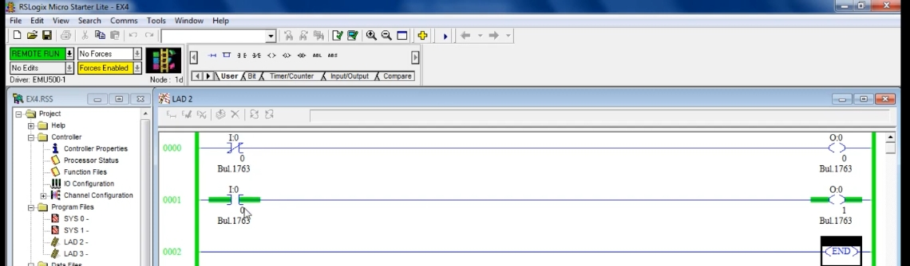
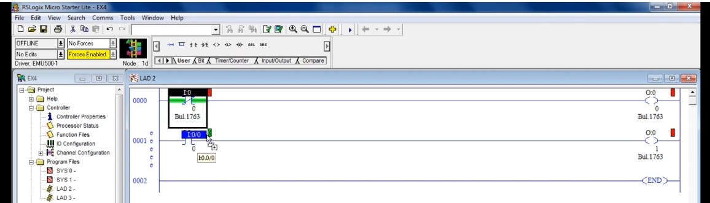
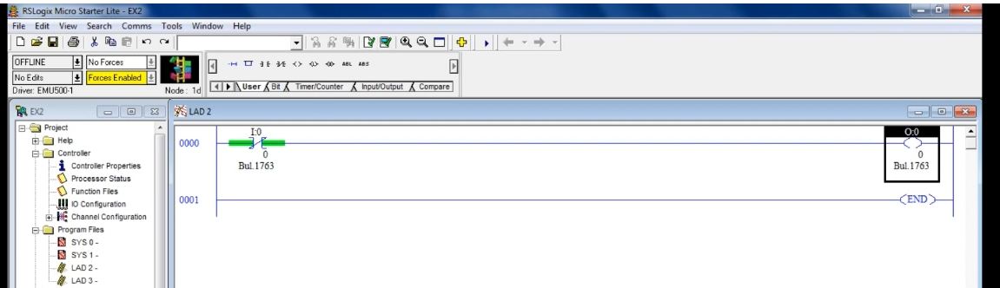
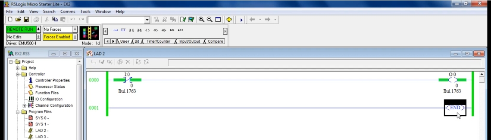
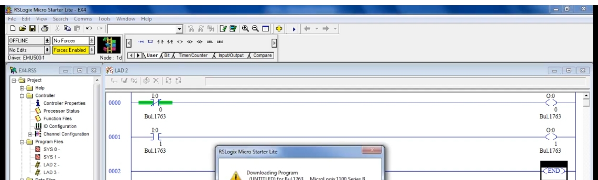
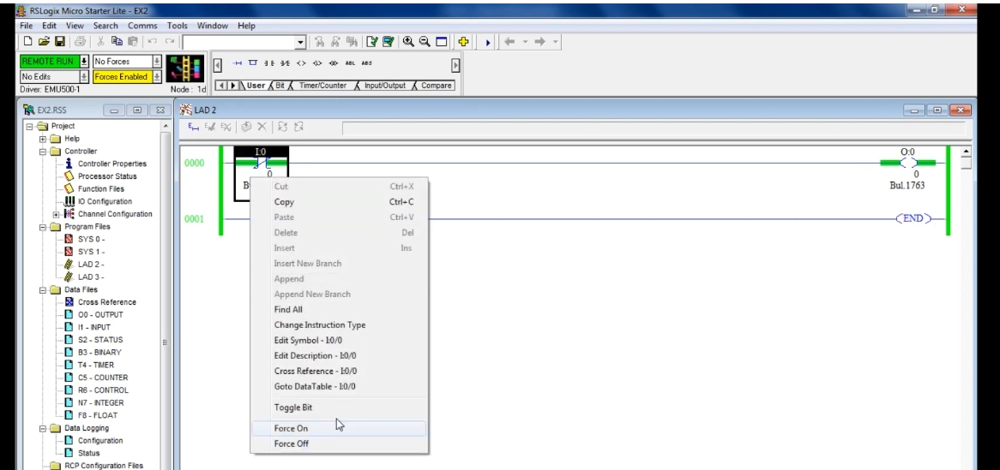

# PLC Training 17 – 常閉接點（NC Contact）教程
# PLC Training 17 – Normally Closed (NC) Contact in PLC Tutorial

> 來源 Source: https://www.youtube.com/watch?v=_8UvDy7mSdA&list=PLI78ZBihrkE3nnGIj2WmHb_GoWjFlfFIu&index=17

**中文**：本教程說明常閉接點（Normally Closed Contact）的動作原理，並與常開接點（NO）比較；同時示範如何在多個梯級中使用同一個輸入位址。

**English**: This tutorial explains how the normally closed (NC) contact works, compares it with the normally open (NO) contact, and shows how to use the same input address in multiple rungs.

---

## 目錄 Contents

1. [建立常閉接點與輸出 Build an NC Contact with an Output](#步驟-1)
2. [常閉接點的特性 How the NC Contact Behaves](#步驟-2)
3. [下載並執行 Download and Run](#步驟-3)
4. [Toggle Bit 切換接點 Toggle the Contact](#步驟-4)
5. [NO 與 NC 並排比較 NO vs NC Side by Side](#步驟-5)
6. [同一位址用在多處 Using the Same Address in Multiple Places](#步驟-6)

---

## 步驟 1：建立常閉接點與輸出 / Step 1: Build an NC Contact with an Output

**中文**
1. 建立一個梯級，放入常閉接點，位址 `I:0/0`；在 Allen-Bradley 中常閉接點稱為 **XIO（Examine If Open）**。
2. 加上輸出線圈 `O:0/0`。
3. 執行 **Verify File**。若**沒有輸出線圈**，驗證會顯示「梯級缺少輸出（output missing on rung）」的錯誤，因此每個梯級都必須有輸出才能模擬。

**English**
1. Create a rung with a normally closed contact at address `I:0/0`; in Allen-Bradley it is called **XIO (Examine If Open)**.
2. Add an output coil `O:0/0`.
3. Run **Verify File**. If the **output coil is missing**, verification reports an "output missing on rung" error, so every rung needs an output before it can be simulated.

---

## 步驟 2：常閉接點的特性 / Step 2: How the NC Contact Behaves

**中文**
- 常閉接點與常開接點**完全相反**。
- 起初控制權不在我們手中：一旦上線，接點就已經是**導通（ON）**狀態。
- 圖形上的差別：常開接點平常沒有綠色線，而常閉接點周圍**已經有綠色線**。
- 可以把它想成一個「已經被按下」的開關，所以輸出一開始就是 ON。

**English**
- The NC contact is the **exact opposite** of the NO contact.
- Initially control is not in our hands: once online, the contact is already in the **conducting (ON)** state.
- Visual difference: a normally open contact has no green line around it by default, while a normally closed contact **already has green around it**.
- Think of it as a switch that is **already pressed**, so the output is ON from the start.

---

## 步驟 3：下載並執行 / Step 3: Download and Run

**中文**
1. **Download** → 按 **Yes**。若出現通訊錯誤，設定 **Controller Properties**，或先 **Save As** 重新命名後再下載（參見 Training 15、16）。
2. **Go Online** → **Run** → **Yes**。
3. 我們還沒有碰開關，輸出 `O:0/0` 就已經是 **ON**。

**English**
1. **Download** → click **Yes**. If a communication error appears, set **Controller Properties**, or **Save As** under a new name and download again (see Training 15 and 16).
2. **Go Online** → **Run** → **Yes**.
3. We have not touched the switch, yet the output `O:0/0` is already **ON**.

---

## 步驟 4：Toggle Bit 切換接點 / Step 4: Toggle the Contact

**中文**
1. 在接點上按 **右鍵** → **Toggle Bit**。
2. 已經閉合的常閉接點被切換後會**打開**，輸出變成 **OFF**。
3. 再切換一次，接點恢復閉合，輸出再次 **ON**。
4. 這與常開接點的行為正好相反。

**English**
1. **Right-click** the contact → **Toggle Bit**.
2. The already-closed NC contact **opens** when toggled, and the output turns **OFF**.
3. Toggle again: the contact closes again and the output is **ON** again.
4. This is exactly the opposite of the NO contact behavior.

> **提醒 Tip**
> **中文**：離線時看不到輸出是否為 ON，需要上線才能觀察輸出狀態。
> **English**: You cannot see the output state while offline; go online to observe it.

---

## 步驟 5：NO 與 NC 並排比較 / Step 5: NO vs NC Side by Side

**中文**
1. 新增第二個梯級：一個**常開接點**加上**不同的輸出**（例如 `O:0/1`）。
2. 每個梯級要使用**不同的輸出位址**，不要在兩處使用同一個輸出。
3. 此時兩個接點使用不同的輸入位址（例如 `I:0/0` 與 `I:0/1`），視為兩個不同的開關。
4. 下載、上線、**Run** 之後：
   - 常閉接點的梯級：輸出初始即為 **ON**。
   - 常開接點的梯級：輸出為 **OFF**（接點是打開的）。
5. 將常開接點 Toggle Bit 使其閉合，第二個輸出才會 ON。

**English**
1. Add a second rung: a **normally open contact** with a **different output** (for example `O:0/1`).
2. Each rung should use a **different output address**; do not use the same output in two places.
3. The two contacts use different input addresses (for example `I:0/0` and `I:0/1`), so they are two different switches.
4. After download, going online and **Run**:
   - The NC rung: the output is **ON** initially.
   - The NO rung: the output is **OFF** (the contact is open).
5. Toggle Bit the NO contact to close it, and only then does the second output turn ON.

---

## 步驟 6：同一位址用在多處 / Step 6: Using the Same Address in Multiple Places

**中文**
1. 因為 PLC 是邏輯運算，**同一個輸入位址可以在多個地方使用**，甚至可以在一處當常閉、另一處當常開。
2. 複製位址的方法：把位址**拖曳**到另一個接點上。
3. 本例中，第一梯級是 `I:0/0` 常閉接點，第二梯級也是 `I:0/0`，但為常開接點。
4. 執行 **Verify File** → **Download** → **Go Online** → **Run**。

**English**
1. Because a PLC works with logic, **the same input address can be used in several places**, even as a normally closed contact in one place and a normally open contact in another.
2. To copy an address, **drag** the address onto another contact.
3. In this example, rung 0 is an `I:0/0` normally closed contact, and rung 1 also uses `I:0/0` but as a normally open contact.
4. Run **Verify File** → **Download** → **Go Online** → **Run**.

**中文**
- 初始狀態：NC 梯級的輸出為 **ON**，NO 梯級的輸出為 **OFF**。
- 只要 Toggle 這個共用的開關一次，兩個接點同時改變：NC 梯級輸出變 **OFF**，NO 梯級輸出變 **ON**。
- 同一個輸入可依需求在多處以不同方式使用，由你依需求決定。

**English**
- Initial state: the NC rung output is **ON** and the NO rung output is **OFF**.
- Toggle the shared switch once and both contacts change together: the NC rung output turns **OFF** and the NO rung output turns **ON**.
- One input can be used in different ways in several places, depending on your requirements.

---

## 重點整理 / Summary

| 項目 Item | 常開 NO（XIC） | 常閉 NC（XIO） |
|---|---|---|
| 初始狀態 Initial state | 打開（OFF），無綠色 Open, no green | 閉合（ON），有綠色 Closed, green |
| 輸出初始 Output at start | OFF | ON |
| Toggle Bit 後 After toggle | 閉合，輸出 ON Closes, output ON | 打開，輸出 OFF Opens, output OFF |
| 生活類比 Real-life analogy | 一般電燈開關 Ordinary light switch | 已按下的開關 A switch already pressed |

**中文**：至此已介紹三個重要元件：常開接點、常閉接點與輸出線圈，並完成模擬。

**English**: We have now covered three important components, the NO contact, the NC contact and the output coil, and simulated them.

---

## 下一單元預告 / Next Session

**中文**：下一課將介紹如何加入說明（Description）、梯級註解（Rung Comment）與標題（Title）。

**English**: The next session shows how to add descriptions, rung comments and titles.
