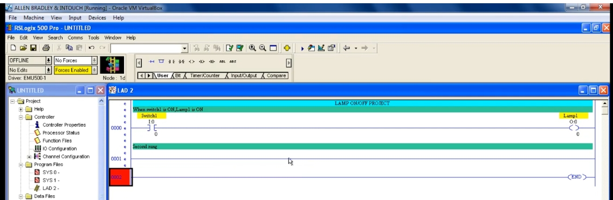
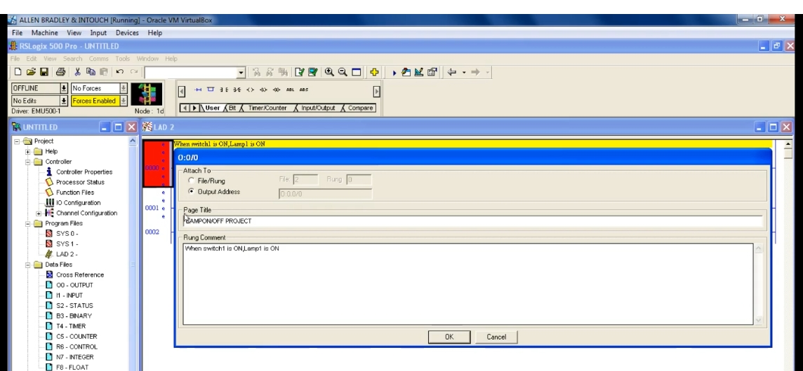
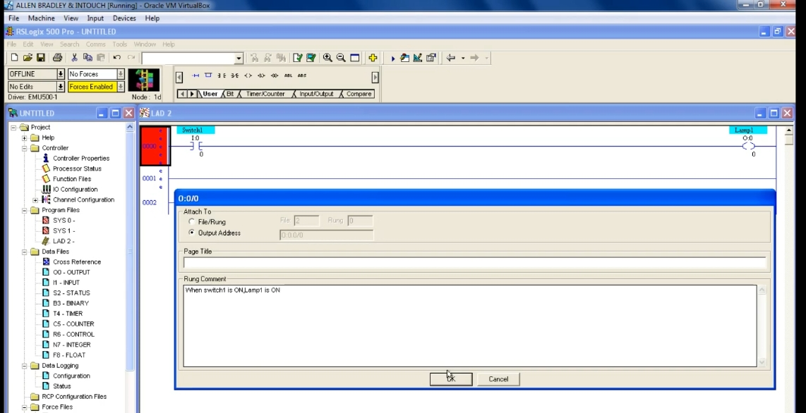
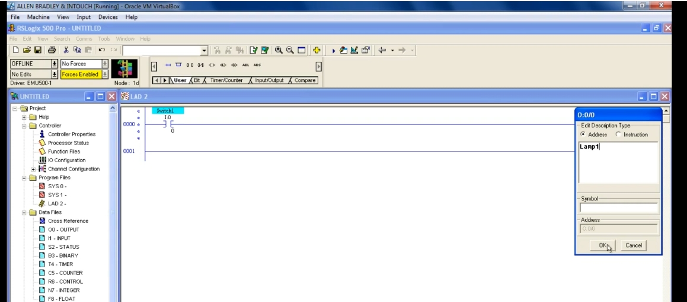
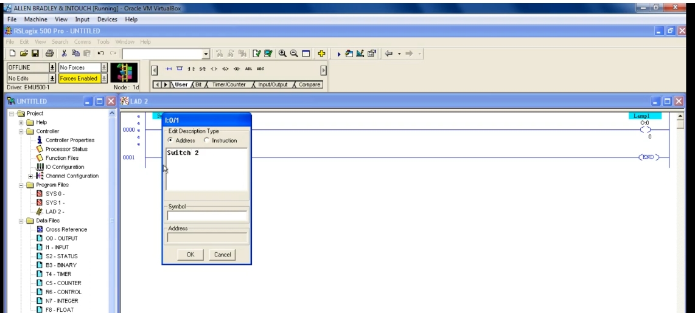
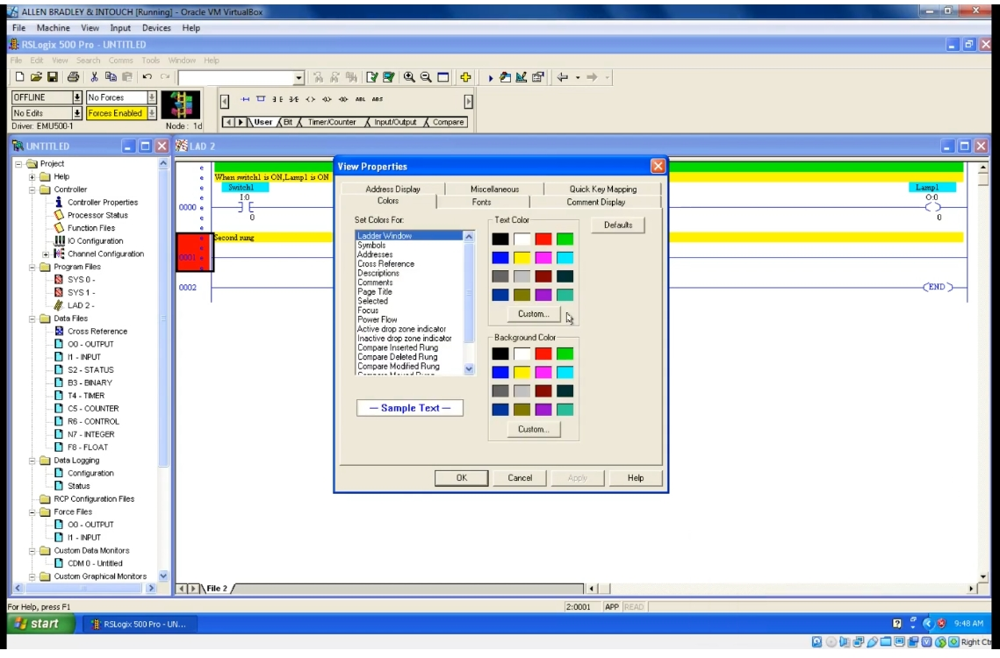
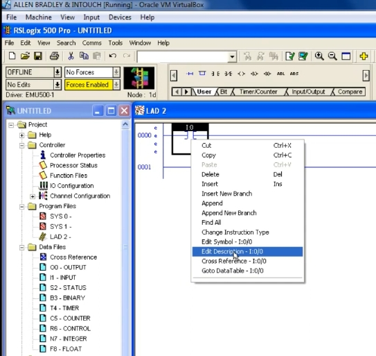

# PLC Training 18 – 梯級註解、標題與描述（Rung Comment / Title / Description）教程
# PLC Training 18 – Rung Comment, Title and Description in PLC

> 來源 Source: https://www.youtube.com/watch?v=z-BXW4Fl_Bw&list=PLI78ZBihrkE3nnGIj2WmHb_GoWjFlfFIu&index=18

**中文**：本教程說明如何為接點或輸出加上**描述（Description）**、為梯級加上**梯級註解（Rung Comment）**、為頁面加上**標題（Page Title）**，並自訂它們的顏色與字型。

**English**: This tutorial shows how to add a **description** to a contact or output, a **rung comment** to a rung, and a **page title** to the page, and how to customize their colors and fonts.

---

## 目錄 Contents

1. [為什麼需要描述 Why Descriptions Matter](#步驟-1)
2. [為接點加入描述 Add a Description to a Contact](#步驟-2)
3. [為輸出加入描述 Add a Description to an Output](#步驟-3)
4. [建立新接點時輸入描述 Add a Description While Creating a Contact](#步驟-4)
5. [梯級註解 Rung Comment](#步驟-5)
6. [頁面標題 Page Title](#步驟-6)
7. [自訂顏色與字型 Customize Colors and Fonts](#步驟-7)

---

## 步驟 1：為什麼需要描述 / Step 1: Why Descriptions Matter

**中文**
- 範例使用 1 個輸入 `I:0/0` 和 1 個輸出 `O:0/0`。
- 位址本身看不出用途：`I:0/0` 可能是開關、按鈕或感測器，甚至可能是輸出被當作輸入來使用。
- 加上描述後，之後閱讀程式時能馬上知道每個接點的實際用途。

**English**
- The example uses one input `I:0/0` and one output `O:0/0`.
- The address alone does not reveal its purpose: `I:0/0` may be a switch, a push button, a sensor, or even an output used as an input in some logic.
- With a description, anyone reading the program later can tell immediately what each contact is for.

---

## 步驟 2：為接點加入描述 / Step 2: Add a Description to a Contact

**中文**
1. 選取接點，按 **右鍵** → **Edit Description – I:0/0**。
2. 在彈出的小視窗輸入描述，例如 `Switch1`，按 **OK**。
3. 接點上方會顯示描述文字。

**English**
1. Select the contact, **right-click** → **Edit Description – I:0/0**.
2. Type the description in the small window that opens, for example `Switch1`, then click **OK**.
3. The description text appears above the contact.

---

## 步驟 3：為輸出加入描述 / Step 3: Add a Description to an Output

**中文**：輸出的做法相同：選取輸出線圈 → 右鍵 → **Edit Description**，輸入 `Lamp1` 後按 **OK**。

**English**: The same procedure applies to the output: select the output coil → right-click → **Edit Description**, type `Lamp1`, and click **OK**.

---

## 步驟 4：建立新接點時輸入描述 / Step 4: Add a Description While Creating a Contact

**中文**
1. 另一種方式：建立新接點時（例如位址 `I:0/1`），軟體會自動跳出描述視窗，直接輸入即可（例如 `Switch 2`）。
2. 之後要修改，可再次對接點按右鍵 → **Edit Description**，或直接點選描述文字。
3. 點選時要點在**描述文字本身**，而不是接點的其他位置。

**English**
1. Alternatively, when you create a new contact (for example address `I:0/1`), the software opens the description window automatically; just type it in (for example `Switch 2`).
2. To change it later, right-click the contact → **Edit Description**, or click the description text directly.
3. Make sure you click on the **description text itself**, not another part of the contact.

---

## 步驟 5：梯級註解 / Step 5: Rung Comment

**中文**
1. 梯級註解用來說明**整個梯級**的作用。
2. 先選取該梯級（游標所在的梯級編號會呈選取狀態），按 **右鍵** → **Edit Rung Comment**。
3. 視窗中有兩個欄位：**Page Title** 與 **Rung Comment**。在 **Rung Comment** 欄輸入說明，例如 `When switch1 is ON,Lamp1 is ON`。
4. 按 **OK**，梯級上方會出現黃色底的註解。
5. 其他梯級也一樣：選取梯級 → 右鍵 → 輸入註解。

**English**
1. A rung comment explains what the **whole rung** does.
2. Select the rung (the rung number where the cursor sits is highlighted), **right-click** → **Edit Rung Comment**.
3. The window has two fields: **Page Title** and **Rung Comment**. In the **Rung Comment** field, type the explanation, for example `When switch1 is ON,Lamp1 is ON`.
4. Click **OK**; the comment appears above the rung with a yellow background.
5. The same applies to other rungs: select the rung → right-click → enter the comment.

---

## 步驟 6：頁面標題 / Step 6: Page Title

**中文**
1. 在同一個視窗的 **Page Title** 欄輸入標題，例如 `LAMP ON/OFF PROJECT`。
2. 按 **OK** 後，標題會顯示在頁面最上方。
3. 頁面標題是**整頁共用**的（類似專案標題）；梯級註解則只對應各自的梯級。

**English**
1. In the **Page Title** field of the same window, enter a title, for example `LAMP ON/OFF PROJECT`.
2. After clicking **OK**, the title is displayed at the very top of the page.
3. The page title is **shared by the whole page** (like a project title), while a rung comment belongs only to its own rung.

**中文**：完成後的畫面：頁面標題在最上方、各梯級的註解在梯級上方、接點與輸出的描述在元件上方。

**English**: The finished result: the page title at the top, each rung comment above its rung, and the descriptions above the contacts and outputs.

---

## 步驟 7：自訂顏色與字型 / Step 7: Customize Colors and Fonts

**中文**
1. 描述、梯級註解與頁面標題各有預設顏色（例如標題為螢光綠、註解為黃色）。
2. 若想更改：在梯級視窗的空白處按 **右鍵** → **Properties**，開啟 **View Properties**。
3. 在 **Colors** 分頁的 **Set Colors For** 清單中選擇項目，例如 **Descriptions**、**Comments**、**Page Title**。
4. 右側可分別設定 **Text Color（文字顏色）** 與 **Background Color（背景顏色）**，下方 **Sample Text** 會即時預覽。
5. 按 **Apply** 套用並查看效果，不滿意可再調整，最後按 **OK**。
6. 在 **Fonts** 分頁可修改字型與字體大小。

**English**
1. Descriptions, rung comments and the page title each have default colors (for example the title is fluorescent green and comments are yellow).
2. To change them: **right-click** an empty area of the ladder window → **Properties** to open **View Properties**.
3. On the **Colors** tab, choose an item in the **Set Colors For** list, such as **Descriptions**, **Comments** or **Page Title**.
4. On the right you can set the **Text Color** and the **Background Color** separately; the **Sample Text** below previews the result.
5. Click **Apply** to see the effect, adjust again if you are not satisfied, then click **OK**.
6. On the **Fonts** tab you can change the font and font size.

---

## 重點整理 / Summary

| 項目 Item | 作用範圍 Scope | 操作方式 How to |
|---|---|---|
| 描述 Description | 單一接點或輸出 A single contact or output | 右鍵 → Edit Description |
| 梯級註解 Rung Comment | 單一梯級 A single rung | 選取梯級 → 右鍵 → Edit Rung Comment |
| 頁面標題 Page Title | 整個頁面（顯示於最上方）The whole page (shown at the top) | 在 Rung Comment 視窗的 Page Title 欄輸入 |
| 顏色與字型 Colors and fonts | 全部顯示項目 All display items | 空白處右鍵 → Properties |

---

## 下一單元預告 / Next Session

**中文**：下一課將介紹另一個有趣的主題。

**English**: The next session covers another interesting topic.
