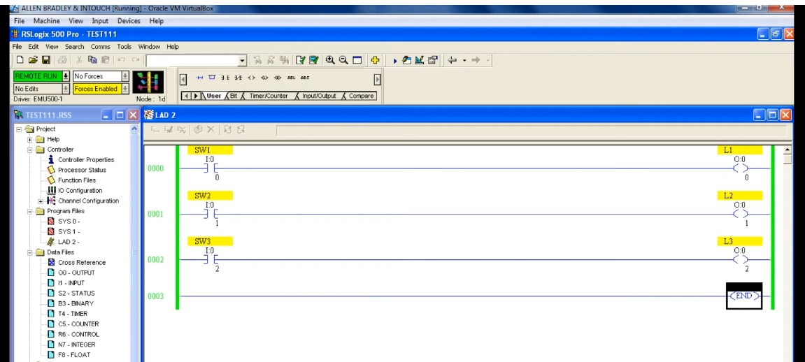
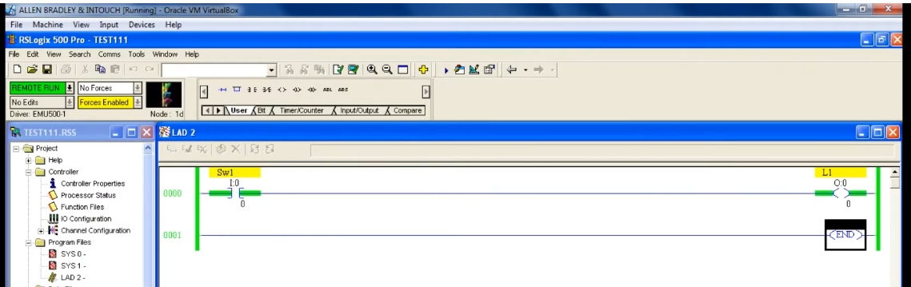
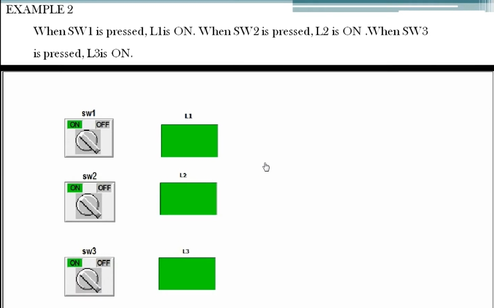
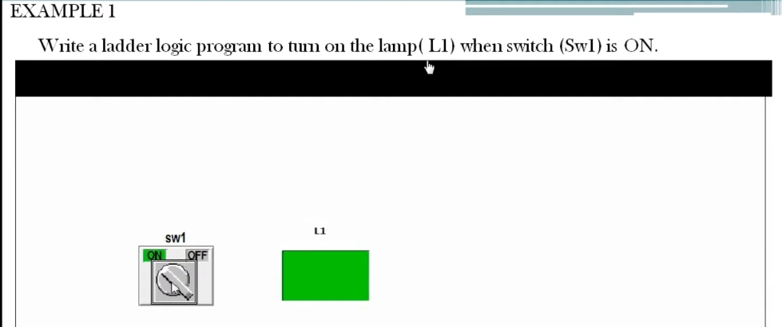

# PLC Training 19 – Allen-Bradley PLC 程式設計基礎（範例 1、2）
# PLC Training 19 – Allen-Bradley PLC Programming Basics (Examples 1 and 2)

> 來源 Source: https://www.youtube.com/watch?v=7-MWO_zmGas&list=PLI78ZBihrkE3nnGIj2WmHb_GoWjFlfFIu&index=19

**中文**：本課開始梯形圖邏輯的程式設計概念。前面已學過常開接點（NO）、常閉接點（NC）與輸出線圈，現在用這三個元件解決兩個練習題。

**English**: This lesson starts the programming concepts of ladder logic. We have already learned the NO contact, the NC contact and the output coil; now we use these three components to solve two exercises.

---

## 目錄 Contents

1. [範例 1：開關 ON 時點亮燈 Example 1: Turn On a Lamp When a Switch Is ON](#範例-1)
2. [範例 2：三個開關控制三盞燈 Example 2: Three Switches, Three Lamps](#範例-2)
3. [重點整理 Summary](#重點整理)

---

## 範例 1：開關 ON 時點亮燈 / Example 1: Turn On a Lamp When a Switch Is ON

### 題目 / Problem

**中文**：撰寫梯形圖程式，當開關 `Sw1` 為 ON 時，點亮燈 `L1`。

**English**: Write a ladder logic program to turn on the lamp (`L1`) when the switch (`Sw1`) is ON.

### 分析 / Analysis

**中文**
1. 寫程式之前，先判斷要使用**哪一種開關**，這一點非常重要。
2. 題目的動作是：開關打開時燈才亮，所以**控制權在我們手中**。
3. 因此應該使用**常開接點（NO）**，直接連到燈（輸出線圈）。
4. 題目沒有要求關閉燈，只要求開關 ON 時燈亮。

**English**
1. Before writing the program, decide **which kind of switch** is needed; this is very important.
2. In the problem the lamp turns on only when the switch is turned on, so **the control is in our hands**.
3. Therefore use a **normally open (NO) contact** connected directly to the lamp (output coil).
4. The problem does not ask for the lamp to be turned off; it only asks that the lamp turn on when the switch is ON.

### 做法 / Procedure

**中文**
1. 放入常開接點，位址 `I:0/0`，描述（Description）設為 `SW1`。
2. 放入輸出線圈，位址 `O:0/0`，描述設為 `L1`。
3. **Verify File** → **Download** → **Go Online** → **Run**。
4. 在接點上按右鍵 → **Toggle Bit**：`SW1` 變 ON，燈 `L1` 也 ON。

**English**
1. Place a normally open contact with address `I:0/0` and set its description to `SW1`.
2. Place an output coil with address `O:0/0` and set its description to `L1`.
3. **Verify File** → **Download** → **Go Online** → **Run**.
4. Right-click the contact → **Toggle Bit**: `SW1` turns ON and the lamp `L1` turns ON.

---

## 範例 2：三個開關控制三盞燈 / Example 2: Three Switches, Three Lamps

### 題目 / Problem

**中文**：按下 `SW1` 時 `L1` 為 ON；按下 `SW2` 時 `L2` 為 ON；按下 `SW3` 時 `L3` 為 ON。

**English**: When `SW1` is pressed, `L1` is ON. When `SW2` is pressed, `L2` is ON. When `SW3` is pressed, `L3` is ON.

### 分析 / Analysis

**中文**
- 共有 3 個輸入與 3 個輸出，每個輸入只對應自己的輸出。
- `SW1`、`SW2`、`SW3` 彼此沒有關聯，輸出之間也沒有關聯。
- 因此三組都要放在**不同的梯級**，並使用**不同的位址**。

**English**
- There are 3 inputs and 3 outputs, and each input controls only its own output.
- `SW1`, `SW2` and `SW3` are unrelated to each other, and the outputs are unrelated as well.
- Therefore each pair goes in a **separate rung** and uses **different addresses**.

### 做法 / Procedure

**中文**
1. 在範例 1 的基礎上再新增兩個梯級（共三個梯級）。
2. 輸入位址：`SW1` = `I:0/0`、`SW2` = `I:0/1`、`SW3` = `I:0/2`。可直接輸入位址，或用拖曳複製接點後再修改位址。
3. 輸出位址：`L1` = `O:0/0`、`L2` = `O:0/1`、`L3` = `O:0/2`。
4. 為每個接點與輸出修改描述（`SW1`～`SW3`、`L1`～`L3`）。
5. **Verify File** → **Download** → **Go Online** → **Run**。
6. 依序對各接點右鍵 → **Toggle Bit**，即可看到對應的燈一盞一盞亮起。

**English**
1. Starting from Example 1, add two more rungs (three rungs in total).
2. Input addresses: `SW1` = `I:0/0`, `SW2` = `I:0/1`, `SW3` = `I:0/2`. Type the addresses directly, or copy a contact by dragging and then change its address.
3. Output addresses: `L1` = `O:0/0`, `L2` = `O:0/1`, `L3` = `O:0/2`.
4. Edit the description of every contact and output (`SW1` to `SW3`, `L1` to `L3`).
5. **Verify File** → **Download** → **Go Online** → **Run**.
6. Right-click each contact in turn → **Toggle Bit**, and the matching lamps turn on one by one.

> **說明 Note**
> **中文**：此畫面為執行中、三個開關尚未切換的狀態。
> **English**: This screenshot shows the program running with none of the three switches toggled yet.

---

## 重點整理 / Summary

| 項目 Item | 範例 1 Example 1 | 範例 2 Example 2 |
|---|---|---|
| 輸入 Inputs | `SW1`（`I:0/0`） | `SW1`～`SW3`（`I:0/0`～`I:0/2`） |
| 輸出 Outputs | `L1`（`O:0/0`） | `L1`～`L3`（`O:0/0`～`O:0/2`） |
| 接點類型 Contact type | 常開 NO | 常開 NO |
| 梯級數 Rungs | 1 | 3（各自獨立 independent） |

**中文**
- 先決定開關類型：「我們操作時才動作」→ 常開接點。
- 彼此無關聯的輸入與輸出，各用一個梯級與不同位址。

**English**
- Decide the switch type first: "acts only when we operate it" → normally open contact.
- Unrelated inputs and outputs each get their own rung and different addresses.

---

## 下一單元預告 / Next Session

**中文**：下一課將繼續說明第 3 與第 4 個練習題。

**English**: The next session continues with the third and fourth exercises.
