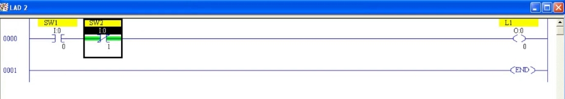
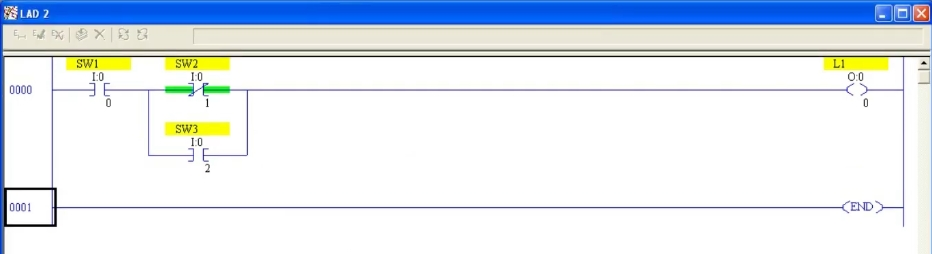
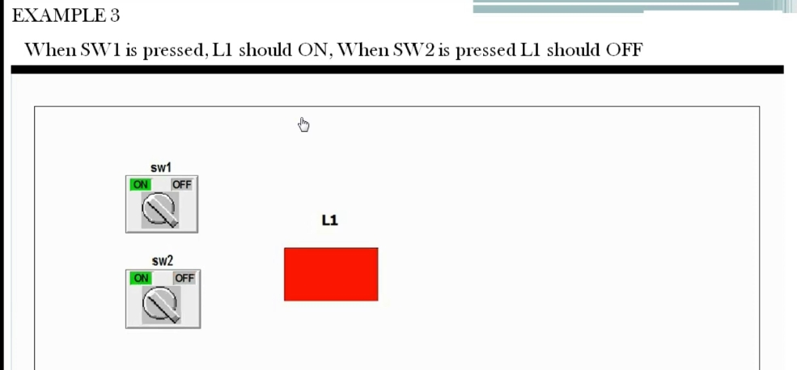
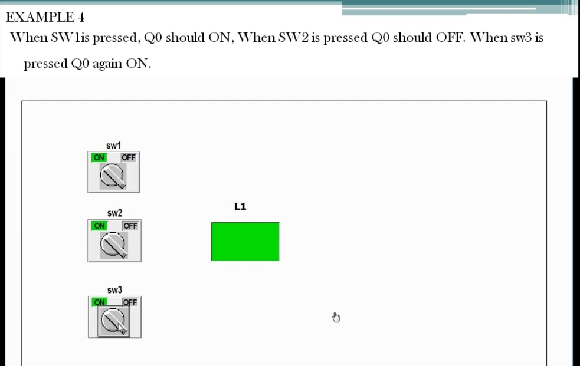

# PLC Training 20 – PLC 程式設計指令範例（範例 3、4）
# PLC Training 20 – Instruction Examples in PLC Programming (Examples 3 and 4) | RSLogix 500

> 來源 Source: https://www.youtube.com/watch?v=SW3JyYqcBnQ&list=PLI78ZBihrkE3nnGIj2WmHb_GoWjFlfFIu&index=20

**中文**：本課延續上一課，示範範例 3 與範例 4，學習如何「關閉輸出」以及「讓已關閉的輸出再次開啟」，並歸納出梯形圖邏輯的三個重要概念。

**English**: This lesson continues the previous one with Examples 3 and 4. You learn how to turn an output off and how to turn it on again after it has been turned off, and we summarize three important concepts of ladder logic.

---

## 目錄 Contents

1. [三個重要概念 Three Key Concepts](#三個概念)
2. [範例 3：SW2 關閉輸出 Example 3: SW2 Turns the Output Off](#範例-3)
3. [範例 4：SW3 再次開啟輸出 Example 4: SW3 Turns the Output On Again](#範例-4)
4. [重點整理 Summary](#重點整理)

---

## 三個重要概念 / Three Key Concepts

| # | 中文 | English |
|---|------|---------|
| 1 | 要**開啟**輸出時，輸入必須**直接**連到輸出，線路中不能有任何**干擾**（阻斷）。 | To turn an output **ON**, the input must be connected **directly** to the output, with no **disturbance** (break) in the line. |
| 2 | 要**關閉**輸出時，使用**常閉接點（NC）**來截斷線路。 | To turn an output **OFF**, use a **normally closed (NC) contact** to break the line. |
| 3 | 要讓已被截斷的輸出**再次開啟**，使用**並聯（Branch）接點**，繞過被截斷的地方。 | To turn an output **ON again** after the line was broken, use a **parallel (Branch) contact** to bypass the broken spot. |

> **口訣 Rule of thumb**
> **中文**：NO 接點用來「接通」，NC 接點用來「截斷」，並聯用來「再次接通」。
> **English**: NO makes the path, NC breaks the path, and a parallel branch makes the path again.

---

## 範例 3：SW2 關閉輸出 / Example 3: SW2 Turns the Output Off

### 題目 / Problem

**中文**：按下 `SW1` 時 `L1` 應為 ON；按下 `SW2` 時 `L1` 應為 OFF。

**English**: When `SW1` is pressed, `L1` should be ON. When `SW2` is pressed, `L1` should be OFF.

### 分析 / Analysis

**中文**
- 有兩個輸入（`SW1`、`SW2`）與一個輸出（`L1`）。
- 與前面不同：這次是**另一個開關**（`SW2`）把輸出關掉，而不是同一個開關。
- 依概念 1，`SW1` 先**直接**連到 `L1`。
- `SW2` 要能把線路截斷，所以要用 **NC 接點**（概念 2）。

**English**
- There are two inputs (`SW1`, `SW2`) and one output (`L1`).
- Unlike before, the output is turned off by **another switch** (`SW2`), not by the same switch.
- Following concept 1, `SW1` is connected **directly** to `L1`.
- `SW2` has to break the line, so it must be an **NC contact** (concept 2).

### 做法 / Procedure

**中文**
1. 梯級放入 `SW1`（`I:0/0`，NO）→ 輸出 `L1`（`O:0/0`）。
2. 接著在 `SW1` 之後串聯 `SW2`（位址 `I:0/1`）。
3. 若 `SW2` 用 **NO 接點**：`SW2` 預設是打開的，會擋住電流，`SW1` ON 時 `L1` 也不會亮（錯誤）。
4. 改用 **NC 接點**：預設閉合，不會干擾；`SW1` ON 時 `L1` 直接 ON。
5. **Verify File** → **Download** → **Go Online** → **Run**。
6. Toggle `SW1`：`L1` ON；再 Toggle `SW2`：NC 接點打開，`L1` OFF。

**English**
1. In the rung, place `SW1` (`I:0/0`, NO) → output `L1` (`O:0/0`).
2. Then place `SW2` (address `I:0/1`) in series after `SW1`.
3. If `SW2` is an **NO contact**: it is open by default and blocks the power flow, so `L1` does not turn on even when `SW1` is ON (wrong).
4. Use an **NC contact** instead: it is closed by default and causes no disturbance; with `SW1` ON, `L1` turns ON directly.
5. **Verify File** → **Download** → **Go Online** → **Run**.
6. Toggle `SW1`: `L1` is ON; then toggle `SW2`: the NC contact opens and `L1` turns OFF.

**中文**：結論：想**關閉**輸出，就使用**常閉接點**。NO 接點用來建立路徑（使輸出 ON），NC 接點用來截斷路徑（使輸出 OFF）。

**English**: Conclusion: to turn an output **off**, use a **normally closed contact**. An NO contact makes the path (output ON); an NC contact breaks the path (output OFF).

---

## 範例 4：SW3 再次開啟輸出 / Example 4: SW3 Turns the Output On Again

### 題目 / Problem

**中文**：按下 `SW1` 時 `Q0` 應為 ON；按下 `SW2` 時 `Q0` 應為 OFF；按下 `SW3` 時 `Q0` 再次為 ON。（影片動畫中的輸出名稱為 `L1`，描述可自行命名，故本例使用 `L1`。）

**English**: When `SW1` is pressed, `Q0` should be ON. When `SW2` is pressed, `Q0` should be OFF. When `SW3` is pressed, `Q0` should be ON again. (The animation in the video labels the output `L1`; any description name works, so this example uses `L1`.)

### 分析 / Analysis

**中文**
- 有三個輸入與一個輸出，而且輸入之間**有關聯**（不像範例 1、2 各自獨立）。
- `SW1` 開啟輸出（概念 1），`SW2` 以 NC 接點截斷線路（概念 2）。
- 要讓輸出**再次開啟**，需要找另一條路徑繞過被截斷的地方，就像開車遇到路障時改走另一條路。
- 線路是因為 `SW2` 而被截斷，所以要**在 `SW2` 的位置並聯**一個新的接點 `SW3`（概念 3）。

**English**
- There are three inputs and one output, and the inputs are **related** (unlike Examples 1 and 2, where each pair was independent).
- `SW1` turns the output on (concept 1), and `SW2` breaks the line as an NC contact (concept 2).
- To turn the output **on again** we need another path around the broken spot, like taking another road when you meet a roadblock.
- The line is broken at `SW2`, so a new contact `SW3` is placed **in parallel with `SW2`** (concept 3).

### 做法 / Procedure

**中文**
1. 先完成範例 3 的梯級：`SW1`（NO）→ `SW2`（NC）→ `L1`。
2. 點選 `SW2` 的位置，使用工具列的 **Branch（分支）** 指令。
3. 把分支拖曳放在 `SW2` 旁，形成一條**並聯路徑**。
4. 在分支上放入新的常開接點 `SW3`（位址 `I:0/2`）。
5. **Verify File** → **Download** → **Go Online** → **Run**。
6. 依序測試：
   - Toggle `SW1`：`L1` ON。
   - Toggle `SW2`：`L1` OFF（路徑被截斷）。
   - Toggle `SW3`：`L1` 再次 ON（電流走 `SW1` → `SW3` → `L1` 這條並聯路徑）。

**English**
1. First complete the rung from Example 3: `SW1` (NO) → `SW2` (NC) → `L1`.
2. Click the position of `SW2` and use the **Branch** instruction on the toolbar.
3. Drag the branch next to `SW2` to create a **parallel path**.
4. Place a new normally open contact `SW3` (address `I:0/2`) on the branch.
5. **Verify File** → **Download** → **Go Online** → **Run**.
6. Test in order:
   - Toggle `SW1`: `L1` is ON.
   - Toggle `SW2`: `L1` is OFF (the path is broken).
   - Toggle `SW3`: `L1` is ON again (power flows through `SW1` → `SW3` → `L1`, the parallel path).

**中文**：結論：要讓已被截斷的輸出再次開啟，在被截斷的位置**並聯**一個接點。

**English**: Conclusion: to turn on an output whose line was broken, place a contact **in parallel** at the broken spot.

---

## 重點整理 / Summary

| 範例 Example | 題目 Requirement | 梯形圖結構 Ladder structure | 用到的概念 Concepts |
|---|---|---|---|
| 3 | `SW1` 開、`SW2` 關 SW1 on, SW2 off | `SW1`(NO) 串聯 in series `SW2`(NC) → `L1` | 1、2 |
| 4 | `SW1` 開、`SW2` 關、`SW3` 再開 SW1 on, SW2 off, SW3 on again | `SW1`(NO) 串聯 in series [`SW2`(NC) 並聯 parallel `SW3`(NO)] → `L1` | 1、2、3 |

---

## 下一單元預告 / Next Session

**中文**：下一課將開始介紹**邏輯閘（Logic Gates）**，並為邏輯閘撰寫程式。

**English**: The next session starts the **logic gates** and shows how to write programs for them.
