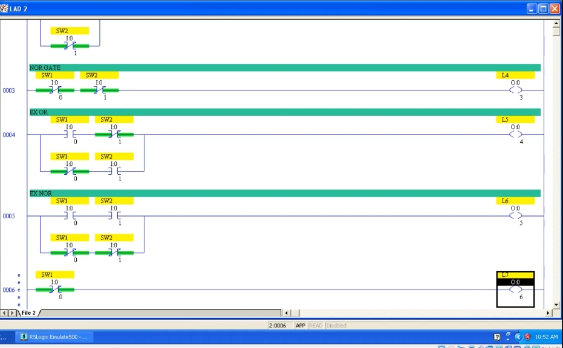
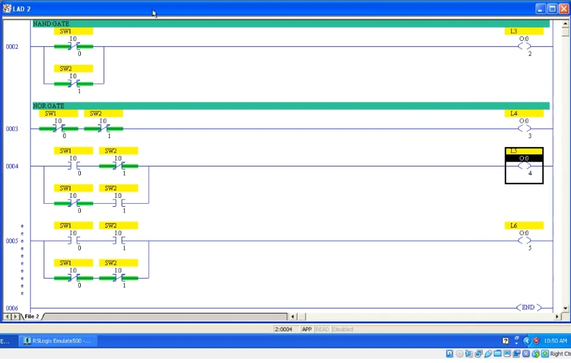
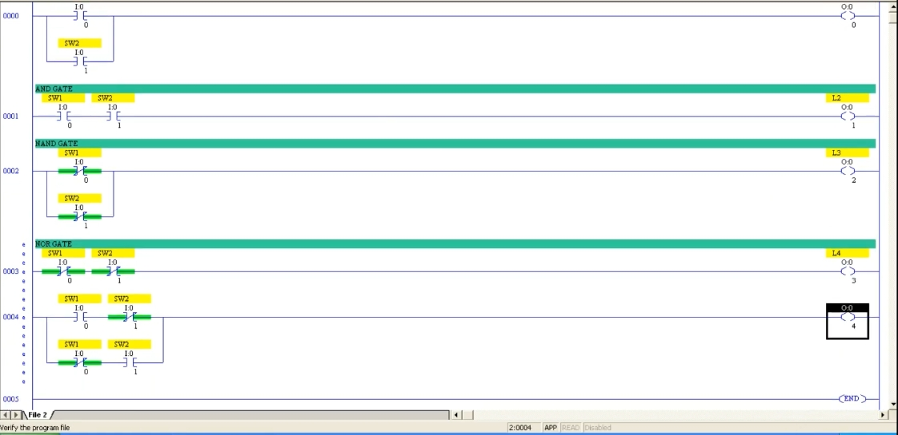
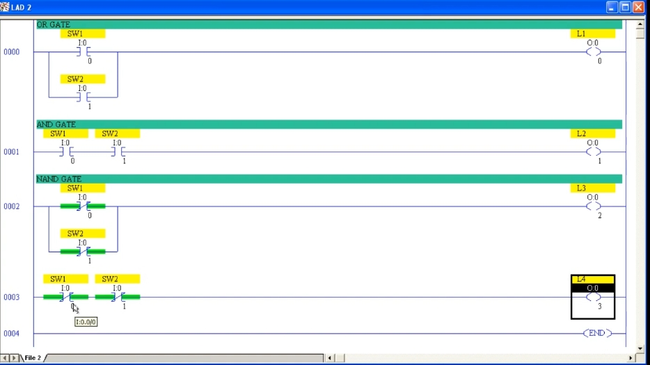
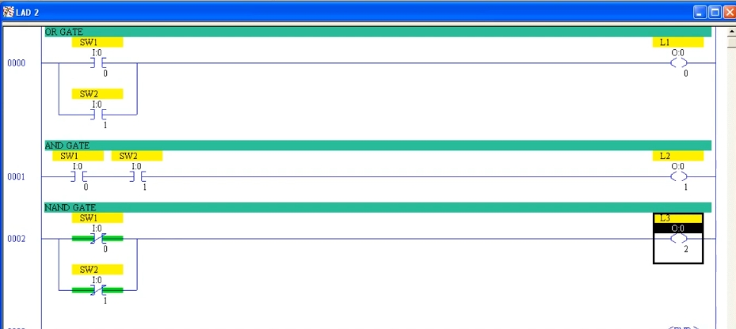
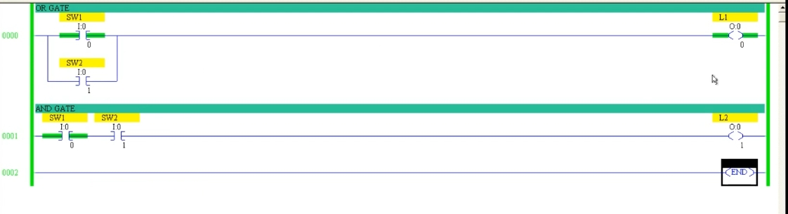
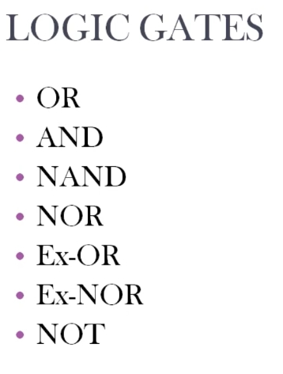
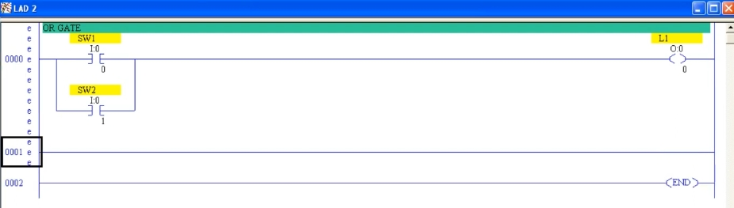

# PLC Training 21 – 使用 PLC 程式實現邏輯閘（Logic Gates）
# PLC Training 21 – Logic Gates using PLC Programming

> 來源 Source: https://www.youtube.com/watch?v=UOyEgX-j0iM&list=PLI78ZBihrkE3nnGIj2WmHb_GoWjFlfFIu&index=21

**中文**：本課用梯形圖邏輯實現七種邏輯閘：OR、AND、NAND、NOR、Ex-OR（XOR）、Ex-NOR（XNOR）與 NOT，並在模擬器中驗證真值表。

**English**: This lesson builds the seven logic gates in ladder logic: OR, AND, NAND, NOR, Ex-OR (XOR), Ex-NOR (XNOR) and NOT, and verifies the truth tables in the emulator.

---

## 目錄 Contents

1. [邏輯閘總覽 Logic Gates Overview](#總覽)
2. [OR 閘 OR Gate](#or)
3. [AND 閘 AND Gate](#and)
4. [NAND 閘 NAND Gate](#nand)
5. [NOR 閘 NOR Gate](#nor)
6. [Ex-OR 閘 Ex-OR (XOR) Gate](#xor)
7. [Ex-NOR 閘 Ex-NOR (XNOR) Gate](#xnor)
8. [NOT 閘 NOT Gate](#not)
9. [重點整理與真值表 Summary and Truth Table](#重點整理)

---

## 邏輯閘總覽 / Logic Gates Overview

**中文**
- 除了 NOT 閘外，其餘閘都有 **2 個輸入**與 **1 個輸出**；NOT 閘只有 **1 個輸入**與 **1 個輸出**。
- **OR**：任何一個輸入為 ON，輸出就為 ON。
- **AND**：兩個輸入都為 ON，輸出才為 ON。
- **NAND**：AND 的相反。**NOR**：OR 的相反。
- 本例中兩個輸入為 `SW1`（`I:0/0`）與 `SW2`（`I:0/1`）；每個閘使用**相同的輸入**，但各自有**不同的輸出**（`L1`～`L7`，即 `O:0/0`～`O:0/6`），這樣才能同時比較所有閘的結果。
- 每個梯級都以梯級註解（Rung Comment）標示閘的名稱。

**English**
- Except for the NOT gate, every gate has **2 inputs** and **1 output**; the NOT gate has **1 input** and **1 output**.
- **OR**: the output is ON when any one input is ON.
- **AND**: the output is ON only when both inputs are ON.
- **NAND**: the opposite of AND. **NOR**: the opposite of OR.
- In this example the two inputs are `SW1` (`I:0/0`) and `SW2` (`I:0/1`); every gate uses the **same inputs** but a **different output** (`L1` to `L7`, i.e. `O:0/0` to `O:0/6`), so the results of all gates can be compared at the same time.
- Each rung is labeled with a rung comment naming the gate.

---

## OR 閘 / OR Gate

**中文**
1. 新增梯級，註解設為 `OR GATE`。
2. OR 表示「任一為 ON 即輸出 ON」，所以要用**並聯**：`SW1`（NO）與 `SW2`（NO）並聯（用 Branch 加入第二個輸入），接到輸出 `L1`。

**English**
1. Add a rung with the comment `OR GATE`.
2. OR means "output ON when any input is ON", so use a **parallel** connection: `SW1` (NO) and `SW2` (NO) in parallel (add the second input with a Branch), connected to output `L1`.

---

## AND 閘 / AND Gate

**中文**
1. 新增梯級，註解設為 `AND GATE`。
2. AND 是「兩個都要 ON」的條件，所以要用**串聯**：`SW1`（NO）串聯 `SW2`（NO），接到不同的輸出 `L2`。
3. 輸入可以重複使用，但**輸出必須不同**。

**English**
1. Add a rung with the comment `AND GATE`.
2. AND is a "both must be ON" condition, so use a **series** connection: `SW1` (NO) in series with `SW2` (NO), connected to a different output `L2`.
3. Inputs can be reused, but **outputs must be different**.

**測試 Test**

**中文**：下載並 Run。`SW1`＝1、`SW2`＝0 時：OR 閘的 `L1` 為 ON，AND 閘的 `L2` 為 OFF。兩個都 ON 時，兩者皆 ON。關閉 `SW1` 後，AND 閘變 OFF，但 OR 閘仍因 `SW2` 而 ON。

**English**: Download and Run. With `SW1`=1 and `SW2`=0: OR output `L1` is ON and AND output `L2` is OFF. With both ON, both outputs are ON. After turning off `SW1`, the AND output turns OFF, but the OR output stays ON because of `SW2`.

---

## NAND 閘 / NAND Gate

**中文**
1. 新增梯級，註解 `NAND GATE`，輸出 `L3`。
2. NAND 是 AND 的相反，真值表為：`00 → 1`、`01 → 1`、`10 → 1`、`11 → 0`。
3. `00` 時輸出要為 ON，所以必須使用 **NC 接點**（NO 接點在未動作時無法導通）。
4. `01`、`10` 時輸出也要為 ON，所以兩個 NC 接點要**並聯**。
5. 結果：`SW1`（NC）並聯 `SW2`（NC）→ `L3`。只有兩個都 ON（`11`）時兩條路徑都被截斷，輸出 OFF。

**English**
1. Add a rung with the comment `NAND GATE` and output `L3`.
2. NAND is the opposite of AND; its truth table is: `00 → 1`, `01 → 1`, `10 → 1`, `11 → 0`.
3. The output must be ON at `00`, so **NC contacts** are required (an NO contact cannot conduct when it is not operated).
4. The output must also be ON at `01` and `10`, so the two NC contacts are connected **in parallel**.
5. Result: `SW1` (NC) in parallel with `SW2` (NC) → `L3`. Only when both are ON (`11`) are both paths broken and the output goes OFF.

---

## NOR 閘 / NOR Gate

**中文**
1. 新增梯級，註解 `NOR GATE`，輸出 `L4`。
2. NOR 是 OR 的相反，真值表為：`00 → 1`、`01 → 0`、`10 → 0`、`11 → 0`。
3. 只有 `00` 時輸出為 ON，所以兩個 **NC 接點串聯**：`SW1`（NC）串聯 `SW2`（NC）→ `L4`。
4. 只要任何一個開關 ON，路徑就被截斷，輸出 OFF。

**English**
1. Add a rung with the comment `NOR GATE` and output `L4`.
2. NOR is the opposite of OR; its truth table is: `00 → 1`, `01 → 0`, `10 → 0`, `11 → 0`.
3. The output is ON only at `00`, so two **NC contacts in series**: `SW1` (NC) in series with `SW2` (NC) → `L4`.
4. As soon as either switch is ON, the path is broken and the output turns OFF.

---

## Ex-OR（XOR）閘 / Ex-OR (XOR) Gate

**中文**
1. 新增梯級，註解 `EX OR`，輸出 `L5`。
2. XOR 真值表：`00 → 0`、`01 → 1`、`10 → 1`、`11 → 0`（兩個輸入**不同**時輸出 ON）。
3. 這需要「混合組合」：同一個輸入在兩處使用，一處為 NO、另一處為 NC。
4. 上方路徑：`SW1`（NO）串聯 `SW2`（NC）；下方並聯路徑：`SW1`（NC）串聯 `SW2`（NO）；兩條路徑接到 `L5`。
5. 因此 `10` 走上方路徑、`01` 走下方路徑，輸出 ON；`00` 與 `11` 兩條路徑都被截斷，輸出 OFF。

**English**
1. Add a rung with the comment `EX OR` and output `L5`.
2. XOR truth table: `00 → 0`, `01 → 1`, `10 → 1`, `11 → 0` (the output is ON when the two inputs **differ**).
3. This needs a "mixed combination": the same input is used in two places, as NO in one and as NC in the other.
4. Upper path: `SW1` (NO) in series with `SW2` (NC); lower parallel path: `SW1` (NC) in series with `SW2` (NO); both paths feed `L5`.
5. So `10` flows through the upper path and `01` through the lower path, turning the output ON; at `00` and `11` both paths are broken and the output is OFF.

---

## Ex-NOR（XNOR）閘 / Ex-NOR (XNOR) Gate

**中文**
1. 新增梯級，註解 `EX NOR`，輸出 `L6`。
2. XNOR 是 XOR 的相反，真值表：`00 → 1`、`01 → 0`、`10 → 0`、`11 → 1`（兩個輸入**相同**時輸出 ON）。
3. 上方路徑：`SW1`（NO）串聯 `SW2`（NO）；下方並聯路徑：`SW1`（NC）串聯 `SW2`（NC）；兩條路徑接到 `L6`。
4. `00` 走下方（兩個 NC）、`11` 走上方（兩個 NO），輸出 ON；`01`、`10` 兩條路徑都不通，輸出 OFF。

**English**
1. Add a rung with the comment `EX NOR` and output `L6`.
2. XNOR is the opposite of XOR; truth table: `00 → 1`, `01 → 0`, `10 → 0`, `11 → 1` (the output is ON when the two inputs are the **same**).
3. Upper path: `SW1` (NO) in series with `SW2` (NO); lower parallel path: `SW1` (NC) in series with `SW2` (NC); both paths feed `L6`.
4. `00` flows through the lower path (two NCs) and `11` through the upper path (two NOs), turning the output ON; at `01` and `10` neither path conducts and the output is OFF.

> **說明 Note**
> **中文**：XOR、XNOR 看起來用了四個接點，但這是輸入 `SW1`、`SW2` 各在不同位置重複使用，並非有四個開關。這就是梯形圖邏輯：同一輸入可以在多處使用，在某處是 NC、另一處是 NO。
> **English**: XOR and XNOR look like they use four contacts, but they are just the inputs `SW1` and `SW2` reused in different places, not four switches. This is ladder logic: the same input can be used in several places, as NC in one and NO in another.

---

## NOT 閘 / NOT Gate

**中文**
1. 新增梯級，輸出 `L7`（`O:0/6`）。
2. NOT 閘只有一個輸入：輸入為 0 時輸出為 1，輸入為 1 時輸出為 0。
3. 沒有碰開關（輸入為 0）時輸出就要為 ON，所以使用 **NC 接點**：`SW1`（NC）→ `L7`。

**English**
1. Add a rung with output `L7` (`O:0/6`).
2. The NOT gate has only one input: input 0 gives output 1, and input 1 gives output 0.
3. The output must be ON when the switch is not touched (input 0), so use an **NC contact**: `SW1` (NC) → `L7`.

---

## 重點整理與真值表 / Summary and Truth Table

| SW1 | SW2 | OR `L1` | AND `L2` | NAND `L3` | NOR `L4` | XOR `L5` | XNOR `L6` | NOT（SW1）`L7` |
|:---:|:---:|:---:|:---:|:---:|:---:|:---:|:---:|:---:|
| 0 | 0 | 0 | 0 | 1 | 1 | 0 | 1 | 1 |
| 0 | 1 | 1 | 0 | 1 | 0 | 1 | 0 | 1 |
| 1 | 0 | 1 | 0 | 1 | 0 | 1 | 0 | 0 |
| 1 | 1 | 1 | 1 | 0 | 0 | 0 | 1 | 0 |

| 閘 Gate | 梯形圖結構 Ladder structure |
|---|---|
| OR | `SW1`(NO) **並聯 parallel** `SW2`(NO) |
| AND | `SW1`(NO) **串聯 series** `SW2`(NO) |
| NAND | `SW1`(NC) **並聯 parallel** `SW2`(NC) |
| NOR | `SW1`(NC) **串聯 series** `SW2`(NC) |
| XOR | [`SW1`(NO) 串 series `SW2`(NC)] 並聯 parallel [`SW1`(NC) 串 series `SW2`(NO)] |
| XNOR | [`SW1`(NO) 串 series `SW2`(NO)] 並聯 parallel [`SW1`(NC) 串 series `SW2`(NC)] |
| NOT | `SW1`(NC) |

**中文**
- 先寫出真值表，再用**同一套邏輯**滿足全部四種輸入組合，不要為不同組合寫不同的邏輯。
- 並聯＝OR 的概念，串聯＝AND 的概念。
- 輸出在 `00` 時需要為 ON 的閘（NAND、NOR、XNOR、NOT），必須使用 NC 接點。
- 如果少用了某些接點（例如 XOR、XNOR 只用兩個接點），就只能滿足其中兩種組合。

**English**
- Write the truth table first, then use **one logic** that satisfies all four input combinations; do not write different logic for different combinations.
- Parallel = the OR idea; series = the AND idea.
- Gates whose output must be ON at `00` (NAND, NOR, XNOR, NOT) must use NC contacts.
- If you leave out some of the contacts (for example, using only two contacts for XOR or XNOR), you can only satisfy two of the four combinations.

---

## 下一單元預告 / Next Session

**中文**：下一課將介紹另一個主題。

**English**: The next session covers another topic.
