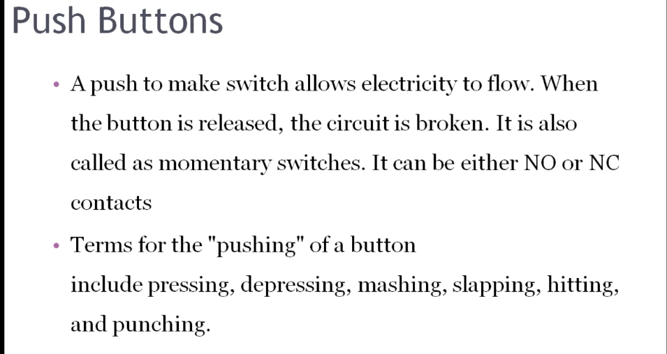
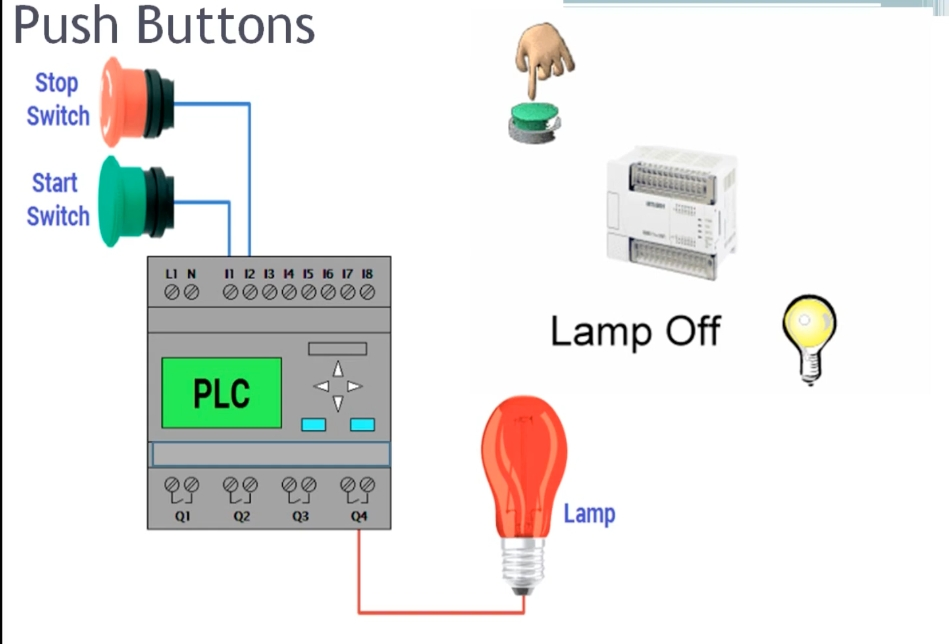
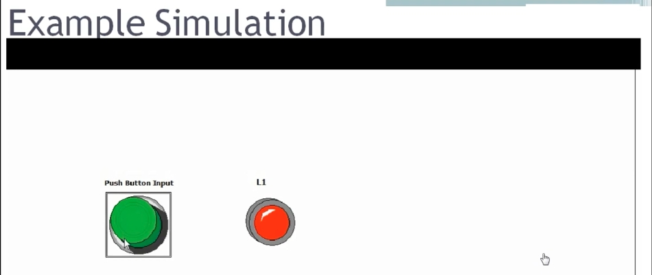
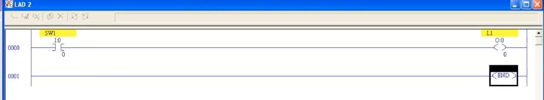

# PLC Training 22 – Push Button Ladder Logic Examples in PLC
# PLC 教學 22 – 按鈕（Push Button）梯形圖範例

> Source video 影片來源：<https://www.youtube.com/watch?v=U_UnXg9Xmng&list=PLI78ZBihrkE3nnGIj2WmHb_GoWjFlfFIu&index=22>
>
> Platform 平台：Allen-Bradley (Rockwell) ladder logic 梯形圖

---

## 1. Overview / 概述

**EN:** In this session we learn about **push buttons**. A push button is a switch used as one of the most common **digital inputs** in industrial automation. We compare it with the ordinary (maintained) switch used in earlier ladder logic examples, then build a simple one-input / one-output program.

**中文：** 本節介紹 **按鈕（Push Button）**。按鈕是工業自動化中最常見的**數位輸入**之一。我們會將它與先前範例中使用的一般（自鎖式）開關比較，並建立一個簡單的一輸入／一輸出程式。

---

## 2. Switch vs. Push Button / 開關與按鈕的差異

| | Switch 開關 | Push Button 按鈕 |
|---|---|---|
| Behavior 行為 | Stays ON once turned on; output stays on continuously 打開後持續保持導通，輸出持續為 ON | **Momentary**: contact is made only while pressed 僅在按下時接通 |
| On release 放開後 | Remains in its position 維持原位置 | Contact breaks immediately 立即斷開 |
| Industrial use 工業應用 | Less common 較少使用 | Very common: easy to operate, resistant to corrosion 非常普遍：操作容易、不易腐蝕 |

**EN:** A push button is a *momentary switch*: while you press it, the contact is made; when you release your finger, the contact breaks.

**中文：** 按鈕是一種*瞬動開關*：按下時接點接通，手指放開時接點即斷開。

### Real-world examples / 生活與工業實例

- **EN:** Doorbell at home; emergency-stop buttons on metro platforms; the stop button in the middle of an escalator; start/stop buttons for a motor; the small reset button on a microcontroller board.
- **中文：** 家用門鈴；捷運月台的緊急停止按鈕；電扶梯中間的緊急停止鈕；馬達的啟動／停止按鈕；微控制器開發板上的小型重置（Reset）按鈕。

---

## 3. Definition / 定義



**EN:**
- A *push-to-make* switch allows electricity to flow while pressed. When the button is released, the circuit is broken. It is also called a **momentary switch**.
- It can have either **NO (normally open)** or **NC (normally closed)** contacts.
- Terms for "pushing" a button include pressing, depressing, mashing, slapping, hitting, and punching.

**中文：**
- *常開型（push-to-make）*按鈕在被按下時讓電流通過；放開後電路即斷開，也稱為**瞬動開關（momentary switch）**。
- 接點可以是 **NO（常開）** 或 **NC（常閉）**。
- 「按」按鈕的說法有很多：press、depress、mash、slap、hit、punch 等。

---

## 4. Animation Example: Start / Stop Buttons and a Lamp / 動畫範例：啟動／停止按鈕與燈



**EN:** The figure shows a **Start** (green) and a **Stop** (red, emergency-stop style) push button wired to the PLC inputs (I1, I2 …), and a lamp wired to an output terminal (Q4). The lamp is lit **only while the finger is pressing the button**; as soon as the button is released, the lamp goes off. This is "push to ON, release to OFF" – **momentary ON**.

**中文：** 圖中綠色**啟動（Start）**按鈕與紅色**停止（Stop）**按鈕（緊急停止型）接到 PLC 的輸入端（I1、I2 …），燈接在輸出端（Q4）。**只有在手指按住按鈕時燈才會亮**，一放開燈就熄滅。這就是「按下為 ON、放開為 OFF」——**瞬動 ON**。

---

## 5. Simulation / 模擬



**EN:** In the simulation there is one push button and one lamp (L1).
- Not pressed → lamp is **red** (value 0, OFF).
- Pressed → lamp turns **green** (value 1, ON).
- Released → it returns to red (0).

**中文：** 模擬畫面中有一個按鈕與一個燈（L1）。
- 未按下 → 燈為**紅色**（值 0，OFF）。
- 按下 → 燈變為**綠色**（值 1，ON）。
- 放開 → 回到紅色（0）。

---

## 6. Ladder Logic in Allen-Bradley / Allen-Bradley 梯形圖實作



**EN:**

In Allen-Bradley there is **no special contact for a push button**. All digital inputs use the same single instruction: the **normally open contact (XIC – Examine If Closed)**.

Steps:
1. Create a new ladder page (rung 0000).
2. Place one **input contact** and name it `SW1` (input address shown in the figure as `I:0/0`).
3. Place one **output coil** and name it `L1` (output address `O:0/0`).
4. Download to the processor and switch to **Run** mode.

Result:
- While `SW1` is held on, the output `L1` is **ON**.
- When you turn `SW1` off (release the button), `L1` goes **OFF** immediately.

If `SW1` were a *maintained switch*, the output would stay on continuously; with a *push button*, it follows the button only while it is pressed. That is the push-button concept.

**中文：**

在 Allen-Bradley 中，**沒有專用的按鈕接點**。所有數位輸入都使用同一個指令：**常開接點（XIC – Examine If Closed）**。

步驟：
1. 建立新的梯形圖頁面（梯級 0000）。
2. 放置一個**輸入接點**，命名為 `SW1`（圖中輸入位址為 `I:0/0`）。
3. 放置一個**輸出線圈**，命名為 `L1`（輸出位址為 `O:0/0`）。
4. 下載程式至處理器並切換到**執行（Run）**模式。

結果：
- 按住 `SW1` 時，輸出 `L1` 為 **ON**。
- 關閉 `SW1`（放開按鈕）時，`L1` 立即變為 **OFF**。

若 `SW1` 是*自鎖式開關*，輸出會持續保持 ON；若是*按鈕*，輸出只在按住期間跟隨。這就是按鈕的概念。

### Ladder diagram (text form) / 梯形圖（文字示意）

```
        SW1                                   L1
0000 ───┤ ├──────────────────────────────────( )───
        I:0/0                                 O:0/0

0001 ──────────────────────────────────────[ END ]
```

---

## 7. Key Takeaways / 重點整理

| # | English | 中文 |
|---|---|---|
| 1 | A push button is a momentary switch. | 按鈕是瞬動開關。 |
| 2 | Contact is made only while pressed; it breaks on release. | 僅在按下時接通，放開即斷開。 |
| 3 | Can be NO or NC. | 可為常開（NO）或常閉（NC）。 |
| 4 | Widely used in industry: easy to operate, corrosion-resistant. | 工業上廣泛使用：操作容易、不易腐蝕。 |
| 5 | Allen-Bradley uses a single contact (XIC) for all digital inputs. | Allen-Bradley 所有數位輸入皆使用單一接點（XIC）。 |
| 6 | Output follows the button only while it is held. | 輸出僅在按住期間跟隨按鈕。 |

---

## 8. Looking Ahead / 下一節預告

**EN:** In real industry, nobody holds a start button down continuously to keep a motor running. At home, you press **Start** once, release it, and the motor keeps running until **Stop** is pressed. How is this achieved? There must be logic behind it (a latching / seal-in circuit) – the topic of the **next session**.

**中文：** 在實際工業中，沒有人會一直按住啟動按鈕讓馬達運轉。在家中，按一下**啟動**後放開，馬達仍持續運轉，直到按下**停止**。這是如何做到的？背後需要邏輯設計（自保持／自鎖電路）——這是**下一節**的主題。

---

## Glossary / 詞彙表

| English | 中文 |
|---|---|
| Push button | 按鈕 |
| Momentary switch | 瞬動開關 |
| Normally open (NO) | 常開 |
| Normally closed (NC) | 常閉 |
| Digital input | 數位輸入 |
| Output coil | 輸出線圈 |
| Ladder logic | 梯形圖 |
| Emergency stop | 緊急停止 |
| Rung | 梯級 |
| Latching / seal-in | 自保持／自鎖 |

---

## Notes / 備註

- **EN:** The transcript was auto-generated and contained recognition errors; it has been cleaned up (e.g., "calling number" → doorbell, "research push button" → reset push button, "logic dates" → ladder logic). Address labels in the ladder image are read from a low-resolution screenshot.
- **中文：** 原始逐字稿為自動語音辨識產生，含有辨識錯誤，已整理修正（例如 "calling number" → 門鈴、"research push button" → 重置按鈕、"logic dates" → 梯形圖）。梯形圖中的位址標示取自低解析度截圖。

## Directory / 目錄結構

```
plc_training_22_push_button.md
images/
├── ab22_01.jpg   # Definition slide 定義投影片
├── ab22_02.jpg   # Start/Stop wiring 啟動/停止接線
├── ab22_03.jpg   # Simulation 模擬
└── ab22_04.jpg   # Ladder logic 梯形圖
```
