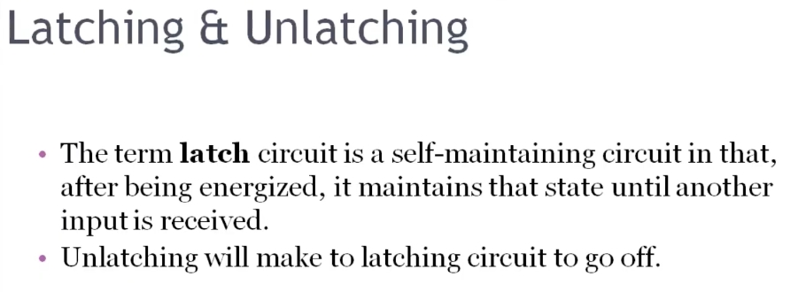
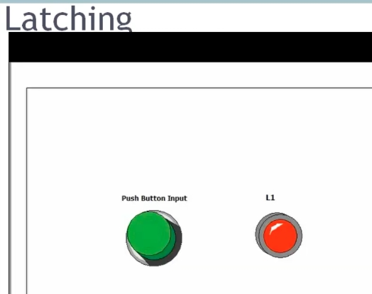
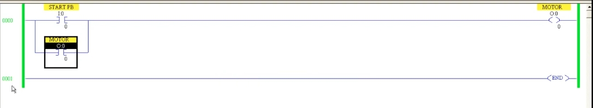
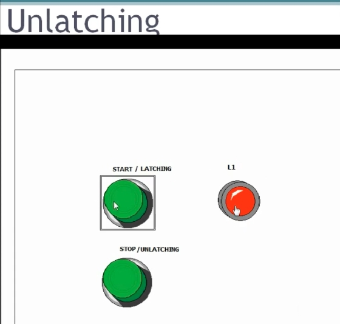
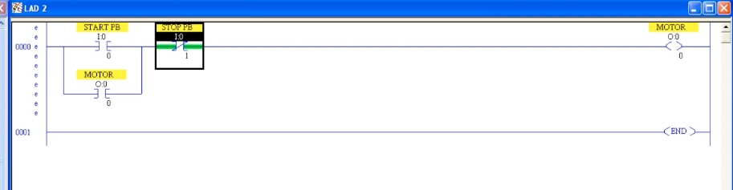
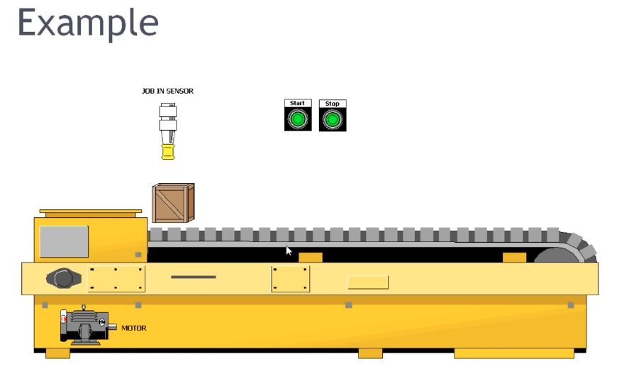

# PLC Training 23 – Latching Ladder Logic PLC Programming
# PLC 教學 23 – 自保持（閂鎖）梯形圖程式設計

> Source video 影片來源：<https://www.youtube.com/watch?v=xT3LLTyIXwg&list=PLI78ZBihrkE3nnGIj2WmHb_GoWjFlfFIu&index=23>
>
> Platform 平台：Allen-Bradley (Rockwell) ladder logic 梯形圖

---

## 1. Review & Problem / 回顧與問題

**EN:** In the previous session we saw that a push button is a **momentary** switch. Imagine a motor controlled by a Start push button: you press it and the motor turns on, but the moment you release it, the motor turns off. This should not happen. We want the motor to **stay ON after a single press**, even after the button is released. Industry uses push buttons far more than maintained switches, so how is the output kept on? The answer is the **latching** concept.

**中文：** 上一節我們學到按鈕是**瞬動**開關。假設用 Start 按鈕控制馬達：按下時馬達運轉，但一放開馬達就停止。這是不希望發生的情況。我們希望**按一下就持續運轉**，即使放開按鈕也不會停。工業上使用按鈕遠多於自鎖開關，那麼如何讓輸出保持 ON？答案就是**自保持（Latching）**概念。

---

## 2. Latching & Unlatching / 自保持與解除自保持



**EN:**
- A **latch** circuit is a *self-maintaining* circuit: after being energized, it maintains that state until another input is received.
- **Unlatching** makes the latched circuit go OFF.
- Example: a motor start button uses latching to keep running. When a tank is full, you press a **Stop** button to turn the motor off – that is **unlatching**.

**中文：**
- **自保持（latch）**電路是一種*自我維持*的電路：通電後會保持該狀態，直到收到另一個輸入為止。
- **解除自保持（unlatching）**會使已自保持的電路斷開（OFF）。
- 例：馬達啟動按鈕利用自保持持續運轉；水塔注滿後，按下 **Stop** 按鈕關閉馬達，這就是**解除自保持**。

---

## 3. Latching Animation / 自保持動畫



| | Momentary push button 瞬動按鈕 (Lesson 22) | Latching 自保持 (this lesson) |
|---|---|---|
| Press 按下 | Lamp ON 燈亮 | Lamp ON 燈亮 |
| Release 放開 | Lamp OFF 燈滅 | **Lamp stays ON 燈保持亮** |

**EN:** When the button is pressed once, the lamp stays on even after the finger is released.

**中文：** 按一下按鈕後，即使手指放開，燈仍保持亮著。

---

## 4. Building the Latching Circuit / 建立自保持電路



**EN:** In ladder logic, latching means connecting a **parallel contact** across the input (the momentary push button).

Rules:
1. The parallel contact must be a **normally open (NO)** contact, *not* normally closed.
2. Its address must be the **output address** (here the `MOTOR` output `O:0/0`), not an input address.

**Why the output address?** When you press `START PB`, the output `MOTOR` turns on. Because the parallel contact shares the **same address** as the output, that contact closes too. When you release the push button, power still flows through this parallel path, so the output stays ON. The output "holds itself" – this is also called a **seal-in** circuit.

**中文：** 在梯形圖中，自保持就是在輸入（瞬動按鈕）上**並聯一個接點**。

規則：
1. 並聯接點必須是**常開（NO）**接點，**不能**是常閉。
2. 位址必須使用**輸出位址**（此處為 `MOTOR` 輸出 `O:0/0`），而不是輸入位址。

**為什麼用輸出位址？** 按下 `START PB` 時，輸出 `MOTOR` 變為 ON；由於並聯接點與輸出使用**相同位址**，該接點也隨之閉合。放開按鈕後，電流仍可經由這條並聯路徑流通，輸出因此保持 ON。輸出「自己維持自己」，也稱為**自鎖（seal-in）**電路。

### Text diagram / 文字示意

```
      START PB                                 MOTOR
0000 ───┤ ├──┬─────────────────────────────────( )───
        I:0/0│                                  O:0/0
      MOTOR  │
 ───────┤ ├──┘
        O:0/0
0001 ──────────────────────────────────────[ END ]
```

### Demonstration steps / 示範步驟

**EN:** Download → Run → turn `START PB` ON: the output turns on. Turn `START PB` OFF (like releasing a push button): the output **remains ON** because of the parallel path. The only way to stop it now is to go offline – which is not acceptable in practice. Hence we need **unlatching**.

**中文：** 下載 → 執行 → 將 `START PB` 打開：輸出變為 ON。再將 `START PB` 關閉（相當於放開按鈕）：輸出**仍保持 ON**，因為有並聯路徑。此時唯一能停止的方法是離線，這在實務上不可接受，因此需要**解除自保持**。

---

## 5. Unlatching with a Stop Button / 以停止按鈕解除自保持



**EN:** The animation has a **START / LATCHING** button and a **STOP / UNLATCHING** button. Press Start → lamp L1 turns on and stays on. Press Stop → lamp L1 turns off.

**中文：** 動畫中有 **START / LATCHING**（啟動／自保持）按鈕與 **STOP / UNLATCHING**（停止／解除自保持）按鈕。按 Start → 燈 L1 亮起並保持；按 Stop → 燈 L1 熄滅。



**EN:** Add a second input, `STOP PB`, **in series** after the latching branch (address `I:0/1`). It must be a **normally closed (NC / XIC with NC wiring logic)** contact: whenever you want to turn something off, use a normally closed contact. In the figure the ladder shows `START PB` (`I:0/0`) in parallel with `MOTOR` (`O:0/0`), followed by `STOP PB` (`I:0/1`), then the `MOTOR` output coil.

Behavior:
- Press `START PB` → motor ON and latched.
- Press `STOP PB` → the NC contact opens, power flow is cut, the motor turns OFF and the latch is released.

Why a *second* input? The same start button cannot unlatch the circuit, because once latched, the parallel path keeps the output on regardless of the start button. The stop contact must be placed **after** the latching branch so it can break the rung.

**中文：** 在自保持分支**之後串聯**第二個輸入 `STOP PB`（位址 `I:0/1`），且必須是**常閉（NC）**接點：凡是要「關閉」某個東西，就使用常閉接點。圖中梯形圖為：`START PB`（`I:0/0`）與 `MOTOR`（`O:0/0`）並聯，後面串接 `STOP PB`（`I:0/1`），最後接 `MOTOR` 輸出線圈。

動作：
- 按下 `START PB` → 馬達 ON 並自保持。
- 按下 `STOP PB` → 常閉接點斷開，電流中斷，馬達 OFF，自保持解除。

為什麼需要*第二個*輸入？因為一旦自保持，並聯路徑會讓輸出持續導通，與啟動按鈕無關，所以無法用同一個按鈕解除。停止接點必須放在自保持分支**之後**，才能切斷整個梯級。

### Text diagram / 文字示意

```
      START PB            STOP PB                 MOTOR
0000 ───┤ ├──┬───────────────┤/├─────────────────( )───
        I:0/0│               I:0/1                O:0/0
      MOTOR  │
 ───────┤ ├──┘
        O:0/0
0001 ──────────────────────────────────────[ END ]
```

---

## 6. Application: Conveyor with Job-In Sensor / 應用：具進料感測器的輸送帶



**EN:** Latching is not only for Start/Stop push buttons; it also works with **sensors**.

Scenario (e.g., a bag placed on a conveyor at a metro security check):
- A **JOB IN SENSOR** detects an object and signals the conveyor motor to run.
- **Without latching:** as soon as the object moves away from the sensor, the sensor signal drops to 0 and the motor stops. The object may be left stuck partway along the belt – poor programming.
- **With latching:** connect a parallel NO contact (the motor's own output address) across the sensor input. Once the sensor triggers the motor, the motor keeps running even after the object leaves the sensor's range.
- To stop the motor, add an **unlatching input**, such as a second sensor at the end of the belt that detects the object has arrived (or a Stop button).

**中文：** 自保持不僅用於啟動／停止按鈕，也可用於**感測器**。

情境（例如捷運安檢口把行李放上輸送帶）：
- **進料感測器（JOB IN SENSOR）**偵測到物體後，通知輸送帶馬達運轉。
- **沒有自保持：** 物體一離開感測器，感測訊號變為 0，馬達就停止，物體可能卡在輸送帶中途——這是不良的程式設計。
- **加入自保持：** 在感測器輸入上並聯一個常開接點（使用馬達本身的輸出位址）。感測器觸發馬達後，即使物體離開感測範圍，馬達仍持續運轉。
- 要停止馬達，需加入**解除自保持的輸入**，例如輸送帶末端的第二個感測器（偵測物體已到達）或一個停止按鈕。

---

## 7. Key Takeaways / 重點整理

| # | English | 中文 |
|---|---|---|
| 1 | Latching keeps an output ON after a momentary input. | 自保持讓輸出在瞬動輸入消失後仍保持 ON。 |
| 2 | Add a parallel **NO** contact across the input. | 在輸入上並聯一個**常開**接點。 |
| 3 | The parallel contact uses the **output address**. | 並聯接點使用**輸出位址**。 |
| 4 | Unlatch with a separate input in series, using an **NC** contact. | 以串聯的獨立輸入、使用**常閉**接點來解除自保持。 |
| 5 | Latching works with push buttons *and* sensors. | 自保持適用於按鈕*與*感測器。 |
| 6 | Also called a seal-in (self-holding) circuit. | 亦稱自鎖（seal-in）電路。 |

---

## Glossary / 詞彙表

| English | 中文 |
|---|---|
| Latching | 自保持／閂鎖 |
| Unlatching | 解除自保持 |
| Seal-in circuit | 自鎖電路 |
| Self-maintaining circuit | 自我維持電路 |
| Parallel contact | 並聯接點 |
| Normally open (NO) | 常開 |
| Normally closed (NC) | 常閉 |
| Momentary | 瞬動 |
| Sensor | 感測器 |
| Conveyor | 輸送帶 |
| Motor | 馬達 |
| Output address | 輸出位址 |

---

## Notes / 備註

- **EN:** The transcript was auto-generated and contained recognition errors (e.g., "matching concept" → latching concept, "stock push button" → stop push button, "job boat sensor" → job-in sensor, a stray unrelated advertisement sentence removed). Image-to-section mapping follows the lesson flow; addresses (`I:0/0`, `I:0/1`, `O:0/0`) are read from low-resolution screenshots, so please verify against the original.
- **中文：** 原始逐字稿為語音辨識產生，含有錯誤（如 "matching concept" → 自保持概念、"stock push button" → 停止按鈕、"job boat sensor" → 進料感測器），並刪除了一句無關的廣告雜訊。圖片依課程流程對應各章節；位址（`I:0/0`、`I:0/1`、`O:0/0`）取自低解析度截圖，請與原圖核對。

## Directory / 目錄結構

```
plc_training_23_latching.md
images/
├── ab23_01.jpg   # Latching & Unlatching definition 定義投影片
├── ab23_02.jpg   # Latching simulation 自保持模擬
├── ab23_03.jpg   # Latching ladder (parallel contact) 自保持梯形圖
├── ab23_04.jpg   # Unlatching simulation 解除自保持模擬
├── ab23_05.jpg   # Start/Stop ladder 啟動/停止梯形圖
└── ab23_06.jpg   # Conveyor example 輸送帶範例
```
