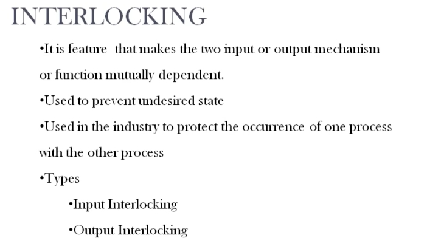
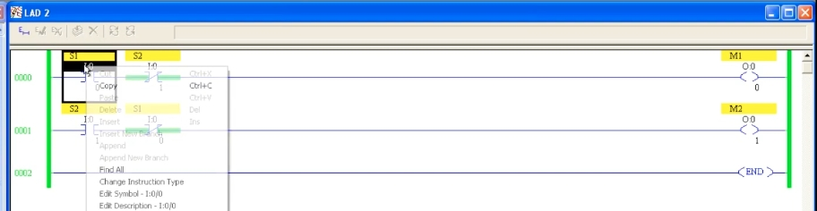

# PLC Training 24 – Interlocking in PLC
# PLC 教學 24 – PLC 互鎖（Interlocking）

> Source video 影片來源：<https://www.youtube.com/watch?v=csTDm0IPb_k&list=PLI78ZBihrkE3nnGIj2WmHb_GoWjFlfFIu&index=24>
>
> Platform 平台：Allen-Bradley (Rockwell) ladder logic 梯形圖

---

## 1. What Is Interlocking? / 什麼是互鎖？



**EN:**
- Interlocking is a feature that makes two **input**, **output** or **function** mechanisms **mutually dependent**.
- It is used to **prevent undesired states**.
- In industry it is used to protect one process from occurring while another process is happening.
- Types: **Input interlocking** and **Output interlocking**.

**中文：**
- 互鎖是一種讓兩個**輸入**、**輸出**或**功能**機制**相互依賴**的功能。
- 用來**防止不希望出現的狀態**。
- 在工業上，用於避免某一製程在另一製程進行時同時發生。
- 類型：**輸入互鎖**與**輸出互鎖**。

---

## 2. Examples / 範例

### Example 1: Two motors / 範例一：兩台馬達

**EN:** Two motors each have their own switch. If Motor 1 is running, Motor 2 must **not** be able to start; and if Motor 2 is running, Motor 1 must not start.

**中文：** 兩台馬達各有獨立開關。若馬達 1 正在運轉，馬達 2 **不能**啟動；反之，若馬達 2 正在運轉，馬達 1 也不能啟動。

### Example 2: Quiz-show buzzer / 範例二：搶答器

**EN:** On a quiz show, when the host asks a question, the first team to press its buzzer makes a light or sound come on. Once the first buzzer is pressed, later presses by the second or third team have **no effect** – "first in, first response". Their buzzers can still be pressed, but their outputs are disabled. Each team's output depends on the others not having responded.

**中文：** 在益智問答節目中，主持人提問後，第一個按下搶答器的隊伍會觸發燈或聲音。第一個搶答器被按下後，第二、第三隊再按也**沒有作用**——「先按先得」。他們仍可按下按鈕，但其輸出被禁止。每一隊的輸出都取決於其他隊尚未搶答。

### Example 3: Automatic door / 範例三：自動門

**EN:** In an automatic door, an object-detecting sensor signals that someone is nearby. While the sensor is active, the **closing motor must be OFF** – even if the door has begun to close, it should stop and open. The closing motor is therefore *dependent* on the object sensor.

**中文：** 自動門中，物體偵測感測器表示附近有人。感測器動作時，**關門馬達必須為 OFF**——即使門已開始關閉，也應停止並重新開啟。因此關門馬達*依賴*於物體感測器。

---

## 3. Input Interlocking / 輸入互鎖



**EN:** In the two-motor example, `S1` is the switch for Motor 1 (`M1`) and `S2` is the switch for Motor 2 (`M2`).

- **Rung 0000:** `S1` (`I:0/0`, normally open) in series with `S2` (`I:0/1`, **normally closed**) → output `M1` (`O:0/0`).
- **Rung 0001:** `S2` (`I:0/1`, normally open) in series with `S1` (`I:0/0`, **normally closed**) → output `M2` (`O:0/1`).

Each rung contains the **other motor's switch as a normally closed contact**. So:
- Press `S1` → `M1` runs. In rung 0001 the NC contact of `S1` opens, so `M2` **cannot** run even if `S2` is pressed.
- Press `S2` first → `M2` runs, and the NC `S2` contact in rung 0000 opens, so `M1` cannot run.

When the interlocking uses **input contacts**, it is called **input interlocking**.

**中文：** 以兩台馬達為例，`S1` 為馬達 1（`M1`）的開關，`S2` 為馬達 2（`M2`）的開關。

- **梯級 0000：** `S1`（`I:0/0`，常開）串聯 `S2`（`I:0/1`，**常閉**）→ 輸出 `M1`（`O:0/0`）。
- **梯級 0001：** `S2`（`I:0/1`，常開）串聯 `S1`（`I:0/0`，**常閉**）→ 輸出 `M2`（`O:0/1`）。

每個梯級都包含**另一台馬達開關的常閉接點**。因此：
- 按下 `S1` → `M1` 運轉。梯級 0001 中 `S1` 的常閉接點斷開，即使按 `S2`，`M2` **也無法**運轉。
- 先按 `S2` → `M2` 運轉，梯級 0000 中 `S2` 的常閉接點斷開，`M1` 無法運轉。

利用**輸入接點**來互鎖，稱為**輸入互鎖**。

### Text diagram / 文字示意

```
      S1            S2                                   M1
0000 ─┤ ├───────────┤/├─────────────────────────────────( )─
      I:0/0         I:0/1                                O:0/0

      S2            S1                                   M2
0001 ─┤ ├───────────┤/├─────────────────────────────────( )─
      I:0/1         I:0/0                                O:0/1

0002 ──────────────────────────────────────────────────[ END ]
```

---

## 4. Output Interlocking / 輸出互鎖

**EN:** The function is the same, but the locking contacts use **output addresses** instead of inputs:
- In the `M1` rung, place a **normally closed** contact with the address of `M2` (`O:0/1`).
- In the `M2` rung, place a **normally closed** contact with the address of `M1` (`O:0/0`).

When `M1` is on, the NC contact of `M1` in the `M2` rung opens, so `M2` cannot turn on – and vice versa. Using outputs to lock is **output interlocking**.

**中文：** 功能相同，但鎖定接點改用**輸出位址**而非輸入：
- 在 `M1` 梯級中放一個**常閉**接點，位址為 `M2`（`O:0/1`）。
- 在 `M2` 梯級中放一個**常閉**接點，位址為 `M1`（`O:0/0`）。

`M1` 為 ON 時，`M2` 梯級中 `M1` 的常閉接點斷開，`M2` 就無法啟動，反之亦然。使用輸出來鎖定，稱為**輸出互鎖**。

### Text diagram / 文字示意

```
      S1            M2                                   M1
0000 ─┤ ├───────────┤/├─────────────────────────────────( )─
      I:0/0         O:0/1                                O:0/0

      S2            M1                                   M2
0001 ─┤ ├───────────┤/├─────────────────────────────────( )─
      I:0/1         O:0/0                                O:0/1
```

---

## 5. Input vs. Output Interlocking / 輸入互鎖與輸出互鎖比較

| | Input interlocking 輸入互鎖 | Output interlocking 輸出互鎖 |
|---|---|---|
| Locking contact 鎖定接點 | The other motor's **input** switch (NC) 另一馬達的**輸入**開關（常閉） | The other motor's **output** address (NC) 另一馬達的**輸出**位址（常閉） |
| Example 範例 | `S2` NC in `M1` rung; `S1` NC in `M2` rung | `M2` NC in `M1` rung; `M1` NC in `M2` rung |
| Result 結果 | Mutually exclusive operation 互相排斥運轉 | Mutually exclusive operation 互相排斥運轉 |

---

## 6. Key Takeaways / 重點整理

| # | English | 中文 |
|---|---|---|
| 1 | Interlocking makes two functions mutually dependent. | 互鎖使兩個功能相互依賴。 |
| 2 | It prevents undesired states (e.g., two motors running together). | 可防止不希望的狀態（如兩台馬達同時運轉）。 |
| 3 | Use **normally closed** contacts of the *other* device in each rung. | 在每個梯級中使用*另一個*裝置的**常閉**接點。 |
| 4 | Input interlocking uses input contacts; output interlocking uses output addresses. | 輸入互鎖用輸入接點；輸出互鎖用輸出位址。 |
| 5 | Applications: motors, quiz buzzers, automatic doors, etc. | 應用：馬達、搶答器、自動門等。 |

---

## Glossary / 詞彙表

| English | 中文 |
|---|---|
| Interlocking | 互鎖 |
| Input interlocking | 輸入互鎖 |
| Output interlocking | 輸出互鎖 |
| Mutually dependent | 相互依賴 |
| Undesired state | 不希望的狀態 |
| Normally closed (NC) | 常閉 |
| Normally open (NO) | 常開 |
| Buzzer | 蜂鳴器／搶答器 |
| Object-detecting sensor | 物體偵測感測器 |
| Rung | 梯級 |

---

## Notes / 備註

- **EN:** The transcript was auto-generated and contained recognition errors, which were corrected (e.g., "host" is the quiz-show host; "dictating sensor" → detecting sensor; "this gate open" → NC contact opens). The ladder screenshot is partly covered by a right-click menu, so the contact addresses (`I:0/0`, `I:0/1`, `O:0/0`, `O:0/1`) were read from a low-resolution image; the output-interlocking diagram is reconstructed from the narration (no screenshot). Please verify against the original video.
- **中文：** 原始逐字稿為語音辨識產生，含有錯誤並已修正（例如 "dictating sensor" → 偵測感測器；"this gate open" → 常閉接點斷開）。梯形圖截圖被右鍵選單部分遮住，接點位址（`I:0/0`、`I:0/1`、`O:0/0`、`O:0/1`）為由低解析度圖片判讀；輸出互鎖的圖是依講解內容重建（無截圖）。請與原影片核對。

## Directory / 目錄結構

```
plc_training_24_interlocking.md
images/
├── ab24_01.jpg   # Interlocking definition slide 互鎖定義投影片
└── ab24_02.jpg   # Input interlocking ladder 輸入互鎖梯形圖
```
