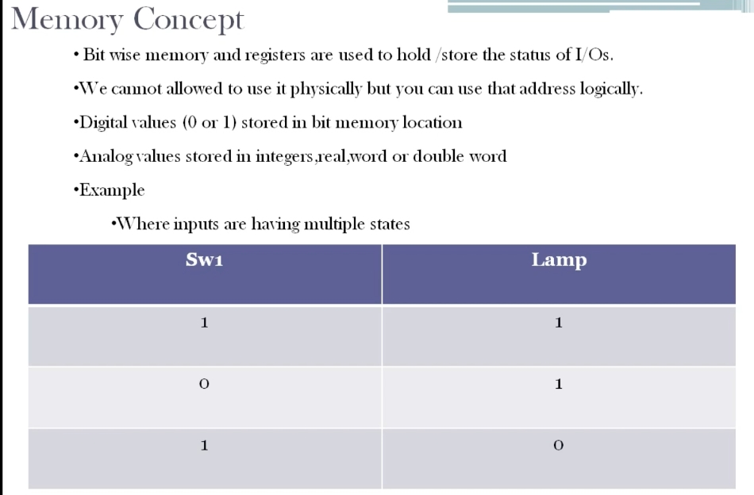
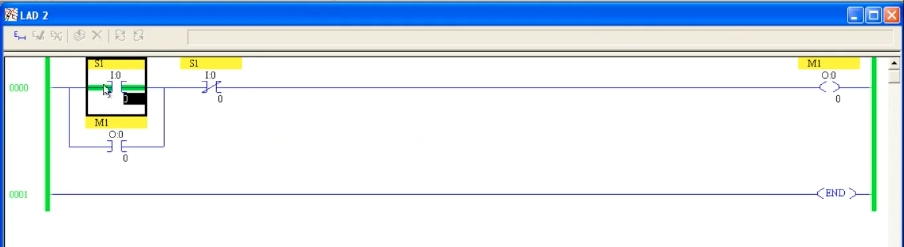
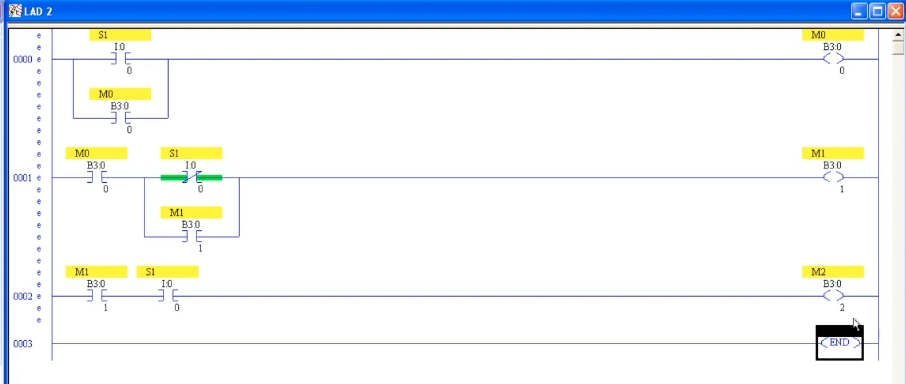
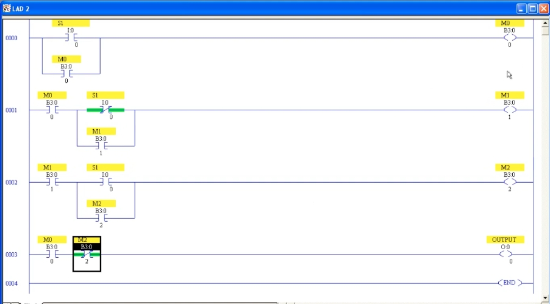

# PLC Training 25 – Memory Concept in Allen Bradley RSLogix 500 PLC Programming
# PLC 教學 25 – Allen-Bradley RSLogix 500 的記憶體（Memory）概念

> Source video 影片來源：<https://www.youtube.com/watch?v=OblS4Ctx6a4&list=PLI78ZBihrkE3nnGIj2WmHb_GoWjFlfFIu&index=25>
>
> Platform 平台：Allen-Bradley RSLogix 500 ladder logic 梯形圖

---

## 1. What Is Memory? / 什麼是記憶體？



**EN:** Memory is one of the most important concepts in PLC programming.
- **Bit-wise memory** and **registers** are used to hold/store the status of I/Os.
- You **cannot use it physically** (no terminal, no wiring) but you can use its address **logically** inside the program.
- When you need "extra switches" or internal helper contacts, you use memory bits – they are not physical devices, only storage locations inside the PLC.
- **Digital values (0 or 1)** are stored in **bit** memory locations.
- **Analog values** are stored in **integers, real, word or double word** locations.

**中文：** 記憶體是 PLC 程式設計中最重要的概念之一。
- **位元記憶體（bit memory）**與**暫存器（register）**用來保存／儲存 I/O 的狀態。
- 它**無法以實體方式使用**（沒有端子、不需接線），但可以在程式中以**邏輯方式**使用其位址。
- 當你需要「額外的開關」或內部輔助接點時，就使用記憶體位元——它們不是實體裝置，只是 PLC 內部的儲存位置。
- **數位值（0 或 1）**儲存在**位元**記憶體位置。
- **類比值**儲存在**整數、實數、字（word）或雙字（double word）**位置。

---

## 2. Motivating Example: Input with Multiple States / 引入範例：輸入具有多種狀態

| Step 步驟 | Sw1 | Lamp 燈 |
|:---:|:---:|:---:|
| 1 | 1 | 1 |
| 2 | 0 | 1 |
| 3 | 1 | 0 |

**EN:** With one switch and one lamp:
1. Turn the switch ON → lamp ON.
2. Turn the switch OFF → lamp **stays ON**.
3. Turn the switch ON **again** → lamp goes **OFF**.

Steps 1–2 can be done with **latching** (previous lesson). But step 3 is the problem: to turn the lamp off we would normally use a normally closed contact of a *second* switch – yet we only have **one** switch. The same input has to do different things depending on *how many times* it has been pressed. This cannot be done without extra "helper" contacts – and that external support is **memory**.

**中文：** 一個開關、一個燈：
1. 開關 ON → 燈亮。
2. 開關 OFF → 燈**仍然亮著**。
3. 開關**再次** ON → 燈**熄滅**。

步驟 1～2 可用上一課的**自保持**完成。但步驟 3 是難點：通常會用*另一個*開關的常閉接點關燈，可是這裡只有**一個**開關。同一個輸入必須依據*被按了幾次*而做不同的事。沒有額外的「輔助」接點就辦不到——這個外部支援就是**記憶體**。

---

## 3. Attempt Without Memory (Fails) / 不使用記憶體的嘗試（會失敗）



**EN:** Name the input `S1` (`I:0/0`) and the output `M1` (`O:0/0`). The natural idea is: latch the output with a parallel output contact, then add `S1` as a **normally closed** contact in series to turn it off:

```
      S1                S1                           M1
0000 ─┤ ├──┬────────────┤/├────────────────────────( )─
      I:0/0│            I:0/0                       O:0/0
      M1   │
 ──────┤ ├─┘
      O:0/0
```

**It does not work.** When `S1` is ON, its normally open contact is closed but its normally closed contact (same address, same state) is **open** – so the rung can never become true at the same moment. The output never turns on. This proves that the task **cannot be done without memory**.

**中文：** 將輸入命名為 `S1`（`I:0/0`），輸出命名為 `M1`（`O:0/0`）。直覺做法是：用並聯的輸出接點自保持，再串聯一個 `S1` 的**常閉**接點來關閉：

（見上方梯形圖）

**這行不通。** 當 `S1` 為 ON 時，它的常開接點閉合，但同一位址、同一狀態的常閉接點卻是**斷開**的——因此梯級永遠無法同時成立，輸出始終不會 ON。這證明沒有記憶體就**無法完成**這個動作。

---

## 4. Using Memory Bits (B3 File) / 使用記憶體位元（B3 檔案）



**EN:** Instead of using a physical output, use **bit-file addresses** `B3:0/0`, `B3:0/1`, `B3:0/2` as internal memories named `M0`, `M1`, `M2`.

- **Rung 0000 – "first press" memory `M0` (`B3:0/0`):** `S1` (`I:0/0`) in parallel with `M0` (`B3:0/0`) → `M0`. This **latches** `M0` after the first press, so it remembers that the switch has been turned on.
- **Rung 0001 – `M1` (`B3:0/1`):** `M0` (NO) in series with [`S1` (`I:0/0`, **NC**) in parallel with `M1` (`B3:0/1`, NO)] → `M1`. `M1` turns on when the switch has been **released** after the first press (S1 off), and then seals itself in – so it remembers that the first press is finished.
- **Rung 0002 – `M2` (`B3:0/2`):** `M1` (NO) in series with `S1` (`I:0/0`, NO) → `M2`. `M2` turns on when `S1` is pressed **again** after `M1` has been set – i.e., the second press.

**中文：** 不使用實體輸出，而是以位元檔案位址 `B3:0/0`、`B3:0/1`、`B3:0/2` 作為內部記憶體，分別命名為 `M0`、`M1`、`M2`。

- **梯級 0000 ——「第一次按下」記憶 `M0`（`B3:0/0`）：** `S1`（`I:0/0`）並聯 `M0`（`B3:0/0`）→ `M0`。第一次按下後 `M0` **自保持**，記住開關已被打開。
- **梯級 0001 —— `M1`（`B3:0/1`）：** `M0`（常開）串聯 [`S1`（`I:0/0`，**常閉**）並聯 `M1`（`B3:0/1`，常開）] → `M1`。第一次按下後**放開**（S1 為 OFF）時 `M1` 導通，並自行保持——記住第一次按下已結束。
- **梯級 0002 —— `M2`（`B3:0/2`）：** `M1`（常開）串聯 `S1`（`I:0/0`，常開）→ `M2`。在 `M1` 已成立後，`S1` **再次**按下時 `M2` 導通——即第二次按下。

---

## 5. Complete Program / 完整程式



**EN:** Rung 0003 drives the real output:

- **Rung 0003:** `M0` (`B3:0/0`, NO) in series with `M2` (`B3:0/2`, **NC**) → `OUTPUT` (`O:0/0`).

Trace of the three states in the table:

| Step 步驟 | S1 | M0 | M1 | M2 | OUTPUT |
|:---:|:---:|:---:|:---:|:---:|:---:|
| Initial 初始 | 0 | 0 | 0 | 0 | 0 |
| 1st press 第一次按下 | 1 | 1 | 0 | 0 | **1** |
| Release 放開 | 0 | 1 | 1 | 0 | **1** |
| 2nd press 第二次按下 | 1 | 1 | 1 | 1 | **0** |

- 1st press: `M0` latches; `M1` stays off because the NC `S1` contact is open; `M2` is off → `OUTPUT` ON.
- Release: `M0` remains; NC `S1` closes → `M1` sets and seals itself in; `OUTPUT` stays ON (matches step 2).
- 2nd press: `M1` is on and `S1` is on → `M2` turns on → its NC contact in rung 0003 opens → `OUTPUT` OFF (matches step 3).

So a **single** switch can produce different results at different times, because the memory bits "remember" what has already happened.

**中文：** 梯級 0003 驅動實際輸出：

- **梯級 0003：** `M0`（`B3:0/0`，常開）串聯 `M2`（`B3:0/2`，**常閉**）→ `OUTPUT`（`O:0/0`）。

表格中三個狀態的追蹤（見上表）：

- 第一次按下：`M0` 自保持；因 `S1` 常閉接點斷開，`M1` 不導通；`M2` 為 OFF → `OUTPUT` 為 ON。
- 放開：`M0` 維持；`S1` 常閉接點閉合 → `M1` 導通並自保持；`OUTPUT` 仍為 ON（對應步驟 2）。
- 第二次按下：`M1` 為 ON 且 `S1` 為 ON → `M2` 導通 → 梯級 0003 中 `M2` 的常閉接點斷開 → `OUTPUT` 為 OFF（對應步驟 3）。

因此，**一個**開關就能在不同時間產生不同結果，因為記憶體位元「記得」先前發生過什麼事。

### Text diagram / 文字示意

```
      S1               (B3:0/0)
0000 ─┤ ├──┬──────────────────────────────────────( M0 )─
      I:0/0│
      M0   │
 ──────┤ ├─┘
      B3:0/0

      M0         S1                              (B3:0/1)
0001 ─┤ ├────┬───┤/├────┬─────────────────────────( M1 )─
      B3:0/0 │   I:0/0  │
             │   M1     │
             └───┤ ├────┘
                 B3:0/1

      M1         S1                              (B3:0/2)
0002 ─┤ ├────────┤ ├────────────────────────────( M2 )─
      B3:0/1     I:0/0

      M0         M2                                OUTPUT
0003 ─┤ ├────────┤/├────────────────────────────( O )─
      B3:0/0     B3:0/2                           O:0/0

0004 ─────────────────────────────────────────────[ END ]
```

---

## 6. Key Takeaways / 重點整理

| # | English | 中文 |
|---|---|---|
| 1 | Memory bits are internal, not physical – no wiring needed. | 記憶體位元是內部的、非實體的——不需接線。 |
| 2 | Digital values are stored in bits; analog values in integer / real / word / double word. | 數位值存於位元；類比值存於整數／實數／字／雙字。 |
| 3 | In RSLogix 500, bit memory is addressed like `B3:0/0`. | 在 RSLogix 500 中，位元記憶體位址如 `B3:0/0`。 |
| 4 | Memory lets one input behave differently on successive presses. | 記憶體讓同一輸入在連續按下時產生不同的行為。 |
| 5 | An NO and NC contact of the same input in series can never be true together. | 同一輸入的常開與常閉接點串聯，永遠無法同時成立。 |

---

## Glossary / 詞彙表

| English | 中文 |
|---|---|
| Memory | 記憶體 |
| Bit memory | 位元記憶體 |
| Register | 暫存器 |
| Integer | 整數 |
| Real (floating-point) | 實數（浮點數） |
| Word / Double word | 字／雙字 |
| Latching | 自保持 |
| Normally open (NO) | 常開 |
| Normally closed (NC) | 常閉 |
| Internal (helper) contact | 內部（輔助）接點 |
| Bit file B3 | 位元檔案 B3 |

---

## Notes / 備註

- **EN:** The transcript was auto-generated and contained recognition errors (e.g., "registered" → register, "iOS" → I/Os, "tablet column" → table). **The transcript ends abruptly mid-sentence**, so the explanation of the final program (Sections 4–5) is derived from the ladder screenshots and the slide table rather than from the narration. Addresses (`I:0/0`, `B3:0/0`–`B3:0/2`, `O:0/0`) are read from low-resolution screenshots – please verify against the original video. Also note that, as drawn, `M2` drops again once `S1` is released, so the lamp would come back on after the second press is released; the video's three-state table only covers up to the second press.
- **中文：** 原始逐字稿為語音辨識產生，含有辨識錯誤（如 "registered" → 暫存器、"iOS" → I/O、"tablet column" → 表格）。**逐字稿在句子中途突然中斷**，因此第 4～5 節對最終程式的說明是依據梯形圖截圖與投影片表格推導，而非來自講解內容。位址（`I:0/0`、`B3:0/0`～`B3:0/2`、`O:0/0`）取自低解析度截圖，請與原影片核對。另外請注意：依圖所繪，`S1` 放開後 `M2` 會再次斷開，因此第二次按下放開後燈會重新亮起；影片的三狀態表只涵蓋到第二次按下。

## Directory / 目錄結構

```
plc_training_25_memory_concept.md
images/
├── ab25_01.jpg   # Memory concept slide 記憶體概念投影片
├── ab25_02.jpg   # Attempt without memory 不使用記憶體的嘗試
├── ab25_03.jpg   # Memory ladder (rungs 0–2) 記憶體梯形圖（梯級 0–2）
└── ab25_04.jpg   # Complete memory ladder 完整記憶體梯形圖
```
