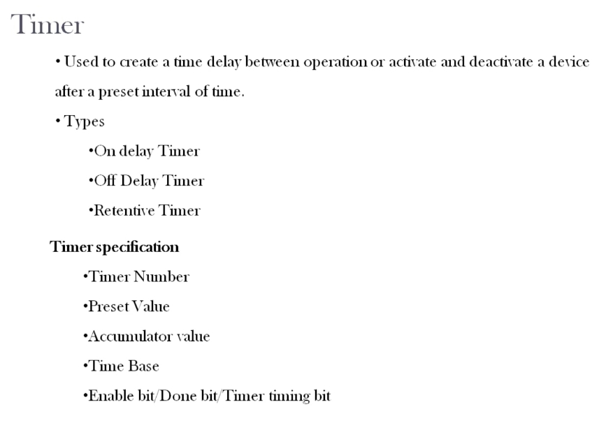

# PLC Training 26 – Introduction to Timers | Allen Bradley PLC Course for Beginners
# PLC 教學 26 – 計時器入門｜Allen-Bradley PLC 初學者課程

> Source video 影片來源：<https://www.youtube.com/watch?v=unwLSBjsT7I&list=PLI78ZBihrkE3nnGIj2WmHb_GoWjFlfFIu&index=26>
>
> Platform 平台：Allen-Bradley (Rockwell) RSLogix 500

---

## 1. What Is a Timer? / 什麼是計時器？



**EN:**
- A **timer** is used to create a **time delay** between operations, or to **activate and deactivate** a device after a **preset** interval of time.
- Types: **On-delay timer**, **Off-delay timer**, **Retentive timer**.
- Timer specification (parameters): **Timer number**, **Preset value**, **Accumulator value**, **Time base**, **Enable bit / Done bit / Timer-timing bit**.

**中文：**
- **計時器（Timer）**用於在動作之間製造**時間延遲**，或在**預設**的時間間隔後**啟動與關閉**裝置。
- 類型：**通電延遲計時器（On-delay）**、**斷電延遲計時器（Off-delay）**、**保持型計時器（Retentive）**。
- 計時器規格（參數）：**計時器編號**、**預設值**、**累加值**、**時間基準**、**致能位元／完成位元／計時中位元**。

---

## 2. Everyday Examples / 日常範例

**EN:**
- **Washing machine:** the spin operation can be set to run for, say, 7 or 10 minutes. After that time, the spin stops – an operation is *deactivated* after a delay.
- **Phone alarm:** after a set time the alarm goes off – a device is *activated* after a delay.

The length of the delay is called the **preset**. For the washing machine, 7 minutes is the preset value: how long you want the delay to be.

**中文：**
- **洗衣機：**脫水程序可設定運轉 7 分鐘或 10 分鐘，時間到後脫水停止——這是在延遲後*關閉*某個動作。
- **手機鬧鐘：**經過設定的時間後鬧鐘響起——這是在延遲後*啟動*某個裝置。

延遲的長度稱為**預設值（preset）**。以洗衣機為例，7 分鐘就是預設值：你希望延遲多久。

---

## 3. Three Types of Timers / 三種計時器

| Type 類型 | Chinese 中文 | Covered 說明 |
|---|---|---|
| On-delay timer (TON) | 通電延遲計時器 | Next lesson 下一課 |
| Off-delay timer (TOF) | 斷電延遲計時器 | Later lessons 後續課程 |
| Retentive timer (RTO) | 保持型計時器 | Later lessons 後續課程 |

**EN:** Before using them, you must understand the timer parameters below.

**中文：** 使用之前，必須先了解下列計時器參數。

---

## 4. Timer Parameters / 計時器參數

### 4.1 Timer Number / 計時器編號

**EN:** The timer number is simply the **timer address**. A project may need several timers, and the timer number is how you tell them apart. In Allen-Bradley (RSLogix 500) timers are addressed from `T4:0` up to `T4:255` – up to **256 timers** in the file.

**中文：** 計時器編號就是**計時器位址**。一個專案可能需要多個計時器，靠編號來區分。在 Allen-Bradley（RSLogix 500）中，計時器位址從 `T4:0` 到 `T4:255`，檔案中最多可有 **256 個計時器**。

### 4.2 Preset Value (PRE) / 預設值

**EN:** How long you want the delay to last. Example: 7 minutes for the washing-machine spin.

**中文：** 你希望延遲持續多久。例如洗衣機脫水的 7 分鐘。

### 4.3 Accumulator Value (ACC) / 累加值

**EN:** The **running (current) value** of the timer. In the washing-machine example, once the spin starts the accumulator begins at 0 and counts 0, 1, 2, 3 … until it reaches the preset. (The instructor notes a timer may count up or count down; the running value is always held in the accumulator.)

**中文：** 計時器的**執行中（目前）數值**。以洗衣機為例，脫水開始後累加值從 0 開始，依 0、1、2、3 … 遞增直到預設值。（講師提到計時器可以遞增或遞減計數；執行中的數值都儲存在累加器中。）

### 4.4 Time Base / 時間基準

**EN:** Determines the unit of counting (for example, seconds or fractions of a second). It relates to the **resolution** of the timer. Allen-Bradley timers provide a time-base option.

**中文：** 決定計數的單位（例如秒或秒的分數），與計時器的**解析度**有關。Allen-Bradley 計時器提供時間基準選項。

### 4.5 Status Bits: EN, DN, TT / 狀態位元：EN、DN、TT

| Bit 位元 | Name 名稱 | Meaning 意義 |
|---|---|---|
| **EN** | Enable bit 致能位元 | ON whenever the **run (rung) condition** is true; stays ON until the rung condition goes false. 只要**執行（梯級）條件**成立即為 ON，直到條件消失。 |
| **DN** | Done bit 完成位元 | ON when the timing function is **complete** (accumulator reached the preset). 計時完成（累加值達到預設值）時為 ON。 |
| **TT** | Timer-timing bit 計時中位元 | ON **while the timer is running** (counting from the first second to the last). Lets you know the timer is currently timing. 計時器**正在計時期間**為 ON（從第一秒到最後一秒）。可用來得知計時器目前正在運作。 |

**EN – Washing-machine example:** when the spin starts, **EN** turns ON and stays ON as long as the run condition remains. **TT** is ON throughout the 7 minutes while it counts. When the 7 minutes are up, **DN** turns ON.

**中文 – 洗衣機範例：**脫水開始時 **EN** 變為 ON，只要執行條件持續就保持 ON；7 分鐘計時期間 **TT** 為 ON；7 分鐘結束時 **DN** 變為 ON。

### Timeline / 時序示意

```
Run condition  ┌──────────────────────────┐
執行條件       ┘                          └──
EN             ┌──────────────────────────┐
               ┘                          └──
TT             ┌─────────────┐
               ┘             └──────────────
DN                           ┌──────────────┐
                             └              └─
ACC            0 → 1 → 2 … → PRE (holds 保持)
               ├─ timing 計時中 ─┤
```

---

## 5. Key Takeaways / 重點整理

| # | English | 中文 |
|---|---|---|
| 1 | Timers create delays or activate/deactivate devices after a preset time. | 計時器可製造延遲，或在預設時間後啟動／關閉裝置。 |
| 2 | Three types: on-delay, off-delay, retentive. | 三種類型：通電延遲、斷電延遲、保持型。 |
| 3 | Timer number identifies each timer (`T4:0`–`T4:255`). | 以計時器編號識別各計時器（`T4:0`～`T4:255`）。 |
| 4 | PRE = target time; ACC = running value; time base = resolution. | PRE＝目標時間；ACC＝執行中數值；時間基準＝解析度。 |
| 5 | EN = rung condition true; DN = timing complete; TT = currently timing. | EN＝梯級條件成立；DN＝計時完成；TT＝正在計時。 |

**Next lesson / 下一課：** On-delay timer – practical example and how to program it in the software. 通電延遲計時器的實際應用範例與軟體程式設計。

---

## Glossary / 詞彙表

| English | 中文 |
|---|---|
| Timer | 計時器 |
| Time delay | 時間延遲 |
| On-delay timer (TON) | 通電延遲計時器 |
| Off-delay timer (TOF) | 斷電延遲計時器 |
| Retentive timer (RTO) | 保持型計時器 |
| Preset value (PRE) | 預設值 |
| Accumulator value (ACC) | 累加值 |
| Time base | 時間基準 |
| Resolution | 解析度 |
| Enable bit (EN) | 致能位元 |
| Done bit (DN) | 完成位元 |
| Timer-timing bit (TT) | 計時中位元 |
| Activate / Deactivate | 啟動／關閉 |

---

## Notes / 備註

- **EN:** The transcript was auto-generated and contained recognition errors, which were corrected (e.g., "written to timer" → retentive timer, "enable but done bitten timer timing but" → enable bit, done bit, timer-timing bit, "Alan Bradley / Ireland Bradley" → Allen-Bradley). The instructor's remark on time base was unclear in the transcript, so only the general idea (unit/resolution) is given. The timeline diagram in Section 4.5 is an illustration added for clarity and is not from the video.
- **中文：** 原始逐字稿為語音辨識產生，含有辨識錯誤並已修正（如 "written to timer" → 保持型計時器、"enable but done bitten timer timing but" → 致能位元、完成位元、計時中位元、"Alan Bradley / Ireland Bradley" → Allen-Bradley）。講師對時間基準的說明在逐字稿中不清楚，故僅保留大意（單位／解析度）。第 4.5 節的時序示意圖為補充說明，非影片內容。

## Directory / 目錄結構

```
plc_training_26_timers_intro.md
images/
└── ab26_01.jpg   # Timer overview slide 計時器概覽投影片
```
