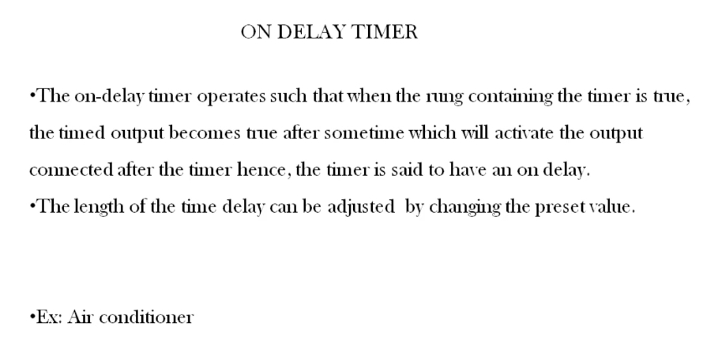
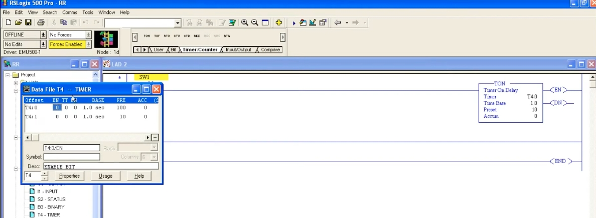
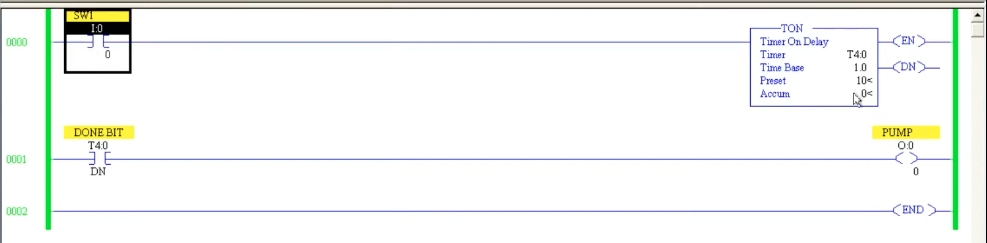
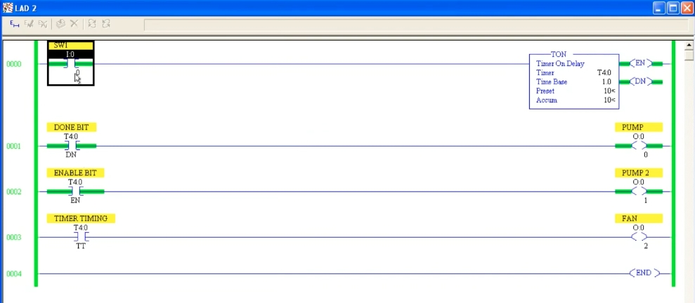
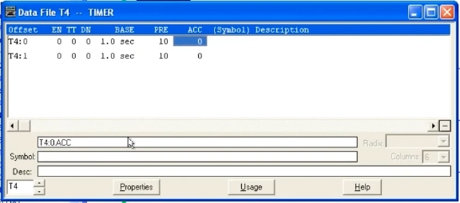

# PLC Training 27 – ON Delay Timer in PLC
# PLC 教學 27 – PLC 通電延遲計時器（ON Delay Timer）

> Source video 影片來源：<https://www.youtube.com/watch?v=pYcZTcKEJgU&list=PLI78ZBihrkE3nnGIj2WmHb_GoWjFlfFIu&index=27>
>
> Platform 平台：Allen-Bradley RSLogix 500

---

## 1. What Is an ON Delay Timer? / 什麼是通電延遲計時器？



**EN:**
- An on-delay timer **delays the ON condition**. When the rung containing the timer becomes **true**, the timer starts running.
- After the preset time, the timed output (the **Done bit**) becomes true, which activates the output connected after the timer. Hence the timer is said to have an *on delay*.
- The length of the delay can be adjusted by changing the **preset value**.
- Example: an air conditioner.

**中文：**
- 通電延遲計時器會**延遲 ON 的條件**。當包含計時器的梯級變為**成立**時，計時器開始運行。
- 經過預設時間後，計時輸出（**完成位元 Done bit**）成立，進而啟動接在計時器之後的輸出，因此稱為*通電延遲*。
- 延遲的長度可透過修改**預設值**調整。
- 範例：冷氣機。

### Everyday examples / 日常範例

**EN:**
- At home, turning on a switch makes a fan run immediately. If you want the fan to start only **after some delay**, use an on-delay timer.
- **Air conditioner:** after you switch on the main power, it does not respond immediately – you cannot use the remote right away. After some time it beeps, and only then can you raise or lower the temperature. During that period the "ON" condition is being delayed.

**中文：**
- 在家中打開開關，風扇會立刻運轉。如果希望風扇**延遲一段時間**才啟動，就可使用通電延遲計時器。
- **冷氣機：**打開主電源後不會馬上有反應，也無法立刻使用遙控器；過一會兒才會發出提示音，之後才能調高或調低溫度。在這段期間，「ON」條件被延遲了。

---

## 2. Programming the TON Instruction / 設定 TON 指令



**EN:**
1. Place an input contact (`SW1`, `I:0/0`) on the rung.
2. From the **Timer/Counter** instruction tab, insert a **TON (Timer On Delay)** instruction.
3. Set the parameters:
   - **Timer:** `T4:0` (the timer number / address)
   - **Time Base:** `1.0` (seconds)
   - **Preset:** `10` → a delay of 10 seconds (10 × 1.0 s)
   - **Accum:** `0` (running value, starts from 0)
4. The timer has three status bits you can use as contacts: **EN** (enable), **TT** (timer timing), **DN** (done).
5. The timer's actual "output" is the **Done bit**, addressed `T4:0/DN`. If you cannot remember the address, open the **Data File T4 – TIMER** window (as in the screenshot) and click on the bit column (e.g., DN) – the address, such as `T4:0/DN`, and its description (e.g., "ENABLE BIT") appear at the bottom.

**中文：**
1. 在梯級上放置輸入接點（`SW1`，`I:0/0`）。
2. 從 **Timer/Counter** 指令頁籤插入 **TON（Timer On Delay）** 指令。
3. 設定參數：
   - **Timer（計時器）：**`T4:0`（計時器編號／位址）
   - **Time Base（時間基準）：**`1.0`（秒）
   - **Preset（預設值）：**`10` → 延遲 10 秒（10 × 1.0 秒）
   - **Accum（累加值）：**`0`（執行中的數值，從 0 開始）
4. 計時器有三個可當作接點使用的狀態位元：**EN**（致能）、**TT**（計時中）、**DN**（完成）。
5. 計時器真正的「輸出」是**完成位元**，位址為 `T4:0/DN`。若記不得位址，可開啟 **Data File T4 – TIMER**（資料檔）視窗（如截圖），點選位元欄（如 DN），底部就會顯示位址（如 `T4:0/DN`）與描述（如 "ENABLE BIT"）。

---

## 3. Example: Pump Delayed by 10 Seconds / 範例：幫浦延遲 10 秒啟動



**EN:**
- **Rung 0000:** `SW1` (`I:0/0`) → `TON` timer `T4:0`, preset 10 s.
- **Rung 0001:** `DONE BIT` contact `T4:0/DN` → `PUMP` (`O:0/0`).

Operation:
1. Turn `SW1` ON. The timer starts; the accumulator counts up. **EN** is ON – it simply mirrors the run (rung) condition.
2. After **10 seconds**, the accumulator equals the preset, the **DN** bit turns ON, and the `PUMP` turns ON.
3. Turn `SW1` OFF → all bits are reset and the accumulator returns to **0**.

**中文：**
- **梯級 0000：**`SW1`（`I:0/0`）→ `TON` 計時器 `T4:0`，預設 10 秒。
- **梯級 0001：**`DONE BIT` 接點 `T4:0/DN` → `PUMP`（`O:0/0`）。

動作：
1. 將 `SW1` 設為 ON，計時器開始運行，累加值遞增。**EN** 為 ON——它僅反映執行（梯級）條件。
2. **10 秒**後累加值等於預設值，**DN** 位元為 ON，`PUMP` 啟動。
3. 將 `SW1` 設為 OFF → 所有位元重置，累加值回到 **0**。

### Text diagram / 文字示意

```
      SW1                         TON  Timer On Delay
0000 ─┤ ├────────────────────────[ Timer    T4:0     ]─( EN )
      I:0/0                       [ Time Base 1.0    ]─( DN )
                                  [ Preset    10     ]
                                  [ Accum     0      ]

      DONE BIT                                        PUMP
0001 ─┤ ├──────────────────────────────────────────────( )─
      T4:0/DN                                         O:0/0
0002 ──────────────────────────────────────────────[ END ]
```

---

## 4. Important Behavior: Input Must Stay ON / 重要特性：輸入必須持續為 ON

**EN:** If the input condition goes **false before the preset time is reached**, the timer is **reset**: the enable bit turns OFF and the accumulator returns to 0. An on-delay timer therefore requires the input condition to be **continuously ON** for the full preset time. A short pulse is not enough. Because of this automatic reset, the on-delay timer **needs no separate reset instruction**; if the input goes false, you can simply start again from the beginning.

**中文：** 如果輸入條件在**達到預設時間之前變為不成立**，計時器會被**重置**：致能位元變為 OFF，累加值回到 0。因此通電延遲計時器要求輸入條件在整個預設時間內**持續為 ON**，短暫的脈衝不夠。由於會自動重置，通電延遲計時器**不需要額外的重置指令**；輸入消失後，只要重新開始即可。

---

## 5. EN, TT and DN Bits in Action / EN、TT、DN 位元的實際動作



**EN:** Two more rungs show the other bits:
- **Rung 0002:** `ENABLE BIT` `T4:0/EN` → `PUMP 2` (`O:0/1`)
- **Rung 0003:** `TIMER TIMING` `T4:0/TT` → `FAN` (`O:0/2`)

| Bit 位元 | When ON 何時為 ON | In this example 本例 |
|---|---|---|
| **EN** | As soon as the rung condition is true; goes OFF when it goes false. 梯級條件一成立即為 ON，條件消失時為 OFF。 | `PUMP 2` turns on immediately. `PUMP 2` 立即啟動。 |
| **TT** | **Only while the timer is running**; turns OFF when timing stops. **僅在計時器運行期間**為 ON，計時結束即 OFF。 | `FAN` runs for the 10 s of timing, then stops. `FAN` 在 10 秒計時期間運轉，之後停止。 |
| **DN** | After the preset time has elapsed. 預設時間過後。 | `PUMP` starts after 10 s. `PUMP` 在 10 秒後啟動。 |

Operation: turn `SW1` ON → EN and TT turn on immediately and the accumulator runs. When timing ends (after 10 s), TT turns OFF and DN turns ON (the screenshot shows the finished state: Preset 10, Accum 10, with EN and DN energized).

**中文：** 另外兩個梯級展示其他位元：
- **梯級 0002：**`ENABLE BIT` `T4:0/EN` → `PUMP 2`（`O:0/1`）
- **梯級 0003：**`TIMER TIMING` `T4:0/TT` → `FAN`（`O:0/2`）

動作：將 `SW1` 設為 ON → EN 與 TT 立即為 ON，累加值開始運行。計時結束（10 秒後），TT 變為 OFF、DN 變為 ON（截圖為計時完成狀態：預設 10、累加 10，EN 與 DN 通電）。

### Timing diagram / 時序示意

```
SW1 / run condition  ┌────────────────────────────
執行條件             ┘
EN                   ┌────────────────────────────
TT                   ┌────────────┐
                     ┘            └───────────────
DN                                ┌───────────────
                     ─────────────┘
ACC                  0 ─ 1 ─ … ─ 10 (= PRE, holds 保持)
                     ├── 10 s ────┤
```

---

## 6. Using PRE and ACC Addresses / 使用預設值與累加值位址



**EN:** Just like the bit addresses (`T4:0/EN`, `/TT`, `/DN`), the **preset** and **accumulator** values have their own addresses (`T4:0.PRE` and `T4:0.ACC`, selected in the data file as the `PRE` and `ACC` columns). If an application needs to compare the running time with another number, use the accumulator address with a **comparator** – covered in upcoming sessions on comparators and counters.

**中文：** 與位元位址（`T4:0/EN`、`/TT`、`/DN`）一樣，**預設值**與**累加值**也有各自的位址（`T4:0.PRE` 與 `T4:0.ACC`，在資料檔中對應 `PRE` 與 `ACC` 欄位）。若應用需要將執行中的時間與其他數值比較，可搭配**比較器**使用累加值位址——後續課程將介紹比較器與計數器。

---

## 7. Key Takeaways / 重點整理

| # | English | 中文 |
|---|---|---|
| 1 | TON delays the ON condition; the Done bit is the timer's real output. | TON 延遲 ON 條件；完成位元才是計時器的實際輸出。 |
| 2 | Delay = Preset × Time Base (e.g., 10 × 1.0 s = 10 s). | 延遲時間＝預設值 × 時間基準（例：10 × 1.0 秒＝10 秒）。 |
| 3 | EN follows the rung condition; TT is ON only while timing; DN is ON when done. | EN 隨梯級條件；TT 僅在計時中為 ON；DN 於完成後為 ON。 |
| 4 | If the input drops early, the timer resets (ACC = 0). | 輸入提前消失，計時器重置（ACC＝0）。 |
| 5 | Input must stay ON continuously for the whole preset time. | 輸入必須在整個預設時間內持續為 ON。 |
| 6 | No special reset instruction is needed for a TON. | TON 不需要特別的重置指令。 |
| 7 | PRE and ACC have addresses usable in comparisons. | PRE 與 ACC 有位址，可用於比較。 |

---

## Glossary / 詞彙表

| English | 中文 |
|---|---|
| On-delay timer (TON) | 通電延遲計時器 |
| Preset value (PRE) | 預設值 |
| Accumulator (ACC) | 累加值 |
| Time base | 時間基準 |
| Enable bit (EN) | 致能位元 |
| Timer-timing bit (TT) | 計時中位元 |
| Done bit (DN) | 完成位元 |
| Run (rung) condition | 執行（梯級）條件 |
| Reset | 重置 |
| Data file | 資料檔 |
| Comparator | 比較器 |
| Pump / Fan | 幫浦／風扇 |

---

## Notes / 備註

- **EN:** The transcript was auto-generated and contained recognition errors, corrected here (e.g., "Dan Bert enable button" → done bit, enable bit; "research should be 10" → preset should be 10; "Honda MRR conditioner" → air conditioner; "daytime" → next topic). In the first screenshot the timer data file briefly shows `PRE 100` for `T4:0` while the instruction shows preset 10 – this appears to be an intermediate state before the value was set; the lesson uses a preset of 10. The ladder diagrams in text form and the timing diagram are added for clarity. Addresses were read from low-resolution screenshots; please verify against the video.
- **中文：** 原始逐字稿為語音辨識產生，含有辨識錯誤並已修正（如 "Dan Bert enable button" → 完成位元、致能位元；"research should be 10" → 預設值設為 10；"Honda MRR conditioner" → 冷氣機）。第一張截圖的資料檔中 `T4:0` 暫時顯示 `PRE 100`，而指令顯示預設值為 10，推測是設定前的中間狀態；本課使用預設值 10。文字版梯形圖與時序示意為補充說明。位址取自低解析度截圖，請與影片核對。

## Directory / 目錄結構

```
plc_training_27_on_delay_timer.md
images/
├── ab27_01.jpg   # ON delay timer slide 通電延遲計時器投影片
├── ab27_02.jpg   # TON instruction + data file TON 指令與資料檔
├── ab27_03.jpg   # Done bit → PUMP rung 完成位元驅動幫浦
├── ab27_04.jpg   # EN / DN / TT ladder EN/DN/TT 梯形圖
└── ab27_05.jpg   # Timer data file (PRE/ACC) 計時器資料檔
```
