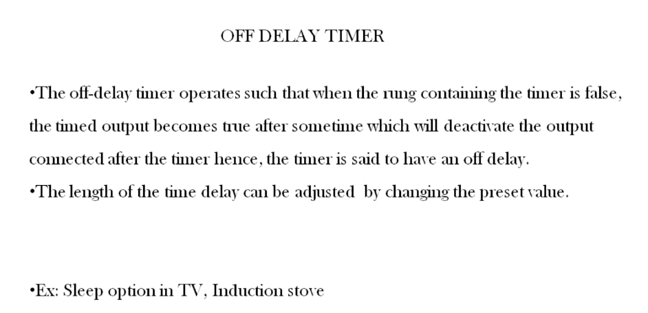
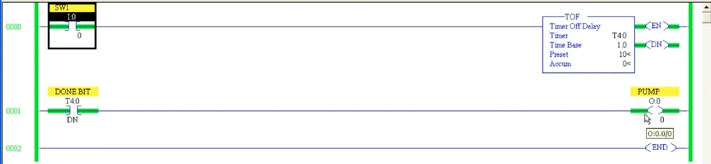
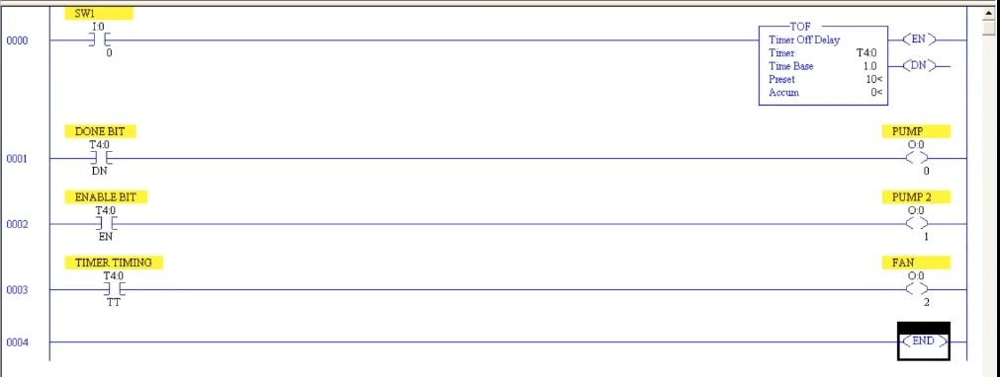

# PLC Training 28 – OFF Delay Timer in Allen Bradley Ladder Logic
# PLC 教學 28 – Allen-Bradley 梯形圖中的斷電延遲計時器（OFF Delay Timer）

> Source video 影片來源：<https://www.youtube.com/watch?v=DcQVlm5uQ2I&list=PLI78ZBihrkE3nnGIj2WmHb_GoWjFlfFIu&index=28>
>
> Platform 平台：Allen-Bradley RSLogix 500

---

## 1. What Is an OFF Delay Timer? / 什麼是斷電延遲計時器？



**EN:**
- The on-delay timer (previous lesson) delays the **ON** condition. The off-delay timer **delays the OFF condition**.
- It has **no delay when turning on** – the output turns on normally and immediately.
- When the rung containing the timer becomes **false**, the timer starts timing; after the preset time the timed output changes state and the output connected after the timer is **deactivated**. Hence the timer is said to have an *off delay*.
- The length of the delay is adjusted by changing the **preset value**.
- Examples: **sleep timer on a TV**, **induction stove**.

**中文：**
- 通電延遲計時器（上一課）延遲的是 **ON** 條件；斷電延遲計時器則是**延遲 OFF 條件**。
- **開啟時沒有延遲**——輸出會正常、立即地開啟。
- 當包含計時器的梯級變為**不成立**時，計時器開始計時；經過預設時間後，計時輸出改變狀態，接在計時器之後的輸出便被**關閉**。因此稱為*斷電延遲*。
- 延遲長度可透過修改**預設值**調整。
- 範例：**電視的睡眠定時**、**電磁爐**。

### Everyday examples / 日常範例

**EN:**
- **Induction stove:** set a time, and when that time is up the stove turns off automatically.
- **TV sleep option:** if you feel sleepy at night, set the TV to switch off after 20 minutes, 40 minutes, 1 hour or 1.5 hours – it turns off automatically even though you did not press the switch.

**中文：**
- **電磁爐：**設定時間，時間到後自動關閉。
- **電視睡眠定時：**晚上想睡時，可設定 20 分鐘、40 分鐘、1 小時或 1.5 小時後關機，不用自己按開關，電視也會自動關閉。

---

## 2. Programming the TOF Instruction / 設定 TOF 指令



**EN:**
1. On the **Timer/Counter** tab, select **TOF** (Timer Off Delay) – or take a TON and change its name to TOF.
2. Parameters (same as TON):
   - **Timer:** `T4:0`
   - **Time Base:** `1.0` (sec)
   - **Preset:** `10` → 10 seconds
   - **Accum:** `0`
3. A timer instruction is an **output-type instruction**, so you cannot connect another output on the same rung. Use its bit (the **Done bit**, `T4:0/DN`) as a contact on a **separate rung** to drive the output.
4. Ladder: `SW1` (`I:0/0`) → `TOF` `T4:0`; next rung `DONE BIT` (`T4:0/DN`) → `PUMP` (`O:0/0`).

**中文：**
1. 在 **Timer/Counter** 頁籤選擇 **TOF**（Timer Off Delay），或先放 TON 再改名為 TOF。
2. 參數（與 TON 相同）：
   - **Timer（計時器）：**`T4:0`
   - **Time Base（時間基準）：**`1.0`（秒）
   - **Preset（預設值）：**`10` → 10 秒
   - **Accum（累加值）：**`0`
3. 計時器指令屬於**輸出型指令**，不能在同一梯級再接其他輸出；需把它的位元（**完成位元**，`T4:0/DN`）當作接點，放在**另一個梯級**去驅動輸出。
4. 梯形圖：`SW1`（`I:0/0`）→ `TOF` `T4:0`；下一梯級 `DONE BIT`（`T4:0/DN`）→ `PUMP`（`O:0/0`）。

### Operation / 動作過程

**EN:**
1. **Turn `SW1` ON** → **EN** and **DN** both turn ON immediately (no delay), so the `PUMP` turns ON at once. The accumulator stays at 0 (the screenshot shows the input, EN, DN and the pump all energized).
2. **Turn `SW1` OFF** → **EN** turns OFF, but **DN stays ON** and the accumulator starts counting up. The `PUMP` keeps running.
3. After **10 seconds** (accumulator = preset), **DN turns OFF** → the `PUMP` turns OFF.
4. If `SW1` is turned ON again, the accumulator is **automatically reset** to 0. As with the on-delay timer, there is **no special reset instruction**.

**中文：**
1. **將 `SW1` 設為 ON** → **EN** 與 **DN** 立即同時為 ON（沒有延遲），因此 `PUMP` 立刻啟動。累加值維持 0（截圖中輸入、EN、DN 與幫浦皆通電）。
2. **將 `SW1` 設為 OFF** → **EN** 變為 OFF，但 **DN 仍為 ON**，累加值開始遞增，`PUMP` 持續運轉。
3. **10 秒**後（累加值＝預設值），**DN 變為 OFF** → `PUMP` 關閉。
4. 若再次將 `SW1` 設為 ON，累加值會**自動重置**為 0。與通電延遲計時器一樣，**不需要特別的重置指令**。

### Timing diagram / 時序示意

```
SW1 (rung 梯級)  ┌──────────┐
                 ┘          └──────────────────────
EN               ┌──────────┐
                 ┘          └──────────────────────
DN               ┌────────────────────────┐
                 ┘                        └────────
TT                          ┌─────────────┐
                 ───────────┘             └────────
ACC              0 ─────────┤ 0 → 1 → … → 10 (=PRE)
PUMP             ┌────────────────────────┐
                 ┘                        └────────
                            ├── 10 s delay 延遲 ──┤
```

---

## 3. EN, TT and DN Bits of the TOF / TOF 的 EN、TT、DN 位元



**EN:** Two more rungs show the other bits:
- **Rung 0002:** `ENABLE BIT` `T4:0/EN` → `PUMP 2` (`O:0/1`)
- **Rung 0003:** `TIMER TIMING` `T4:0/TT` → `FAN` (`O:0/2`)

| Bit 位元 | Behavior in a TOF 在 TOF 中的行為 |
|---|---|
| **EN** | ON while the rung condition is true; OFF as soon as it goes false. 梯級條件成立時為 ON，一旦不成立立即為 OFF。 |
| **TT** | ON **while timing** – that is, after the input has turned off and until the preset time is reached. **計時期間**為 ON——即輸入關閉後，到達預設時間之前。 |
| **DN** | ON immediately with the input; turns OFF only after the delay has elapsed. 隨輸入立即為 ON，延遲時間結束後才為 OFF。 |

Test: turn the input ON → EN and DN are ON. Turn it OFF → EN goes OFF, TT is ON while the accumulator runs, and after the delay everything goes OFF. Turn it ON again → the accumulator returns to 0.

**中文：** 另外兩個梯級展示其他位元：
- **梯級 0002：**`ENABLE BIT` `T4:0/EN` → `PUMP 2`（`O:0/1`）
- **梯級 0003：**`TIMER TIMING` `T4:0/TT` → `FAN`（`O:0/2`）

測試：輸入 ON → EN 與 DN 為 ON；輸入 OFF → EN 變 OFF，累加值運行期間 TT 為 ON，延遲結束後全部變 OFF；再次 ON → 累加值回到 0。

---

## 4. ON Delay vs. OFF Delay / 通電延遲與斷電延遲比較

| | On-delay (TON) 通電延遲 | Off-delay (TOF) 斷電延遲 |
|---|---|---|
| Delays 延遲的是 | Turning **ON** 開啟 | Turning **OFF** 關閉 |
| Timing starts when 開始計時時機 | Rung becomes **true** 梯級變為**成立** | Rung becomes **false** 梯級變為**不成立** |
| EN | ON with input 隨輸入 ON | ON with input 隨輸入 ON |
| DN | ON **after** the preset 預設時間**之後**為 ON | ON **immediately**, OFF after the preset 立即為 ON，預設時間後為 OFF |
| TT | ON while timing (input ON) 計時中為 ON（輸入 ON 時） | ON while timing (input OFF) 計時中為 ON（輸入 OFF 時） |
| Input must stay | **ON** for the full time 全程保持 **ON** | Input is released; timing continues 輸入放開後仍繼續計時 |
| Reset 重置 | Automatic when input goes false 輸入消失時自動重置 | Automatic when input turns ON again 輸入再次 ON 時自動重置 |
| Example 範例 | Air conditioner 冷氣機 | TV sleep timer, induction stove 電視睡眠定時、電磁爐 |

---

## 5. Key Takeaways / 重點整理

| # | English | 中文 |
|---|---|---|
| 1 | TOF delays the OFF condition; turning ON has no delay. | TOF 延遲 OFF 條件；開啟時沒有延遲。 |
| 2 | Timing starts when the input goes OFF. | 輸入變為 OFF 時開始計時。 |
| 3 | DN is the timed output – use it in a separate rung to drive the load. | DN 是計時輸出——放在另一梯級驅動負載。 |
| 4 | After the preset time, DN goes OFF and the load turns off. | 預設時間後 DN 變 OFF，負載關閉。 |
| 5 | The accumulator resets automatically; no reset instruction needed. | 累加值自動重置，不需重置指令。 |
| 6 | Examples: TV sleep timer, induction stove. | 範例：電視睡眠定時、電磁爐。 |

**Next lesson / 下一課：** RTO – the **retentive timer on-delay**. 保持型通電延遲計時器（RTO）。

---

## Glossary / 詞彙表

| English | 中文 |
|---|---|
| Off-delay timer (TOF) | 斷電延遲計時器 |
| On-delay timer (TON) | 通電延遲計時器 |
| Retentive timer (RTO) | 保持型計時器 |
| Preset (PRE) | 預設值 |
| Accumulator (ACC) | 累加值 |
| Time base | 時間基準 |
| Enable bit (EN) | 致能位元 |
| Timer-timing bit (TT) | 計時中位元 |
| Done bit (DN) | 完成位元 |
| Output instruction | 輸出型指令 |
| Induction stove | 電磁爐 |
| Sleep timer | 睡眠定時 |

---

## Notes / 備註

- **EN:** The transcript was auto-generated and contained recognition errors, corrected here (e.g., "induction style" → induction stove, "Dan bit / debit" → done bit, "Akim value" → accumulator value, "written timer on daily" → retentive timer on-delay). The transcript says the "ENABLE" and "DONE" bits are both on when the input is on; this matches the screenshot. The timing diagram and the comparison table are added for clarity and are not from the video. Addresses were read from low-resolution screenshots – please verify against the video.
- **中文：** 原始逐字稿為語音辨識產生，含有辨識錯誤並已修正（如 "induction style" → 電磁爐、"Dan bit / debit" → 完成位元、"Akim value" → 累加值、"written timer on daily" → 保持型通電延遲計時器）。逐字稿提到輸入 ON 時「致能」與「完成」位元同時為 ON，與截圖一致。時序示意與比較表為補充說明，並非影片內容。位址取自低解析度截圖，請與影片核對。

## Directory / 目錄結構

```
plc_training_28_off_delay_timer.md
images/
├── ab28_01.jpg   # OFF delay timer slide 斷電延遲計時器投影片
├── ab28_02.jpg   # TOF ladder, online 上線執行中的 TOF 梯形圖
└── ab28_03.jpg   # TOF with DN/EN/TT rungs 含 DN/EN/TT 的梯形圖
```
