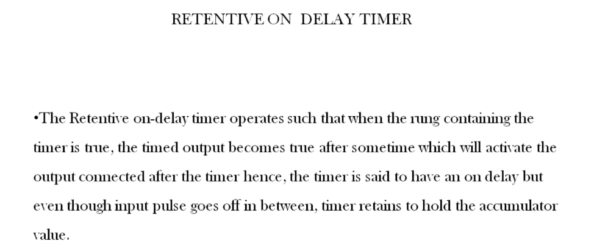
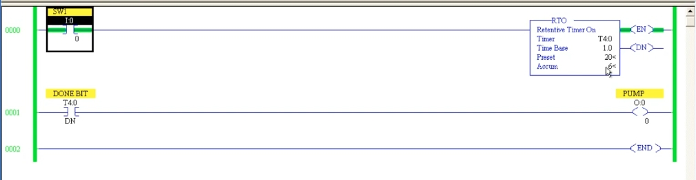
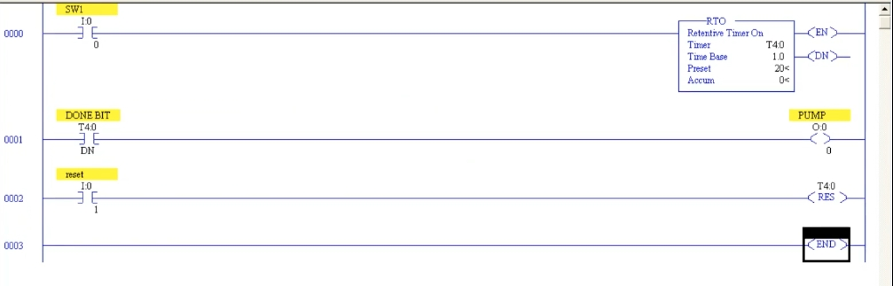

# PLC Training 29 – Retentive ON Delay Timer in PLC | Free Tutorial with Example
# PLC 教學 29 – PLC 保持型通電延遲計時器（RTO）｜附範例

> Source video 影片來源：<https://www.youtube.com/watch?v=I0W1P_3ZbkE&list=PLI78ZBihrkE3nnGIj2WmHb_GoWjFlfFIu&index=29>
>
> Platform 平台：Allen-Bradley RSLogix 500

---

## 1. What Is a Retentive ON Delay Timer? / 什麼是保持型通電延遲計時器？



**EN:**
- The **RTO** (Retentive Timer On) works like an on-delay timer: when the rung containing the timer is **true**, the timer starts running, and after the preset time the timed output becomes true and activates the output connected after the timer.
- The difference is in the word **retentive** – "retain / hold". Even if the **input pulse goes off in between**, the timer **retains (holds) the accumulator value**.

**中文：**
- **RTO**（Retentive Timer On，保持型通電計時器）的運作像通電延遲計時器：當包含計時器的梯級**成立**時，計時器開始運行，經過預設時間後計時輸出成立，並啟動接在計時器之後的輸出。
- 差別在於 **retentive（保持）** 這個字——「保留／保持」。即使**輸入在中途消失**，計時器仍會**保留（保持）累加值**。

---

## 2. Differences from the ON Delay Timer / 與通電延遲計時器的差異

| # | ON delay (TON) 通電延遲 | Retentive ON delay (RTO) 保持型通電延遲 |
|---|---|---|
| 1 | When the input goes OFF, the accumulator goes back to **0**. 輸入變 OFF 時，累加值回到 **0**。 | The accumulator is **not reset**; it keeps its value and the Done bit stays ON. 累加值**不會重置**，維持原值，完成位元也保持 ON。 |
| 2 | An interrupted input must start the timing over. 輸入中斷後必須重新開始計時。 | When the input comes back, timing **continues from where it left off**. 輸入恢復時，從**中斷處繼續**計時。 |
| 3 | No reset instruction needed (automatic). 不需重置指令（自動重置）。 | A separate **reset (RES) coil is required**. **必須**另外使用**重置（RES）線圈**。 |

---

## 3. Programming the RTO / 設定 RTO



**EN:**
1. Take a timer instruction and change it to **RTO (Retentive Timer On)**.
2. Parameters:
   - **Timer:** `T4:0`
   - **Time Base:** `1.0` (sec)
   - **Preset:** `20` → 20 seconds
   - **Accum:** `0`
3. **Rung 0000:** `SW1` (`I:0/0`) → `RTO` `T4:0`.
4. **Rung 0001:** `DONE BIT` `T4:0/DN` → `PUMP` (`O:0/0`).
5. Download and run.

**中文：**
1. 取一個計時器指令，並改為 **RTO（Retentive Timer On）**。
2. 參數：
   - **Timer（計時器）：**`T4:0`
   - **Time Base（時間基準）：**`1.0`（秒）
   - **Preset（預設值）：**`20` → 20 秒
   - **Accum（累加值）：**`0`
3. **梯級 0000：**`SW1`（`I:0/0`）→ `RTO` `T4:0`。
4. **梯級 0001：**`DONE BIT` `T4:0/DN` → `PUMP`（`O:0/0`）。
5. 下載並執行。

### Test 1 – It behaves like an on-delay timer / 測試一：行為如同通電延遲

**EN:** Turn `SW1` ON. The pump does **not** start immediately. The timer runs, and after **20 seconds** the Done bit turns ON and the pump starts – exactly like a TON.

**中文：**將 `SW1` 設為 ON，幫浦**不會**立即啟動；計時器運行，**20 秒**後完成位元為 ON，幫浦啟動——與 TON 完全相同。

### Test 2 – It retains the accumulator value / 測試二：保持累加值

**EN:** Turn `SW1` ON and then OFF part-way (the screenshot shows the accumulator at 6 with EN on). The accumulator **stays at its value**, and the Done bit / pump are not affected by turning the input off. In the video's example, the timer is stopped at **15** s; when `SW1` is turned ON again, it **counts on from 15** instead of starting from 0.

**中文：**將 `SW1` 設為 ON，再於中途設為 OFF（截圖顯示累加值為 6，EN 為 ON）。累加值**維持不變**，關閉輸入也不影響完成位元／幫浦。影片的例子中，計時器停在 **15** 秒；再次將 `SW1` 設為 ON 時，會**從 15 繼續計數**，而不是從 0 開始。

---

## 4. Resetting an RTO / 重置 RTO



**EN:** Because an RTO never resets by itself, once it has run (or is partway through), the only ways to start again from 0 are:
1. Go offline and back online – **not advisable**.
2. Use a **reset coil** in the program – **the proper way**.

Add the following:
- **Rung 0002:** input contact `reset` (`I:0/1`) → **RES** instruction with address `T4:0` (the timer you want to reset).

Operation:
1. Turn `SW1` ON; after 20 s the Done bit is ON and the pump starts.
2. Turn `SW1` OFF – the accumulator and Done bit remain, so the pump stays on.
3. Turn `reset` ON → the accumulator returns to **0**, the Done bit turns OFF (the pump goes off).
4. Turn `reset` OFF and `SW1` ON again → the timer starts from the beginning.

The reset also works **in the middle of timing**, whenever you want to restart from zero. (Tip: the RES address must be the timer's address, `T4:0`, because that is the timer being reset.)

**中文：** 因為 RTO 不會自行重置，執行過（或進行到一半）後，要從 0 重新開始只有兩種方法：
1. 離線再上線——**不建議**。
2. 在程式中使用**重置線圈**——**正確做法**。

新增：
- **梯級 0002：**輸入接點 `reset`（`I:0/1`）→ **RES** 指令，位址填入 `T4:0`（要重置的計時器）。

動作：
1. `SW1` 為 ON，20 秒後完成位元為 ON，幫浦啟動。
2. `SW1` 變 OFF——累加值與完成位元維持，幫浦持續運轉。
3. `reset` 為 ON → 累加值回到 **0**，完成位元變 OFF（幫浦關閉）。
4. `reset` 變 OFF、`SW1` 再次 ON → 計時器從頭開始。

重置在**計時途中**也有效，隨時可以從零重新開始。（提示：RES 的位址必須是被重置計時器的位址 `T4:0`。）

### Text diagram / 文字示意

```
      SW1                        RTO  Retentive Timer On
0000 ─┤ ├──────────────────────[ Timer T4:0  Base 1.0 ]─( EN )
      I:0/0                    [ Preset 20   Accum 0  ]─( DN )

      DONE BIT                                        PUMP
0001 ─┤ ├──────────────────────────────────────────────( )─
      T4:0/DN                                         O:0/0

      reset                                           T4:0
0002 ─┤ ├──────────────────────────────────────────( RES )─
      I:0/1

0003 ──────────────────────────────────────────────[ END ]
```

### Timing diagram / 時序示意

```
SW1      ┌────────┐      ┌──────────────┐
         ┘        └──────┘              └────────
ACC      0→…→15 (hold 保持 15) 15→…→20 (=PRE)
DN                                  ┌──────────────
         ──────────────────────────┘ (stays ON 保持 ON until reset 直到重置)
reset                                         ┌──┐
                                              ┘  └─
```

---

## 5. EN, TT and DN Bits / EN、TT、DN 位元

**EN:** As with the TON, **EN** follows the run condition, and **TT** is ON only while the timer is actually running (accumulating). You can test them by adding rungs with the `T4:0/EN` and `T4:0/TT` contacts.

**中文：** 與 TON 一樣，**EN** 隨執行條件，**TT** 僅在計時器實際運行（累加）期間為 ON。可加入使用 `T4:0/EN` 與 `T4:0/TT` 接點的梯級來測試。

---

## 6. Key Takeaways / 重點整理

| # | English | 中文 |
|---|---|---|
| 1 | RTO = on-delay timer that retains its accumulated value. | RTO＝會保持累加值的通電延遲計時器。 |
| 2 | If the input goes off, ACC and DN are kept. | 輸入消失時，ACC 與 DN 都被保持。 |
| 3 | When the input returns, timing resumes from the held value. | 輸入恢復後，從保持的數值繼續計時。 |
| 4 | An RTO **never resets automatically** – a RES coil is a must. | RTO **不會自動重置**——必須使用 RES 線圈。 |
| 5 | RES uses the timer address (`T4:0`) and can reset at any time. | RES 使用計時器位址（`T4:0`），可隨時重置。 |

**Next lesson / 下一課：** Counters. 計數器。

---

## Glossary / 詞彙表

| English | 中文 |
|---|---|
| Retentive timer (RTO) | 保持型計時器 |
| Retain / hold | 保持／保留 |
| Reset coil (RES) | 重置線圈 |
| Accumulator (ACC) | 累加值 |
| Preset (PRE) | 預設值 |
| Done bit (DN) | 完成位元 |
| Enable bit (EN) | 致能位元 |
| Timer-timing bit (TT) | 計時中位元 |
| Pulse | 脈衝 |
| Offline / Online | 離線／上線 |

---

## Notes / 備註

- **EN:** The transcript was auto-generated and contained recognition errors, corrected here (e.g., "representative on delayed timer" → retentive on-delay timer, "written to" → retentive, "Danby" → done bit, "precept coil" → reset coil). The timing diagram is added for clarity. In the video the numbers 15 and 20 are the accumulator and preset values used in the demonstration. Addresses were read from low-resolution screenshots – please verify against the video.
- **中文：** 原始逐字稿為語音辨識產生，含有辨識錯誤並已修正（如 "representative on delayed timer" → 保持型通電延遲計時器、"written to" → 保持型、"Danby" → 完成位元、"precept coil" → 重置線圈）。時序示意為補充說明。影片中的 15 與 20 為示範時的累加值與預設值。位址取自低解析度截圖，請與影片核對。

## Directory / 目錄結構

```
plc_training_29_retentive_on_delay_timer.md
images/
├── ab29_01.jpg   # Retentive ON delay timer slide 保持型通電延遲計時器投影片
├── ab29_02.jpg   # RTO ladder, online (ACC held at 6) 上線執行中的 RTO 梯形圖（累加值 6）
└── ab29_03.jpg   # Full ladder with reset rung 含重置梯級的完整梯形圖
```
