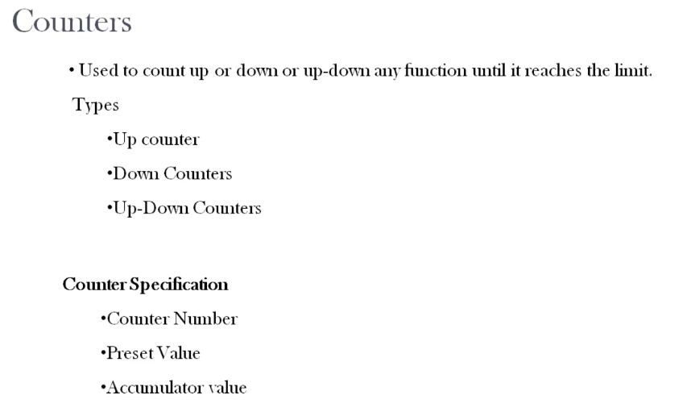
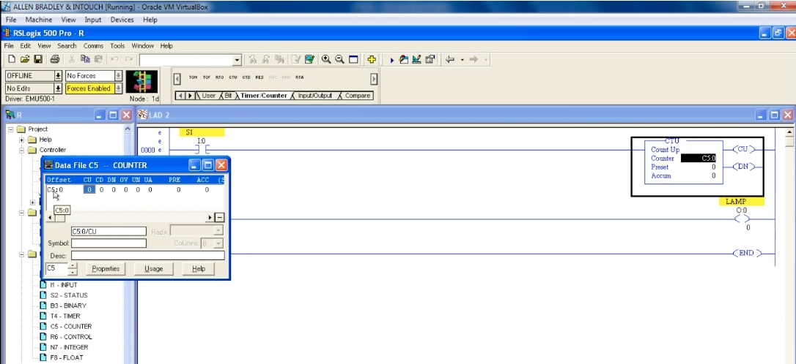
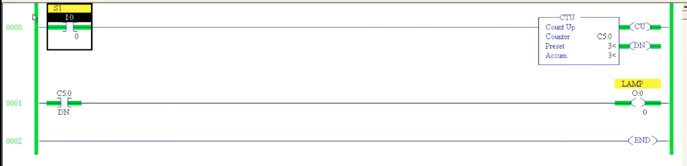
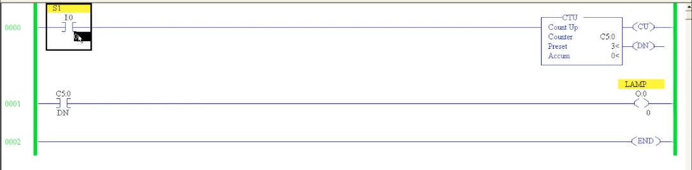
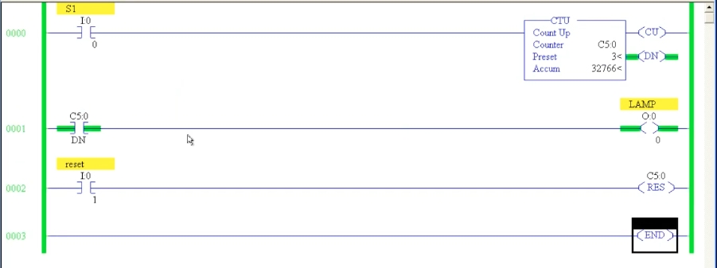

# PLC Training 30 – UP Counter (CTU) Programming | RSLogix 500 PLC Course
# PLC 教學 30 – 上數計數器（CTU）程式設計｜RSLogix 500 PLC 課程

> Source video 影片來源：<https://www.youtube.com/watch?v=XK2lAc_v6ac&list=PLI78ZBihrkE3nnGIj2WmHb_GoWjFlfFIu&index=30>
>
> Platform 平台：Allen-Bradley RSLogix 500

---

## 1. What Is a Counter? / 什麼是計數器？



**EN:**
- A counter is used to **count up, count down, or count up-down** any function until it reaches a **limit**.
- Types: **Up counter**, **Down counter**, **Up-Down counter**.
- Counter specification: **Counter number**, **Preset value**, **Accumulator value**.

**中文：**
- 計數器用來對任何動作進行**上數、下數或上下數**，直到達到**限值**為止。
- 類型：**上數計數器**、**下數計數器**、**上下數計數器**。
- 計數器規格：**計數器編號**、**預設值**、**累加值**。

---

## 2. Everyday Examples / 日常範例

### Conveyor product counting / 輸送帶產品計數

**EN:** On a conveyor, you want to count how many products pass. Place a **sensor** that gives **one pulse** each time a product crosses it. Feed that pulse to the counter and the PLC counts automatically.

**中文：**在輸送帶上要計算通過的產品數量時，裝設一個**感測器**，每當產品經過就產生**一個脈衝**。將脈衝送入計數器，PLC 便會自動計數。

### Car park / 停車場

**EN:** Counters can count from 0 up to a limit, and from the limit back down to 0. A **car park** is the perfect example:
- One sensor at the **entrance** → counts **up** (0, 1, 2 … up to the limit, e.g. 5 or 10 = parking capacity).
- One sensor at the **exit** → counts **down**: if 10 cars are inside and one leaves, the count drops 9, 8, 7 …
- When the limit is reached, an indication such as "parking full" can be given.

**中文：**計數器可由 0 數到限值，也可由限值數回 0。**停車場**是最好的例子：
- **入口**一個感測器 → **上數**（0、1、2 … 直到限值，例如容量 5 或 10 輛）。
- **出口**一個感測器 → **下數**：若場內有 10 輛車，一輛離開後計數減為 9、8、7 …
- 達到限值時可給出「車位已滿」之類的指示。

---

## 3. Counter Types in Allen-Bradley / Allen-Bradley 的計數器類型

**EN:** Some PLCs have all three counter instructions. In Allen-Bradley (RSLogix 500) there are only **two**: **CTU** (count up) and **CTD** (count down). There is no dedicated up-down instruction; an **up-down counter is built by combining CTU and CTD**. This lesson covers **CTU**; the next covers the down counter.

**中文：**有些 PLC 具備全部三種計數器指令。在 Allen-Bradley（RSLogix 500）中只有**兩種**：**CTU**（上數）與 **CTD**（下數）。沒有專用的上下數指令，**上下數計數器是結合 CTU 與 CTD 組成**。本課說明 **CTU**，下一課說明下數計數器。

---

## 4. Counter Specification / 計數器規格

| Item 項目 | Meaning 意義 | Car-park example 停車場範例 |
|---|---|---|
| Counter number 計數器編號 | Address of the counter, e.g. `C5:0` 計數器位址，如 `C5:0` | – |
| Preset value (PRE) 預設值 | The **limit** to count to 要數到的**限值** | Parking limit 10 停車容量 10 |
| Accumulator value (ACC) 累加值 | Current count 目前計數 | Cars currently inside 目前場內車輛數 |

---

## 5. Programming the CTU / 設定 CTU



**EN:**
1. Place an input contact `S1` (`I:0/0`) – the **pulse** from the conveyor sensor.
2. On the **Timer/Counter** tab, click **CTU** (Count Up). A block appears.
3. Set the **Counter** address `C5:0` (counter file `C5`; open **Data File C5 – COUNTER** to see the addresses and bits).
4. Set the **Preset** – here `3` (only three products are counted).
5. Counter bits (columns in the data file: CU, CD, DN, OV, UN, UA):
   - **CU** – count-up enable bit: ON whenever the CTU rung is true.
   - **DN** – done bit: ON when the accumulator **reaches the preset value**.
   - **OV** – overflow bit.
6. Use the done bit as a contact (address `C5:0/DN`) on the next rung to drive a `LAMP` (`O:0/0`): the lamp lights once three products have been counted.

**中文：**
1. 放置輸入接點 `S1`（`I:0/0`）——即輸送帶感測器的**脈衝**。
2. 在 **Timer/Counter** 頁籤點選 **CTU**（Count Up），出現指令方塊。
3. 設定**計數器（Counter）**位址 `C5:0`（計數器檔案 `C5`；開啟 **Data File C5 – COUNTER** 可查看位址與位元）。
4. 設定**預設值（Preset）**——此處為 `3`（只計 3 件產品）。
5. 計數器位元（資料檔欄位：CU、CD、DN、OV、UN、UA）：
   - **CU**——上數致能位元：CTU 梯級成立時為 ON。
   - **DN**——完成位元：累加值**達到預設值**時為 ON。
   - **OV**——溢位位元。
6. 在下一梯級以完成位元當接點（位址 `C5:0/DN`）驅動 `LAMP`（`O:0/0`）：數滿三件產品後燈亮。

---

## 6. Operation / 動作過程



**EN:** Initially the accumulator is **0**, the lamp is off.

**中文：**初始時累加值為 **0**，燈為 OFF。



**EN:**
1. Product 1 crosses the sensor → one pulse → accumulator = **1**, **CU** ON while the pulse is present. When the product has passed, the pulse goes OFF.
2. Product 2 → accumulator = **2**.
3. Product 3 → accumulator = **3 = preset** → **DN** turns ON → the lamp turns ON (the screenshot shows Preset 3, Accum 3, with CU and DN energized).

So the lamp indicates "counting is done / work is done" every time the preset is reached.

**中文：**
1. 產品 1 通過感測器 → 一個脈衝 → 累加值＝**1**，脈衝期間 **CU** 為 ON；產品通過後脈衝變 OFF。
2. 產品 2 → 累加值＝**2**。
3. 產品 3 → 累加值＝**3＝預設值** → **DN** 變 ON → 燈亮（截圖顯示預設 3、累加 3，CU 與 DN 通電）。

因此每當達到預設值，燈就表示「計數完成／工作完成」。

---

## 7. Counting Beyond the Preset, and Overflow / 超過預設值的計數與溢位

**EN:** If more pulses arrive after the preset is reached, the accumulator **keeps increasing** – it does not stop at 3. The **DN bit stays ON** (it is ON whenever ACC ≥ PRE). The accumulator range is **−32768 to +32767**:
- At **32767**, one more pulse makes the accumulator **roll over to −32768**, and then it continues counting up from there.
- When this happens the **overflow bit (OV)** turns ON.

If you do not reset, an up counter keeps counting as long as pulses keep coming (a down counter would keep decreasing – covered in the next lesson).

**中文：**預設值達到後如果仍有脈衝，累加值**會繼續增加**，不會停在 3。**DN 位元保持 ON**（只要累加值 ≥ 預設值即為 ON）。累加值範圍為 **−32768 到 +32767**：
- 在 **32767** 時再來一個脈衝，累加值會**繞回 −32768**，之後從該值繼續遞增。
- 此時**溢位位元（OV）**變為 ON。

若不重置，上數計數器只要持續有脈衝就會一直計數（下數計數器則會持續遞減，下一課說明）。

---

## 8. Resetting the Counter / 重置計數器



**EN:** The counter does not reset by itself, so a **reset** is mandatory. Add:
- **Rung 0002:** input `reset` (`I:0/1`) → **RES** instruction with address `C5:0`.

When `reset` is pressed, the accumulator returns to **0** and the Done bit (and lamp) turn OFF; you can start counting again from the beginning. You can reset at any time, even in the middle of counting. (The screenshot shows the accumulator at 32766 with DN ON, just before overflow.)

**中文：**計數器不會自動重置，因此**重置**是必要的。新增：
- **梯級 0002：**輸入 `reset`（`I:0/1`）→ **RES** 指令，位址為 `C5:0`。

按下 `reset` 時，累加值回到 **0**，完成位元（與燈）變為 OFF，即可重新從頭計數。計數途中也可隨時重置。（截圖為累加值 32766、DN 為 ON，接近溢位時的狀態。）

### Text diagram / 文字示意

```
      S1                           CTU  Count Up
0000 ─┤ ├─────────────────────────[ Counter C5:0 ]─( CU )
      I:0/0                       [ Preset  3     ]─( DN )
                                  [ Accum   0     ]

      C5:0                                          LAMP
0001 ─┤ ├────────────────────────────────────────────( )─
      DN                                            O:0/0

      reset                                         C5:0
0002 ─┤ ├────────────────────────────────────────( RES )─
      I:0/1

0003 ───────────────────────────────────────────[ END ]
```

---

## 9. Key Takeaways / 重點整理

| # | English | 中文 |
|---|---|---|
| 1 | A counter counts pulses until a limit (preset) is reached. | 計數器對脈衝計數，直到達到限值（預設值）。 |
| 2 | Allen-Bradley has CTU and CTD; up-down = CTU + CTD combined. | Allen-Bradley 有 CTU 與 CTD；上下數＝CTU＋CTD 組合。 |
| 3 | Specification: counter number (`C5:0`), preset, accumulator. | 規格：計數器編號（`C5:0`）、預設值、累加值。 |
| 4 | DN turns ON when ACC reaches PRE; use `C5:0/DN` to drive outputs. | ACC 達到 PRE 時 DN 為 ON；用 `C5:0/DN` 驅動輸出。 |
| 5 | Counting continues past the preset; range −32768 to 32767, then overflow (OV). | 超過預設值仍繼續計數；範圍 −32768～32767，之後溢位（OV）。 |
| 6 | A RES instruction with the counter address is mandatory to restart. | 必須使用帶計數器位址的 RES 指令才能重新計數。 |

**Next lesson / 下一課：** Down counter (CTD). 下數計數器（CTD）。

---

## Glossary / 詞彙表

| English | 中文 |
|---|---|
| Counter | 計數器 |
| Up counter (CTU) | 上數計數器 |
| Down counter (CTD) | 下數計數器 |
| Up-down counter | 上下數計數器 |
| Pulse | 脈衝 |
| Preset (PRE) | 預設值 |
| Accumulator (ACC) | 累加值 |
| Count-up enable bit (CU) | 上數致能位元 |
| Done bit (DN) | 完成位元 |
| Overflow bit (OV) | 溢位位元 |
| Roll over | 繞回 |
| Reset (RES) | 重置 |
| Sensor | 感測器 |

---

## Notes / 備註

- **EN:** The transcript was auto-generated and contained recognition errors, corrected here (e.g., "uptown instructions" → up-down instruction, "return to" → retentive timer, "precept coil" → reset coil, "-3 to 768" → −32768). The text diagram is added for clarity. In the video, the speaker places the counter after the conveyor-sensor contact; addresses (`I:0/0`, `I:0/1`, `C5:0`, `O:0/0`) were read from low-resolution screenshots – please verify against the video.
- **中文：** 原始逐字稿為語音辨識產生，含有辨識錯誤並已修正（如 "uptown instructions" → 上下數指令、"return to" → 保持型計時器、"precept coil" → 重置線圈、"-3 to 768" → −32768）。文字版梯形圖為補充說明。影片中計數器放在輸送帶感測器接點之後；位址（`I:0/0`、`I:0/1`、`C5:0`、`O:0/0`）取自低解析度截圖，請與影片核對。

## Directory / 目錄結構

```
plc_training_30_up_counter_ctu.md
images/
├── ab30_01.jpg   # Counters slide 計數器投影片
├── ab30_02.jpg   # Inserting CTU + counter data file 插入 CTU 與資料檔
├── ab30_03.jpg   # ACC = PRE = 3, DN + lamp ON 累加值達預設值
├── ab30_04.jpg   # Initial state (ACC 0) 初始狀態
└── ab30_05.jpg   # Full ladder with RES, ACC 32766 含 RES 的完整梯形圖
```
