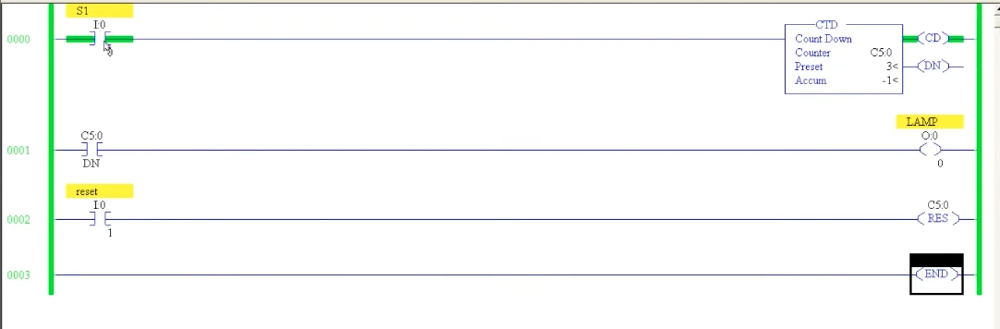
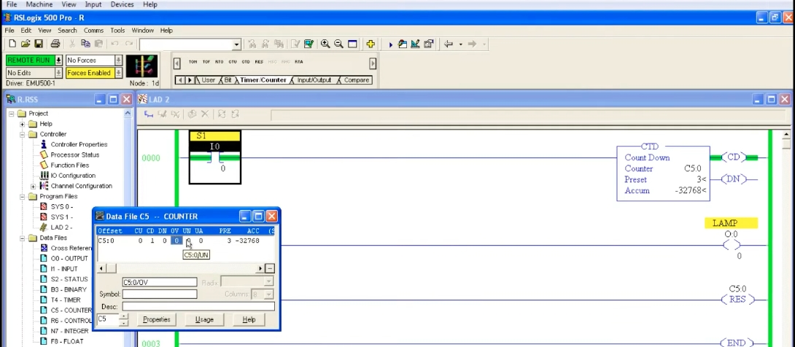
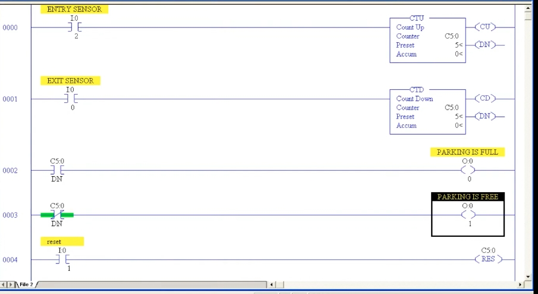

# PLC Training 31 – Down Counter (CTD Instruction) | Counters in PLC Programming
# PLC 教學 31 – 下數計數器（CTD 指令）｜PLC 程式設計中的計數器

> Source video 影片來源：<https://www.youtube.com/watch?v=-xDxxZPeJQ4&list=PLI78ZBihrkE3nnGIj2WmHb_GoWjFlfFIu&index=31>
>
> Platform 平台：Allen-Bradley RSLogix 500

---

## 1. The Down Counter (CTD) / 下數計數器（CTD）

**EN:** In the previous lesson we used the up counter (CTU). The **down counter** instruction is **CTD** (Count Down) – find it on the **Timer/Counter** tab, or type its name. Like timers, counters are **output-type instructions**: you cannot connect anything after them on the same rung. A **reset (RES)** coil is also needed, because without it you cannot bring the accumulator back to zero.

**中文：**上一課使用了上數計數器（CTU）。**下數計數器**指令是 **CTD**（Count Down）——可在 **Timer/Counter** 頁籤找到，或直接輸入名稱。與計時器一樣，計數器是**輸出型指令**：同一梯級上它之後不能再接其他東西。同時需要**重置（RES）**線圈，否則無法讓累加值回到零。

---

## 2. Down Counter Behavior / 下數計數器的行為



**EN:** Ladder: `S1` (`I:0/0`) → `CTD` `C5:0`, preset `3`; `LAMP` driven by the done bit `C5:0/DN`; `reset` (`I:0/1`) → `RES` `C5:0`.

**Starting from zero:**
- Each pulse on `S1` **decreases** the accumulator: 0 → **−1** → **−2** … (the screenshot shows Accum = −1).
- Used this way, a down counter just counts below zero, which is usually **not useful**.

**Starting from the preset:**
1. Reset, then go offline and **set the accumulator to the preset (3)** manually.
2. Download and run: now **DN is ON**, because the accumulator equals the preset. (The done bit works the same as for the up counter.)
3. Give a pulse → the accumulator becomes 2, and **DN turns OFF** (accumulator no longer equals the preset).
4. Next pulses → 1 → 0 → −1 …, decreasing as long as pulses keep coming.

**中文：**梯形圖：`S1`（`I:0/0`）→ `CTD` `C5:0`，預設值 `3`；`LAMP` 由完成位元 `C5:0/DN` 驅動；`reset`（`I:0/1`）→ `RES` `C5:0`。

**從零開始：**
- `S1` 每來一個脈衝，累加值就**遞減**：0 → **−1** → **−2** …（截圖顯示 Accum＝−1）。
- 這樣使用時，下數計數器只是數到零以下，通常**沒有用處**。

**從預設值開始：**
1. 先重置，再離線，**手動把累加值設為預設值（3）**。
2. 下載並執行：此時 **DN 為 ON**，因為累加值等於預設值。（完成位元的作用與上數計數器相同。）
3. 給一個脈衝 → 累加值變 2，**DN 變為 OFF**（累加值不再等於預設值）。
4. 後續脈衝 → 1 → 0 → −1 …，只要持續有脈衝就持續遞減。

---

## 3. Underflow / 下溢



**EN:** The accumulator range is **−32768 to +32767**. With a down counter, once the accumulator reaches **−32768**, the next pulse makes it **roll back to +32767**, and the **underflow bit (UN)** turns ON. Counting then continues downward from 32767 … 32766 … 0 … −32768 and rolls over again, until you press reset. (In the demonstration the accumulator was preloaded to −32767 or so to show the roll-over quickly; the screenshot shows Accum = −32768 and the data-file columns CU, CD, DN, OV, UN, UA.)

The underflow bit stays ON after the roll-over; it is cleared only by a **reset**, after which you can start again from the beginning.

For the up counter the corresponding bit is the **overflow (OV)** bit; for the down counter it is the **underflow (UN)** bit.

**中文：**累加值範圍為 **−32768 到 +32767**。下數時，累加值到達 **−32768** 後，下一個脈衝會讓它**繞回 +32767**，同時**下溢位元（UN）**變為 ON。之後繼續向下計數：32767 … 32766 … 0 … −32768，再次繞回，直到按下重置為止。（示範中為了快速展示繞回，先將累加值預設為接近 −32767；截圖顯示 Accum＝−32768，以及資料檔欄位 CU、CD、DN、OV、UN、UA。）

繞回後下溢位元保持 ON，只有**重置**才會清除，之後可從頭開始。

上數計數器對應的是**溢位（OV）**位元；下數計數器對應的是**下溢（UN）**位元。

---

## 4. Application: Car Park (Up-Down Counter) / 應用：停車場（上下數計數器）



**EN:** Allen-Bradley has no separate up-down counter, but **combining CTU and CTD with the *same counter address*** gives one. This is essential: both instructions must share `C5:0`, otherwise they would be two separate counters. (Using `C5:0` in one and `C5:1` in the other would not work.)

Example: a car park with room for **5 cars**.

| Rung 梯級 | Contents 內容 |
|---|---|
| 0000 | `ENTRY SENSOR` (`I:0/2`) → `CTU` `C5:0`, preset 5 |
| 0001 | `EXIT SENSOR` (`I:0/0`) → `CTD` `C5:0`, preset 5 |
| 0002 | `C5:0/DN` (NO) → `PARKING IS FULL` (`O:0/0`) |
| 0003 | `C5:0/DN` (**NC**) → `PARKING IS FREE` (`O:0/1`) |
| 0004 | `reset` (`I:0/1`) → `RES` `C5:0` |

Operation:
- The **accumulator = number of cars currently inside**. Because both counters use the same address, the value is updated by either sensor.
- Entry sensor pulse → ACC +1 (CTU). Exit sensor pulse → ACC −1 (CTD).
- Example: 1 car enters (ACC = 1), a second enters (ACC = 2), one parked car leaves (ACC = 1) … 
- When **5 cars** are inside, ACC = preset (5) → **DN ON** → "PARKING IS FULL" lights and "PARKING IS FREE" (the NC contact of DN) goes OFF.
- When one car leaves, ACC = 4, DN turns OFF → "FULL" goes off and "FREE" comes on again. When a car enters again → full.
- Reset: turn off both inputs and press `reset` → ACC = 0, parking is free.

Why the **normally closed** contact for "PARKING IS FREE"? Because "free" means the accumulator is **not equal to the preset**, i.e., DN is OFF.

**中文：**Allen-Bradley 沒有獨立的上下數計數器，但**使用*相同的計數器位址*結合 CTU 與 CTD** 即可實現。這一點很關鍵：兩個指令必須共用 `C5:0`，否則會變成兩個獨立的計數器。（一個用 `C5:0`、另一個用 `C5:1` 是行不通的。）

範例：可停放 **5 輛車**的停車場。

（梯級內容見上表。）

動作：
- **累加值＝目前場內的車輛數**。由於兩個計數器使用相同位址，任一感測器都會更新該數值。
- 入口感測器脈衝 → ACC +1（CTU）；出口感測器脈衝 → ACC −1（CTD）。
- 例：第 1 輛進入（ACC＝1），第 2 輛進入（ACC＝2），一輛已停放的車離開（ACC＝1）……
- 場內達 **5 輛**時，ACC＝預設值（5）→ **DN 為 ON** →「PARKING IS FULL（車位已滿）」亮起，「PARKING IS FREE（有空位）」（DN 的常閉接點）熄滅。
- 一輛車離開後 ACC＝4，DN 變 OFF →「已滿」熄滅、「有空位」再次亮起；再有車進入則又變滿。
- 重置：關閉兩個輸入並按下 `reset` → ACC＝0，停車場有空位。

為什麼「PARKING IS FREE」要用**常閉**接點？因為「有空位」代表累加值**不等於預設值**，也就是 DN 為 OFF。

### Text diagram / 文字示意

```
      ENTRY SENSOR                    CTU  Count Up
0000 ─┤ ├────────────────────────────[ C5:0  Preset 5 ]─( CU )
      I:0/2                                            ( DN )

      EXIT SENSOR                     CTD  Count Down
0001 ─┤ ├────────────────────────────[ C5:0  Preset 5 ]─( CD )
      I:0/0                                            ( DN )

      C5:0                                  PARKING IS FULL
0002 ─┤ ├───────────────────────────────────────────( )─
      DN                                          O:0/0

      C5:0                                  PARKING IS FREE
0003 ─┤/├───────────────────────────────────────────( )─
      DN                                          O:0/1

      reset                                         C5:0
0004 ─┤ ├────────────────────────────────────────( RES )─
      I:0/1
```

---

## 5. Key Takeaways / 重點整理

| # | English | 中文 |
|---|---|---|
| 1 | CTD decreases the accumulator on each pulse; it is an output-type instruction. | CTD 每個脈衝讓累加值遞減；屬輸出型指令。 |
| 2 | A down counter normally starts from the preset value, not from 0. | 下數計數器通常從預設值開始，而不是從 0。 |
| 3 | DN is ON when ACC equals the preset. | ACC 等於預設值時 DN 為 ON。 |
| 4 | Below −32768 it rolls over to +32767 and sets the underflow bit (UN). | 低於 −32768 時繞回 +32767，並設定下溢位元（UN）。 |
| 5 | RES is needed to return ACC to 0 and clear UN. | 需用 RES 讓 ACC 回到 0 並清除 UN。 |
| 6 | CTU + CTD with the **same address** = up-down counter. | CTU＋CTD 使用**相同位址**＝上下數計數器。 |
| 7 | Car-park: ACC = cars inside; DN = full; NC DN = free. | 停車場：ACC＝場內車輛數；DN＝已滿；DN 常閉＝有空位。 |

---

## Glossary / 詞彙表

| English | 中文 |
|---|---|
| Down counter (CTD) | 下數計數器 |
| Up counter (CTU) | 上數計數器 |
| Up-down counter | 上下數計數器 |
| Count-down bit (CD) | 下數致能位元 |
| Done bit (DN) | 完成位元 |
| Overflow bit (OV) | 溢位位元 |
| Underflow bit (UN) | 下溢位元 |
| Roll back / roll over | 繞回 |
| Reset (RES) | 重置 |
| Entry / Exit sensor | 入口／出口感測器 |
| Parking full / free | 車位已滿／有空位 |

---

## Notes / 備註

- **EN:** The transcript was auto-generated and contained recognition errors, corrected here (e.g., "QCTD / CTT" → CTD, "done counter / Dan bit" → done bit, "ready to 3 to 766" → 32766, "Danby" etc.). The demonstration of the underflow used a preloaded accumulator value; the exact value in the video is hard to recover from the transcript. The text diagram is added for clarity. Addresses (`I:0/0`, `I:0/1`, `I:0/2`, `C5:0`, `O:0/0`, `O:0/1`) were read from low-resolution screenshots – please verify against the video.
- **中文：** 原始逐字稿為語音辨識產生，含有辨識錯誤並已修正（如 "QCTD / CTT" → CTD、"Dan bit" → 完成位元、"ready to 3 to 766" → 32766）。下溢示範使用了預先載入的累加值，影片中的確切數值無法從逐字稿還原。文字版梯形圖為補充說明。位址（`I:0/0`、`I:0/1`、`I:0/2`、`C5:0`、`O:0/0`、`O:0/1`）取自低解析度截圖，請與影片核對。

## Directory / 目錄結構

```
plc_training_31_down_counter_ctd.md
images/
├── ab31_01.jpg   # CTD ladder, ACC = −1 CTD 梯形圖
├── ab31_02.jpg   # Counter data file, underflow 計數器資料檔（下溢）
└── ab31_03.jpg   # Car-park ladder 停車場梯形圖
```
