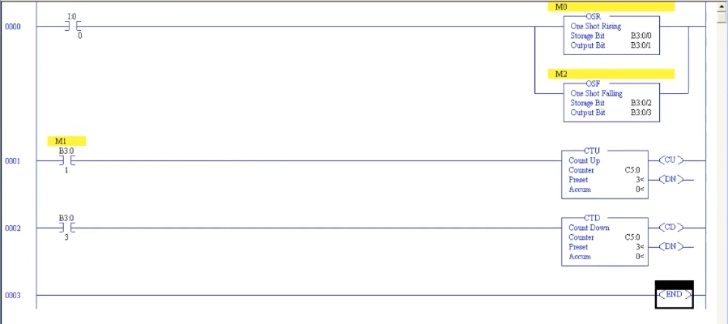
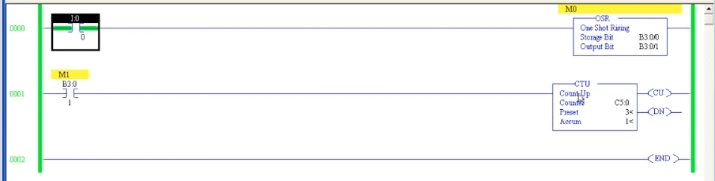
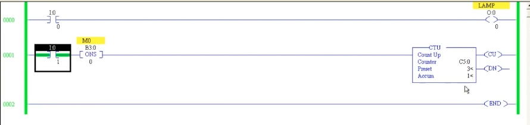
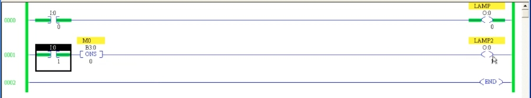

# PLC 教程 32:位元指令 ONS / OSR / OSF
# PLC Training 32: Bit Instructions – ONS / OSR / OSF

> 來源 Source:<https://www.youtube.com/watch?v=vbNxwH-jF9c&list=PLI78ZBihrkE3nnGIj2WmHb_GoWjFlfFIu&index=32>
> 平台 Platform:Allen-Bradley(RSLogix 500 / SLC 500 風格 Style)

---

## 目錄 Contents

1. [簡介 Introduction](#1-簡介--introduction)
2. [ONS 單次觸發 One Shot](#2-ons-單次觸發--one-shot)
3. [OSR 上升緣單次觸發 One Shot Rising](#3-osr-上升緣單次觸發--one-shot-rising)
4. [OSF 下降緣單次觸發 One Shot Falling](#4-osf-下降緣單次觸發--one-shot-falling)
5. [三者比較 Comparison](#5-三者比較--comparison)
6. [重點整理 Summary](#6-重點整理--summary)

---

## 1. 簡介 | Introduction

**中文**
本節介紹位元(Bit)指令中的三個「單次觸發」指令,可在 Bit 指令選單中找到:

- **ONS**(One Shot):單次觸發
- **OSR**(One Shot Rising):上升緣單次觸發
- **OSF**(One Shot Falling):下降緣單次觸發

它們的共同功能是:**不論輸入維持多久,只輸出「一個掃描週期」的脈衝(pulse)**。

**English**
This lesson covers three "one-shot" instructions found in the Bit instruction group:

- **ONS** (One Shot)
- **OSR** (One Shot Rising)
- **OSF** (One Shot Falling)

Their common purpose: **no matter how long the input stays ON, they produce only a single pulse (one scan).**

---

## 2. ONS 單次觸發 | One Shot

### 2.1 特性 | Characteristics

**中文**
- ONS **不是輸出指令**,因此它的**後面必須再接一個輸出**(線圈、計數器、計時器等)。
- 只需要**一個記憶體位址**(例如 `B3:0/0`),用來儲存上一次掃描的狀態。
- 輸入由 OFF → ON 時,輸出只會導通一個掃描週期;輸入持續為 ON,輸出也不會再導通。

**English**
- ONS is **not an output instruction**, so you must **connect an output after it** (coil, counter, timer, etc.).
- It needs only **one memory address** (e.g. `B3:0/0`) to store the previous scan state.
- When the input goes OFF → ON, the rung output is true for exactly one scan; holding the input ON does not re-trigger it.

### 2.2 範例一:燈號比較 | Example 1: Lamp Comparison

**中文**
建立兩個 Rung 來比較差異:

| Rung | 結構 | 行為 |
|------|------|------|
| 0 | `I:0/0` → `LAMP` | 輸入直接接燈,**按著就持續亮** |
| 1 | `I:0/0` → `ONS (B3:0/0)` → `LAMP2` | 中間有 ONS,**只閃一下就熄滅** |

**English**

| Rung | Structure | Behavior |
|------|-----------|----------|
| 0 | `I:0/0` → `LAMP` | Input wired directly to the lamp – **stays ON while held** |
| 1 | `I:0/0` → `ONS (B3:0/0)` → `LAMP2` | ONS in between – **flashes once, then OFF** |



*圖 1:上線 LAMP 持續導通;下線 LAMP2 經 ONS 後僅單次脈衝。*
*Fig. 1: The top lamp stays ON; the lower lamp (through ONS) gets only a single pulse.*

**中文** 線上測試:持續按住 `I:0/0` 時,LAMP 一直亮;LAMP2 只在按下瞬間亮一下。再按一次,同樣只亮一次。

**English** Online test: while `I:0/0` is held, LAMP stays ON, whereas LAMP2 lights only for an instant. Pressing again gives one more single flash.

### 2.3 範例二:用計數器驗證 | Example 2: Verifying with a Counter

**中文**
將 ONS 的輸出接到計數器 `CTU C5:0`,Preset = 3。每按一次輸入,計數值只 +1(因為只有一個脈衝),按三次後 Accum = 3,Done 位元(DN)導通。

**English**
Connect the ONS output to a count-up counter `CTU C5:0`, Preset = 3. Each press adds exactly 1 (one pulse per press). After three presses Accum = 3 and the Done (DN) bit turns ON.



*圖 2:輸入導通後,Accum 只增加 1。*
*Fig. 2: After the input turns ON, Accum increases by only 1.*

### 2.4 應用 | Applications

**中文**
例如**雷射切割**:若持續送出訊號,會切得過深;改為單次脈衝,就能精確控制切割深度與動作次數。

**English**
For example, **laser cutting**: a continuous signal could cut too deep; a single pulse gives precise control over the depth and the number of actions.

---

## 3. OSR 上升緣單次觸發 | One Shot Rising

### 3.1 說明 | Description

**中文**
- 輸入**由 0 變 1(上升緣,Rising Edge)**的瞬間,輸出一個脈衝。
- 輸入由 1 變 0 時**不會**有任何動作。
- OSR **是輸出指令**,需要兩個位址:
  - **Storage Bit(儲存位元)**:`B3:0/0`,記錄上一次輸入狀態
  - **Output Bit(輸出位元)**:`B3:0/1`,產生單次脈衝,供其他 Rung 使用

**English**
- Produces one pulse the moment the input goes **from 0 to 1 (rising edge)**.
- Nothing happens when the input goes from 1 to 0.
- OSR **is an output instruction** and needs two addresses:
  - **Storage Bit**: `B3:0/0` – remembers the previous input state
  - **Output Bit**: `B3:0/1` – carries the one-scan pulse, used by other rungs

### 3.2 範例 | Example

**中文**
- Rung 0:`I:0/0` → `OSR`(Storage `B3:0/0`、Output `B3:0/1`)
- Rung 1:`B3:0/1`(XIC,說明 M1)→ `CTU C5:0`(Preset 3)

導通 `I:0/0` 時,計數值 +1;關閉 `I:0/0` 不會有任何變化;再次導通才會再 +1。

**English**
- Rung 0: `I:0/0` → `OSR` (Storage `B3:0/0`, Output `B3:0/1`)
- Rung 1: `B3:0/1` (XIC, description M1) → `CTU C5:0` (Preset 3)

Turning `I:0/0` ON increments the counter by 1; turning it OFF does nothing; turning it ON again adds another 1.



*圖 3:輸入導通後,Accum = 1。*
*Fig. 3: After the input turns ON, Accum = 1.*

---

## 4. OSF 下降緣單次觸發 | One Shot Falling

### 4.1 說明 | Description

**中文**
- 輸入**由 1 變 0(下降緣,Falling Edge)**的瞬間,輸出一個脈衝。
- 同樣是輸出指令,需要 Storage Bit 與 Output Bit 兩個位址(本例:`B3:0/2`、`B3:0/3`)。

**English**
- Produces one pulse the moment the input goes **from 1 to 0 (falling edge)**.
- Also an output instruction, requiring a Storage Bit and an Output Bit (here `B3:0/2`, `B3:0/3`).

### 4.2 綜合範例:OSR + OSF | Combined Example: OSR + OSF

**中文**
同一個輸入 `I:0/0` 以**分支(Branch)**同時接 OSR 與 OSF:

| Rung | 內容 |
|------|------|
| 0 | `I:0/0` → 分支:`OSR`(`B3:0/0`、`B3:0/1`)與 `OSF`(`B3:0/2`、`B3:0/3`) |
| 1 | `B3:0/1` → `CTU C5:0`,Preset 3(加計數) |
| 2 | `B3:0/3` → `CTD C5:0`,Preset 3(減計數) |

**English**

| Rung | Content |
|------|---------|
| 0 | `I:0/0` → branch: `OSR` (`B3:0/0`, `B3:0/1`) and `OSF` (`B3:0/2`, `B3:0/3`) |
| 1 | `B3:0/1` → `CTU C5:0`, Preset 3 (count up) |
| 2 | `B3:0/3` → `CTD C5:0`, Preset 3 (count down) |



*圖 4:OSR 驅動加計數,OSF 驅動減計數,共用同一個計數器 C5:0。*
*Fig. 4: OSR drives the count-up, OSF drives the count-down, both on the same counter C5:0.*

**中文 動作過程**
1. 輸入 OFF → ON:OSR 產生脈衝 → CTU 加 1 → Accum = 1。
2. 輸入 ON → OFF:OSF 產生脈衝 → CTD 減 1 → Accum 回到 0。
3. 重複操作,計數值最大只會是 1(因為每次上升緣 +1,下降緣 −1)。

**English Sequence**
1. Input OFF → ON: OSR pulses → CTU adds 1 → Accum = 1.
2. Input ON → OFF: OSF pulses → CTD subtracts 1 → Accum returns to 0.
3. Repeating this, the count never exceeds 1 (+1 on every rising edge, −1 on every falling edge).

### 4.3 時序圖 | Timing Diagram

```
輸入 Input I:0/0     __┌──────────┐______┌────┐__
OSR 輸出 B3:0/1      __┌┐_________________┌┐_____   ← 上升緣 Rising edge
OSF 輸出 B3:0/3      ___________┌┐____________┌┐_   ← 下降緣 Falling edge
計數 Accum C5:0       0  1       0       1     0
```

---

## 5. 三者比較 | Comparison

| 指令 Instruction | 類型 Type | 位址 Addresses | 觸發時機 Triggers on | 後面需接輸出? Output needed after? |
|---|---|---|---|---|
| **ONS** | 非輸出指令 Non-output | 1(Storage) | 上升緣 Rung false → true | 需要 Yes |
| **OSR** | 輸出指令 Output | 2(Storage + Output) | 0 → 1 | 否,輸出位元供其他 Rung 使用 No – Output Bit is used in other rungs |
| **OSF** | 輸出指令 Output | 2(Storage + Output) | 1 → 0 | 否 No |

---

## 6. 重點整理 | Summary

**中文**
1. 單次觸發指令只產生**一個掃描週期**的脈衝,與輸入持續時間無關。
2. **ONS** 放在 Rung 中間,後面要接輸出;只需一個位址。
3. **OSR** 偵測**上升緣(0→1)**;**OSF** 偵測**下降緣(1→0)**;各需 Storage Bit 與 Output Bit。
4. 每個單次觸發指令應使用各自獨立的 Storage Bit,不可重複。
5. 常見應用:計數器計數、雷射切割、狀態變化偵測、避免重複觸發。
6. 下一節:**栓鎖與解栓(Latch / Unlatch)** 指令。

**English**
1. One-shot instructions generate a pulse of **one scan only**, regardless of how long the input stays ON.
2. **ONS** sits mid-rung and must be followed by an output; it needs one address.
3. **OSR** detects the **rising edge (0→1)**; **OSF** detects the **falling edge (1→0)**; each needs a Storage Bit and an Output Bit.
4. Give each one-shot instruction its own Storage Bit; never reuse one.
5. Typical uses: counting events, laser cutting, state-change detection, preventing repeated triggering.
6. Next lesson: **Latch / Unlatch** instructions.

---

## 附:檔案結構 | Appendix: File Layout

```
PLC_32_Bit_Instructions_ONS_OSR_OSF.md
images/
├── ab32_01.jpg   # OSR + OSF + CTU/CTD
├── ab32_02.jpg   # OSR + CTU
├── ab32_03.jpg   # ONS + CTU
└── ab32_04.jpg   # ONS vs. direct lamp
```
