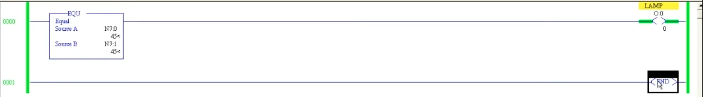
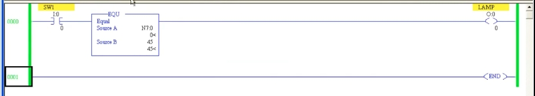
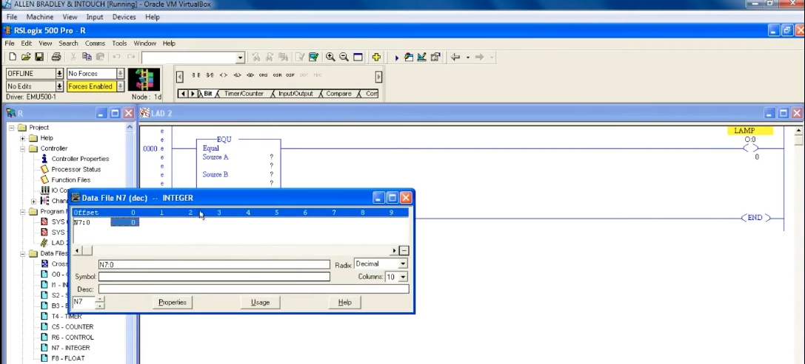
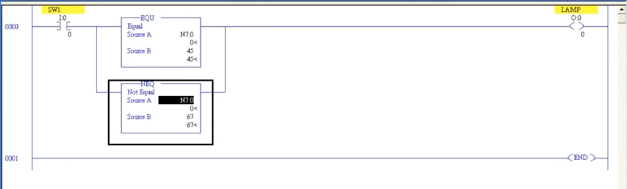
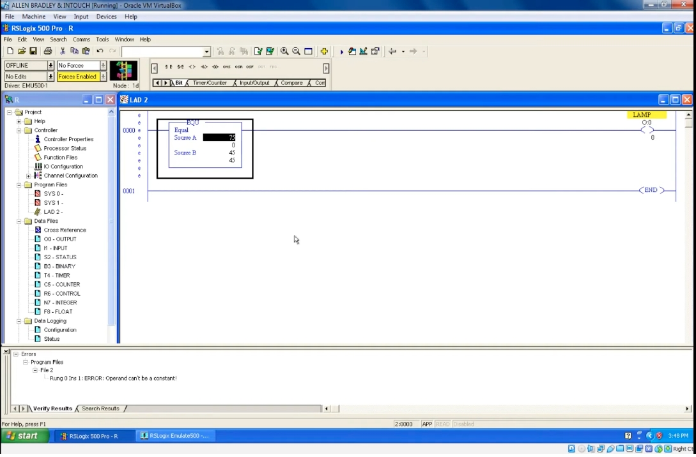

# PLC 教程 34:比較指令 EQU 與 NEQ
# PLC Training 34: EQU and NEQ Comparators

> 來源 Source:<https://www.youtube.com/watch?v=kEkRMLGsjzI&list=PLI78ZBihrkE3nnGIj2WmHb_GoWjFlfFIu&index=34>
> 平台 Platform:Allen-Bradley(RSLogix 500 Pro / SLC 500 風格 Style)

---

## 目錄 Contents

1. [簡介 Introduction](#1-簡介--introduction)
2. [整數資料檔 Integer Data File (N7)](#2-整數資料檔--integer-data-file-n7)
3. [EQU:兩個位址比較 EQU: Comparing Two Addresses](#3-equ兩個位址比較--equ-comparing-two-addresses)
4. [Source B 使用常數 Constant in Source B](#4-source-b-使用常數--constant-in-source-b)
5. [Source A 不能是常數 Source A Cannot Be a Constant](#5-source-a-不能是常數--source-a-cannot-be-a-constant)
6. [加入輸入條件 Adding an Input Condition](#6-加入輸入條件--adding-an-input-condition)
7. [EQU 與 NEQ 並聯 EQU and NEQ in Parallel](#7-equ-與-neq-並聯--equ-and-neq-in-parallel)
8. [重點整理 Summary](#8-重點整理--summary)

---

## 1. 簡介 | Introduction

**中文**
**比較指令(Comparator)** 用來比較兩個數值,可比較整數(Integer)、長整數(Double Integer)或浮點數(Real)等類比數值。在 Compare 選單中包含:

| 指令 | 英文 | 意義 |
|------|------|------|
| **EQU** | Equal | 等於 |
| **NEQ** | Not Equal | 不等於 |
| LES | Less Than | 小於 |
| GRT | Greater Than | 大於 |
| LEQ | Less Than or Equal | 小於或等於 |
| GEQ | Greater Than or Equal | 大於或等於 |

本節先介紹 **EQU** 與 **NEQ**,其餘留待下一節。

比較指令是**輸入指令**,因此後面**必須接一個輸出線圈**:比較結果為真,線圈導通;為假,線圈不導通。

**English**
A **comparator** compares two values. It can compare integers, double integers, or real numbers (analog values). The Compare menu contains:

| Instruction | Meaning |
|------|------|
| **EQU** | Equal |
| **NEQ** | Not Equal |
| LES | Less Than |
| GRT | Greater Than |
| LEQ | Less Than or Equal |
| GEQ | Greater Than or Equal |

This lesson covers **EQU** and **NEQ**; the rest follow in the next lesson.

Comparators are **input instructions**, so you must **connect an output coil after them**: if the comparison is true the coil turns ON, if false it stays OFF.

---

## 2. 整數資料檔 | Integer Data File (N7)

**中文**
比較指令有兩個參數:**Source A** 與 **Source B**,也就是要比較的兩個值。

- 在左側 **Data Files** 中,**N7 – INTEGER** 就是整數資料檔。
- 位址格式為 `N7:0`、`N7:1`、`N7:2` …… 第一個整數用 `N7:0`,下一個用 `N7:1`。
- 開啟資料檔視窗即可查看與修改數值(預設為 0)。

**English**
A comparator has two parameters: **Source A** and **Source B**, the two values to compare.

- In the **Data Files** tree on the left, **N7 – INTEGER** is the integer data file.
- Address format: `N7:0`, `N7:1`, `N7:2` … Use `N7:0` for the first integer, `N7:1` for the next.
- Open the data file window to view and change values (default 0).



*圖 1:EQU 指令(Source A、Source B 尚未設定)與 `N7:0` 整數資料檔視窗。*
*Fig. 1: The EQU instruction (Source A and B not yet set) and the `N7:0` integer data file window.*

---

## 3. EQU:兩個位址比較 | EQU: Comparing Two Addresses

**中文**
設定如下:

- Rung 0:`EQU`,Source A = `N7:0`,Source B = `N7:1` → `LAMP`(`O:0/0`)

下載並進入 Run 模式後:

1. `N7:0` 與 `N7:1` 都是 0 → **相等** → LAMP **亮**。
2. 把 `N7:0` 改為 45 → 0 ≠ 45 → LAMP **熄**。
3. 把 `N7:1` 也改為 45 → 兩者相等 → LAMP **再次亮起**。

**English**
Setup:

- Rung 0: `EQU`, Source A = `N7:0`, Source B = `N7:1` → `LAMP` (`O:0/0`)

After downloading and going to Run mode:

1. `N7:0` and `N7:1` are both 0 → **equal** → LAMP **ON**.
2. Change `N7:0` to 45 → 45 ≠ 0 → LAMP **OFF**.
3. Change `N7:1` to 45 too → equal → LAMP **ON** again.



*圖 2:`N7:0` = `N7:1` = 45,比較結果為真,LAMP 導通(綠色)。*
*Fig. 2: `N7:0` = `N7:1` = 45; the comparison is true and LAMP is ON (green).*

---

## 4. Source B 使用常數 | Constant in Source B

**中文**
Source B 也可以直接填**常數**,例如 45:

- 條件變成:`N7:0` 等於 45 時 LAMP 才亮。
- 檢查錯誤:無錯誤。
- **重要:常數無法在線上(Online)修改。** 在 Run 模式下點選常數並輸入新值(如 65)不會生效,若要更改,必須**回到 Offline 模式修改後再下載**。若要在執行中調整比較值,請改用位址(如 `N7:1`)。

**English**
Source B may also be a **constant**, e.g. 45:

- The condition becomes: LAMP is ON only when `N7:0` equals 45.
- Verify: no errors.
- **Important: a constant cannot be changed online.** Clicking the constant in Run mode and typing a new value (e.g. 65) has no effect. To change it, **go Offline, edit, and download again**. If you need to adjust the compare value at runtime, use an address (e.g. `N7:1`) instead.

---

## 5. Source A 不能是常數 | Source A Cannot Be a Constant

**中文**
若把 **Source A** 也設為常數(例如 75,Source B 為 45),驗證時會出現錯誤:

> `ERROR: Operand can't be a constant!`

規則:

- **Source A 必須是位址。**
- **Source B 可以是位址或常數。**
- 兩者**不能同時是常數**。

**English**
If you also set **Source A** to a constant (e.g. 75, with Source B = 45), verification gives an error:

> `ERROR: Operand can't be a constant!`

Rules:

- **Source A must be an address.**
- **Source B can be an address or a constant.**
- **Both cannot be constants** at the same time.



*圖 3:Source A = 75、Source B = 45,下方錯誤視窗顯示「Operand can't be a constant!」。*
*Fig. 3: Source A = 75, Source B = 45; the error pane shows "Operand can't be a constant!".*

> 註:影片逐字稿中的「source C / source we」為語音辨識錯誤,實際指 **Source A / Source B**。
> Note: "source C / source we" in the raw transcript are speech-recognition errors for **Source A / Source B**.

---

## 6. 加入輸入條件 | Adding an Input Condition

**中文**
比較指令與其他輸入指令一樣,可以串聯其他條件。在 EQU 前加一個輸入接點 `SW1`(`I:0/0`):

- Rung 0:`SW1` → `EQU`(`N7:0` = 45)→ `LAMP`

**整個 Rung 必須全部為真,LAMP 才會亮。** 因此:

- 把 `N7:0` 改成 45,但 `SW1` 沒導通 → LAMP **不亮**。
- `SW1` 導通後,LAMP 才亮。
- 之後只要 `N7:0` 不是 45(如 89),LAMP 就熄滅;改回 45 才再亮。

**English**
A comparator can be combined with other conditions like any input instruction. Add an input contact `SW1` (`I:0/0`) before the EQU:

- Rung 0: `SW1` → `EQU` (`N7:0` = 45) → `LAMP`

**The whole rung must be true for LAMP to turn ON.** So:

- Set `N7:0` to 45 but leave `SW1` OFF → LAMP stays **OFF**.
- Once `SW1` is ON, LAMP turns ON.
- If `N7:0` then changes to something else (e.g. 89), LAMP turns OFF; set it back to 45 and it turns ON again.



*圖 4:`SW1` 串聯 EQU(`N7:0` 與常數 45)。目前 `N7:0` = 0,比較為假,LAMP 熄滅。*
*Fig. 4: `SW1` in series with EQU (`N7:0` vs constant 45). `N7:0` = 0, so the comparison is false and LAMP is OFF.*

---

## 7. EQU 與 NEQ 並聯 | EQU and NEQ in Parallel

**中文**
**NEQ(Not Equal)** 在兩個值**不相等**時為真。把 EQU 與 NEQ 以**分支(Branch)並聯**:

- Rung 0:`SW1` → 分支 { `EQU`(`N7:0` = 45)/ `NEQ`(`N7:0` ≠ 67)} → `LAMP`

並聯代表 **OR(或)邏輯**:任一條成立,LAMP 就亮。



*圖 5:`SW1` 之後以分支並聯 EQU(`N7:0`、45)與 NEQ(`N7:0`、67),輸出至 LAMP。*
*Fig. 5: After `SW1`, EQU (`N7:0`, 45) and NEQ (`N7:0`, 67) are branched in parallel to LAMP.*

**真值表(依本例推算,非影片內容)**
**Truth table (derived from this example, not from the video)**

| `N7:0` | EQU(= 45) | NEQ(≠ 67) | LAMP(`SW1` 導通 ON) |
|:---:|:---:|:---:|:---:|
| 0 | 假 F | 真 T | **亮 ON** |
| 45 | 真 T | 真 T | **亮 ON** |
| 67 | 假 F | 假 F | **熄 OFF** |

**中文** 影片示範:`N7:0` = 0 時,0 ≠ 67,NEQ 為真,LAMP 亮;將其改為 67 後,兩個比較都為假,LAMP 熄滅。

**English** The video demo: with `N7:0` = 0, 0 ≠ 67 so NEQ is true and LAMP is ON; changing it to 67 makes both comparisons false and LAMP turns OFF.

---

## 8. 重點整理 | Summary

**中文**
1. 比較指令是**輸入指令**,後面必須接輸出線圈。
2. **EQU**:Source A = Source B 時為真;**NEQ**:Source A ≠ Source B 時為真。
3. 整數位址格式為 `N7:x`。
4. **Source A 必須是位址**;Source B 可為位址或常數;兩者不可同時為常數。
5. 常數無法在 Online 時修改,需回 Offline 修改並重新下載;需要即時調整時請使用位址。
6. 比較指令可與其他接點串聯(AND)或並聯(OR),整個 Rung 為真輸出才導通。
7. 下一節:Less Than、Greater Than 等其他比較指令。

**English**
1. Comparators are **input instructions** and must be followed by an output coil.
2. **EQU** is true when Source A = Source B; **NEQ** is true when Source A ≠ Source B.
3. Integer address format is `N7:x`.
4. **Source A must be an address**; Source B can be an address or a constant; both cannot be constants.
5. Constants cannot be edited online – go Offline, edit, and download again; use addresses if you need runtime changes.
6. Comparators can be combined in series (AND) or parallel (OR); the output is ON only when the whole rung is true.
7. Next lesson: Less Than, Greater Than and the other comparators.

---

## 附:檔案結構 | Appendix: File Layout

```
PLC_34_EQU_and_NEQ_Comparators.md
images/
├── ab34_01.jpg   # Error: operand can't be a constant
├── ab34_02.jpg   # EQU instruction + N7 data file window
├── ab34_03.jpg   # EQU and NEQ in parallel
├── ab34_04.jpg   # EQU N7:0 = N7:1 = 45, LAMP ON
└── ab34_05.jpg   # SW1 + EQU (N7:0 vs constant 45)
```
