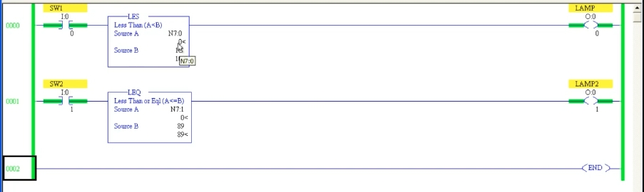
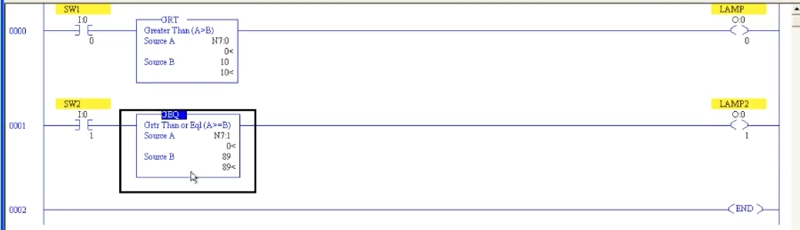

# PLC 教程 35:比較指令 LES / LEQ / GRT / GEQ
# PLC Training 35: Less Than and Greater Than Instructions (LES, LEQ, GRT, GEQ)

> 來源 Source:<https://www.youtube.com/watch?v=oeXxOO99sHk&list=PLI78ZBihrkE3nnGIj2WmHb_GoWjFlfFIu&index=35>
> 平台 Platform:Allen-Bradley(RSLogix 500 Pro / SLC 500 風格 Style)

---

## 目錄 Contents

1. [簡介 Introduction](#1-簡介--introduction)
2. [LES 與 LEQ Less Than and Less Than or Equal](#2-les-與-leq--less-than-and-less-than-or-equal)
3. [使用常數 Using Constants](#3-使用常數--using-constants)
4. [GRT 與 GEQ Greater Than and Greater Than or Equal](#4-grt-與-geq--greater-than-and-greater-than-or-equal)
5. [六個比較指令總表 The Six Comparators at a Glance](#5-六個比較指令總表--the-six-comparators-at-a-glance)
6. [重點整理 Summary](#6-重點整理--summary)

---

## 1. 簡介 | Introduction

**中文**
延續上一節的 EQU / NEQ,本節介紹其餘四個比較指令:

- **LES**(Less Than):A < B
- **LEQ**(Less Than or Equal):A ≤ B
- **GRT**(Greater Than):A > B
- **GEQ**(Greater Than or Equal):A ≥ B

它們和 EQU / NEQ 一樣是**輸入指令**,後面必須接輸出線圈;結果為真,線圈導通,為假則不導通。每個指令都有 **Source A** 與 **Source B** 兩個參數,比較的方向是「**A 對 B**」。

**English**
Continuing from EQU / NEQ in the last lesson, this lesson covers the remaining four comparators:

- **LES** (Less Than): A < B
- **LEQ** (Less Than or Equal): A ≤ B
- **GRT** (Greater Than): A > B
- **GEQ** (Greater Than or Equal): A ≥ B

Like EQU / NEQ they are **input instructions** and must be followed by an output coil: true turns the coil ON, false leaves it OFF. Each has a **Source A** and a **Source B**, and the comparison always reads "**A against B**".

> 註:YouTube 標題中的 "GES" 應為 **GEQ**,這是 RSLogix 500 中實際使用的指令名稱。
> Note: "GES" in the YouTube title should be **GEQ**, the instruction name actually used in RSLogix 500.

---

## 2. LES 與 LEQ | Less Than and Less Than or Equal

**中文**
建立兩個 Rung,各有自己的輸入與輸出:

- Rung 0:`SW1`(`I:0/0`)→ `LES`(Source A、Source B)→ `LAMP`(`O:0/0`)
- Rung 1:`SW2`(`I:0/1`)→ `LEQ`(Source A、Source B)→ `LAMP2`(`O:0/1`)

**實驗一:兩個值相同(皆為 0)**

| 指令 | 判斷 | 結果 |
|------|------|------|
| LES | 0 < 0 | 假 → LAMP **熄** |
| LEQ | 0 ≤ 0 | 真 → LAMP2 **亮** |

這就是「小於」與「小於或等於」的差別:**兩值相等時,LES 為假,LEQ 為真。**

**實驗二:改變數值**

1. 讓 Source B 大於 Source A(如 B = 8):兩者都為真 → 兩盞燈都亮。
2. 讓 Source A 等於 Source B(如皆為 8):LES 變假(熄),LEQ 仍為真(亮)。
3. 讓 Source A 大於 Source B(如 A = 9、B = 8):兩者都為假 → 兩盞燈都熄。

**English**
Create two rungs, each with its own input and output:

- Rung 0: `SW1` (`I:0/0`) → `LES` (Source A, Source B) → `LAMP` (`O:0/0`)
- Rung 1: `SW2` (`I:0/1`) → `LEQ` (Source A, Source B) → `LAMP2` (`O:0/1`)

**Experiment 1: both values equal (both 0)**

| Instruction | Test | Result |
|------|------|------|
| LES | 0 < 0 | False → LAMP **OFF** |
| LEQ | 0 ≤ 0 | True → LAMP2 **ON** |

This is the difference between "less than" and "less than or equal": **when the values are equal, LES is false while LEQ is true.**

**Experiment 2: changing the values**

1. Make Source B larger than Source A (e.g. B = 8): both are true → both lamps ON.
2. Make Source A equal Source B (e.g. both 8): LES becomes false (OFF), LEQ stays true (ON).
3. Make Source A larger than Source B (e.g. A = 9, B = 8): both are false → both lamps OFF.

> 註:實驗二的具體數字為依影片講解整理的示意值。
> Note: The specific numbers in Experiment 2 are illustrative values summarizing the video's explanation.

---

## 3. 使用常數 | Using Constants

**中文**
與上一節相同,**Source B 可以是常數**,Source A 必須是位址(兩者不可同時為常數)。本例設定:

- `LES`:Source A = `N7:0`,Source B = 常數 **10**
- `LEQ`:Source A = `N7:1`,Source B = 常數 **89**

結果:

- 兩個位址初始皆為 0:0 < 10 為真、0 ≤ 89 為真 → **兩盞燈都亮**。
- `N7:0` 只要小於 10,LES 就維持導通;達到 10 或更大時熄滅。
- `N7:1` 在 89 以下(含 89)LEQ 都導通;**剛好等於 89 仍然亮**,超過 89 才熄滅。



*圖 1:Rung 0 為 `LES`(`N7:0` < 10),Rung 1 為 `LEQ`(`N7:1` ≤ 89)。目前兩個值皆為 0,比較為真,LAMP 與 LAMP2 都導通(綠色)。*
*Fig. 1: Rung 0 is `LES` (`N7:0` < 10), Rung 1 is `LEQ` (`N7:1` ≤ 89). Both values are 0, both comparisons are true, and LAMP and LAMP2 are ON (green).*

**English**
As in the last lesson, **Source B may be a constant**, but Source A must be an address (both cannot be constants). In this example:

- `LES`: Source A = `N7:0`, Source B = constant **10**
- `LEQ`: Source A = `N7:1`, Source B = constant **89**

Results:

- Both addresses start at 0: 0 < 10 is true and 0 ≤ 89 is true → **both lamps ON**.
- LES stays ON while `N7:0` is below 10; it turns OFF at 10 or more.
- LEQ is ON for `N7:1` up to and including 89; **exactly 89 is still ON**, and it turns OFF only above 89.

---

## 4. GRT 與 GEQ | Greater Than and Greater Than or Equal

**中文**
只要在指令上按右鍵或直接修改指令名稱,就能把 LES 換成 GRT、把 LEQ 換成 GEQ,位址與常數可以沿用:

- Rung 0:`SW1` → `GRT`(`N7:0` > 10)→ `LAMP`
- Rung 1:`SW2` → `GEQ`(`N7:1` ≥ 89)→ `LAMP2`

動作:

1. 兩個位址皆為 0:0 > 10 為假、0 ≥ 89 為假 → **兩盞燈都熄**。
2. 把 `N7:0` 調到大於 10、`N7:1` 調到 89 或更大 → 比較為真 → 燈亮。
3. 注意 GEQ 在 `N7:1` **剛好等於 89** 時就已經導通,而 GRT 在 `N7:0` 等於 10 時仍為假。



*圖 2:Rung 0 為 `GRT`(`N7:0` > 10),Rung 1 為 `GEQ`(`N7:1` ≥ 89)。兩個值皆為 0,比較為假,LAMP 與 LAMP2 都熄滅。*
*Fig. 2: Rung 0 is `GRT` (`N7:0` > 10), Rung 1 is `GEQ` (`N7:1` ≥ 89). Both values are 0, both comparisons are false, and LAMP and LAMP2 are OFF.*

**English**
You can change LES to GRT and LEQ to GEQ simply by editing the instruction name; addresses and constants can be reused:

- Rung 0: `SW1` → `GRT` (`N7:0` > 10) → `LAMP`
- Rung 1: `SW2` → `GEQ` (`N7:1` ≥ 89) → `LAMP2`

Operation:

1. Both addresses are 0: 0 > 10 is false and 0 ≥ 89 is false → **both lamps OFF**.
2. Raise `N7:0` above 10 and `N7:1` to 89 or more → comparisons become true → lamps ON.
3. Note that GEQ is already ON when `N7:1` is **exactly 89**, while GRT is still false when `N7:0` equals 10.

---

## 5. 六個比較指令總表 | The Six Comparators at a Glance

| 指令 Instruction | 名稱 Name | 條件(為真時導通) True when | A = 5, B = 5 | A = 3, B = 5 | A = 8, B = 5 |
|:---:|---|:---:|:---:|:---:|:---:|
| **EQU** | Equal | A = B | 真 T | 假 F | 假 F |
| **NEQ** | Not Equal | A ≠ B | 假 F | 真 T | 真 T |
| **LES** | Less Than | A < B | 假 F | 真 T | 假 F |
| **LEQ** | Less Than or Equal | A ≤ B | 真 T | 真 T | 假 F |
| **GRT** | Greater Than | A > B | 假 F | 假 F | 真 T |
| **GEQ** | Greater Than or Equal | A ≥ B | 真 T | 假 F | 真 T |

> 註:此表為整理補充,非影片內容。
> Note: This table is a supplementary summary, not taken from the video.

---

## 6. 重點整理 | Summary

**中文**
1. **LES**(A < B)、**LEQ**(A ≤ B)、**GRT**(A > B)、**GEQ**(A ≥ B)都是輸入指令,後面要接輸出線圈。
2. 比較方向永遠是 **Source A 對 Source B**,A、B 順序不可隨意對調。
3. 「含等於」的指令(LEQ、GEQ)在兩值**相等**時為真;LES、GRT 則為假。
4. Source A 必須是位址;Source B 可以是位址或常數;兩者不可同時為常數。
5. 常數不能在 Online 時修改,需要即時調整比較值時,請改用位址。
6. 六個比較指令為:EQU、NEQ、LES、LEQ、GRT、GEQ,影片說明後續會用練習題實作。
7. 下一節:**Limit Test(LIM)** 範圍測試指令。

**English**
1. **LES** (A < B), **LEQ** (A ≤ B), **GRT** (A > B) and **GEQ** (A ≥ B) are input instructions and must be followed by an output coil.
2. The comparison always reads **Source A against Source B**; the order of A and B matters.
3. The "or equal" instructions (LEQ, GEQ) are true when the two values are **equal**; LES and GRT are false.
4. Source A must be an address; Source B can be an address or a constant; both cannot be constants.
5. Constants cannot be edited online; use an address if you need to adjust the compare value at runtime.
6. The six comparators are EQU, NEQ, LES, LEQ, GRT, GEQ; the video says they will be practiced later in exercises.
7. Next lesson: the **Limit Test (LIM)** instruction.

---

## 附:檔案結構 | Appendix: File Layout

```
PLC_35_LES_LEQ_GRT_GEQ_Comparators.md
images/
├── ab35_01.jpg   # LES (N7:0 < 10) and LEQ (N7:1 <= 89), both ON
└── ab35_02.jpg   # GRT (N7:0 > 10) and GEQ (N7:1 >= 89), both OFF
```
