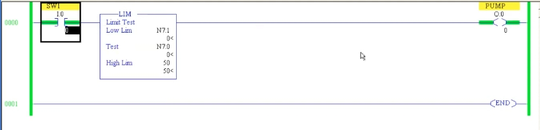

# PLC 教程 36:範圍測試指令 LIM(Limit Test)
# PLC Training 36: Limit Test (LIM) Instruction

> 來源 Source:<https://www.youtube.com/watch?v=7-6sRxH92OM&list=PLI78ZBihrkE3nnGIj2WmHb_GoWjFlfFIu&index=36>
> 平台 Platform:Allen-Bradley(RSLogix 500 Pro / SLC 500 風格 Style)

---

## 目錄 Contents

1. [簡介 Introduction](#1-簡介--introduction)
2. [應用情境:水箱液位控制 Application: Tank Level Control](#2-應用情境水箱液位控制--application-tank-level-control)
3. [LIM 參數 LIM Parameters](#3-lim-參數--lim-parameters)
4. [常數限值實驗 Experiment with Constant Limits](#4-常數限值實驗--experiment-with-constant-limits)
5. [位址限值實驗 Experiment with Address Limits](#5-位址限值實驗--experiment-with-address-limits)
6. [補充:上下限顛倒時 Extra: When Low Limit > High Limit](#6-補充上下限顛倒時--extra-when-low-limit--high-limit)
7. [重點整理 Summary](#7-重點整理--summary)

---

## 1. 簡介 | Introduction

**中文**
**LIM(Limit Test,範圍測試)** 位於 Compare 選單中,延續上一節的比較指令。它也是**輸入指令**,後面必須接一個輸出線圈。

功能:**判斷某個數值是否落在「下限」與「上限」之間**,在範圍內為真,範圍外為假。

**English**
**LIM (Limit Test)** is found in the Compare menu and follows the comparators from the previous lesson. It is also an **input instruction**, so an output coil must follow it.

Function: **it checks whether a value lies between a "low limit" and a "high limit"** – true inside the range, false outside.

---

## 2. 應用情境:水箱液位控制 | Application: Tank Level Control

**中文**
需求:當水位**在 20 到 50 之間**時,啟動水泵。

**使用兩個比較指令的做法**

- `GEQ`:液位 ≥ 20
- `LEQ`:液位 ≤ 50
- 兩者**串聯**(AND)後驅動水泵

**使用 LIM 的做法**

- **一個指令**即可完成同樣的判斷,程式更精簡。

**English**
Requirement: turn on the pump when the water level is **between 20 and 50**.

**Using two comparators**

- `GEQ`: level ≥ 20
- `LEQ`: level ≤ 50
- Connect them **in series** (AND) to drive the pump

**Using LIM**

- **A single instruction** performs the same check, giving a more compact program.

> 註:影片口述為「above 20 and below 50」,但實際示範顯示 **20 與 50 本身也算在範圍內**(見第 4 節)。
> Note: The video says "above 20 and below 50", but the demo shows that **20 and 50 themselves are inside the range** (see Section 4).

---

## 3. LIM 參數 | LIM Parameters

**中文**

| 參數 | 英文 | 說明 |
|------|------|------|
| **Low Lim** | Low Limit | 下限值 |
| **Test** | Test | 被測試的數值,通常是來自現場的**製程變數(Process Variable)**,例如水位 |
| **High Lim** | High Limit | 上限值 |

判斷條件(包含邊界值):

```
Low Lim  ≤  Test  ≤  High Lim   →  真 True(輸出導通 / output ON)
```

LIM 相當於一個 **GEQ + LEQ** 的組合,因此**下限與上限本身都算在範圍內**。

**English**

| Parameter | Description |
|------|------|
| **Low Lim** | The lower boundary |
| **Test** | The value being tested, usually a **process variable** from the field, e.g. the water level |
| **High Lim** | The upper boundary |

Condition (boundaries included):

```
Low Lim  ≤  Test  ≤  High Lim   →  True (output ON)
```

LIM behaves like a **GEQ + LEQ** pair, so **both the low and high limits are inside the range**.

---

## 4. 常數限值實驗 | Experiment with Constant Limits

**中文**
設定:

- Rung 0:`SW1`(`I:0/0`)→ `LIM` → `PUMP`(`O:0/0`)
- `Low Lim` = **20**(常數)
- `Test` = `N7:0`(水位)
- `High Lim` = **50**(常數)

在 Run 模式下導通 `SW1`,逐步修改 `N7:0`:

| `N7:0`(水位) | 判斷 | PUMP |
|:---:|---|:---:|
| 0 | 0 < 20,低於下限 | 熄 OFF |
| 10 | 10 < 20,低於下限 | 熄 OFF |
| **20** | 20 ≥ 20 且 ≤ 50 | **亮 ON** |
| 25 | 在範圍內 | 亮 ON |
| 49 | 在範圍內 | 亮 ON |
| **50** | 50 ≤ 50(含上限) | **亮 ON** |
| **51** | 51 > 50,超過上限 | 熄 OFF |

重點:**LIM 的兩端都是「含等於」**,不是單純的「小於」或「大於」。

**English**
Setup:

- Rung 0: `SW1` (`I:0/0`) → `LIM` → `PUMP` (`O:0/0`)
- `Low Lim` = **20** (constant)
- `Test` = `N7:0` (water level)
- `High Lim` = **50** (constant)

In Run mode, turn `SW1` ON and change `N7:0` step by step:

| `N7:0` (level) | Evaluation | PUMP |
|:---:|---|:---:|
| 0 | 0 < 20, below the low limit | OFF |
| 10 | 10 < 20, below the low limit | OFF |
| **20** | 20 ≥ 20 and ≤ 50 | **ON** |
| 25 | Inside the range | ON |
| 49 | Inside the range | ON |
| **50** | 50 ≤ 50 (high limit included) | **ON** |
| **51** | 51 > 50, above the high limit | OFF |

Key point: **both ends of LIM are inclusive** – it is not a plain "less than" or "greater than".

---

## 5. 位址限值實驗 | Experiment with Address Limits

**中文**
與普通比較指令不同:普通比較指令的兩個參數**不能同時為常數**,但在 **LIM 中,上限與下限都可以直接填常數**。限值也可以改成**位址**,讓範圍在執行中可以調整:

- `Low Lim` = `N7:1`
- `Test` = `N7:0`
- `High Lim` = **50**(常數)

目前 `N7:1` = 0、`N7:0` = 0:

- 判斷:0 ≤ 0 ≤ 50 → 為真 → PUMP **導通**(如圖)。
- 若把 `N7:1`(下限)改成 7,而 `N7:0` 仍為 0:7 ≤ 0 不成立 → PUMP **熄滅**。

因此限值既可以是**常數**,也可以是**可隨時修改的變數**。



*圖 1:`SW1` → `LIM`(Low Lim = `N7:1`、Test = `N7:0`、High Lim = 50)→ `PUMP`。三個值為 0、0、50,條件成立,PUMP 導通(綠色)。*
*Fig. 1: `SW1` → `LIM` (Low Lim = `N7:1`, Test = `N7:0`, High Lim = 50) → `PUMP`. With 0, 0 and 50 the condition is true and PUMP is ON (green).*

> 註:把下限改為 7 的具體步驟,逐字稿未清楚說明是修改哪一個位址,此處依邏輯推論為 `N7:1`(下限)。
> Note: The transcript does not say clearly which address was changed to 7; it is inferred here to be `N7:1` (the low limit), which matches the described result.

**English**
Unlike ordinary comparators, whose two parameters **cannot both be constants**, in **LIM both limits may be plain constants**. A limit can also be an **address**, so the range can be adjusted while the program runs:

- `Low Lim` = `N7:1`
- `Test` = `N7:0`
- `High Lim` = **50** (constant)

Currently `N7:1` = 0 and `N7:0` = 0:

- Evaluation: 0 ≤ 0 ≤ 50 → true → PUMP **ON** (as shown).
- If you change `N7:1` (the low limit) to 7 while `N7:0` stays 0: 7 ≤ 0 is false → PUMP **OFF**.

So a limit can be a **constant** or a **variable you can change at any time**.

---

## 6. 補充:上下限顛倒時 | Extra: When Low Limit > High Limit

**中文**(非影片內容)
依 Allen-Bradley SLC 500 的規則,若 **Low Lim 大於 High Lim**,判斷邏輯會反過來:當 `Test ≥ Low Lim` **或** `Test ≤ High Lim` 時為真,也就是「**在範圍之外**」才導通。一般使用時請確保 Low Lim ≤ High Lim。

**English** (not from the video)
Under the Allen-Bradley SLC 500 rules, if the **Low Lim is greater than the High Lim**, the logic is reversed: the instruction is true when `Test ≥ Low Lim` **or** `Test ≤ High Lim`, i.e. true **outside the range**. In normal use make sure Low Lim ≤ High Lim.

---

## 7. 重點整理 | Summary

**中文**
1. **LIM** 是輸入指令,後面要接輸出線圈。
2. 判斷式:**Low Lim ≤ Test ≤ High Lim**,**含上下限**。
3. 一個 LIM 可取代 **GEQ + LEQ 兩個比較指令**,程式更簡潔。
4. 上下限可以是**常數**,也可以是**位址**(可在執行中修改)。
5. 典型應用:水箱液位、溫度區間、壓力區間等「落在某範圍內才動作」的控制。
6. 下一節:**MEQ(Masked Comparison for Equal,遮罩比較相等)** 指令。

**English**
1. **LIM** is an input instruction and must be followed by an output coil.
2. Condition: **Low Lim ≤ Test ≤ High Lim**, **limits included**.
3. One LIM can replace the **GEQ + LEQ pair**, keeping the program compact.
4. The limits can be **constants** or **addresses** (adjustable at runtime).
5. Typical uses: tank level, temperature band, pressure band – any control that acts only inside a range.
6. Next lesson: the **MEQ (Masked Comparison for Equal)** instruction.

---

## 附:檔案結構 | Appendix: File Layout

```
PLC_36_Limit_Test_LIM.md
images/
└── ab36_01.jpg   # LIM: Low Lim N7:1, Test N7:0, High Lim 50, PUMP ON
```
