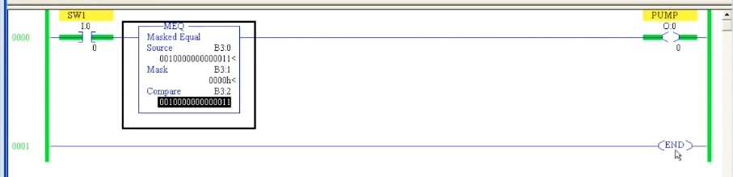
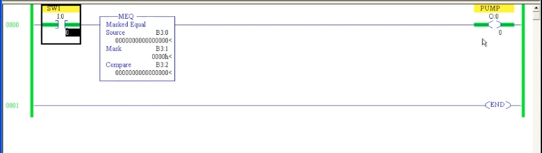
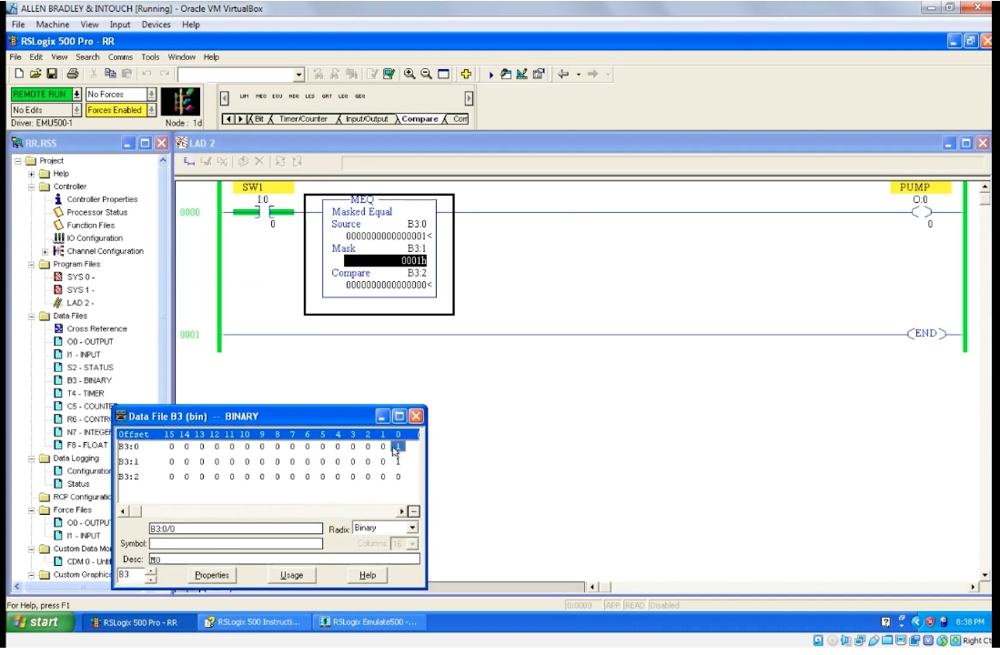

# PLC 教程 37:遮罩比較相等指令 MEQ(Masked Equal)
# PLC Training 37: Masked Equal (MEQ) Instruction

> 來源 Source:<https://www.youtube.com/watch?v=EpcmL4BMlPk&list=PLI78ZBihrkE3nnGIj2WmHb_GoWjFlfFIu&index=37>
> 平台 Platform:Allen-Bradley(RSLogix 500 Pro / SLC 500 風格 Style)

---

## 目錄 Contents

1. [簡介 Introduction](#1-簡介--introduction)
2. [三個參數 The Three Parameters](#2-三個參數--the-three-parameters)
3. [實驗一:遮罩全為 0 Experiment 1: Mask All Zeros](#3-實驗一遮罩全為-0--experiment-1-mask-all-zeros)
4. [實驗二:啟用遮罩位元 Experiment 2: Activating a Mask Bit](#4-實驗二啟用遮罩位元--experiment-2-activating-a-mask-bit)
5. [實驗三:多位元比較 Experiment 3: Comparing Several Bits](#5-實驗三多位元比較--experiment-3-comparing-several-bits)
6. [運作原理 How It Works](#6-運作原理--how-it-works)
7. [重點整理 Summary](#7-重點整理--summary)

---

## 1. 簡介 | Introduction

**中文**
**MEQ(Masked Equal,遮罩比較相等)** 是 Compare 選單中的最後一個比較指令,同樣是**輸入指令**,後面要接輸出線圈(本例為 `PUMP`)。

它和 EQU 的差別是:**只比較「被遮罩選中」的位元**,沒被選中的位元一律忽略。適合用在「只關心一個字(Word)中的某幾個位元」的情況。

**English**
**MEQ (Masked Equal)** is the last comparator in the Compare menu. It is also an **input instruction** and must be followed by an output coil (here `PUMP`).

Unlike EQU, it **compares only the bits selected by the mask**; all other bits are ignored. It is useful when you care about only a few bits within a word.

---

## 2. 三個參數 | The Three Parameters

**中文**

| 參數 | 說明 | 本例位址 |
|------|------|------|
| **Source** | 要被比較的數值 | `B3:0` |
| **Mask** | 遮罩:決定要比較哪些位元 | `B3:1` |
| **Compare** | 參考值(要和 Source 比對的基準) | `B3:2` |

- 本例使用 **Binary 資料檔(B3)**,每個位址是完整的 **16 位元**。
- Mask 可以用二進位、十六進位、十進位等格式輸入,但**指令中一律以十六進位顯示**(例如 `0001h`)。
- 與前面的比較指令一樣,Rung 由 `SW1`(`I:0/0`)啟動,輸出為 `PUMP`(`O:0/0`)。

**English**

| Parameter | Description | Address in this example |
|------|------|------|
| **Source** | The value to be compared | `B3:0` |
| **Mask** | Decides which bits are compared | `B3:1` |
| **Compare** | The reference value compared against Source | `B3:2` |

- This example uses the **Binary data file (B3)**; each address is a full **16 bits**.
- The Mask can be entered in binary, hexadecimal, decimal and so on, but is **always displayed in hexadecimal** in the instruction (e.g. `0001h`).
- As in earlier comparators, the rung is enabled by `SW1` (`I:0/0`) and the output is `PUMP` (`O:0/0`).

---

## 3. 實驗一:遮罩全為 0 | Experiment 1: Mask All Zeros

**中文**
初始狀態:Source、Mask、Compare 全部為 0。導通 `SW1`:

- 兩個值相等 → PUMP **亮**。

接著把 Source 的 bit 0 改成 1(Source ≠ Compare),但 **Mask 仍是 0**:

- 兩個值明明不相等,**PUMP 仍然亮**。

原因:**Mask 的位元沒有啟用時,沒有任何位元被拿來比較,結果一律視為「相等」。** 也就是說,MEQ 在遮罩全為 0 時永遠為真。



*圖 1:`SW1` → `MEQ`(Source `B3:0`、Mask `B3:1` = `0000h`、Compare `B3:2`,皆為 0)→ `PUMP`。PUMP 導通(綠色)。*
*Fig. 1: `SW1` → `MEQ` (Source `B3:0`, Mask `B3:1` = `0000h`, Compare `B3:2`, all 0) → `PUMP`. PUMP is ON (green).*

**English**
Initial state: Source, Mask and Compare are all 0. Turn `SW1` ON:

- The values are equal → PUMP **ON**.

Now change bit 0 of Source to 1 (Source ≠ Compare) while the **Mask stays 0**:

- The values are clearly different, yet **PUMP stays ON**.

Reason: **when no mask bit is activated, no bit is actually compared, so the result is always treated as "equal".** In other words, MEQ is always true when the mask is all zeros.

---

## 4. 實驗二:啟用遮罩位元 | Experiment 2: Activating a Mask Bit

**中文**
要得到**真正準確的比較結果**,必須啟用遮罩位元。打開 `B3` 資料檔,把 Mask(`B3:1`)的 **bit 0 設為 1**(即 `0001h`):

- 現在只比較 **bit 0**:`B3:0` 的 bit 0 = 1,`B3:2` 的 bit 0 = 0 → **不相等** → PUMP **熄**。
- 把 Compare(`B3:2`)的 bit 0 也設為 1 → bit 0 相等 → PUMP **再次亮起**。



*圖 2:Source `B3:0` = `0000000000000001`、Mask `B3:1` = `0001h`、Compare `B3:2` = 全 0。資料檔視窗顯示 `B3:1` 的 bit 0 已啟用。bit 0 不相等,PUMP 熄滅。*
*Fig. 2: Source `B3:0` = `0000000000000001`, Mask `B3:1` = `0001h`, Compare `B3:2` = all 0. The data file window shows bit 0 of `B3:1` activated. Bit 0 differs, so PUMP is OFF.*

**中文** 若再把 Mask 全部清為 0,Source 與 Compare 的資料就算不同,PUMP 也會亮。這在某些應用中很有用:**「資料不同,但我仍想要輸出」**時,不啟用遮罩即可。

**English**
To get a **truly exact comparison**, you must activate mask bits. Open the `B3` data file and **set bit 0 of the Mask** (`B3:1`) to 1 (i.e. `0001h`):

- Now only **bit 0** is compared: bit 0 of `B3:0` = 1, bit 0 of `B3:2` = 0 → **not equal** → PUMP **OFF**.
- Set bit 0 of Compare (`B3:2`) to 1 as well → bit 0 matches → PUMP **ON** again.

If you clear the Mask back to all zeros, PUMP turns ON even when Source and Compare differ. This can be useful when you want **an output even though the data differ** – simply leave the mask deactivated.

---

## 5. 實驗三:多位元比較 | Experiment 3: Comparing Several Bits

**中文**
再用較複雜的資料練習:

- Source = `0010 0000 0000 0011`
- Compare = `0010 0000 0000 0011`(兩者相同)
- Mask = `0000h`

此時 PUMP 亮,但**這只是因為遮罩為 0**,並不代表「真的比較過」。要讓比較真正生效,必須啟用「想要比較的位元」。依影片說明,啟用對應的位元後(最低的 4 位元為 **3**、最高的 4 位元為 **2**),Mask 即為 **`2003h`**,此時只比較 bit 13、bit 1、bit 0:

- 這三個位元都相等 → PUMP **亮**。
- 其中任何一個位元不同 → PUMP **熄**。
- 其他位元(未被遮罩選中)不論是 0 或 1 都**不影響**結果。



*圖 3:Source 與 Compare 皆為 `0010000000000011`,Mask 為 `0000h`。PUMP 導通。*
*Fig. 3: Source and Compare are both `0010000000000011`, Mask is `0000h`. PUMP is ON.*

> 註:影片只口述「最低 4 位元是 3、最高 4 位元是 2」,最終 Mask 值 `2003h` 為依畫面資料換算的結果。
> Note: The video only says "the lowest nibble is 3 and the top nibble is 2"; the final Mask value `2003h` is calculated from the data shown on screen.

**English**
Practice with more complex data:

- Source = `0010 0000 0000 0011`
- Compare = `0010 0000 0000 0011` (identical)
- Mask = `0000h`

PUMP is ON, but **only because the mask is 0**, not because a real comparison was made. To make the comparison effective you must activate the bits you want to compare. Following the video (lowest nibble **3**, highest nibble **2**), the Mask becomes **`2003h`**, so only bit 13, bit 1 and bit 0 are compared:

- All three bits match → PUMP **ON**.
- Any one of them differs → PUMP **OFF**.
- All other bits (not selected by the mask) are **ignored**, whether 0 or 1.

> Note: The video only says "the lowest nibble is 3 and the top nibble is 2"; the final Mask value `2003h` is calculated from the data shown on screen.

---

## 6. 運作原理 | How It Works

**中文**(整理補充,非影片原話)
MEQ 的判斷等同於:

```
(Source AND Mask)  =  (Compare AND Mask)   →  真 True,輸出導通
```

遮罩為 1 的位元才參與比較;遮罩為 0 的位元被「蓋掉」。

| Source | Compare | Mask | 結果 Result | 說明 Explanation |
|:---:|:---:|:---:|:---:|---|
| `0000 0000 0000 0001` | `0000 0000 0000 0000` | `0000h` | 真 T | 沒有位元被比較 No bit compared |
| `0000 0000 0000 0001` | `0000 0000 0000 0000` | `0001h` | 假 F | bit 0 不同 bit 0 differs |
| `0000 0000 0000 0001` | `0000 0000 0000 0001` | `0001h` | 真 T | bit 0 相同 bit 0 matches |
| `0010 0000 0000 0011` | `0010 0000 0000 0011` | `2003h` | 真 T | 三個被選位元相同 The 3 selected bits match |
| `0010 0000 0000 0011` | `0000 0000 0000 0011` | `2003h` | 假 F | bit 13 不同 bit 13 differs |
| `0010 0000 0000 0011` | `0000 0000 0000 0011` | `0003h` | 真 T | bit 13 被遮掉 bit 13 is masked out |

**English** (supplementary summary, not the video's own words)
MEQ is equivalent to:

```
(Source AND Mask)  =  (Compare AND Mask)   →  True, output ON
```

Only bits where the mask is 1 take part in the comparison; bits where the mask is 0 are "masked out".

(See the table above.)

---

## 7. 重點整理 | Summary

**中文**
1. **MEQ** 是 Compare 選單的最後一個指令,屬於**輸入指令**,後面要接輸出線圈。
2. 三個參數:**Source**(被比較值)、**Mask**(遮罩)、**Compare**(參考值)。
3. **只有遮罩中為 1 的位元會被比較**,其他位元一律忽略。
4. **遮罩全為 0 時,結果永遠為真**(PUMP 一直亮),即使 Source 與 Compare 不同。
5. 要得到準確的比較結果,必須**啟用想要比較的遮罩位元**。
6. Mask 可用不同進位制輸入,指令中以**十六進位**顯示。
7. 建議用不同的資料自行多練習,更容易理解。

**English**
1. **MEQ** is the last instruction in the Compare menu; it is an **input instruction** and must be followed by an output coil.
2. Three parameters: **Source** (value to compare), **Mask**, **Compare** (reference value).
3. **Only bits set to 1 in the mask are compared**; all other bits are ignored.
4. **With an all-zero mask the result is always true** (PUMP stays ON) even if Source and Compare differ.
5. For an exact comparison you must **activate the mask bits you want to compare**.
6. The Mask can be entered in different number bases and is displayed in **hexadecimal**.
7. Practice with different data to understand it better.

---

## 附:檔案結構 | Appendix: File Layout

```
PLC_37_Masked_Equal_MEQ.md
images/
├── ab37_01.jpg   # MEQ: Mask 0001h, bit 0 differs, PUMP OFF (with B3 data file window)
├── ab37_02.jpg   # MEQ: Source = Compare = 0010000000000011, Mask 0000h, PUMP ON
└── ab37_03.jpg   # MEQ: all zeros, PUMP ON
```
