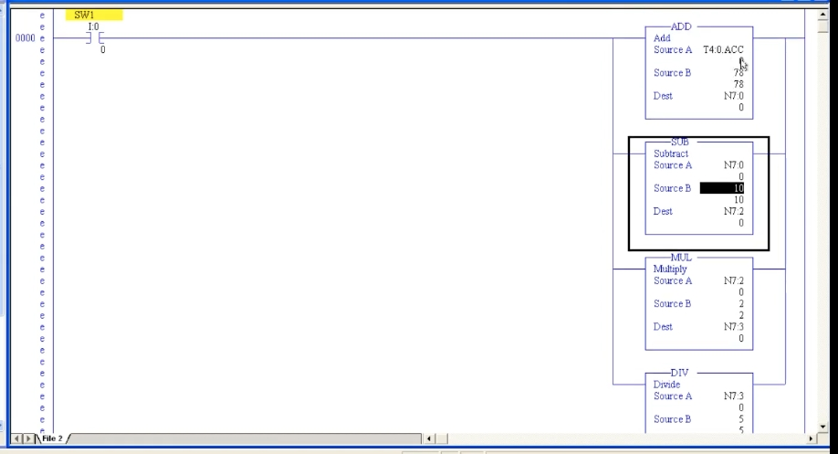
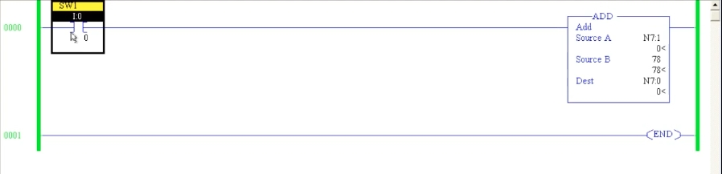
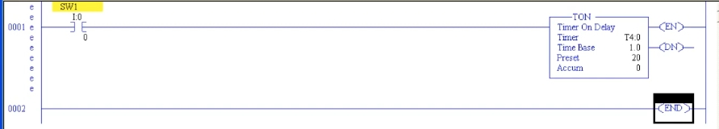

# PLC 教程 38:算術指令(ADD / SUB / MUL / DIV)
# PLC Training 38: Arithmetic and Math Instructions (ADD / SUB / MUL / DIV)

> 來源 Source:<https://www.youtube.com/watch?v=s1PyXnHHheg&list=PLI78ZBihrkE3nnGIj2WmHb_GoWjFlfFIu&index=38>
> 平台 Platform:Allen-Bradley(RSLogix 500 Pro / SLC 500 風格 Style)

---

## 目錄 Contents

1. [簡介 Introduction](#1-簡介--introduction)
2. [ADD 加法指令 ADD Instruction](#2-add-加法指令--add-instruction)
3. [SUB / MUL / DIV 並聯使用 SUB / MUL / DIV in Parallel Branches](#3-sub--mul--div-並聯使用--sub--mul--div-in-parallel-branches)
4. [只有兩個輸入 Only Two Inputs](#4-只有兩個輸入--only-two-inputs)
5. [使用計時器累計值 Using a Timer Accumulator](#5-使用計時器累計值--using-a-timer-accumulator)
6. [重點整理 Summary](#6-重點整理--summary)

---

## 1. 簡介 | Introduction

**中文**
本節開始介紹**算術(Arithmetic)指令**,可進行加、減、乘、除、開平方等數學運算。

- 在指令工具列中,用右側箭頭向後捲動,找到 **Compute / Math** 分頁。
- 其中包含:**ADD**(加)、**SUB**(減)、**MUL**(乘)、**DIV**(除)、**SQR**(開平方)、**NEG**(取負)以及轉換類指令。轉換指令留待之後講解。

**重要:數學指令是「輸出指令」。**

- 前面的比較指令是**輸入指令**;Compute / Math 的所有指令是**輸出指令**。
- 放上去後它會自動出現在 Rung 的**最末端**,**後面不能再接其他輸出**,否則會出現錯誤。

**English**
This lesson begins the **arithmetic instructions**: addition, subtraction, multiplication, division, square root and so on.

- In the instruction toolbar, scroll right with the arrow to find the **Compute / Math** tab.
- It contains **ADD**, **SUB**, **MUL**, **DIV**, **SQR** (square root), **NEG** (negate) and conversion instructions. Conversions are covered later.

**Important: math instructions are output instructions.**

- Comparators are **input instructions**; everything in Compute / Math is an **output instruction**.
- When placed, the instruction automatically goes to the **end of the rung**, and **no further output can follow it**, otherwise an error occurs.

---

## 2. ADD 加法指令 | ADD Instruction

### 2.1 參數 | Parameters

**中文**

| 參數 | 說明 |
|------|------|
| **Source A** | 第一個運算元 |
| **Source B** | 第二個運算元 |
| **Dest** | 目的地(存放結果),**必須是位址** |

運算:`Dest = Source A + Source B`

**常數規則**:與比較指令不同,**數學指令的兩個來源不能同時為常數**(程式沒有意義,像一個固定值的計算機),會出現錯誤。至少有一個必須是**位址**(例如來自其他地方的變動數值,甚至計時器、計數器的值)。

**English**

| Parameter | Description |
|------|------|
| **Source A** | The first operand |
| **Source B** | The second operand |
| **Dest** | Destination where the result is stored; **must be an address** |

Operation: `Dest = Source A + Source B`

**Constant rule:** as with the comparators, **both sources cannot be constants** (it would be a calculator with fixed values) and an error appears. At least one must be an **address** (a changing value from elsewhere, even a timer or counter value).

### 2.2 範例 | Example

**中文**
設定:

- Rung 0:`SW1`(`I:0/0`)→ `ADD`
- Source A = `N7:1`,Source B = 常數 **78**,Dest = `N7:0`

下載並 Run:

1. 導通 `SW1` → `N7:0` = 0 + 78 = **78**。
2. 修改 `N7:1`(例如改為 167),`N7:0` 隨之變化。
3. 把 `N7:1` 改回 0 並關閉 `SW1`:此時 Rung 條件為假,**指令不執行**,`N7:0` 不會更新(保持原值)。要再次導通 `SW1`,答案才會重新計算為 78。



*圖 1:最簡單的加法 Rung:`N7:1` + 78,結果存入 `N7:0`。*
*Fig. 1: The simplest add rung: `N7:1` + 78, result stored in `N7:0`.*

**English**
Setup:

- Rung 0: `SW1` (`I:0/0`) → `ADD`
- Source A = `N7:1`, Source B = constant **78**, Dest = `N7:0`

Download and Run:

1. Turn `SW1` ON → `N7:0` = 0 + 78 = **78**.
2. Change `N7:1` (e.g. to 167) and `N7:0` changes accordingly.
3. Set `N7:1` back to 0 and turn `SW1` OFF: the rung is false, so **the instruction does not execute** and `N7:0` is not updated (it keeps its old value). Only when `SW1` is ON again is the result recalculated as 78.

---

## 3. SUB / MUL / DIV 並聯使用 | SUB / MUL / DIV in Parallel Branches

### 3.1 建立方式 | Building the Rung

**中文**
同一個 Rung 中,以**分支(Branch)** 並聯放置四個指令,共用 `SW1`:

| 指令 | Source A | Source B | Dest | 運算 |
|------|----------|----------|------|------|
| `ADD` | `N7:1` | 78 | `N7:0` | N7:1 + 78 |
| `SUB` | `N7:1` | 10 | `N7:2` | N7:1 − 10 |
| `MUL` | `N7:2` | 2 | `N7:3` | N7:2 × 2 |
| `DIV` | `N7:3` | 5 | `N7:4` | N7:3 ÷ 5 |

這裡 SUB 的結果(`N7:2`)被 MUL 當作來源,MUL 的結果(`N7:3`)再被 DIV 當作來源,形成**串接運算**。

**放置分支的小技巧(影片操作提示)**:拖曳分支或指令時,要放在分支上**小方框(落點)**的位置;若放在綠色線上,兩個分支會被**合併**在一起,結果不正確。放對位置後,各指令才會整齊地並聯排列。

**English**
In one rung, place four instructions in **parallel branches** sharing `SW1`:

| Instruction | Source A | Source B | Dest | Operation |
|------|----------|----------|------|------|
| `ADD` | `N7:1` | 78 | `N7:0` | N7:1 + 78 |
| `SUB` | `N7:1` | 10 | `N7:2` | N7:1 − 10 |
| `MUL` | `N7:2` | 2 | `N7:3` | N7:2 × 2 |
| `DIV` | `N7:3` | 5 | `N7:4` | N7:3 ÷ 5 |

Here the SUB result (`N7:2`) is the source of MUL, and the MUL result (`N7:3`) is the source of DIV – a **chained calculation**.

**Branch placement tip (from the video):** when dropping a branch or instruction, drop it on the **small box (drop target)** of the branch; if dropped on the green line the two branches are **merged** and the result is wrong. Once placed correctly the instructions line up neatly in parallel.

### 3.2 執行結果 | Run Results

**中文**
**(a)`N7:1` = 0**

| 步驟 | 運算 | 結果 |
|------|------|------|
| ADD | 0 + 78 | **78** |
| SUB | 0 − 10 | **−10**(可顯示負號) |
| MUL | −10 × 2 | **−20** |
| DIV | −20 ÷ 5 | **−4** |

**(b)`N7:1` = 20**

| 步驟 | 運算 | 結果 |
|------|------|------|
| SUB | 20 − 10 | **10** |
| MUL | 10 × 2 | **20** |
| DIV | 20 ÷ 5 | **4** |


*圖 2:線上狀態:ADD 結果 78、SUB 結果 −10、MUL 結果 −20,DIV 的 Source A = −20、Source B = 5。*
*Fig. 2: Online: ADD result 78, SUB result −10, MUL result −20; DIV has Source A = −20 and Source B = 5.*

**English**
**(a) `N7:1` = 0**

| Step | Operation | Result |
|------|------|------|
| ADD | 0 + 78 | **78** |
| SUB | 0 − 10 | **−10** (signs are displayed) |
| MUL | −10 × 2 | **−20** |
| DIV | −20 ÷ 5 | **−4** |

**(b) `N7:1` = 20**

| Step | Operation | Result |
|------|------|------|
| SUB | 20 − 10 | **10** |
| MUL | 10 × 2 | **20** |
| DIV | 20 ÷ 5 | **4** |

> 補充(非影片內容):`N7` 為 16 位元整數,範圍為 −32768 至 32767;整數除法的結果不含小數。
> Supplement (not from the video): `N7` is a 16-bit integer with a range of −32768 to 32767; integer division gives no fractional part.

---

## 4. 只有兩個輸入 | Only Two Inputs

**中文**
- 在**某些 PLC** 中,ADD 方塊可以增加輸入數量,一次加多個數。
- 但在 **Allen-Bradley** 中,**只有 Source A 與 Source B 兩個輸入**。
- 若要加三個以上的數,請**串接多個 ADD**:先把兩個數相加,結果放進位址,再讓下一個 ADD 使用那個位址。

**English**
- In **some PLCs** the ADD block can be extended with more inputs to add several numbers at once.
- In **Allen-Bradley** there are **only two inputs**, Source A and Source B.
- To add three or more numbers, **chain several ADD blocks**: add two numbers, store the result at an address, then use that address in the next ADD.

---

## 5. 使用計時器累計值 | Using a Timer Accumulator

**中文**
數學指令的來源不限於 `N7` 整數,也可以使用**計時器或計數器的 Accumulated(累計值)與 Preset(預設值)**。比較指令同樣可以使用。

**建立方式**

- 新增 Rung 1:`SW1` → `TON T4:0`(Time Base 1.0 秒、Preset **20**)。
- 修改 Rung 0:
  - `ADD`:Source A = **`T4:0.ACC`**,Source B = 78,Dest = `N7:0`
  - `SUB`:Source A = `N7:0`,Source B = 10,Dest = `N7:2`
  - `MUL`:Source A = `N7:2`,Source B = 2,Dest = `N7:3`
  - `DIV`:Source A = `N7:3`,Source B = 5,Dest = `N7:4`

所有方塊串接在一起,隨計時器的累計值一起變動。



*圖 3:ADD 的 Source A 為 `T4:0.ACC`;SUB 使用 `N7:0`,MUL 使用 `N7:2`,DIV 使用 `N7:3`。*
*Fig. 3: ADD Source A is `T4:0.ACC`; SUB uses `N7:0`, MUL uses `N7:2`, DIV uses `N7:3`.*



*圖 4:Rung 1 的計時器 `TON T4:0`,Preset = 20,Accum 起始為 0。*
*Fig. 4: The `TON T4:0` timer in Rung 1, Preset = 20, Accum starting at 0.*

**執行過程**

導通 `SW1` 後,計時器開始計時,`T4:0.ACC` 由 0 逐秒上升,所有運算結果隨之變化。計時到 **ACC = 20** 時:

| 步驟 | 運算 | 結果 |
|------|------|------|
| ADD | 20 + 78 | **98** |
| SUB | 98 − 10 | **88** |
| MUL | 88 × 2 | **176** |
| DIV | 176 ÷ 5 | **35**(35.2,取整數 integer) |

應用:若需要依計時器的預設值或累計值做計算,就可以使用這些方塊;**計數器的 Accumulated 與 Preset 值也同樣可以使用**。

**English**
Math sources are not limited to `N7` integers; you can also use a **timer's or counter's Accumulated and Preset values**. The same applies to comparators.

**Setup**

- Add Rung 1: `SW1` → `TON T4:0` (Time Base 1.0 s, Preset **20**).
- Modify Rung 0:
  - `ADD`: Source A = **`T4:0.ACC`**, Source B = 78, Dest = `N7:0`
  - `SUB`: Source A = `N7:0`, Source B = 10, Dest = `N7:2`
  - `MUL`: Source A = `N7:2`, Source B = 2, Dest = `N7:3`
  - `DIV`: Source A = `N7:3`, Source B = 5, Dest = `N7:4`

All blocks are chained and change together with the timer's accumulated value.

**Operation**

After `SW1` goes ON, the timer starts and `T4:0.ACC` rises from 0 one count per second, and all results change with it. At **ACC = 20**:

| Step | Operation | Result |
|------|------|------|
| ADD | 20 + 78 | **98** |
| SUB | 98 − 10 | **88** |
| MUL | 88 × 2 | **176** |
| DIV | 176 ÷ 5 | **35** (35.2, integer result) |

Application: whenever you need to calculate from a timer's preset or accumulated value, use these blocks; **counter Accumulated and Preset values can be used in the same way.**

---

## 6. 重點整理 | Summary

**中文**
1. 算術指令位於 **Compute / Math** 分頁:ADD、SUB、MUL、DIV、SQR、NEG,以及轉換指令。
2. 數學指令是**輸出指令**,位於 Rung 末端,後面不能再接輸出。
3. 每個指令有 **Source A、Source B、Dest**;**兩個來源不能同時為常數**,Dest 必須是位址。
4. Rung 條件為假時指令**不執行**,Dest 保持原值。
5. 多個運算可用**分支**並聯,並以**目的位址串接**成連續運算。
6. Allen-Bradley 只有**兩個輸入**,要加多個數需串接多個 ADD。
7. 來源可使用**計時器 / 計數器的 ACC 與 PRE** 值,例如 `T4:0.ACC`。
8. 放置分支時要放在小方框落點,以免分支被合併。

**English**
1. Arithmetic instructions live in the **Compute / Math** tab: ADD, SUB, MUL, DIV, SQR, NEG and conversions.
2. Math instructions are **output instructions** placed at the end of the rung; nothing can follow them.
3. Each has **Source A, Source B, Dest**; **both sources cannot be constants** and Dest must be an address.
4. When the rung is false the instruction **does not execute** and Dest keeps its old value.
5. Several operations can be placed in **parallel branches** and **chained through their destination addresses**.
6. Allen-Bradley has **only two inputs**; chain several ADDs to add more numbers.
7. Sources can be **timer / counter ACC and PRE** values, e.g. `T4:0.ACC`.
8. When placing branches, drop onto the small target box so branches are not merged.

---

## 附:檔案結構 | Appendix: File Layout

```
PLC_38_Arithmetic_Instructions.md
images/
├── ab38_01.jpg   # ADD (T4:0.ACC) → SUB → MUL → DIV chain
├── ab38_02.jpg   # ADD / SUB / MUL / DIV online with N7:1 = 0
├── ab38_03.jpg   # Simple ADD: N7:1 + 78 → N7:0
└── ab38_04.jpg   # TON T4:0, Preset 20
```
