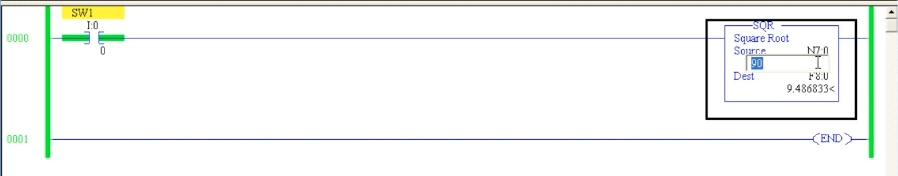
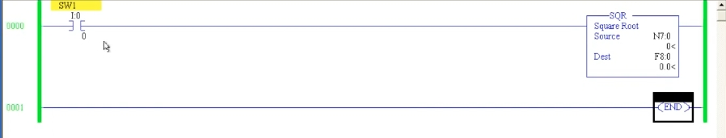

# PLC 教程 39:開平方(SQR)與取負(NEG)指令
# PLC Training 39: Square Root (SQR) and Negate (NEG) Instructions

> 來源 Source:<https://www.youtube.com/watch?v=Eb42Y1J9Jv4&list=PLI78ZBihrkE3nnGIj2WmHb_GoWjFlfFIu&index=39>
> 平台 Platform:Allen-Bradley(RSLogix 500 Pro / SLC 500 風格 Style)

---

## 目錄 Contents

1. [簡介 Introduction](#1-簡介--introduction)
2. [SQR 開平方指令 Square Root (SQR)](#2-sqr-開平方指令--square-root-sqr)
3. [整數目的地:四捨五入 Integer Destination: Rounding](#3-整數目的地四捨五入--integer-destination-rounding)
4. [浮點數目的地:精確結果 Float Destination: Exact Result](#4-浮點數目的地精確結果--float-destination-exact-result)
5. [NEG 取負指令 Negate (NEG)](#5-neg-取負指令--negate-neg)
6. [重點整理 Summary](#6-重點整理--summary)

---

## 1. 簡介 | Introduction

**中文**
延續上一節的算術指令,本節介紹 Compute / Math 分頁中剩下的兩個指令:

- **SQR**(Square Root):開平方
- **NEG**(Negate):取負(變號)

兩者都是**輸出指令**,放在 Rung 末端,後面不能再接其他輸出。與 ADD、SUB 不同,它們只有**一個來源(Source)** 與**一個目的地(Dest)**。

**English**
Continuing the arithmetic instructions, this lesson covers the last two in the Compute / Math tab:

- **SQR** (Square Root)
- **NEG** (Negate – change the sign)

Both are **output instructions** placed at the end of the rung; nothing can follow them. Unlike ADD or SUB, they have only **one Source** and **one Dest**.

---

## 2. SQR 開平方指令 | Square Root (SQR)

**中文**

| 參數 | 說明 |
|------|------|
| **Source** | 要開平方的數值 |
| **Dest** | 存放結果的位址 |

運算:`Dest = √Source`

初始設定:

- Rung 0:`SW1`(`I:0/0`)→ `SQR`
- Source = `N7:0`,Dest = `N7:1`(整數)

導通 `SW1` 後,修改 `N7:0` 觀察 `N7:1` 的變化。



*圖 1:`SW1` → `SQR`(Source `N7:0`、Dest `F8:0`)。目前 `SW1` 未導通,Source 與 Dest 皆為 0。*
*Fig. 1: `SW1` → `SQR` (Source `N7:0`, Dest `F8:0`). `SW1` is not yet ON; Source and Dest are both 0.*

**English**

| Parameter | Description |
|------|------|
| **Source** | The value to take the square root of |
| **Dest** | Address where the result is stored |

Operation: `Dest = √Source`

Initial setup:

- Rung 0: `SW1` (`I:0/0`) → `SQR`
- Source = `N7:0`, Dest = `N7:1` (integer)

After turning `SW1` ON, change `N7:0` and watch `N7:1`.

---

## 3. 整數目的地:四捨五入 | Integer Destination: Rounding

**中文**
當 Dest 是**整數(`N7:x`)** 時,結果**會被四捨五入成整數**,不會顯示小數:

| Source `N7:0` | 精確平方根 Exact √ | Dest `N7:1`(整數) |
|:---:|:---:|:---:|
| 81 | 9 | 9 |
| 90 | 9.4868… | **9** |
| 75 | 8.6603… | **9** |
| 45 | 6.7082… | **7** |

影片說明:SQR 在得不到整數結果時,會把值四捨五入後再輸出,因此**不是精確答案**。

> 註:逐字稿中的語音辨識數字較混亂,表中的精確平方根與四捨五入結果是依數學計算整理,與影片說明的趨勢(90、75 顯示約 9)一致。
> Note: The numbers in the raw transcript are garbled by speech recognition; the exact roots and rounded results in the table are calculated mathematically and agree with the trend described in the video (90 and 75 both show about 9).

**English**
When the Dest is an **integer (`N7:x`)**, the result is **rounded to a whole number** with no decimals:

| Source `N7:0` | Exact √ | Dest `N7:1` (integer) |
|:---:|:---:|:---:|
| 81 | 9 | 9 |
| 90 | 9.4868… | **9** |
| 75 | 8.6603… | **9** |
| 45 | 6.7082… | **7** |

The video explains that when SQR cannot produce a whole-number result, it rounds the value before outputting it, so **the answer is not exact**.

---

## 4. 浮點數目的地:精確結果 | Float Destination: Exact Result

**中文**
若要得到**精確的小數結果**,把 Dest 改為**浮點數(Float)** 資料型態:

- 在資料檔中使用 **`F8`(FLOAT)**,Dest = `F8:0`。
- 檢查錯誤:無錯誤,SQR 接受浮點數目的地。

下載並 Run:

| Source `N7:0` | Dest `F8:0`(浮點) |
|:---:|:---:|
| 90 | **9.486833** |
| 75 | **8.660254** |

同樣是 90,目的地為整數時是 **9**,為浮點時則是 **9.486833**。**需要準確答案時,請使用 Float 資料型態。**



*圖 2:Source `N7:0` = 90,Dest `F8:0` = `9.486833`。*
*Fig. 2: Source `N7:0` = 90, Dest `F8:0` = `9.486833`.*

**English**
For an **exact decimal result**, change the Dest to a **float** data type:

- In the data files use **`F8` (FLOAT)**, Dest = `F8:0`.
- Verify: no errors – SQR accepts a float destination.

Download and Run:

| Source `N7:0` | Dest `F8:0` (float) |
|:---:|:---:|
| 90 | **9.486833** |
| 75 | **8.660254** |

For the same input of 90, an integer destination gives **9** while a float destination gives **9.486833**. **Use a Float data type whenever you need an accurate answer.**

---

## 5. NEG 取負指令 | Negate (NEG)

**中文**

| 參數 | 說明 |
|------|------|
| **Source** | 要變號的數值 |
| **Dest** | 存放結果的位址(請使用另一個位址) |

運算:`Dest = −Source`

功能:**把來源的正負號反轉**。正數變負數,負數變正數。

| Source | Dest |
|:---:|:---:|
| 0 | 0(零沒有正負,不變) |
| 12 | **−12** |
| −8 | **8** |
| 18 | **−18** |

用途:當需要把某個數值**由正變負或由負變正**時,可使用 NEG,不必另外做乘以 −1 的運算。

> 註:Dest 應使用與 Source 不同的位址,以便同時觀察前後兩個值。
> Note: Use a Dest address different from the Source so you can see both values at the same time.

**English**

| Parameter | Description |
|------|------|
| **Source** | The value whose sign is to be changed |
| **Dest** | Address for the result (use a different address) |

Operation: `Dest = −Source`

Function: **it reverses the sign of the source** – positive becomes negative and negative becomes positive.

| Source | Dest |
|:---:|:---:|
| 0 | 0 (zero has no sign, unchanged) |
| 12 | **−12** |
| −8 | **8** |
| 18 | **−18** |

Use: whenever you need to **flip a value from positive to negative or vice versa**, NEG does it without a separate multiply-by-−1 step.

---

## 6. 重點整理 | Summary

**中文**
1. **SQR** 與 **NEG** 都是 Compute / Math 的**輸出指令**,只有 **Source** 與 **Dest** 各一個。
2. **SQR**:`Dest = √Source`。Dest 為**整數**時會**四捨五入**,結果不精確;Dest 為 **Float(`F8:x`)** 時可得精確小數。
3. **NEG**:`Dest = −Source`,正負號反轉;0 維持 0。
4. 到此為止,算術指令(ADD、SUB、MUL、DIV、SQR、NEG)全部介紹完畢,建議在軟體中多練習。
5. 下一節:**轉換指令(Converters)**。

**English**
1. **SQR** and **NEG** are Compute / Math **output instructions**, each with a single **Source** and **Dest**.
2. **SQR**: `Dest = √Source`. With an **integer** Dest the result is **rounded** and inexact; with a **Float (`F8:x`)** Dest you get an exact decimal.
3. **NEG**: `Dest = −Source` – reverses the sign; 0 stays 0.
4. With this, all arithmetic instructions (ADD, SUB, MUL, DIV, SQR, NEG) are covered; practice them in the software.
5. Next lesson: **Converters**.

---

## 附:檔案結構 | Appendix: File Layout

```
PLC_39_Square_Root_and_Negate.md
images/
├── ab39_01.jpg   # SQR: N7:0 = 90, F8:0 = 9.486833
└── ab39_02.jpg   # SQR: SW1 OFF, Source N7:0 / Dest F8:0
```
