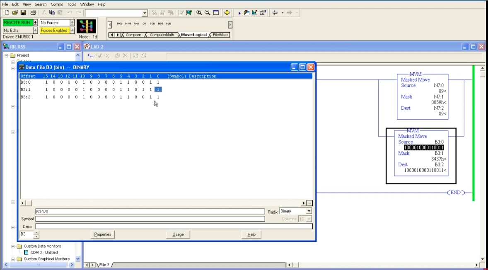
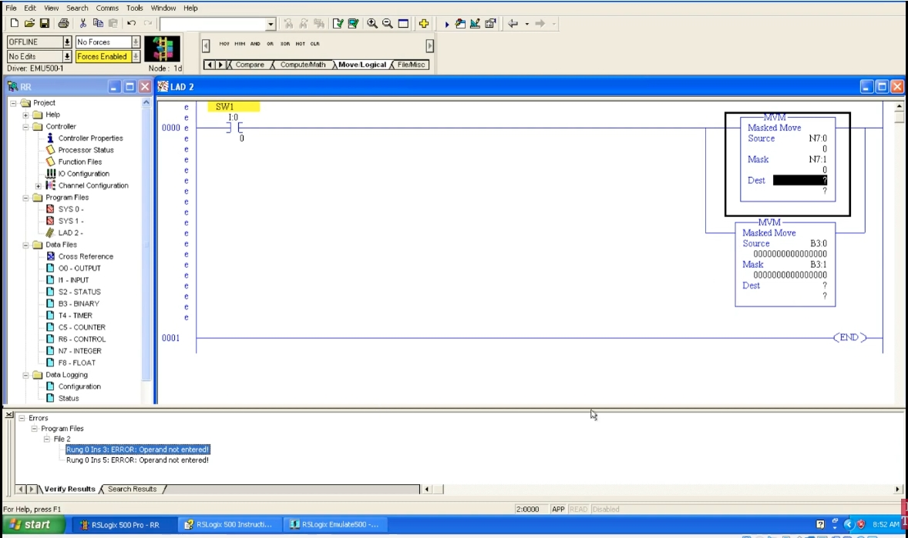
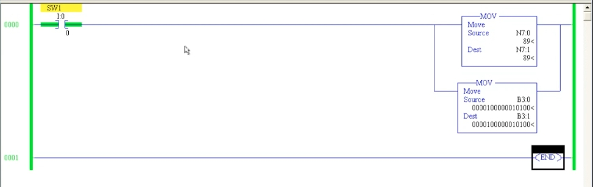
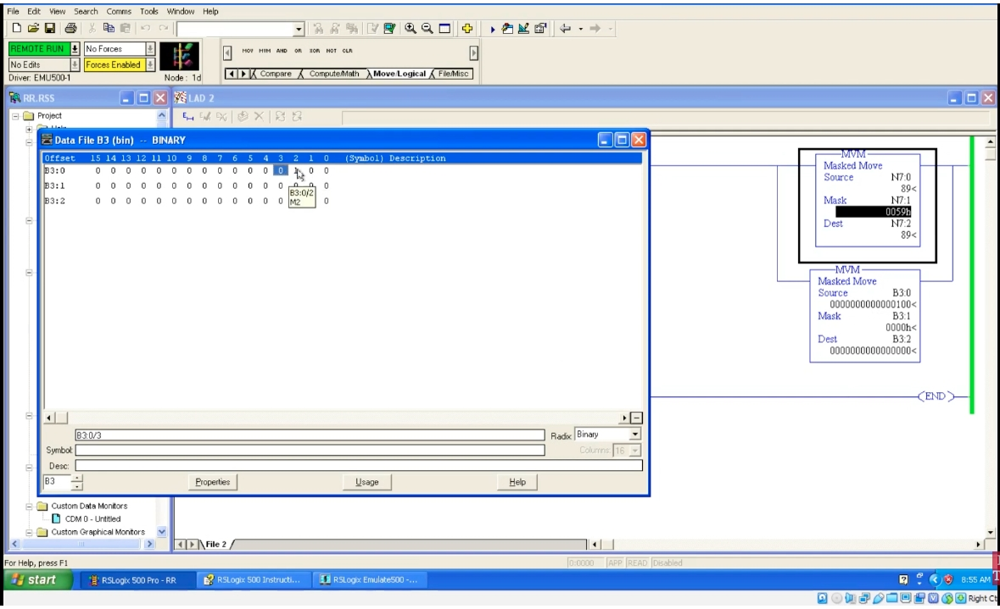

# PLC 教程 41:搬移指令 MOV 與遮罩搬移 MVM
# PLC Training 41: Move (MOV) and Move with Mask (MVM) Instructions

> 來源 Source:<https://www.youtube.com/watch?v=frQP9eLVY2k&list=PLI78ZBihrkE3nnGIj2WmHb_GoWjFlfFIu&index=41>
> 平台 Platform:Allen-Bradley(RSLogix 500 Pro / SLC 500 風格 Style)

---

## 目錄 Contents

1. [簡介 Introduction](#1-簡介--introduction)
2. [MOV 搬移指令 Move (MOV)](#2-mov-搬移指令--move-mov)
3. [MVM 遮罩搬移指令 Masked Move (MVM)](#3-mvm-遮罩搬移指令--masked-move-mvm)
4. [實驗一:遮罩未啟用 Experiment 1: Mask Not Activated](#4-實驗一遮罩未啟用--experiment-1-mask-not-activated)
5. [實驗二:逐位元啟用遮罩 Experiment 2: Activating Mask Bits One by One](#5-實驗二逐位元啟用遮罩--experiment-2-activating-mask-bits-one-by-one)
6. [運作原理 How It Works](#6-運作原理--how-it-works)
7. [重點整理 Summary](#7-重點整理--summary)

---

## 1. 簡介 | Introduction

**中文**
本節介紹 **Move / Logical** 分頁中的兩個指令:

| 指令 | 英文 | 功能 |
|------|------|------|
| **MOV** | Move | 把資料從一個位址**搬移**到另一個位址 |
| **MVM** | Masked Move | 依照**遮罩**,只搬移被選中的位元 |

這個分頁還有 AND、OR、XOR、NOT、CLR 等指令,留待後續課程。

**English**
This lesson covers two instructions in the **Move / Logical** tab:

| Instruction | Name | Function |
|------|------|------|
| **MOV** | Move | **Moves** data from one address to another |
| **MVM** | Masked Move | Moves only the bits selected by a **mask** |

The same tab also contains AND, OR, XOR, NOT and CLR, which are left for later lessons.

---

## 2. MOV 搬移指令 | Move (MOV)

### 2.1 說明 | Description

**中文**
MOV 有兩個參數:

| 參數 | 說明 |
|------|------|
| **Source** | 來源:要搬移的資料 |
| **Dest** | 目的地:存放資料的位址 |

當 **Rung 為真**時,Source 的值就被複製到 Dest。它是**輸出指令**。Source 與 Dest 可以是整數(`N7:x`)、二進位(`B3:x`)等資料型態。

**English**
MOV has two parameters:

| Parameter | Description |
|------|------|
| **Source** | The data to be moved |
| **Dest** | The address that receives the data |

When the **rung is true**, the Source value is copied to the Dest. It is an **output instruction**. Source and Dest can be integer (`N7:x`), binary (`B3:x`) and other data types.

### 2.2 範例 | Example

**中文**
Rung 0:`SW1`(`I:0/0`)→ 分支 { `MOV` 整數 / `MOV` 二進位 }

| 指令 | Source | Dest | 結果 |
|------|--------|------|------|
| `MOV` | `N7:0` = 89 | `N7:1` | `N7:1` = **89** |
| `MOV` | `B3:0` = `0000100000010100` | `B3:1` | `B3:1` = **`0000100000010100`** |

導通 `SW1` 後,來源的值就出現在目的地。



*圖 1:上方 `MOV` 把 `N7:0`(89)搬到 `N7:1`;下方 `MOV` 把 `B3:0` 搬到 `B3:1`,兩個位址的 16 位元內容相同。*
*Fig. 1: The upper `MOV` moves `N7:0` (89) to `N7:1`; the lower `MOV` moves `B3:0` to `B3:1`; both 16-bit contents are identical.*

**English**
Rung 0: `SW1` (`I:0/0`) → branch { integer `MOV` / binary `MOV` }

(See the table above.)

After `SW1` is turned ON the source value appears at the destination.

### 2.3 實際用途 | Typical Uses

**中文**
- **類比輸入**:類比輸入模組把資料存在某個位址,用 MOV 搬到程式內的記憶體位址再處理。
- **類比輸出**:處理完成後,用 MOV 把結果放到輸出模組的位址,送到類比輸出。
- Source 或 Dest 也可以是**計時器的 Accumulated / Preset**、**計數器的 Accumulated / Preset**。

**English**
- **Analog input:** the analog input module stores data at some address; use MOV to bring it into a memory address in the program for processing.
- **Analog output:** after processing, use MOV to place the result at the output module's address to drive the analog output.
- Source or Dest can also be a **timer's Accumulated / Preset** or a **counter's Accumulated / Preset**.

---

## 3. MVM 遮罩搬移指令 | Masked Move (MVM)

**中文**
把 MOV 的名稱改為 **MVM**,指令外觀變成 **Masked Move**,參數增為**三個**:

| 參數 | 說明 |
|------|------|
| **Source** | 來源資料 |
| **Mask** | 遮罩:決定**哪些位元**可以被搬移 |
| **Dest** | 目的地 |

**常見錯誤**:MOV 只有兩個參數;MVM 有三個。若 Mask 或 Dest 沒有填寫,驗證時會出現:

> `ERROR: Operand not entered!`

填入 Dest(例如整數用 `N7:2`、二進位用 `B3:2`)後錯誤消失。



*圖 2:Offline 狀態,兩個 `MVM`(整數版與二進位版)的 Dest 為 `?`,下方錯誤視窗顯示「Operand not entered!」。工具列為 Move/Logical 分頁(MOV、MVM、AND、OR、XOR、NOT、CLR)。*
*Fig. 2: Offline: the Dest of both `MVM` instructions (integer and binary versions) is `?`, and the error pane shows "Operand not entered!". The toolbar shows the Move/Logical tab (MOV, MVM, AND, OR, XOR, NOT, CLR).*

**English**
Change MOV to **MVM** and the instruction becomes **Masked Move** with **three** parameters:

| Parameter | Description |
|------|------|
| **Source** | The source data |
| **Mask** | Decides **which bits** may be moved |
| **Dest** | The destination |

**Common error:** MOV has two parameters; MVM has three. If the Mask or Dest is not filled in, verification gives:

> `ERROR: Operand not entered!`

The error clears once the Dest is entered (e.g. `N7:2` for the integer version, `B3:2` for the binary version).

---

## 4. 實驗一:遮罩未啟用 | Experiment 1: Mask Not Activated

**中文**
**規則:遮罩位元沒有啟用(= 0)的位元,不會被搬移。**

建議使用**二進位(Binary)位址**,更容易看清楚每個位元。

設定:

- Source = `B3:0`,Mask = `B3:1`,Dest = `B3:2`

操作:

1. `B3:0` 的 **bit 2 = 1**(`0000 0000 0000 0100`)。
2. `B3:1`(Mask)全為 0(`0000h`)。
3. 導通 `SW1` → `B3:2` 仍為 **0**,**什麼都沒搬移**,因為沒有任何遮罩位元啟用。

整數版同理:`N7:0` = 89、Mask = `N7:1`,Dest = `N7:2`。**Mask 輸入的十進位 89 在指令中顯示為十六進位 `0059h`**。



*圖 3:上方 `MVM`:Source `N7:0` = 89、Mask `N7:1` = `0059h`、Dest `N7:2` = 89。下方 `MVM`:Source `B3:0` = `0000000000000100`、Mask `B3:1` = `0000h`、Dest `B3:2` = 全 0(未搬移)。資料檔中 `B3:0` 的 bit 2 為 1。*
*Fig. 3: Upper `MVM`: Source `N7:0` = 89, Mask `N7:1` = `0059h`, Dest `N7:2` = 89. Lower `MVM`: Source `B3:0` = `0000000000000100`, Mask `B3:1` = `0000h`, Dest `B3:2` = all 0 (nothing moved). In the data file, bit 2 of `B3:0` is 1.*

**English**
**Rule: bits whose mask bit is not activated (= 0) are not moved.**

Using **binary (Binary) addresses** is recommended, since each bit is easy to see.

Setup:

- Source = `B3:0`, Mask = `B3:1`, Dest = `B3:2`

Steps:

1. **Bit 2** of `B3:0` is 1 (`0000 0000 0000 0100`).
2. `B3:1` (the Mask) is all 0 (`0000h`).
3. Turn `SW1` ON → `B3:2` stays **0**: **nothing is moved**, because no mask bit is activated.

The integer version works the same way: `N7:0` = 89, Mask = `N7:1`, Dest = `N7:2`. **A decimal 89 entered as the Mask is displayed as hexadecimal `0059h`** in the instruction.

---

## 5. 實驗二:逐位元啟用遮罩 | Experiment 2: Activating Mask Bits One by One

**中文**
1. 在 `B3:1` 把與 **`B3:0` 的 bit 2** 對應的位元(bit 2)設為 1。
2. 導通後,bit 2 的資料被搬到 `B3:2` → `B3:2` 的 bit 2 = **1**。
3. 再把 `B3:0` 的另一個位元(如 bit 0)設為 1,**但 `B3:1` 的對應位元仍為 0** → 新增的那一位元**沒有**被搬移。
4. 把 `B3:1` 的對應位元也設為 1 → 該位元**立刻**被搬移。
5. 換成一組較複雜的資料,**只有遮罩中為 1 的位元會被搬移**。

最後一例(見圖):

| 暫存器 Register | 二進位 Binary | 十六進位 Hex |
|------|------|:---:|
| Source `B3:0` | `1000 0100 0011 0011` | `8433h` |
| Mask `B3:1` | `1000 0100 0011 0111` | `8437h` |
| Dest `B3:2` | `1000 0100 0011 0011` | `8433h` |

Source 中所有為 1 的位元,在 Mask 中對應位元都是 1,因此全部被搬到 Dest。Mask 的 bit 2 也為 1,而 Source 的 bit 2 為 0,所以 Dest 的 bit 2 被搬成 0。



*圖 4:`B3:0` = `1000010000110011`、`B3:1`(Mask)= `8437h`、`B3:2` = `1000010000110011`。資料檔視窗顯示三個 16 位元暫存器。*
*Fig. 4: `B3:0` = `1000010000110011`, `B3:1` (Mask) = `8437h`, `B3:2` = `1000010000110011`. The data file window shows the three 16-bit registers.*

> 註:逐字稿中的位元編號與數字多為語音辨識錯誤,步驟 1 到 4 依畫面與影片說明整理;圖 4 的二進位值依截圖讀取。
> Note: Bit numbers and values in the raw transcript are largely speech-recognition errors; steps 1–4 are organized from the screen and the video's explanation; the binary values in Fig. 4 are read from the screenshot.

**English**
1. In `B3:1`, set to 1 the bit corresponding to **bit 2 of `B3:0`** (bit 2).
2. After turning ON, bit 2 is moved to `B3:2` → bit 2 of `B3:2` = **1**.
3. Set another bit of `B3:0` (e.g. bit 0) to 1 **while the matching bit of `B3:1` is still 0** → the new bit is **not** moved.
4. Set the matching bit of `B3:1` to 1 as well → that bit is moved **immediately**.
5. Use a more complex data pattern: **only the bits that are 1 in the mask are moved**.

Last example (see figure): see the table above.

Every 1-bit in the Source has a 1 in the same position of the Mask, so all are moved to the Dest. The Mask also has bit 2 set while the Source's bit 2 is 0, so Dest bit 2 is moved as 0.

---

## 6. 運作原理 | How It Works

**中文**(補充整理,非影片原話)
MVM 的運算可寫成:

```
Dest = (Source AND Mask) OR (原來的 Dest AND NOT Mask)
Dest = (Source AND Mask) OR (old Dest AND NOT Mask)
```

- **遮罩為 1 的位元**:Dest 位元 = Source 位元(被搬移)。
- **遮罩為 0 的位元**:Dest 位元**保持原值**(不被更動)。

| Source | Mask | 原 Dest Old Dest | 新 Dest New Dest | 說明 |
|:---:|:---:|:---:|:---:|---|
| `0000 0100` | `0000 0000` | `0000 0000` | `0000 0000` | 遮罩全 0,未搬移 No bits moved |
| `0000 0100` | `0000 0100` | `0000 0000` | `0000 0100` | bit 2 被搬移 Bit 2 moved |
| `0000 0101` | `0000 0100` | `0000 0000` | `0000 0100` | bit 0 未被遮罩,不搬移 Bit 0 not masked, not moved |
| `0000 0101` | `0000 0101` | `0000 0000` | `0000 0101` | bit 0 與 bit 2 都搬移 Bits 0 and 2 moved |

與前面學的 **MEQ** 對照:**MEQ 用遮罩決定「比較」哪些位元;MVM 用遮罩決定「搬移」哪些位元。**

**English** (supplementary, not the video's own words)
MVM can be written as:

- **Bits where the mask is 1:** Dest bit = Source bit (moved).
- **Bits where the mask is 0:** the Dest bit **keeps its old value** (unchanged).

(See the table above.)

Compare with **MEQ** from earlier: **MEQ uses the mask to choose which bits are *compared*; MVM uses it to choose which bits are *moved*.**

---

## 7. 重點整理 | Summary

**中文**
1. **MOV**:把 Source 複製到 Dest,有 **2 個參數**;**MVM**:有 **3 個參數**(Source、Mask、Dest)。
2. 兩者都是**輸出指令**,Rung 為真時才執行。
3. MOV 常用於**類比輸入 / 輸出**資料的搬移,也可搬移計時器、計數器的 ACC 與 PRE。
4. MVM 只搬移**遮罩位元為 1** 的位元;遮罩為 0 的位元不會被搬移。
5. 遮罩全為 0 時,什麼都不會搬移;遮罩全為 1 時,整個 Source 都被搬移,等同 MOV。
6. 練習 MVM 建議使用 **Binary 位址**,較容易觀察位元變化。
7. Mask 以**十六進位**顯示(例如十進位 89 顯示為 `0059h`)。
8. 若出現 `Operand not entered!`,表示有參數沒有填寫。

**English**
1. **MOV** copies Source to Dest with **2 parameters**; **MVM** has **3 parameters** (Source, Mask, Dest).
2. Both are **output instructions** that execute only when the rung is true.
3. MOV is often used to move **analog input / output** data, and can also move timer and counter ACC and PRE values.
4. MVM moves only the bits whose **mask bit is 1**; bits with mask 0 are not moved.
5. With an all-zero mask nothing moves; with an all-ones mask the entire Source moves, equivalent to MOV.
6. To practice MVM, use **Binary addresses** so you can see the bit changes.
7. The Mask is displayed in **hexadecimal** (e.g. decimal 89 shows as `0059h`).
8. `Operand not entered!` means a parameter has not been filled in.

---

## 附:檔案結構 | Appendix: File Layout

```
PLC_41_MOV_and_MVM.md
images/
├── ab41_01.jpg   # MVM: integer (mask 0059h) and binary (mask 0000h) versions online
├── ab41_02.jpg   # MVM: "Operand not entered!" error, Dest = ?
├── ab41_03.jpg   # MVM: Source 8433h, Mask 8437h, Dest 8433h
└── ab41_04.jpg   # MOV: N7:0 -> N7:1 and B3:0 -> B3:1
```
