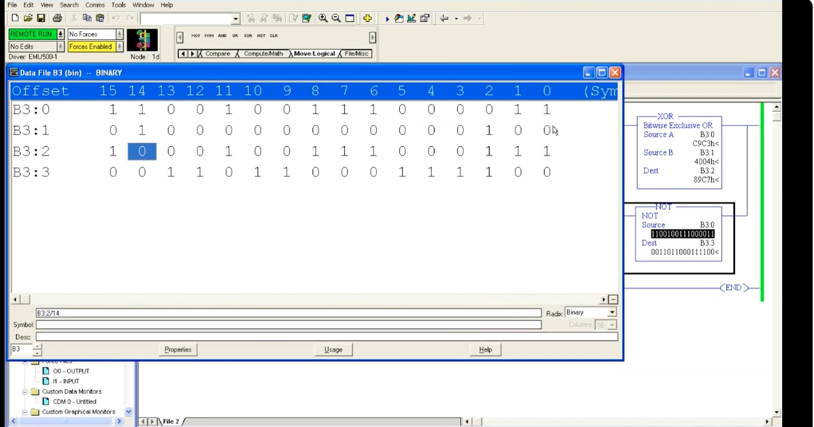
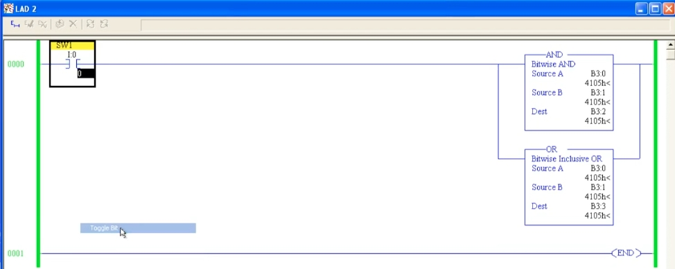
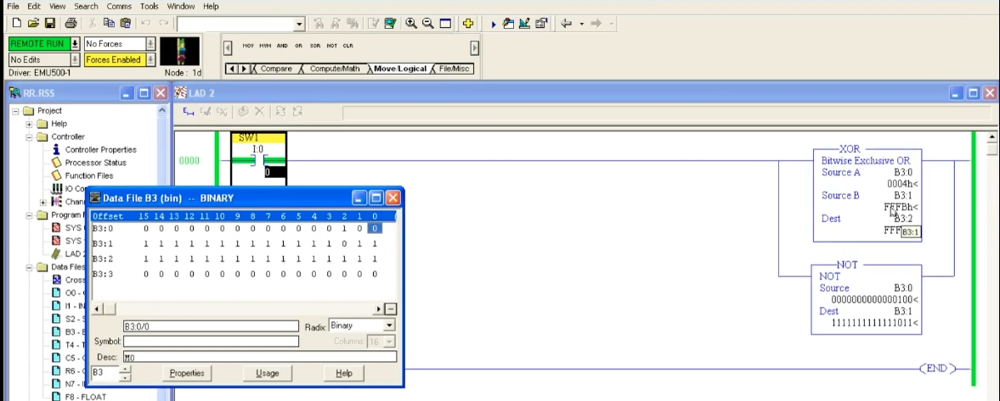
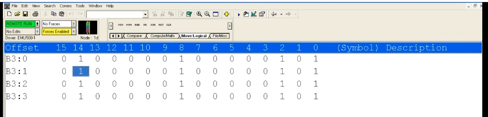
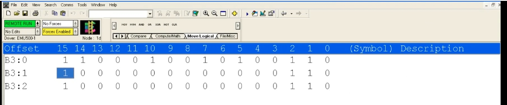
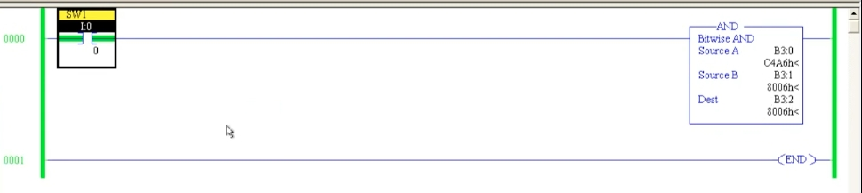

# PLC 教程 42:位元邏輯指令(AND / OR / NOT / XOR)
# PLC Training 42: Bitwise Logical Instructions (AND / OR / NOT / XOR)

> 來源 Source:<https://www.youtube.com/watch?v=H9qlWYAOL5E&list=PLI78ZBihrkE3nnGIj2WmHb_GoWjFlfFIu&index=42>
> 平台 Platform:Allen-Bradley(RSLogix 500 Pro / SLC 500 風格 Style)

---

## 目錄 Contents

1. [簡介 Introduction](#1-簡介--introduction)
2. [AND 位元且 Bitwise AND](#2-and-位元且--bitwise-and)
3. [OR 位元或 Bitwise OR](#3-or-位元或--bitwise-or)
4. [NOT 位元反相 Bitwise NOT](#4-not-位元反相--bitwise-not)
5. [XOR 位元互斥或 Bitwise XOR](#5-xor-位元互斥或--bitwise-xor)
6. [四個指令比較 Comparison](#6-四個指令比較--comparison)
7. [重點整理 Summary](#7-重點整理--summary)

---

## 1. 簡介 | Introduction

**中文**
上一節學了搬移指令,本節進入 **Move / Logical** 分頁中的**邏輯指令**。共有四種邏輯閘:

| 指令 | 英文全名 | 說明 |
|------|------|------|
| **AND** | Bitwise AND | 位元且 |
| **OR** | Bitwise Inclusive OR | 位元或 |
| **XOR** | Bitwise Exclusive OR | 位元互斥或 |
| **NOT** | NOT | 位元反相 |

**位元式(Bitwise)** 的意思:指令會把兩個 16 位元資料的**每一個對應位元**逐一做邏輯運算,再把結果存入目的地。因此要使用**二進位(Binary)位址**,例如 `B3:0`。

**共同特性**

- 都是**輸出指令**。
- AND / OR / XOR 有三個參數:**Source A、Source B、Dest**;NOT 只有兩個:**Source、Dest**。
- **只有在 Rung 為真時才會執行**。若 `SW1` 沒導通,修改資料後目的地不會更新;導通 `SW1` 後才會重新運算。
- 想看每個位元,開啟 **B3 資料檔**(Binary)。

**English**
After the move instructions, this lesson moves on to the **logical instructions** in the **Move / Logical** tab. There are four logic gates:

| Instruction | Full name | Description |
|------|------|------|
| **AND** | Bitwise AND | Bitwise AND |
| **OR** | Bitwise Inclusive OR | Bitwise OR |
| **XOR** | Bitwise Exclusive OR | Bitwise exclusive OR |
| **NOT** | NOT | Bitwise inversion |

**Bitwise** means the instruction performs the logic operation on **each corresponding bit** of two 16-bit values and stores the result in the destination. Therefore use **binary (Binary) addresses** such as `B3:0`.

**Common characteristics**

- All are **output instructions**.
- AND / OR / XOR have three parameters: **Source A, Source B, Dest**; NOT has two: **Source, Dest**.
- **They execute only while the rung is true.** If `SW1` is OFF, changing data does not update the destination; turn `SW1` ON and the result is recalculated.
- To see each bit, open the **B3 data file** (Binary).

---

## 2. AND 位元且 | Bitwise AND

**中文**
設定:Rung 0:`SW1`(`I:0/0`)→ `AND`,Source A = `B3:0`,Source B = `B3:1`,Dest = `B3:2`。

**規則**:對應的兩個位元**都是 1** 時,結果才是 1;只要有一個是 0,結果就是 0。

| A | B | A AND B |
|:-:|:-:|:-:|
| 0 | 0 | 0 |
| 0 | 1 | 0 |
| 1 | 0 | 0 |
| 1 | 1 | **1** |

**範例**

| 暫存器 Register | 二進位 Binary | 十六進位 Hex |
|------|------|:---:|
| `B3:0`(A) | `1100 0100 1010 0110` | `C4A6h` |
| `B3:1`(B) | `1000 0000 0000 0110` | `8006h` |
| `B3:2`(結果 Result) | `1000 0000 0000 0110` | `8006h` |

只有兩者同為 1 的位元(bit 15、bit 2、bit 1)被保留。



*圖 1:`AND` 的三個參數(十六進位顯示):`B3:0` = `C4A6h`、`B3:1` = `8006h`、`B3:2` = `8006h`。*
*Fig. 1: The three AND parameters (hex display): `B3:0` = `C4A6h`, `B3:1` = `8006h`, `B3:2` = `8006h`.*



*圖 2:B3 資料檔:`B3:0` 為 `1100 0100 1010 0110`,`B3:1` 為 `1000 0000 0000 0110`,`B3:2` 為 `1000 0000 0000 0110`。*
*Fig. 2: The B3 data file: `B3:0` is `1100 0100 1010 0110`, `B3:1` is `1000 0000 0000 0110`, `B3:2` is `1000 0000 0000 0110`.*

**English**
Setup: Rung 0: `SW1` (`I:0/0`) → `AND`, Source A = `B3:0`, Source B = `B3:1`, Dest = `B3:2`.

**Rule:** the result bit is 1 only when **both** corresponding bits are 1; if either is 0, the result is 0.

**Example:** see the tables above. Only the bits that are 1 in both values (bit 15, bit 2, bit 1) remain.

---

## 3. OR 位元或 | Bitwise OR

**中文**
複製同一組來源,在分支中加入 `OR`:Source A = `B3:0`,Source B = `B3:1`,**Dest = `B3:3`**(要與 AND 的結果 `B3:2` 分開)。

**規則**:對應的兩個位元**只要有一個是 1**,結果就是 1;兩者都是 0 才是 0。

| A | B | A OR B |
|:-:|:-:|:-:|
| 0 | 0 | 0 |
| 0 | 1 | **1** |
| 1 | 0 | **1** |
| 1 | 1 | **1** |

**範例**:`B3:0` 與 `B3:1` 都是 `4105h`(`0100 0001 0000 0101`),AND 與 OR 的結果都是 `4105h`。若把其中一個位元改成不同,AND 與 OR 的結果就會不同:例如某位元 A = 1、B = 0,AND 為 0,OR 為 1。



*圖 3:`AND`(`B3:2`)與 `OR`(`B3:3`)並聯,Source A、Source B 皆為 `B3:0`、`B3:1` = `4105h`,結果皆為 `4105h`。*
*Fig. 3: `AND` (`B3:2`) and `OR` (`B3:3`) in parallel; Source A and B (`B3:0`, `B3:1`) are both `4105h`, and both results are `4105h`.*



*圖 4:B3 資料檔中 `B3:0` 到 `B3:3` 的內容相同:bit 14、bit 8、bit 2、bit 0 為 1。*
*Fig. 4: In the B3 data file `B3:0` to `B3:3` hold the same pattern: bits 14, 8, 2 and 0 are 1.*

**English**
Copy the same sources and add an `OR` in a branch: Source A = `B3:0`, Source B = `B3:1`, **Dest = `B3:3`** (separate from the AND result in `B3:2`).

**Rule:** the result bit is 1 when **either** corresponding bit is 1; it is 0 only when both are 0.

**Example:** `B3:0` and `B3:1` are both `4105h` (`0100 0001 0000 0101`), so AND and OR both give `4105h`. If a bit differs between the two values, AND and OR give different results: e.g. A = 1, B = 0 gives AND = 0 and OR = 1.

---

## 4. NOT 位元反相 | Bitwise NOT

**中文**
NOT 只有兩個參數:**Source** 與 **Dest**。

**規則**:把 Source 的**每個位元反相**:0 變 1,1 變 0。

| A | NOT A |
|:-:|:-:|
| 0 | **1** |
| 1 | **0** |

**範例**

| 暫存器 Register | 二進位 Binary | 十六進位 Hex |
|------|------|:---:|
| `B3:0`(Source) | `0000 0000 0000 0100` | `0004h` |
| `B3:1`(Dest) | `1111 1111 1111 1011` | `FFFBh` |

原本全為 0 的位元變成 1,唯一一個 1(bit 2)變成 0,與來源**完全相反**。



*圖 5:`NOT`:Source `B3:0` = `0000000000000100`,Dest `B3:1` = `1111111111111011`。同時 `XOR` 的 Source A = `0004h`、Source B = `FFFBh`、Dest = `FFFFh`。*
*Fig. 5: `NOT`: Source `B3:0` = `0000000000000100`, Dest `B3:1` = `1111111111111011`. The `XOR` has Source A = `0004h`, Source B = `FFFBh`, Dest = `FFFFh`.*

**English**
NOT has only two parameters: **Source** and **Dest**.

**Rule:** it **inverts every bit** of the Source: 0 becomes 1 and 1 becomes 0.

**Example:** see the table above. Bits that were all 0 become 1, and the single 1 (bit 2) becomes 0 – exactly **the opposite** of the source.

---

## 5. XOR 位元互斥或 | Bitwise XOR

**中文**
**規則**:對應的兩個位元**不同**時,結果是 1;**相同**(同為 0 或同為 1)時,結果是 0。

| A | B | A XOR B |
|:-:|:-:|:-:|
| 0 | 0 | 0 |
| 0 | 1 | **1** |
| 1 | 0 | **1** |
| 1 | 1 | 0 |

**範例一(畫面)**

| 暫存器 Register | 二進位 Binary | 十六進位 Hex |
|------|------|:---:|
| `B3:0`(A) | `1100 1001 1100 0011` | `C9C3h` |
| `B3:1`(B) | `0100 0000 0000 0100` | `4004h` |
| `B3:2`(A XOR B) | `1000 1001 1100 0111` | `89C7h` |
| `B3:3`(NOT `B3:0`) | `0011 0110 0011 1100` | `363Ch` |

例如 bit 14:A = 1、B = 1 → 相同 → 結果 **0**(圖中被選取的位元)。



*圖 6:`XOR`:`C9C3h` XOR `4004h` = `89C7h`;`NOT`:`B3:0` → `B3:3` = `0011011000111100`。資料檔中 `B3:2` 的 bit 14 為 0。*
*Fig. 6: `XOR`: `C9C3h` XOR `4004h` = `89C7h`; `NOT`: `B3:0` → `B3:3` = `0011011000111100`. Bit 14 of `B3:2` is 0 in the data file.*

**範例二:XOR 與 NOT 搭配**

- NOT 的 Dest(`B3:1`)同時是 XOR 的 Source B。
- `B3:0` = `0004h`,NOT 得到 `B3:1` = `FFFBh`,XOR 的結果 `B3:2` = **`FFFFh`**(每個位元都不同,所以全為 1)。

**English**
**Rule:** the result bit is 1 when the two corresponding bits are **different**; it is 0 when they are **the same** (both 0 or both 1).

**Example 1 (from the screen):** see the table above. For instance, bit 14: A = 1, B = 1 → same → result **0** (the highlighted bit in the figure).

**Example 2: XOR with NOT**

- The NOT Dest (`B3:1`) is also the XOR Source B.
- `B3:0` = `0004h`; NOT gives `B3:1` = `FFFBh`; the XOR result `B3:2` = **`FFFFh`** (every bit differs, so all bits are 1).

---

## 6. 四個指令比較 | Comparison

| A | B | AND | OR | XOR | NOT A |
|:-:|:-:|:-:|:-:|:-:|:-:|
| 0 | 0 | 0 | 0 | 0 | 1 |
| 0 | 1 | 0 | 1 | 1 | 1 |
| 1 | 0 | 0 | 1 | 1 | 0 |
| 1 | 1 | 1 | 1 | 0 | 0 |

| 指令 Instruction | 參數數量 Parameters | 結果為 1 的條件 Result is 1 when |
|---|:-:|---|
| AND | 3 | 兩位元都是 1 Both bits are 1 |
| OR | 3 | 至少一個是 1 At least one bit is 1 |
| XOR | 3 | 兩位元不同 The bits differ |
| NOT | 2 | 來源位元是 0 The source bit is 0 |

> 註:本節比較表為整理補充,非影片內容。
> Note: This comparison table is a supplementary summary, not taken from the video.

---

## 7. 重點整理 | Summary

**中文**
1. 位元邏輯指令位於 **Move / Logical** 分頁:**AND、OR、XOR、NOT**,都是**輸出指令**。
2. 它們對 16 位元資料的**每個位元逐一運算**,建議使用 **Binary(`B3:x`)** 位址。
3. **AND**:兩位元皆為 1 才得 1。**OR**:至少一個為 1 就得 1。**XOR**:兩位元不同才得 1。**NOT**:位元反相。
4. AND / OR / XOR 有 **Source A、Source B、Dest**;NOT 只有 **Source、Dest**。
5. **Rung 為真才會執行**,否則目的地不更新。
6. 多個指令使用相同來源時,**Dest 要使用不同位址**,避免結果互相覆蓋。
7. 位元顯示為十六進位時要注意:`4105h` = `0100 0001 0000 0101`。
8. 下一節:**CLR(Clear,清除)** 指令。

**English**
1. The bitwise logic instructions are in the **Move / Logical** tab: **AND, OR, XOR, NOT** – all **output instructions**.
2. They operate on **each bit** of 16-bit data; use **Binary (`B3:x`)** addresses.
3. **AND:** 1 only if both bits are 1. **OR:** 1 if at least one bit is 1. **XOR:** 1 only if the bits differ. **NOT:** inverts each bit.
4. AND / OR / XOR have **Source A, Source B, Dest**; NOT has only **Source, Dest**.
5. **They execute only when the rung is true**; otherwise the destination is not updated.
6. When several instructions share the same sources, **use different Dest addresses** so results do not overwrite each other.
7. When bits are shown in hexadecimal, remember: `4105h` = `0100 0001 0000 0101`.
8. Next lesson: the **CLR (Clear)** instruction.

---

## 附:檔案結構 | Appendix: File Layout

```
PLC_42_Bitwise_Logical_Instructions.md
images/
├── ab42_01.jpg   # XOR (C9C3h ^ 4004h = 89C7h) and NOT (B3:0 -> B3:3), data file
├── ab42_02.jpg   # NOT (0004h -> FFFBh) and XOR (0004h ^ FFFBh = FFFFh)
├── ab42_03.jpg   # B3 data file: B3:0 to B3:3 all 0100 0001 0000 0101
├── ab42_04.jpg   # AND bit results in the B3 data file
├── ab42_05.jpg   # AND and OR in parallel, all 4105h
└── ab42_06.jpg   # AND: C4A6h AND 8006h = 8006h
```
