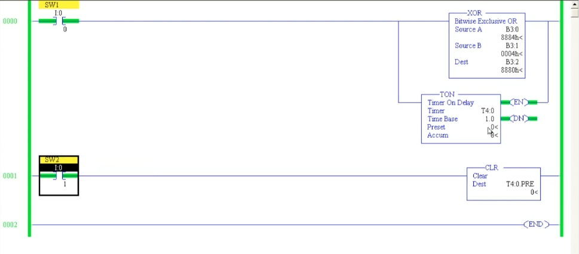
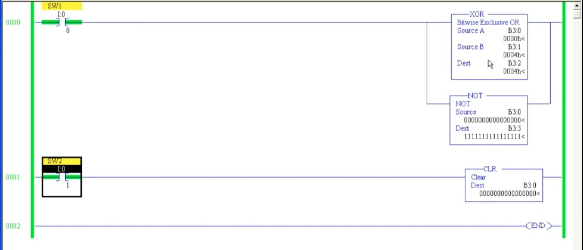

# PLC 教程 43:清除指令 CLR(Clear)
# PLC Training 43: Clear (CLR) Instruction

> 來源 Source:<https://www.youtube.com/watch?v=amG-MIhVHyE&list=PLI78ZBihrkE3nnGIj2WmHb_GoWjFlfFIu&index=43>
> 平台 Platform:Allen-Bradley(RSLogix 500 Pro / SLC 500 風格 Style)

---

## 目錄 Contents

1. [簡介 Introduction](#1-簡介--introduction)
2. [實驗一:清除二進位資料 Experiment 1: Clearing Binary Data](#2-實驗一清除二進位資料--experiment-1-clearing-binary-data)
3. [實驗二:清除整數 Experiment 2: Clearing an Integer](#3-實驗二清除整數--experiment-2-clearing-an-integer)
4. [實驗三:清除計時器預設值 Experiment 3: Clearing a Timer Preset](#4-實驗三清除計時器預設值--experiment-3-clearing-a-timer-preset)
5. [重點整理 Summary](#5-重點整理--summary)

---

## 1. 簡介 | Introduction

**中文**
**CLR(Clear,清除)** 位於 **Move / Logical** 分頁,是**輸出指令**。

- 只有**一個參數:Dest(目的地)**。
- 當 **Rung 為真**時,CLR 把 Dest 位址中的資料**清為 0**。
- 例如:Dest 中原本存放 100,Rung 為真時就變成 0。
- 不限於整數,也可以清除**二進位資料、計時器的 Preset / Accumulated、計數器的值**等任何位址。

**English**
**CLR (Clear)** is in the **Move / Logical** tab and is an **output instruction**.

- It has **only one parameter: Dest (destination)**.
- When the **rung is true**, CLR **sets the data at the Dest address to 0**.
- For example, if the Dest holds 100, it becomes 0 when the rung is true.
- It is not limited to integers: you can clear **binary data, a timer's Preset / Accumulated, a counter's value**, or any other address.

---

## 2. 實驗一:清除二進位資料 | Experiment 1: Clearing Binary Data

**中文**
沿用上一節的程式,再新增一條 Rung:

- Rung 0:`SW1`(`I:0/0`)→ 分支 { `XOR`(Source A = `B3:0`、Source B = `B3:1`、Dest = `B3:2`)/ `NOT`(Source = `B3:0`、Dest = `B3:3`)}
- Rung 1:`SW2`(`I:0/1`)→ `CLR`,**Dest = `B3:0`**

**步驟**

1. 先在 `B3:0` 放入資料(例如 `8889h`),`B3:1` = `0004h`。導通 `SW1`,XOR 與 NOT 正常運算。
2. `SW2` 尚未導通時,CLR **不動作**,`B3:0` 保持原值。
3. 導通 `SW2`(在接點上按右鍵選 **Toggle Bit**)→ CLR 執行 → `B3:0` 立刻變成 **0**。
4. 因為 XOR 與 NOT 都使用 `B3:0`,它們的結果也**隨之更新**。

| 暫存器 Register | `SW2` 導通前 Before | `SW2` 導通後 After |
|------|:---:|:---:|
| `B3:0`(被清除 cleared) | `8889h` = `1000 1000 1000 1001` | `0000h` |
| `B3:1` | `0004h` | `0004h` |
| `B3:2`(`B3:0` XOR `B3:1`) | `888Dh` | `0004h` |
| `B3:3`(NOT `B3:0`) | `7776h` = `0111 0111 0111 0110` | `FFFFh` = 全 1 all ones |


*圖 1:`SW2`(`I:0/1`)尚未導通。`B3:0` = `1000100010001001`(`8889h`),XOR 結果 `888Dh`,NOT 結果 `0111011101110110`。右鍵選單的 **Toggle Bit** 用來切換接點。*
*Fig. 1: `SW2` (`I:0/1`) is not yet ON. `B3:0` = `1000100010001001` (`8889h`), XOR result `888Dh`, NOT result `0111011101110110`. The context menu's **Toggle Bit** switches the contact.*


*圖 2:`SW2` 導通後,`CLR` 的 Dest `B3:0` = `0000000000000000`,XOR 結果 `0004h`,NOT 結果為全 1(`1111111111111111`)。*
*Fig. 2: After `SW2` is ON, the `CLR` Dest `B3:0` = `0000000000000000`, the XOR result is `0004h` and the NOT result is all ones (`1111111111111111`).*


*圖 3:資料檔視窗(8 位元顯示):`B3:0` 全為 0、`B3:1` 為 `0000 0100`、`B3:2` 為 `0000 0100`、`B3:3` 全為 1。*
*Fig. 3: The data file window (8-bit view): `B3:0` all 0, `B3:1` is `0000 0100`, `B3:2` is `0000 0100`, `B3:3` all 1.*

**關於輸入新資料**

CLR 在 Rung 為真時**每次掃描都會清除**。若要重新輸入新的資料,必須先**關閉 `SW2`**,再修改 `B3:0`;之後只要再次導通 `SW2`,資料又會被清回 0。

> 註:這一點是依指令行為推論,逐字稿中該句語音辨識不完整。
> Note: This point is inferred from how the instruction works; the corresponding sentence in the raw transcript is incomplete.

**English**
Building on the previous lesson's program, add one more rung:

- Rung 0: `SW1` (`I:0/0`) → branch { `XOR` (Source A = `B3:0`, Source B = `B3:1`, Dest = `B3:2`) / `NOT` (Source = `B3:0`, Dest = `B3:3`) }
- Rung 1: `SW2` (`I:0/1`) → `CLR`, **Dest = `B3:0`**

**Steps**

1. Put data in `B3:0` first (e.g. `8889h`), with `B3:1` = `0004h`. Turn `SW1` ON; XOR and NOT calculate normally.
2. While `SW2` is OFF, CLR **does nothing** and `B3:0` keeps its value.
3. Turn `SW2` ON (right-click the contact and choose **Toggle Bit**) → CLR executes → `B3:0` immediately becomes **0**.
4. Since XOR and NOT both use `B3:0`, their results **update accordingly**.

(See the before/after table above.)

**About entering new data**

CLR **clears on every scan** while the rung is true. To enter new data, first **turn `SW2` OFF**, then edit `B3:0`; whenever `SW2` is turned ON again, the data is cleared back to 0.

---

## 3. 實驗二:清除整數 | Experiment 2: Clearing an Integer

**中文**
CLR 不只能用在二進位位址,**整數位址**也可以:

- Rung 0:`SW1` → 分支 { `XOR` / `MOV`(Source = `N7:0`、Dest = `N7:1`)}
- Rung 1:`SW2`(`I:0/1`)→ `CLR`,**Dest = `N7:0`**

操作:

1. `N7:0` 輸入任意值(如 789),導通 `SW1` → MOV 把它搬到 `N7:1`(`N7:1` = 789)。
2. 導通 `SW2` → `N7:0` 被清為 **0**。



*圖 4:`MOV`:Source `N7:0` = 789、Dest `N7:1` = 789。下方 Rung 的 `CLR` Dest = `N7:0`(`SW2` 尚未導通,所以 `N7:0` 仍為 789)。*
*Fig. 4: `MOV`: Source `N7:0` = 789, Dest `N7:1` = 789. The `CLR` in the rung below has Dest = `N7:0` (`SW2` is not yet ON, so `N7:0` is still 789).*

**English**
CLR works on **integer addresses** as well as binary ones:

- Rung 0: `SW1` → branch { `XOR` / `MOV` (Source = `N7:0`, Dest = `N7:1`) }
- Rung 1: `SW2` (`I:0/1`) → `CLR`, **Dest = `N7:0`**

Steps:

1. Enter any value (e.g. 789) in `N7:0` and turn `SW1` ON → MOV copies it to `N7:1` (`N7:1` = 789).
2. Turn `SW2` ON → `N7:0` is cleared to **0**.

---

## 4. 實驗三:清除計時器預設值 | Experiment 3: Clearing a Timer Preset

**中文**
CLR 也可以清除**計時器的 Preset**:

- Rung 0:`SW1` → 分支 { `XOR` / `TON T4:0`(Time Base 1.0)}
- Rung 1:`SW2` → `CLR`,**Dest = `T4:0.PRE`**

操作與結果:

1. 導通 `SW2` → `T4:0.PRE` 立刻變成 **0**。
2. 此時 Accum = 0、Preset = 0,**累計值等於預設值**,所以 **DN(Done)位元導通**(圖中 EN 與 DN 皆為綠色)。
3. 關閉 `SW2`,輸入新的 Preset,**重新觸發計時器**,計時才會再度開始。
4. 再次導通 `SW2`,Preset 又會被清為 0。



*圖 5:`CLR` Dest = `T4:0.PRE` = 0。`TON T4:0` 的 Preset = 0、Accum = 0,EN 與 DN 皆導通。*
*Fig. 5: `CLR` Dest = `T4:0.PRE` = 0. The `TON T4:0` has Preset = 0 and Accum = 0, and both EN and DN are ON.*

**English**
CLR can also clear a **timer's Preset**:

- Rung 0: `SW1` → branch { `XOR` / `TON T4:0` (Time Base 1.0) }
- Rung 1: `SW2` → `CLR`, **Dest = `T4:0.PRE`**

Operation and result:

1. Turn `SW2` ON → `T4:0.PRE` immediately becomes **0**.
2. Now Accum = 0 and Preset = 0, so **the accumulated value equals the preset** and the **DN (Done) bit turns ON** (EN and DN are both green in the figure).
3. Turn `SW2` OFF, enter a new Preset and **re-trigger the timer**; only then does it start timing again.
4. Turn `SW2` ON again and the Preset is cleared to 0 once more.

---

## 5. 重點整理 | Summary

**中文**
1. **CLR** 是 Move / Logical 分頁中的**輸出指令**,只有一個參數 **Dest**。
2. **Rung 為真時**,Dest 的資料被**清為 0**。
3. Dest 可以是**二進位**(`B3:x`)、**整數**(`N7:x`)、**計時器 Preset / Accum**(`T4:0.PRE`)、計數器值等。
4. CLR 在 Rung 為真期間**持續清除**;要重新寫入新資料,需先關閉 CLR 的條件。
5. 清除計時器的 Preset 會使 Accum = Preset,**DN 導通**;要重新計時,需輸入新的 Preset 並重新觸發。
6. 當其他指令(如 XOR、NOT、MOV)使用同一位址時,它們的結果會隨著清除而更新。
7. 適用於**需要把資料重置為 0** 的場合。

**English**
1. **CLR** is an **output instruction** in the Move / Logical tab with a single parameter, **Dest**.
2. **While the rung is true**, the Dest data is **cleared to 0**.
3. Dest can be **binary** (`B3:x`), **integer** (`N7:x`), a **timer Preset / Accum** (`T4:0.PRE`), a counter value, and so on.
4. CLR **keeps clearing** as long as the rung is true; to write new data, first turn off the CLR condition.
5. Clearing a timer's Preset makes Accum = Preset, so **DN turns ON**; to time again, enter a new Preset and re-trigger.
6. When other instructions (XOR, NOT, MOV) use the same address, their results update as the data is cleared.
7. Use it whenever you need to **reset data to 0**.

---

## 附:檔案結構 | Appendix: File Layout

```
PLC_43_Clear_CLR.md
images/
├── ab43_01.jpg   # Data file after CLR: B3:0 = 0, B3:3 = all 1
├── ab43_02.jpg   # Before CLR: B3:0 = 8889h, Toggle Bit menu
├── ab43_03.jpg   # CLR T4:0.PRE, TON DN ON
├── ab43_04.jpg   # After CLR: B3:0 = 0000h
└── ab43_05.jpg   # MOV N7:0 -> N7:1 (789), CLR N7:0
```
