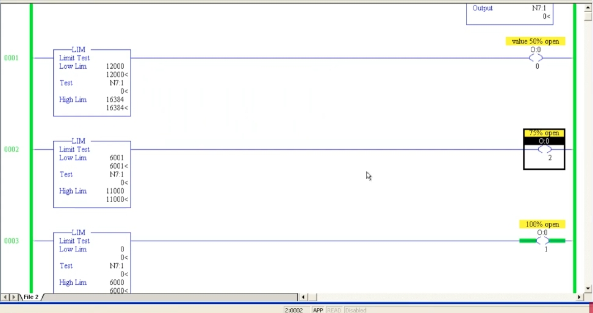
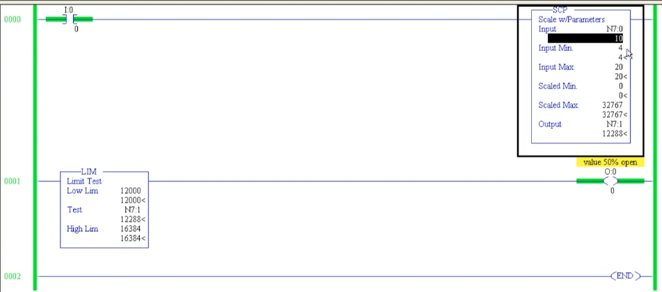
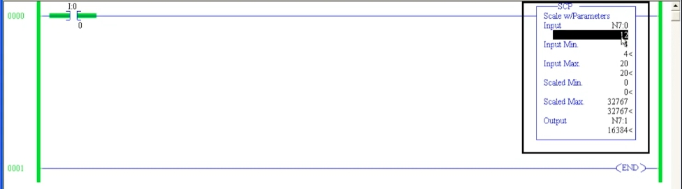
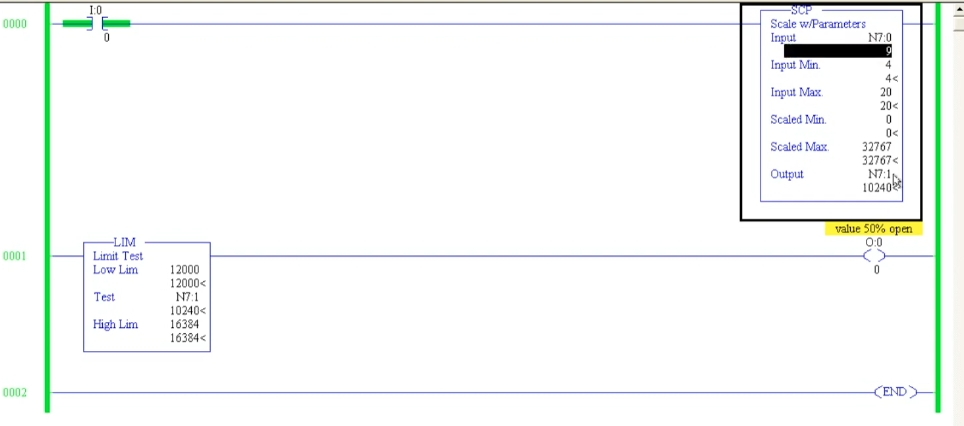
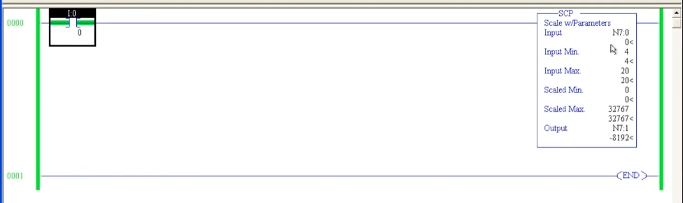

# PLC 教程 44:比例縮放指令 SCP(Scale with Parameters)
# PLC Training 44: Scaling – Scale with Parameters (SCP) Instruction

> 來源 Source:<https://www.youtube.com/watch?v=aThVtcOJq-0&list=PLI78ZBihrkE3nnGIj2WmHb_GoWjFlfFIu&index=44>
> 平台 Platform:Allen-Bradley(RSLogix 500 Pro / SLC 500 風格 Style)

---

## 目錄 Contents

1. [簡介 Introduction](#1-簡介--introduction)
2. [SCP 的六個參數 The Six SCP Parameters](#2-scp-的六個參數--the-six-scp-parameters)
3. [應用情境:水箱液位與閥門 Application: Tank Level and Valve](#3-應用情境水箱液位與閥門--application-tank-level-and-valve)
4. [步驟一:縮放 4–20 mA Step 1: Scaling 4–20 mA](#4-步驟一縮放-420-ma--step-1-scaling-420-ma)
5. [步驟二:用 LIM 控制閥門開度 Step 2: Controlling Valve Opening with LIM](#5-步驟二用-lim-控制閥門開度--step-2-controlling-valve-opening-with-lim)
6. [重點整理 Summary](#6-重點整理--summary)

---

## 1. 簡介 | Introduction

**中文**
**SCP(Scale with Parameters,參數式縮放)** 位於 **Advanced Math(進階數學)** 分頁。它能把一個**輸入範圍**內的數值,依比例轉換成另一個**輸出範圍**內的數值。

舉例:輸入範圍是 0 到 10,希望輸出範圍是 0 到 200:

- Input Min = 0,Input Max = 10
- Scaled Min = 0,Scaled Max = 200

於是輸入 5 會得到輸出 100(剛好在範圍的一半)。

**為什麼需要縮放?** 現場的類比訊號(如液位傳送器的 **4–20 mA**)不能直接拿來做比較運算,必須先縮放成一般的整數範圍(例如 0 到 32767),梯形圖才好處理。反過來,也可以把程式中的 0 到 32767 縮放成 **4–20 mA、3–15** 等類比輸出範圍(輸出縮放)。

**English**
**SCP (Scale with Parameters)** is in the **Advanced Math** tab. It converts a value within an **input range** proportionally into a value within another **output range**.

Example: an input range of 0 to 10 should become an output range of 0 to 200:

- Input Min = 0, Input Max = 10
- Scaled Min = 0, Scaled Max = 200

So an input of 5 gives an output of 100 (exactly halfway).

**Why scale?** Field analog signals (such as the **4–20 mA** of a level transmitter) cannot be used directly in comparisons; they must first be scaled to a normal integer range (e.g. 0 to 32767) that ladder logic can handle. Conversely, a 0 to 32767 value in the program can be scaled to an analog output range such as **4–20 mA or 3–15** (output scaling).

---

## 2. SCP 的六個參數 | The Six SCP Parameters

**中文**

| 參數 | 說明 | 本例 |
|------|------|------|
| **Input** | 輸入值(來自現場) | `N7:0` |
| **Input Min.** | 輸入最小值 | 4 |
| **Input Max.** | 輸入最大值 | 20 |
| **Scaled Min.** | 縮放後最小值 | 0 |
| **Scaled Max.** | 縮放後最大值 | 32767 |
| **Output** | 縮放結果存放位址 | `N7:1` |

**English**

| Parameter | Description | This example |
|------|------|------|
| **Input** | The input value (from the field) | `N7:0` |
| **Input Min.** | Minimum of the input range | 4 |
| **Input Max.** | Maximum of the input range | 20 |
| **Scaled Min.** | Minimum of the scaled range | 0 |
| **Scaled Max.** | Maximum of the scaled range | 32767 |
| **Output** | Address that receives the scaled result | `N7:1` |

---

## 3. 應用情境:水箱液位與閥門 | Application: Tank Level and Valve

**中文**
情境:水箱以**液位傳送器**量測水位,**進水閥**的開度要隨水位改變。依影片的設計:

| 水箱水位 | 進水閥開度 |
|------|------|
| 低水位 | **100% 全開** |
| 約 50% | **50% 開啟** |
| 約 70% | **25% 開啟** |
| 100%(滿) | **0%(全關)** |

做法分兩步:

1. 用 **SCP** 把傳送器的 **4–20 mA** 縮放成 **0–32767**。
2. 用 **LIM(範圍測試)** 判斷縮放值落在哪個區間,點亮對應的「閥門開度」輸出。

**English**
Scenario: a tank's water level is measured by a **level transmitter**, and the **inlet valve** opening must change with the level. Per the video's design:

| Tank level | Inlet valve opening |
|------|------|
| Low | **100% open** |
| About 50% | **50% open** |
| About 70% | **25% open** |
| 100% (full) | **0% (closed)** |

Two steps:

1. Use **SCP** to scale the transmitter's **4–20 mA** to **0–32767**.
2. Use **LIM (limit test)** to decide which range the scaled value falls in, and turn on the matching valve-opening output.

---

## 4. 步驟一:縮放 4–20 mA | Step 1: Scaling 4–20 mA

**中文**
設定:Rung 0:`I:0/0` → `SCP`,Input = `N7:0`(代表傳送器的 mA 值)、Input Min = 4、Input Max = 20、Scaled Min = 0、Scaled Max = 32767、Output = `N7:1`。

**比例公式(補充整理)**

```
Output = (Input − Input Min) ÷ (Input Max − Input Min) × (Scaled Max − Scaled Min) + Scaled Min
```

**影片與畫面中的結果**

| Input `N7:0`(mA) | 水位 Level | Output `N7:1` | 來源 Source |
|:---:|:---:|:---:|:---:|
| 4 | 0% | 0 | 影片 video |
| 6 | 12.5% | 4096 | 影片 video |
| 9 | 31.25% | **10240** | 畫面 screen(圖 3 Fig. 3) |
| 10 | 37.5% | **12288** | 畫面 screen(圖 4 Fig. 4) |
| 12 | 50% | **16384** | 畫面 screen(圖 1 Fig. 1) |
| 16 | 75% | 24575 | 影片 video |
| 20 | 100% | 32767 | 影片 video |
| 0 | (低於下限 below min) | **−8192** | 畫面 screen(圖 2 Fig. 2) |

當 Input = 4 mA(水箱為空)時,輸出為 0;Input = 12 mA(半滿)時,輸出約為 32767 的一半,即 16384;Input = 20 mA 時,輸出為 32767。



*圖 1:Input `N7:0` = 12,Output `N7:1` = `16384`(約為 32767 的一半)。*
*Fig. 1: Input `N7:0` = 12, Output `N7:1` = `16384` (about half of 32767).*



*圖 2:Input = 0 時,Output = `−8192`。*
*Fig. 2: With Input = 0, Output = `−8192`.*

> 補充(非影片內容):Input 低於 Input Min(例如斷線時的 0 mA)時,SCP **不會自動限制在 Scaled Min**,而是繼續按比例外推,因此得到負值。實務上常用比較指令偵測這種「超出範圍」的情況。
> Supplement (not from the video): when the Input is below Input Min (e.g. 0 mA from a broken wire), SCP does **not clamp to Scaled Min**; it keeps extrapolating proportionally, hence the negative value. In practice a comparator is often used to detect such "out of range" conditions.

**English**
Setup: Rung 0: `I:0/0` → `SCP`, Input = `N7:0` (representing the transmitter's mA value), Input Min = 4, Input Max = 20, Scaled Min = 0, Scaled Max = 32767, Output = `N7:1`.

**Proportional formula (supplementary):** see the formula above.

**Results from the video and screen:** see the table above.

At Input = 4 mA (empty tank) the output is 0; at 12 mA (half full) the output is about half of 32767, i.e. 16384; at 20 mA the output is 32767.

---

## 5. 步驟二:用 LIM 控制閥門開度 | Step 2: Controlling Valve Opening with LIM

**中文**
縮放後,就能用 **LIM**(上一節學過的範圍測試)判斷 `N7:1` 的區間。每個 LIM 控制一個輸出燈號(代表閥門開度):

| Rung | LIM:Low Lim ~ High Lim | Test | 輸出 Output | 意義 |
|:---:|:---:|:---:|---|------|
| 1 | 12000 ~ 16384 | `N7:1` | `O:0/0` | **50% 開啟**(`value 50% open`) |
| 2 | 6001 ~ 11000 | `N7:1` | `O:0/2` | **75% 開啟**(`75% open`) |
| 3 | 0 ~ 6000 | `N7:1` | `O:0/1` | **100% 開啟**(`100% open`) |

**實驗結果**

- **Input = 9 mA** → `N7:1` = 10240:不在 12000 到 16384 之間 → 50% 輸出**不亮**(圖 3)。
- **Input = 10 mA** → `N7:1` = 12288:落在 12000 到 16384 之間 → **50% 開啟輸出導通**(圖 4)。
- **數值為 0**(水位很低)→ 落在 0 到 6000 → **100% 開啟**輸出導通(圖 5)。
- 數值在 6001 到 11000(如 8 mA 以上)→ **75% 開啟**輸出導通。

> 注意:影片提到 LIM 要在 Rung 為真時才會更新,所以要先導通輸入條件(`I:0/0`),輸出才會隨之更新。



*圖 3:Input = 9 → Output = 10240。LIM(12000 到 16384)測試值 10240 低於下限,`value 50% open` 輸出熄滅。*
*Fig. 3: Input = 9 → Output = 10240. The LIM (12000 to 16384) test value 10240 is below the low limit, so the `value 50% open` output is OFF.*



*圖 4:Input = 10 → Output = 12288,落在 12000 到 16384 之間,`value 50% open` 輸出導通(綠色)。*
*Fig. 4: Input = 10 → Output = 12288, inside 12000 to 16384, so the `value 50% open` output is ON (green).*



*圖 5:三個 LIM:12000 到 16384(50% 開啟,`O:0/0`)、6001 到 11000(75% 開啟,`O:0/2`)、0 到 6000(100% 開啟,`O:0/1`)。目前 `N7:1` = 0,只有 100% 開啟的輸出導通。*
*Fig. 5: Three LIMs: 12000 to 16384 (50% open, `O:0/0`), 6001 to 11000 (75% open, `O:0/2`), 0 to 6000 (100% open, `O:0/1`). `N7:1` is currently 0, so only the 100% open output is ON.*

**延伸**:依同樣方式再增加 LIM,即可做出 **25% 開啟**與 **0%(全關)** 的區間。

> 補充(非影片內容):上表的區間之間有空隙(例如 11001 到 11999)及 16384 以上,這些值目前不會點亮任何輸出。實際使用時,請把相鄰區間的上下限接起來,避免出現「沒有任何輸出」的區段。
> Supplement (not from the video): the ranges in the table have gaps (e.g. 11001 to 11999) and above 16384, where no output is turned on. In real use, make adjacent limits join up so no range is left without an output.

**English**
After scaling, use **LIM** (the limit test from the earlier lesson) to decide which range `N7:1` falls into. Each LIM drives an output lamp that represents a valve opening: see the table above.

**Experiment results**

- **Input = 9 mA** → `N7:1` = 10240: not between 12000 and 16384 → the 50% output is **OFF** (Fig. 3).
- **Input = 10 mA** → `N7:1` = 12288: between 12000 and 16384 → the **50% open output turns ON** (Fig. 4).
- **Value 0** (very low level) → within 0 to 6000 → the **100% open** output turns ON (Fig. 5).
- A value within 6001 to 11000 turns ON the **75% open** output.

> Note: the video mentions that the instructions update only while the rung is true, so turn the input condition (`I:0/0`) ON first for the outputs to follow.

**Extension:** add more LIMs the same way to create ranges for **25% open** and **0% (closed)**.

---

## 6. 重點整理 | Summary

**中文**
1. **SCP** 位於 **Advanced Math** 分頁,把**輸入範圍**按比例轉換為**輸出範圍**。
2. 六個參數:**Input、Input Min.、Input Max.、Scaled Min.、Scaled Max.、Output**。
3. 典型用途:把現場 **4–20 mA** 縮放成 **0–32767**,便於梯形圖處理;也可做**輸出縮放**(如 0–32767 縮放為 4–20 mA 或 3–15)。
4. 本例結果:4 → 0、12 → 16384、20 → 32767。
5. 縮放後,可搭配 **LIM / 比較指令** 依區間控制輸出(例如閥門開度 100% / 75% / 50%)。
6. 輸入低於 Input Min 時,結果會是**負值**(如 0 → −8192),要注意範圍檢查。
7. 影片說明後續請自行在軟體中練習。

**English**
1. **SCP** is in the **Advanced Math** tab and converts an **input range** proportionally to an **output range**.
2. Six parameters: **Input, Input Min., Input Max., Scaled Min., Scaled Max., Output**.
3. Typical use: scale a field **4–20 mA** signal to **0–32767** for ladder processing; it can also do **output scaling** (e.g. 0–32767 to 4–20 mA or 3–15).
4. Results in this example: 4 → 0, 12 → 16384, 20 → 32767.
5. After scaling, combine it with **LIM / comparators** to control outputs by range (e.g. valve opening 100% / 75% / 50%).
6. When the input is below Input Min the result is **negative** (e.g. 0 → −8192), so add range checking.
7. The video encourages practicing in the software.

---

## 附:檔案結構 | Appendix: File Layout

```
PLC_44_Scaling_SCP.md
images/
├── ab44_01.jpg   # Three LIMs: 50% / 75% / 100% valve opening
├── ab44_02.jpg   # SCP: Input 9 -> 10240, LIM output OFF
├── ab44_03.jpg   # SCP: Input 10 -> 12288, 50% open output ON
├── ab44_04.jpg   # SCP: Input 0 -> -8192
└── ab44_05.jpg   # SCP: Input 12 -> 16384
```
