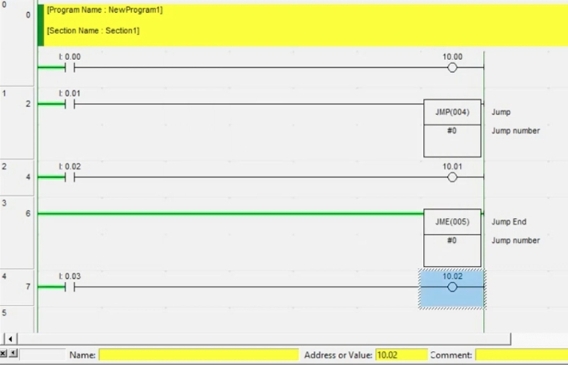
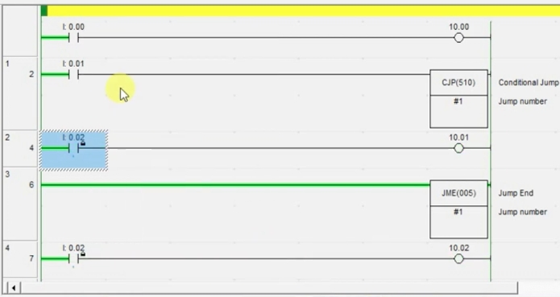
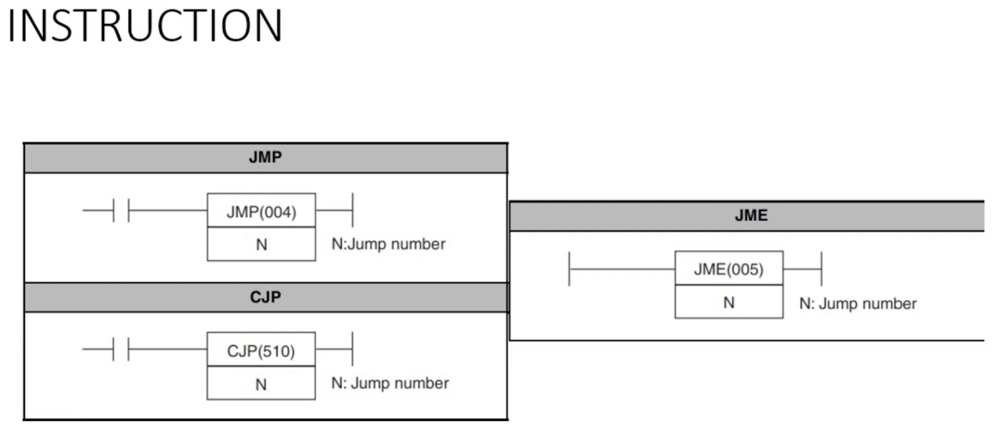
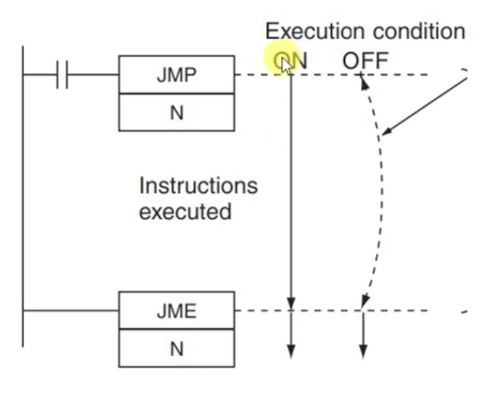
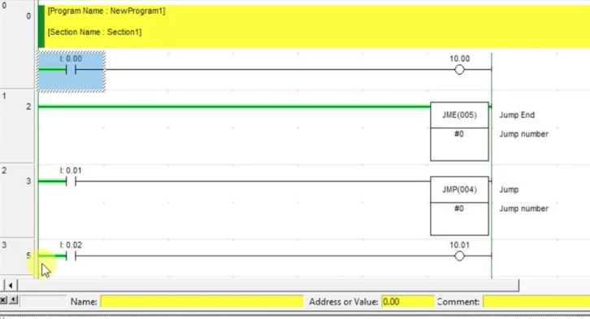
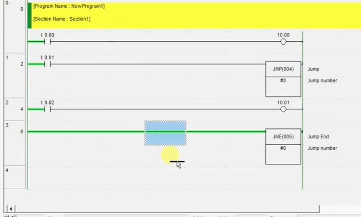
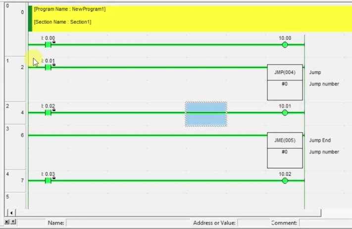
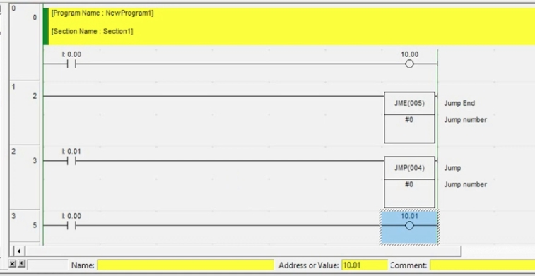
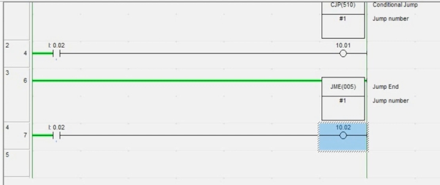

# Jump Instructions in Omron PLC Ladder Logic: JMP / JME / CJP
# 歐姆龍 PLC 梯形圖跳轉指令：JMP / JME / CJP（中英對照教程）

> Source / 來源: <https://www.youtube.com/watch?v=019Uu3aSA_k> — *Jump Instruction in PLC Ladder Logic - JMP JME CJP Instructions* (Omron PLC Course, Automation Community)

---

## 1. Purpose of Jump Instructions / 跳轉指令的用途

**EN:** A jump instruction lets the PLC **skip a section of rungs** in the ladder program. Imagine a project with 100 rungs: in some situations you want to skip a certain group of rungs. Deleting them and re-adding them later is *not* a proper way to program. Instead, PLCs provide instructions that let you enable or skip a block of logic whenever you need.

**中文：** 跳轉指令可以讓 PLC **略過（不執行）梯形圖中的一段梯級**。假設專案有 100 個梯級，某些情況下想跳過其中一部分；若每次都刪除再加回來，並不是正確的寫法。PLC 提供了跳轉指令，讓你隨時決定某段程式要執行還是略過。

**EN:** Omron (and most other PLCs) provide these instructions:

**中文：** 歐姆龍（及多數 PLC）提供以下指令：

| Instruction 指令 | Code 代碼 | Meaning 說明 |
|---|---|---|
| **JMP** | JMP(004) | Jump / 跳轉 |
| **CJP** | CJP(510) | Conditional Jump / 條件跳轉 |
| **JME** | JME(005) | Jump End / 跳轉結束 |

*Figure 1 / 圖 1：JMP, CJP, JME 指令符號；N = Jump number（跳轉編號）。*

---

## 2. JMP and JME: How They Work / JMP 與 JME 的工作原理

**EN:** A jump always needs **two instructions**: **JMP** (where the skipping starts) and **JME** (where the skipping ends). They are paired by the **jump number N**. In a large project you may use several jumps, and the jump number tells the PLC which JMP belongs to which JME.

**中文：** 跳轉必須使用**兩個指令**：**JMP**（從哪裡開始跳）與 **JME**（跳到哪裡結束）。兩者以**跳轉編號 N** 配對。專案較大時可能用到多組跳轉，靠編號區分哪個 JMP 對應哪個 JME。

**EN:** Behavior of JMP:
- **Condition ON** → the rungs between JMP and JME are **executed normally**.
- **Condition OFF** → the rungs between JMP and JME are **skipped** (not executed).

**中文：** JMP 的行為：
- **條件 ON** → JMP 與 JME 之間的梯級**正常執行**。
- **條件 OFF** → JMP 與 JME 之間的梯級**被跳過（不執行）**。

*Figure 2 / 圖 2：JMP 執行條件圖——ON 時中間指令被執行；OFF 時直接跳到 JME。*

---

## 3. Example 1: JMP #0 / 範例一：JMP #0

**EN:** Program structure (see figures):

| Rung 梯級 | Logic 邏輯 |
|---|---|
| 0 | `I0.00` → `10.00` (outside the jump range 在跳轉範圍外) |
| 1 | `I0.01` → `JMP #0` |
| 2 | `I0.02` → `10.01` (inside the jump range 在跳轉範圍內) |
| 3 | `JME #0` (Jump End 跳轉結束) |
| 4 | `I0.03` → `10.02` (outside the jump range 在跳轉範圍外) |

*Figure 3 / 圖 3：`I0.01` ON，JMP 條件成立，中間梯級（`I0.02 → 10.01`）正常執行。*

*Figure 4 / 圖 4：`I0.01` OFF，中間梯級被跳過；跳轉範圍外的 `I0.03 → 10.02` 仍正常執行。*

**EN – Simulation results:**
1. With `I0.01` **OFF** (JMP not active), turning on `I0.02` does **not** turn on `10.01`, because that rung lies inside the skipped area and is not executed.
2. Rungs **outside** the jump range (`10.00`, `10.02`) always run as usual, regardless of the JMP condition.
3. With `I0.01` **ON**, the rungs between JMP and JME run normally, so `I0.02` controls `10.01`.
4. Important: if `10.01` was already ON and you then turn the JMP condition OFF (skip), the output **does not turn off** — the skipped rung is not scanned, so the output simply **keeps its previous state**. It updates again only when the jump is released.

**中文 – 模擬結果：**
1. `I0.01` **OFF**（JMP 未成立）時，即使打開 `I0.02`，`10.01` 也**不會**輸出，因為該梯級位於被跳過的區域，沒有被執行。
2. 跳轉範圍**之外**的梯級（`10.00`、`10.02`）不受 JMP 條件影響，照常執行。
3. `I0.01` **ON** 時，JMP 與 JME 之間的梯級正常執行，`I0.02` 可控制 `10.01`。
4. 重點：若 `10.01` 原本已經 ON，之後將 JMP 條件關閉（開始跳過），輸出**不會被關掉**——因為被跳過的梯級不再掃描，輸出會**保持原本的狀態**，直到跳轉解除後才會重新更新。

*Figure 5 / 圖 5：編輯程式——在 JMP 之後加入梯級，再加入 JME。*

---

## 4. Programming Rules / 程式撰寫規則

**EN:**
1. **Jump numbers must match.** The JMP and JME of the same pair must use the same number (e.g. both `#0`).
2. **Use a different number for each additional jump pair** (e.g. `#1` for a second pair). The video states the same number should not be reused.
3. **JME must come after JMP.** JME placed *before* its JMP is wrong.
4. **Use JMP before JME.** The software warns if you do (see Section 5).
5. Rungs **outside** the jump range are never affected.
6. You may use **multiple jump pairs** in one project.

**中文：**
1. **編號必須一致**：同一組 JMP 與 JME 要使用相同的編號（例如都用 `#0`）。
2. **每增加一組跳轉就換一個編號**（例如第二組用 `#1`）。影片中說明不要重複使用相同編號。
3. **JME 必須放在 JMP 之後**；JME 放在對應 JMP 之前是錯誤的。
4. **先 JMP、後 JME**，否則軟體會出現警告（見第 5 節）。
5. 跳轉範圍**以外**的梯級完全不受影響。
6. 一個專案中可以使用**多組跳轉**。

> **Note 備註 (EN):** Exact jump-number ranges and special behavior of `#0` depend on the PLC model; check your model's instruction manual.
> **備註（中文）：** 跳轉編號的範圍與 `#0` 的特殊用法依 PLC 機型而異，請查閱所用機型的指令手冊。

---

## 5. Common Mistake: JME Before JMP / 常見錯誤：JME 出現在 JMP 之前

**EN:** If you place `JME #0` **above** `JMP #0` (as below), the program cannot be transferred/run correctly. In the video, the software shows a **warning** (some PLC software gives a warning instead of an error), and the program still cannot be used properly. Fix it by moving JME **below** the matching JMP.

**中文：** 如果把 `JME #0` 放在 `JMP #0` **上方**（如下圖），程式無法正確下載／執行。影片中軟體顯示**警告**（部分 PLC 軟體會給警告而非錯誤），程式仍無法正常使用。修正方法：把 JME 移到對應 JMP 的**下方**。

*Figure 6 / 圖 6：錯誤範例——JME 在 JMP 之前。*

*Figure 7 / 圖 7：同一錯誤，後面接 `I0.00 → 10.01`。*

---

## 6. CJP: Conditional Jump / CJP：條件跳轉

**EN:** **CJP(510)** works in the **opposite** way to JMP:
- **CJP condition ON** → the rungs between CJP and JME are **skipped**.
- **CJP condition OFF** → the rungs between CJP and JME are **executed normally**.

As with JMP, CJP needs a matching **JME with the same jump number**, and JME must come after CJP.

**中文：** **CJP(510)** 的動作與 JMP **相反**：
- **CJP 條件 ON** → CJP 與 JME 之間的梯級**被跳過**。
- **CJP 條件 OFF** → CJP 與 JME 之間的梯級**正常執行**。

與 JMP 相同，CJP 也需要搭配**相同編號的 JME**，且 JME 必須位於 CJP 之後。

### Comparison / 對照表

| | JMP(004) | CJP(510) |
|---|---|---|
| Condition ON 條件 ON | Execute between rungs 執行中間梯級 | **Skip** between rungs 跳過中間梯級 |
| Condition OFF 條件 OFF | **Skip** between rungs 跳過中間梯級 | Execute between rungs 執行中間梯級 |
| Needs JME 需搭配 JME | Yes, same number 是，編號相同 | Yes, same number 是，編號相同 |

### Example 2: CJP #1 / 範例二：CJP #1

| Rung 梯級 | Logic 邏輯 |
|---|---|
| 0 | `I0.00` → `10.00` |
| 1 | `I0.01` → `CJP #1` |
| 2 | `I0.02` → `10.01` (inside 範圍內) |
| 3 | `JME #1` |
| 4 | `I0.02` → `10.02` (outside 範圍外) |

*Figure 8 / 圖 8：`I0.01` ON → CJP 成立，中間的 `10.01` 梯級被跳過。*

*Figure 9 / 圖 9：跳轉範圍外的 `I0.02 → 10.02` 仍然正常輸出。*

**EN – Simulation results:**
1. Turn on `I0.01` (CJP ON) and `I0.02`: `10.02` (outside the range) turns **ON**, but `10.01` (inside the range) stays **OFF** because it is skipped.
2. Turn `I0.01` OFF (CJP OFF): the rungs in between execute, so `10.01` follows `I0.02`.

**中文 – 模擬結果：**
1. 打開 `I0.01`（CJP ON）與 `I0.02`：範圍外的 `10.02` **輸出 ON**，但範圍內的 `10.01` 因為被跳過而**保持 OFF**。
2. 關閉 `I0.01`（CJP OFF）：中間梯級正常執行，`10.01` 會跟隨 `I0.02`。

---

## 7. Summary / 總結

**EN:**
- JMP / CJP + JME skip a block of rungs without deleting any logic.
- **JMP**: ON = run, OFF = skip. **CJP**: ON = skip, OFF = run.
- Match jump numbers; place JME after JMP/CJP.
- Rungs outside the jump range are unaffected.
- Skipped outputs keep their last state (they are not reset).

**中文：**
- JMP / CJP 搭配 JME，可在不刪除程式的情況下略過一段梯級。
- **JMP**：ON 執行、OFF 跳過。**CJP**：ON 跳過、OFF 執行。
- 編號要一致；JME 要放在 JMP／CJP 之後。
- 跳轉範圍以外的梯級不受影響。
- 被跳過的輸出會保持最後的狀態（不會被重置）。
