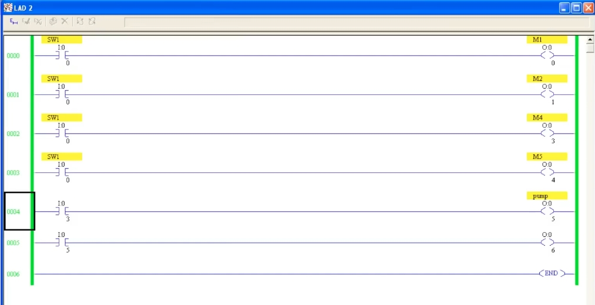
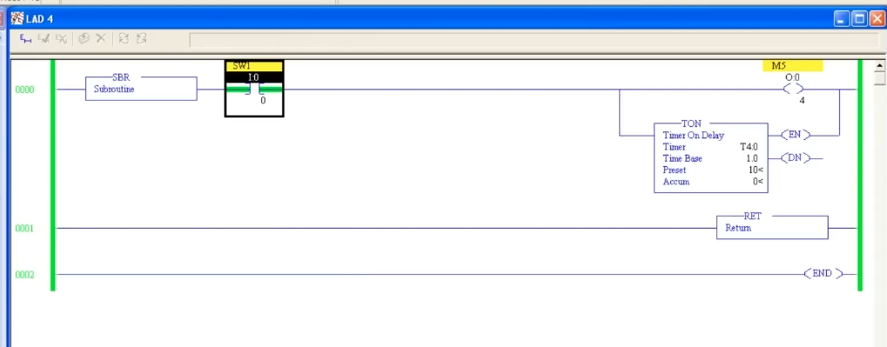
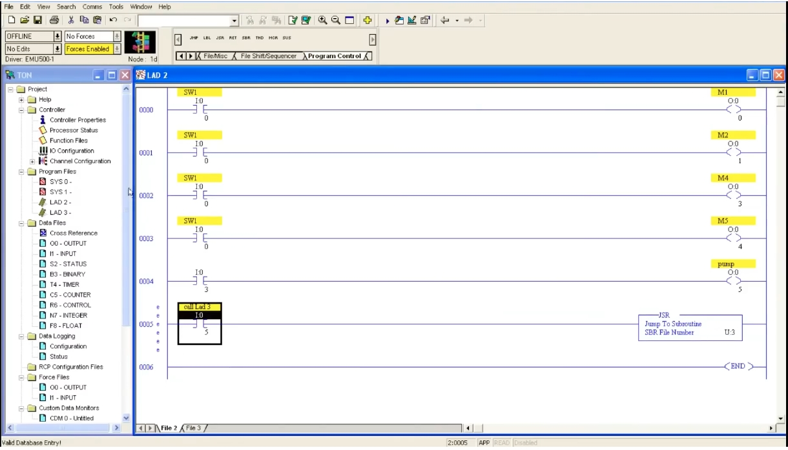
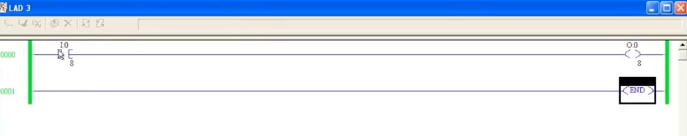
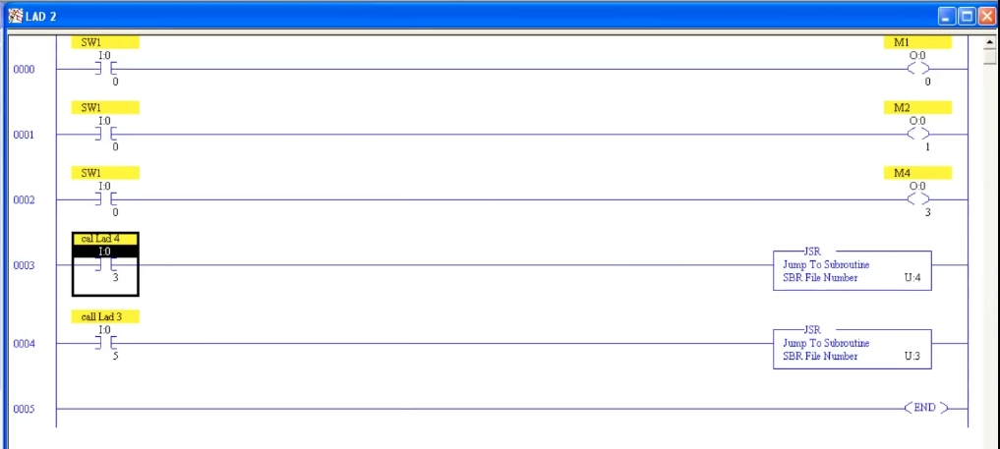
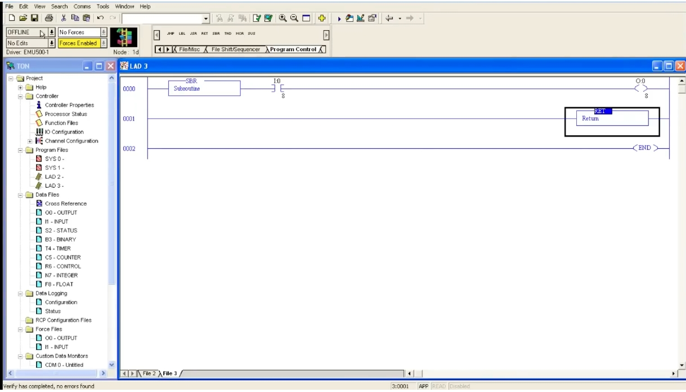

# Subroutines in PLC Ladder Logic: JSR / SBR / RET
# PLC 梯形圖子程式：JSR / SBR / RET（中英對照教程）

> Source / 來源: <https://www.youtube.com/watch?v=zYrpi6aWnsA> — *PLC Training 46: Subroutine in PLC* (Electrical & Automation Online Courses)
>
> Software in the video / 影片使用軟體: Allen-Bradley RSLogix 500 (SLC 500 / MicroLogix style, emulator EMU500) — 程式檔案 LAD 2、LAD 3、LAD 4。

---

## 1. Program Files and the Main Program / 程式檔案與主程式

**EN:** When you create a new project, the **Program Files** folder already contains:
- **SYS 0** and **SYS 1** – system files used by the controller. You cannot use them for your own logic.
- **LAD 2** – the **main program** (default ladder file). This is where the processor starts scanning, and where you normally write your logic.

**中文：** 建立新專案時，**Program Files（程式檔案）** 資料夾內已有：
- **SYS 0**、**SYS 1**：控制器的系統檔案，不能用來寫使用者程式。
- **LAD 2**：**主程式**（預設的梯形圖檔案），PLC 從這裡開始掃描，一般也在這裡撰寫邏輯。

**EN:** You can add more ladder pages for separate functions (for example I/O mapping, scaling, or any other function). These extra pages are called **subroutines**.

**中文：** 你可以另外增加梯形圖頁面來放獨立功能（例如 I/O 對應、比例換算等）。這些額外增加的頁面稱為**子程式（Subroutine）**。

*Figure 1 / 圖 1：左側專案樹可見 SYS 0、SYS 1、LAD 2、LAD 3；主程式 LAD 2 的第 0005 梯級以 JSR 呼叫 U:3。*

---

## 2. Creating a New Subroutine File / 建立新的子程式檔案

**EN:**
1. In the project tree, right-click **Program Files** → **New**.
2. Enter the next free file number. Since files 0, 1, 2 already exist, the new file is **3** (name it e.g. *LAD 3*).
3. Write your logic on the new page just like in the main program.

**中文：**
1. 在專案樹中，對 **Program Files** 按右鍵 → **New（新增）**。
2. 輸入下一個可用的檔案編號。因為 0、1、2 已存在，所以新檔案是 **3**（可命名為 *LAD 3*）。
3. 在新頁面中像主程式一樣撰寫邏輯。

---

## 3. Experiment: Why the Extra Page Does Not Run / 實驗：為什麼額外頁面不會執行

**EN:** In the video, a simple rung is written in LAD 3: input `I:0/8` → output `O:0/8`. After checking for errors and going online, turning on `I:0/8` does **nothing** — the output stays OFF.

**Reason:** the processor only scans the **main program**. A new page is never executed unless the main program **calls** it. This applies to everything on that page: contacts, timers, counters, comparisons, and so on — none of them run.

**中文：** 影片中在 LAD 3 寫了一個簡單梯級：輸入 `I:0/8` → 輸出 `O:0/8`。檢查錯誤並上線後，打開 `I:0/8`，輸出**沒有反應**，仍為 OFF。

**原因：** 處理器只會掃描**主程式**。新增的頁面除非由主程式**呼叫**，否則永遠不會被執行；頁面上的接點、計時器、計數器、比較指令等全部都不會動作。

*Figure 2 / 圖 2：LAD 3 剛建立時只有 `I:0/8 → O:0/8` 與 END，沒有 SBR，也沒有被呼叫，因此不會執行。*

---

## 4. The Three Instructions / 三個指令

| Instruction 指令 | Full name 全名 | Where used 使用位置 | Function 功能 |
|---|---|---|---|
| **JSR** | Jump to Subroutine 跳至子程式 | Main program (LAD 2) 主程式 | Calls a subroutine file 呼叫子程式檔案 |
| **SBR** | Subroutine 子程式標籤 | First rung of the subroutine file 子程式檔案的第一個梯級 | Marks the file as a subroutine 標示此檔案為子程式 |
| **RET** | Return 返回 | End of the subroutine, before END 子程式尾端（END 之前） | Returns to the main program 返回主程式 |

**EN:** All three are found in the **Program Control** instruction tab (JMP, LBL, JSR, RET, SBR, TND, MCR, SUS).

**中文：** 這三個指令都在 **Program Control（程式控制）** 指令頁籤中（JMP、LBL、JSR、RET、SBR、TND、MCR、SUS）。

---

## 5. Step by Step: Calling LAD 3 / 步驟：呼叫 LAD 3

### Step 1 – Add JSR in the main program / 步驟 1：在主程式加入 JSR

**EN:**
1. In LAD 2, add a contact (e.g. `I:0/5`) – this input will trigger the call.
2. From **Program Control**, insert **JSR (Jump to Subroutine)** as an **output instruction** on that rung.
3. Enter the **SBR File Number**: `U:3` (the format is `U:` + file number).
4. Add a description to the contact, e.g. *call Lad 3*.

**中文：**
1. 在 LAD 2 加入一個接點（例如 `I:0/5`），用它來觸發呼叫。
2. 從 **Program Control** 選擇 **JSR（Jump to Subroutine）**，作為該梯級的**輸出指令**。
3. 輸入 **SBR File Number（子程式檔案編號）**：`U:3`（格式為 `U:` 加檔案編號）。
4. 為接點加上描述，例如 *call Lad 3*。

*Figure 3 / 圖 3：主程式原本的梯級（第 0004、0005 條為一般輸出，之後第 0005 條改為 JSR）。*

### Step 2 – Add SBR and RET in the subroutine / 步驟 2：在子程式加入 SBR 與 RET

**EN:**
1. In LAD 3, put **SBR** at the **start of the first rung**, in series with the logic.
2. In a following rung, add **RET (Return)**.
3. Keep **END** as the last rung.

**中文：**
1. 在 LAD 3 的**第一個梯級最前面**放置 **SBR**，並與後面的邏輯串聯。
2. 在後面的梯級加入 **RET（返回）**。
3. 最後一個梯級保留 **END**。

*Figure 4 / 圖 4：LAD 3 – 第 0000 條：SBR + `I:0/8 → O:0/8`；第 0001 條：RET；第 0002 條：END。下方狀態列顯示 "Verify has completed, no errors found"。*

### Step 3 – Verify and test / 步驟 3：檢查與測試

**EN:**
1. Run **Verify (check for errors)** and go **online**.
2. First turn on `I:0/8` only → output `O:0/8` stays **OFF** (subroutine not yet called).
3. Turn on the calling input `I:0/5` → the subroutine is now called.
4. Turn on `I:0/8` again → `O:0/8` turns **ON**.

**中文：**
1. 執行 **Verify（檢查錯誤）** 並**上線（Online）**。
2. 先只打開 `I:0/8` → 輸出 `O:0/8` **仍為 OFF**（子程式尚未被呼叫）。
3. 打開呼叫用的輸入 `I:0/5` → 子程式被呼叫。
4. 再打開 `I:0/8` → `O:0/8` **變為 ON**。

> **Key point 重點：** Unless the main program calls the subroutine, its logic never runs. / 除非主程式呼叫，否則子程式內的邏輯不會執行。

---

## 6. Using Multiple Subroutines (LAD 4 with a Timer) / 使用多個子程式（含計時器的 LAD 4）

**EN:** You can create as many subroutine files as you need. In the video a fourth file, **LAD 4**, is created:
- First rung: **SBR** → contact `SW1` (`I:0/0`) → output `M5` (`O:0/4`) and a **TON** timer (`T4:0`, time base 1.0 s, preset 10).
- Next rung: **RET**, then **END**.

**中文：** 你可以依需要建立任意數量的子程式檔案。影片中新增了第四個檔案 **LAD 4**：
- 第一個梯級：**SBR** → 接點 `SW1`（`I:0/0`）→ 輸出 `M5`（`O:0/4`）並聯一個 **TON** 計時器（`T4:0`，時基 1.0 秒，預設值 10）。
- 下一個梯級：**RET**，再接 **END**。

*Figure 5 / 圖 5：LAD 4 – SBR、`SW1`、輸出 `M5`、TON 計時器、RET、END。*

**EN:** In the main program, add another JSR rung: contact `I:0/3` (description *call Lad 4*) → **JSR, SBR File Number `U:4`**. Now LAD 2 calls both LAD 3 (via `I:0/5`) and LAD 4 (via `I:0/3`).

**中文：** 在主程式再加一個 JSR 梯級：接點 `I:0/3`（描述 *call Lad 4*）→ **JSR，SBR 檔案編號 `U:4`**。此時 LAD 2 可分別用 `I:0/5` 呼叫 LAD 3、用 `I:0/3` 呼叫 LAD 4。

*Figure 6 / 圖 6：第 0003 條 `call Lad 4` → JSR U:4；第 0004 條 `call Lad 3` → JSR U:3；最後 END。*

**EN – Test:** Go online. Turning on `SW1` alone does nothing in LAD 4 – first turn on `I:0/3` (call LAD 4); then `SW1` starts the output and the timer.

**中文 – 測試：** 上線後，單獨打開 `SW1` 時 LAD 4 不會動作；必須先打開 `I:0/3`（呼叫 LAD 4），之後 `SW1` 才會啟動輸出與計時器。

---

## 7. Summary / 總結

**EN:**
- Extra ladder files are **not scanned** unless the main program calls them.
- **JSR** (in the main program) calls a subroutine by file number, e.g. `U:3`.
- **SBR** goes at the **beginning** of the subroutine; **RET** goes at its end, before **END**.
- You can have multiple subroutines (LAD 3, LAD 4, …), each with its own JSR.
- Use subroutines to organize the program (I/O mapping, scaling, separate functions).

**中文：**
- 額外的梯形圖檔案除非由主程式呼叫，否則**不會被掃描**。
- **JSR**（放在主程式）以檔案編號呼叫子程式，例如 `U:3`。
- **SBR** 放在子程式**開頭**；**RET** 放在子程式尾端、**END** 之前。
- 可以有多個子程式（LAD 3、LAD 4…），各自搭配一個 JSR。
- 善用子程式整理程式結構（I/O 對應、比例換算、獨立功能等）。

> **Next topic 下一主題:** Master Control Reset (MCR) instruction / 主控重置（MCR）指令。
